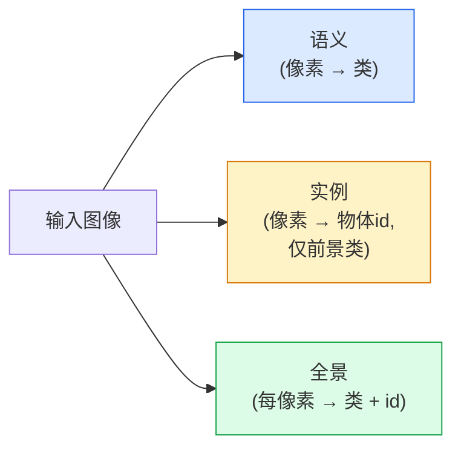
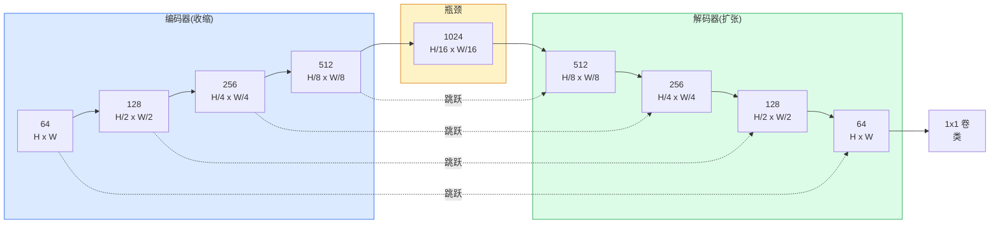

# 语义分割 — U-Net

> 分割是每像素分类。U-Net通过配下采样编码器和上采样解码器并连线其间跳跃连接使其工作。

**类型:** 构建
**语言:** Python
**前置要求:** 阶段4课程03(CNN)，阶段4课程04(图像分类)
**时间:** ~75分钟

## 学习目标

- 区语义、实例和全景分割并为给定问题选对任务
- 在PyTorch从零建U-Net带编码器块、瓶颈、带转置卷积解码器和跳跃连接
- 实现像素级交叉熵、Dice损失和当前医学与工业分割默认组合损失
- 读每类IoU和Dice指标并诊断差评分来自小物召回、边界精度或类不平衡

## 问题背景

分类输每图像一标签。检测输每图像几框。分割输每像素一标签。对于大小`H x W`输入，输出是形状`H x W`张量(语义)或`H x W x N_instances`(实例)。那是每图像百万预测，非一。

分割结构是为何它驱动几乎每密集预测视觉产品:医学成像(肿瘤掩)、自动驾驶(道、车道、障碍)、卫星(建筑足迹、作物边界)、文档解析(布局区)、机器人(可抓区)。那些任务无一可通过框围物解;它们需精确轮廓。

架构问题简述不简解:你需要网络同时见图像全局上下文(这何场景)和局部像素细节(哪像素道vs路)。标准CNN空间压缩获上下文，抛细节。U-Net是得两者设计。

## 概念讲解

### 语义 vs 实例 vs 全景



- **语义**说"这像素是道，那像素是车。"相邻两车缩为单块。
- **实例**说"这像素是车#3，那像素是车#5。"忽略背景物("物" = 天、道、草)。
- **全景**统两者:每像素得类标签，每实例得唯一id，物和事皆分割。

这课覆盖语义。下课(Mask R-CNN)覆盖实例。

### U-Net形状



编码器四次半空间分辨率并双通道。解码器逆转:四次双空间分辨率并半通道。跳跃连接每分辨率拼接匹配编码器特征与解码器特征。终1x1卷映射`64 -> num_classes`于全分辨率。

为何跳跃连接必要:解码器试输出像素级预测时已仅见小特征图。无跳跃它不能准定位边因那信息在编码器压缩掉。跳跃连接手它编码器下行时算的高分辨率特征图。

### 转置 vs 双线性上采样

解码器须扩空间维度。两选项:

- **转置卷积**(`nn.ConvTranspose2d`) — 可学习上采样。历史U-Net默认。若步幅和核大小不整除可产棋盘伪影。
- **双线性上采样 + 3x3卷积** — 平滑上采样后卷积。少伪影、少参数、现现代默认。

两者皆见于实。对首U-Net，双线性更安全。

### 像素网格上交叉熵

对C类语义分割，模型输出`(N, C, H, W)`。目标是`(N, H, W)`带整数类ID。交叉熵同分类案，仅应用于每空间位:

```
损失 = 均值于(n, h, w) -log( softmax(logits[n, :, h, w])[target[n, h, w]] )
```

PyTorch中`F.cross_entropy`原生处理此形状。无重塑需。

### Dice损失和为何需它

交叉熵等对待每像素。那错当一类主导帧(医学成像:99%背景，1%肿瘤)。网络可通过处处预测背景打99%精度仍无用。

Dice损失通过直接优化预测和真掩间重叠解:

```
Dice(p, y) = 2 * sum(p * y) / (sum(p) + sum(y) + epsilon)
Dice损失 = 1 - Dice
```

其中`p`是一类的sigmoid/softmax概率图，`y`是二元真掩。损失仅在重叠完美时零。因基于比率，类不平衡无关。

实践，用**组合损失**:

```
L = L_cross_entropy + lambda * L_dice       (lambda ~ 1)
```

交叉熵予训练初稳梯度;Dice聚焦训练末实匹配掩形状。这组合是医学成像默认难打于任类不平衡数据集。

### 评估指标

- **像素精度** — 正确预测像素百分比。便宜。不平衡数据破同分类精度理。
- **每类IoU** — 每类掩交并比;跨类平均 = mIoU。
- **Dice(像素F1)** — 类似IoU; `Dice = 2 * IoU / (1 + IoU)`。医学成像偏Dice，驾驶社区偏IoU;它们单调相关。
- **边界F1** — 测预测边界近真边界多近，罚小移。高精度任务如半导体检重要。

报每类IoU，不仅mIoU。均IoU藏一类15%当九类85%。

### 输入分辨率权衡

U-Net编码器四次半分辨率，故输入须除16。医学图像常512x512或1024x1024。自动驾驶裁剪2048x1024。U-Net内存代价缩`H * W * C_max`，1024x1024带1024瓶颈通道前向已用GB显存。

两标准绕:

1. 砖输入 — 处理256x256砖带重叠缝合。
2. 替瓶颈为扩张卷积保空间分辨率更高但扩感受野(DeepLab族)。

对首模型，256x256输入带64通道基U-Net8 GB显存舒适训。

## 构建

### 步骤1: 编码器块

两3x3卷积带批归一化和ReLU。首卷积改通道数;次保持。

```python
import torch
import torch.nn as nn
import torch.nn.functional as F

class DoubleConv(nn.Module):
    def __init__(self, in_c, out_c):
        super().__init__()
        self.net = nn.Sequential(
            nn.Conv2d(in_c, out_c, kernel_size=3, padding=1, bias=False),
            nn.BatchNorm2d(out_c),
            nn.ReLU(inplace=True),
            nn.Conv2d(out_c, out_c, kernel_size=3, padding=1, bias=False),
            nn.BatchNorm2d(out_c),
            nn.ReLU(inplace=True),
        )

    def forward(self, x):
        return self.net(x)
```

此块全课复用。`bias=False`因BN的beta处理偏置。

### 步骤2: 下和上块

```python
class Down(nn.Module):
    def __init__(self, in_c, out_c):
        super().__init__()
        self.net = nn.Sequential(
            nn.MaxPool2d(2),
            DoubleConv(in_c, out_c),
        )

    def forward(self, x):
        return self.net(x)


class Up(nn.Module):
    def __init__(self, in_c, out_c):
        super().__init__()
        self.up = nn.Upsample(scale_factor=2, mode="bilinear", align_corners=False)
        self.conv = DoubleConv(in_c, out_c)

    def forward(self, x, skip):
        x = self.up(x)
        if x.shape[-2:] != skip.shape[-2:]:
            x = F.interpolate(x, size=skip.shape[-2:], mode="bilinear", align_corners=False)
        x = torch.cat([skip, x], dim=1)
        return self.conv(x)
```

仅空间形状检查(`shape[-2:]`)处理维不除16输入;安全`F.interpolate`对齐张量前拼接。比全形状也会触通道数差，那应为响错，非静默插值。

### 步骤3: U-Net

```python
class UNet(nn.Module):
    def __init__(self, in_channels=3, num_classes=2, base=64):
        super().__init__()
        self.inc = DoubleConv(in_channels, base)
        self.d1 = Down(base, base * 2)
        self.d2 = Down(base * 2, base * 4)
        self.d3 = Down(base * 4, base * 8)
        self.d4 = Down(base * 8, base * 16)
        self.u1 = Up(base * 16 + base * 8, base * 8)
        self.u2 = Up(base * 8 + base * 4, base * 4)
        self.u3 = Up(base * 4 + base * 2, base * 2)
        self.u4 = Up(base * 2 + base, base)
        self.outc = nn.Conv2d(base, num_classes, kernel_size=1)

    def forward(self, x):
        x1 = self.inc(x)
        x2 = self.d1(x1)
        x3 = self.d2(x2)
        x4 = self.d3(x3)
        x5 = self.d4(x4)
        x = self.u1(x5, x4)
        x = self.u2(x, x3)
        x = self.u3(x, x2)
        x = self.u4(x, x1)
        return self.outc(x)

net = UNet(in_channels=3, num_classes=2, base=32)
x = torch.randn(1, 3, 256, 256)
print(f"输出: {net(x).shape}")
print(f"参数: {sum(p.numel() for p in net.parameters()):,}")
```

输出形状`(1, 2, 256, 256)` — 同输入空间大小，`num_classes`通道。`base=32`约7.7M参数。

### 步骤4: 损失

```python
def dice_loss(logits, targets, num_classes, eps=1e-6):
    probs = F.softmax(logits, dim=1)
    targets_one_hot = F.one_hot(targets, num_classes).permute(0, 3, 1, 2).float()
    dims = (0, 2, 3)
    intersection = (probs * targets_one_hot).sum(dim=dims)
    denom = probs.sum(dim=dims) + targets_one_hot.sum(dim=dims)
    dice = (2 * intersection + eps) / (denom + eps)
    return 1 - dice.mean()


def combined_loss(logits, targets, num_classes, lam=1.0):
    ce = F.cross_entropy(logits, targets)
    dc = dice_loss(logits, targets, num_classes)
    return ce + lam * dc, {"ce": ce.item(), "dice": dc.item()}
```

Dice每类算后平均(macro Dice)。`eps`防类缺于批除零。

### 步骤5: IoU指标

```python
@torch.no_grad()
def iou_per_class(logits, targets, num_classes):
    preds = logits.argmax(dim=1)
    ious = torch.zeros(num_classes)
    for c in range(num_classes):
        pred_c = (preds == c)
        true_c = (targets == c)
        inter = (pred_c & true_c).sum().float()
        union = (pred_c | true_c).sum().float()
        ious[c] = (inter / union) if union > 0 else torch.tensor(float("nan"))
    return ious
```

返长度C向量。`nan`标类缺于批 — 算mIoU时勿平均那些。

### 步骤6: 端到端验证合成数据集

生成形状于色背景使网络须学形状，非像素色。

```python
import numpy as np
from torch.utils.data import Dataset, DataLoader

def synthetic_segmentation(num_samples=200, size=64, seed=0):
    rng = np.random.default_rng(seed)
    images = np.zeros((num_samples, size, size, 3), dtype=np.float32)
    masks = np.zeros((num_samples, size, size), dtype=np.int64)
    for i in range(num_samples):
        bg = rng.uniform(0, 1, (3,))
        images[i] = bg
        masks[i] = 0
        num_shapes = rng.integers(1, 4)
        for _ in range(num_shapes):
            cls = int(rng.integers(1, 3))
            color = rng.uniform(0, 1, (3,))
            cx, cy = rng.integers(10, size - 10, size=2)
            r = int(rng.integers(4, 12))
            yy, xx = np.meshgrid(np.arange(size), np.arange(size), indexing="ij")
            if cls == 1:
                mask = (xx - cx) ** 2 + (yy - cy) ** 2 < r ** 2
            else:
                mask = (np.abs(xx - cx) < r) & (np.abs(yy - cy) < r)
            images[i][mask] = color
            masks[i][mask] = cls
        images[i] += rng.normal(0, 0.02, images[i].shape)
        images[i] = np.clip(images[i], 0, 1)
    return images, masks


class SegDataset(Dataset):
    def __init__(self, images, masks):
        self.images = images
        self.masks = masks

    def __len__(self):
        return len(self.images)

    def __getitem__(self, i):
        img = torch.from_numpy(self.images[i]).permute(2, 0, 1).float()
        mask = torch.from_numpy(self.masks[i]).long()
        return img, mask
```

三类:背景(0)、圆(1)、方(2)。网络须学辨形状。

### 步骤7: 训练循环

```python
def train_one_epoch(model, loader, optimizer, device, num_classes):
    model.train()
    loss_sum, total = 0.0, 0
    iou_sum = torch.zeros(num_classes)
    for x, y in loader:
        x, y = x.to(device), y.to(device)
        logits = model(x)
        loss, _ = combined_loss(logits, y, num_classes)
        optimizer.zero_grad()
        loss.backward()
        optimizer.step()
        loss_sum += loss.item() * x.size(0)
        total += x.size(0)
        iou_sum += iou_per_class(logits, y, num_classes).nan_to_num(0)
    return loss_sum / total, iou_sum / len(loader)
```

于合成数据集跑10-30 epochs并观形状类mIoU爬超0.9。注`nan_to_num(0)`处理缺类为零;准每类IoU，用掩按存在评估时`torch.nanmean`跨批而非此处平均。

## 使用

对生产，`segmentation_models_pytorch`("smp")包每标准分割架构带任torchvision或timm骨干。三行:

```python
import segmentation_models_pytorch as smp

model = smp.Unet(
    encoder_name="resnet34",
    encoder_weights="imagenet",
    in_channels=3,
    classes=3,
)
```

实工作也知:
- **DeepLabV3+**替最大池基下采样为扩张卷积瓶颈保分辨率;卫星和驾驶数据边界更快。
- **SegFormer**换卷积编码器为层级transformer;多基准当前SOTA。
- **Mask2Former** / **OneFormer**统语义、实例和全景分割于单架构。

全三在`smp`或`transformers`为同数据加载器替换。

## 交付成果

本课程产:

- `outputs/prompt-segmentation-task-picker.md` — 为给定任务在语义、实例和全景分割间选并命名架构提示词
- `outputs/skill-segmentation-mask-inspector.md` — 报类分布、预测掩统计和欠预测或边界模糊类技能

## 练习题

1. **(易)** 为二元分割任务(前景vs背景)实现`bce_dice_loss`。于合成两类数据集验证组合损失比仅BCE收敛更快当前景5%像素。

2. **(中)** 替`nn.Upsample + conv`上块为`nn.ConvTranspose2d`上块。于合成数据集训两者比mIoU。观察转置卷积版棋盘伪影现处。

3. **(难)** 取真分割数据集(Oxford-IIIT Pets、Cityscapes mini split或医学子集)训U-Net近`smp.Unet`参考2 IoU点。报每类IoU并识哪类最益加Dice损失。

## 关键术语

| 术语 | 人们怎么说 | 实际含义 |
|------|----------------|----------------------|
| 语义分割 | "标签每像素" | 每像素分类入C类;同类实例合 |
| 实例分割 | "标签每物体" | 分同类不同实例;仅前景 |
| 全景分割 | "语义 + 实例" | 每像素得类;每物实例也得唯一id |
| 跳跃连接 | "U-Net桥" | 编码器特征拼接入匹配分辨率解码器特征;保高频细节 |
| 转置卷积 | "反卷积" | 可学习上采样;可产棋盘伪影 |
| Dice损失 | "重叠损失" | 1 - 2|A ∩ B| / (|A| + |B|);直接优化掩重叠且鲁棒类不平衡 |
| mIoU | "均交并比" | 类间IoU平均;分割社区标准指标 |
| 边界F1 | "边界精度" | 仅边界像素算F1;精度关键任务重要 |

## 延伸阅读

- [U-Net: Convolutional Networks for Biomedical Image Segmentation (Ronneberger等, 2015)](https://arxiv.org/abs/1505.04597) — 原论文;每拷图在第2页
- [Fully Convolutional Networks (Long等, 2015)](https://arxiv.org/abs/1411.4038) — 首使分割端到端卷积问题论文
- [segmentation_models_pytorch](https://github.com/qubvel/segmentation_models.pytorch) — 生产分割参考;每标准架构加每标准损失
- [Lessons learned from training SOTA segmentation (kaggle.com competitions)](https://www.kaggle.com/code/iafoss/carvana-unet-pytorch) — TTA、伪标签和类权重于真实数据为何重要导览