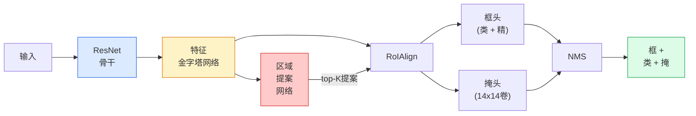

# 实例分割 — Mask R-CNN

> 在Faster R-CNN检测器加小掩分支你就有实例分割。难点是RoIAlign，比看起难。

**类型:** 构建 + 学
**语言:** Python
**前置要求:** 阶段4课程06(YOLO)，阶段4课程07(U-Net)
**时间:** ~75分钟

## 学习目标

- 端到端追Mask R-CNN架构:骨干、FPN、RPN、RoIAlign、框头、掩头
- 从零实现RoIAlign并解释为何RoIPool不再用
- 用torchvision`maskrcnn_resnet50_fpn_v2`预训模型生产质量实例掩并正确读其输出格式
- 在小自定义数据集微调Mask R-CNN通过换框和掩头并保持骨干冻结

## 问题背景

语义分割给你每类一掩。实例分割给你每物一掩，即使两物共享类。数个体、跨帧跟踪和量东西(墙每砖边界框、显微镜图像每细胞)都需实例分割。

Mask R-CNN (He等, 2017)通过重构实例分割为检测加掩解。设计如此干净下五年几乎每实例分割论文是Mask R-CNN变种，torchvision实现仍是小中数据集生产默认。

硬工程问题是采样:如何从角不齐像素边界提案框裁固定大小特征区？错那损每处十分mAP点。RoIAlign是答案。

## 概念讲解

### 架构



五件理解:

1. **骨干** — ResNet-50或ResNet-101训于ImageNet。产步幅4、8、16、32特征图层级。
2. **FPN(特征金字塔网络)** — 自上而下 + 侧连给每级C通道语义丰富特征。检测查询匹配物大小FPN级。
3. **RPN(区域提案网络)** — 小卷积头，每锚位，预"这里有物否？"和"如何精框？"。产~1000提案每图像。
4. **RoIAlign** — 从任框任FPN级采样固定大小(如7x7)特征patch。双线性采样，无量化。
5. **头** — 两层框头精框选类，加小卷积头每提案输出`28x28`二元掩。

### 为何RoIAlign而非RoIPool

原Fast R-CNN用RoIPool，分提案框入网格，取每单元最大特征，并将全坐标圆整为整数。那圆整使特征图偏输入像素坐标达一全特征图像素 — 224x224图像小，特征图步幅32灾难。

```
RoIPool:
  框 (34.7, 51.3, 98.2, 142.9)
  圆整 -> (34, 51, 98, 142)
  分网格 -> 圆整每单元边界
  不对齐每步累积

RoIAlign:
  框 (34.7, 51.3, 98.2, 142.9)
  于精确浮点坐标用双线性插值采样
  无处圆整
```

RoIAlign免费提掩AP 3-4点。每关定位检测器现用它 — YOLOv7 seg、RT-DETR、Mask2Former同。

### RPN一段

于特征图每位置，放K不同大小形状锚框。为每锚预目标度评分和回归偏移转锚入更合框。保评分前~1,000框，IoU 0.7用NMS，交幸存者给头。RPN用自己迷你损失训 — 同课6YOLO损失结构，仅两类(物 / 无物)。

### 掩头

每提案(RoIAlign后)掩头是小FCN:四3x3卷积、一2x反卷积、终1x1卷积产`num_classes`输出通道于`28x28`分辨率。仅对应预测类通道保;其他忽略。这解耦掩预测和分类。

将28x28掩上采样到提案原像素大小产终二元掩。

### 损失

Mask R-CNN有四损失加:

```
L = L_rpn_cls + L_rpn_box + L_box_cls + L_box_reg + L_mask
```

- `L_rpn_cls`、`L_rpn_box` — RPN提案目标度 + 框回归。
- `L_box_cls` — 头分类器(C+1)类交叉熵(含背景)。
- `L_box_reg` — 头框精平滑L1。
- `L_mask` — 28x28掩输出每像素二元交叉熵。

每损失有自己默认权重;torchvision实现暴露它们为构造参数。

### 输出格式

`torchvision.models.detection.maskrcnn_resnet50_fpn_v2`返字典列表，每图像一:

```
{
    "boxes":  (N, 4) 于(x1, y1, x2, y2)像素坐标,
    "labels": (N,) 类ID, 0 = 背景故索引1基,
    "scores": (N,) 置信评分,
    "masks":  (N, 1, H, W) 浮点掩在[0, 1] — 阈值0.5为二元,
}
```

掩已是全图像分辨率。28x28头输出已内上采样。

## 构建

### 步骤1: 从零RoIAlign

这是Mask R-CNN一组件码比文简理解。

```python
import torch
import torch.nn.functional as F

def roi_align_single(feature, box, output_size=7, spatial_scale=1 / 16.0):
    """
    feature: (C, H, W) 单图像特征图
    box: (x1, y1, x2, y2) 于原图像像素坐标
    output_size: 输出网格边(框头7，掩头14)
    spatial_scale: 特征图步幅倒数
    """
    C, H, W = feature.shape
    x1, y1, x2, y2 = [c * spatial_scale - 0.5 for c in box]
    bin_w = (x2 - x1) / output_size
    bin_h = (y2 - y1) / output_size

    grid_y = torch.linspace(y1 + bin_h / 2, y2 - bin_h / 2, output_size)
    grid_x = torch.linspace(x1 + bin_w / 2, x2 - bin_w / 2, output_size)
    yy, xx = torch.meshgrid(grid_y, grid_x, indexing="ij")

    gx = 2 * (xx + 0.5) / W - 1
    gy = 2 * (yy + 0.5) / H - 1
    grid = torch.stack([gx, gy], dim=-1).unsqueeze(0)
    sampled = F.grid_sample(feature.unsqueeze(0), grid, mode="bilinear",
                            align_corners=False)
    return sampled.squeeze(0)
```

每数于双线性采样位。无圆整、无量化、无丢梯度。

### 步骤2: 比torchvision RoIAlign

```python
from torchvision.ops import roi_align

feature = torch.randn(1, 16, 50, 50)
boxes = torch.tensor([[0, 10, 20, 100, 90]], dtype=torch.float32)  # (batch_idx, x1, y1, x2, y2)

ours = roi_align_single(feature[0], boxes[0, 1:].tolist(), output_size=7, spatial_scale=1/4)
theirs = roi_align(feature, boxes, output_size=(7, 7), spatial_scale=1/4, sampling_ratio=1, aligned=True)[0]

print(f"形状我们:   {tuple(ours.shape)}")
print(f"形状他们: {tuple(theirs.shape)}")
print(f"最大|差|:    {(ours - theirs).abs().max().item():.3e}")
```

`sampling_ratio=1`和`aligned=True`，两匹配在`1e-5`内。

### 步骤3: 加载预训Mask R-CNN

```python
import torch
from torchvision.models.detection import maskrcnn_resnet50_fpn_v2, MaskRCNN_ResNet50_FPN_V2_Weights

model = maskrcnn_resnet50_fpn_v2(weights=MaskRCNN_ResNet50_FPN_V2_Weights.DEFAULT)
model.eval()
print(f"参数: {sum(p.numel() for p in model.parameters()):,}")
print(f"类(含背景): {len(model.roi_heads.box_predictor.cls_score.out_features * [0])}")
```

46M参数，91类(COCO)。首类(id 0)背景;模型实检一切始id 1。

### 步骤4: 跑推理

```python
with torch.no_grad():
    x = torch.randn(3, 400, 600)
    predictions = model([x])
p = predictions[0]
print(f"框:  {tuple(p['boxes'].shape)}")
print(f"标签: {tuple(p['labels'].shape)}")
print(f"评分: {tuple(p['scores'].shape)}")
print(f"掩:  {tuple(p['masks'].shape)}")
```

掩张量形状`(N, 1, H, W)`。阈值0.5得每物二元掩:

```python
binary_masks = (p['masks'] > 0.5).squeeze(1)  # (N, H, W) 布尔
```

### 步骤5: 为自定义类数换头

常微调配方:复用骨干、FPN和RPN;替两分类头。

```python
from torchvision.models.detection.faster_rcnn import FastRCNNPredictor
from torchvision.models.detection.mask_rcnn import MaskRCNNPredictor

def build_custom_maskrcnn(num_classes):
    model = maskrcnn_resnet50_fpn_v2(weights=MaskRCNN_ResNet50_FPN_V2_Weights.DEFAULT)
    in_features = model.roi_heads.box_predictor.cls_score.in_features
    model.roi_heads.box_predictor = FastRCNNPredictor(in_features, num_classes)
    in_features_mask = model.roi_heads.mask_predictor.conv5_mask.in_channels
    hidden_layer = 256
    model.roi_heads.mask_predictor = MaskRCNNPredictor(in_features_mask, hidden_layer, num_classes)
    return model

custom = build_custom_maskrcnn(num_classes=5)
print(f"自定义cls_score.out_features: {custom.roi_heads.box_predictor.cls_score.out_features}")
```

`num_classes`须含背景类，故4物类数据集用`num_classes=5`。

### 步骤6: 冻结不需训练

于小数据集，冻结骨干和FPN。仅RPN目标度 + 回归和两头学。

```python
def freeze_backbone_and_fpn(model):
    # torchvision Mask R-CNN将FPN包于`model.backbone`(作
    # `model.backbone.fpn`)，故迭代`model.backbone.parameters()`覆盖
    # ResNet特征层和FPN侧/输出卷。
    for p in model.backbone.parameters():
        p.requires_grad = False
    return model

custom = freeze_backbone_and_fpn(custom)
trainable = sum(p.numel() for p in custom.parameters() if p.requires_grad)
print(f"冻结后可训: {trainable:,}")
```

于500图像数据集这是收敛和过拟合差。

## 使用

torchvision Mask R-CNN全训练循环40行任务间无义改 — 换数据集走。

```python
def train_step(model, images, targets, optimizer):
    model.train()
    loss_dict = model(images, targets)
    losses = sum(loss for loss in loss_dict.values())
    optimizer.zero_grad()
    losses.backward()
    optimizer.step()
    return {k: v.item() for k, v in loss_dict.items()}
```

`targets`列表须有每图像字典带`boxes`、`labels`和`masks`(作`(num_instances, H, W)`二元张量)。模型训练返四损失字典、评估返预测列表，键于`model.training`。

`pycocotools`评估器产框和掩mAP@IoU=0.5:0.95;你需两数知框头或掩头瓶颈。

## 交付成果

本课程产:

- `outputs/prompt-instance-vs-semantic-router.md` — 问三问题选实例vs语义vs全景加确切始模型提示词
- `outputs/skill-mask-rcnn-head-swapper.md` — 给新`num_classes`生成换任torchvision检测模型头10行代码技能

## 练习题

1. **(易)** 于100随机框验你RoIAlign对`torchvision.ops.roi_align`。报最大绝对差。也跑RoIPool(2017前行为)并示近边框差~1-2特征图像素。

2. **(中)** 于50图像自定义数据集(任两类:气球、鱼、坑洞、标志)微调`maskrcnn_resnet50_fpn_v2`。冻结骨干，训20 epochs，报掩AP@0.5。

3. **(难)** 替Mask R-CNN掩头为预测56x56而非28x28版。测前后mAP@IoU=0.75。解释增益(或无)为何匹配预期边界精度/内存权衡。

## 关键术语

| 术语 | 人们怎么说 | 实际含义 |
|------|----------------|----------------------|
| Mask R-CNN | "检测加掩" | Faster R-CNN + 小FCN头每提案每类预28x28掩 |
| FPN | "特征金字塔" | 自上而下 + 侧连给每步幅级C通道语义丰富特征 |
| RPN | "区域提案器" | 小卷积头产~1000物/无物提案每图像 |
| RoIAlign | "无圆整裁剪" | 双线性采样固定大小特征网格于任浮点坐标框 |
| RoIPool | "2017前裁剪" | 同RoIAlign目的但圆整框坐标;弃 |
| Mask AP | "实例mAP" | 用掩IoU而非框IoU算平均精度;COCO实例分割指标 |
| 二元掩头 | "每类掩" | 每提案每类预一二元掩;仅保留预测类通道 |
| 背景类 | "类0" | 包罗"无物"类;实类索引始1 |

## 延伸阅读

- [Mask R-CNN (He等, 2017)](https://arxiv.org/abs/1703.06870) — 论文;第3节RoIAlign关键读
- [FPN: Feature Pyramid Networks (Lin等, 2017)](https://arxiv.org/abs/1612.03144) — FPN论文;每现代检测器用它
- [torchvision Mask R-CNN教程](https://pytorch.org/tutorials/intermediate/torchvision_tutorial.html) — 微调循环参考
- [Detectron2模型动物园](https://github.com/facebookresearch/detectron2/blob/main/MODEL_ZOO.md) — 生产实现带训权重近乎每检测和分割变种