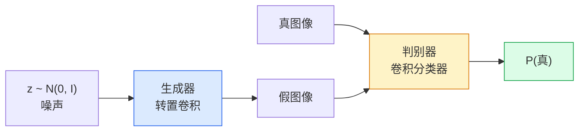
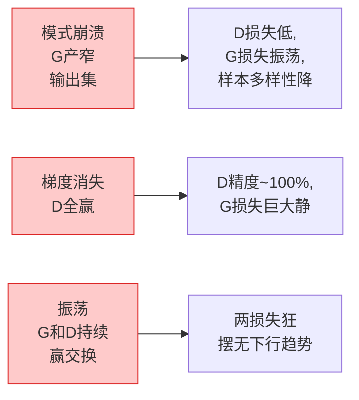

# 图像生成 — GAN

> GAN是两个神经网络之间的固定博弈。一个绘图，一个评判。它们共同进步，直到画作能骗过批评者。

**类型:** 构建
**语言:** Python
**前置要求:** 阶段4课程03(CNN)，阶段3课程06(优化器)，阶段3课程07(正则化)
**时间:** ~75分钟

## 学习目标

- 解释生成器和判别器间极大极小游戏为何均衡对应p_model = p_data
- 在PyTorch实现DCGAN并少于60行生成连贯32x32合成图像
- 用三标准技巧稳GAN训练:非饱和损失、谱归一化、TTUR(双时标更新规则)
- 读训练曲线区分健康收敛和模式崩溃、振荡、判别器全赢

## 问题背景

分类教网络映射图像到标签。生成逆问题:采新图像看起来来自同分布。无"正确"输出你可对差;仅有分布你要仿。

标准损失函数(MSE、交叉熵)不能测"这样本来自真实分布否"。最小化每像素误差产模糊平均，非现实样本。突破是学损失:训第二网络其职是辨真假，用其判推生成器。

GANs (Goodfellow等, 2014)定义那框架。到2018 StyleGAN产1024x1024脸不辨于照。扩散模型此后在质量和可控取王，但每使扩散实用技巧 — 归一化选择、潜空间、特征损失 — 先于GAN理解。

## 概念讲解

### 两网络



**生成器**G取噪声向量`z`输出图像。**判别器**D取图像输出单标量:图像真概率。

### 游戏

G想D错。D想对。形式:

```
min_G max_D  E_x[log D(x)] + E_z[log(1 - D(G(z)))]
```

右读左:D最大化真(`log D(real)`)和假(`log (1 - D(fake))`)图像精度。G最小化D假精度 — 它想`D(G(z))`高。

Goodfellow证这极大极小有全局均衡`p_G = p_data`，D处处输出0.5，生成和真实分布间Jensen-Shannon分歧零。难点达那。

### 非饱和损失

上形式数值不稳。训练初，`D(G(z))`近零于每假，故`log(1 - D(G(z)))`对G梯度消失。修:翻G损失。

```
L_D = -E_x[log D(x)] - E_z[log(1 - D(G(z)))]
L_G = -E_z[log D(G(z))]                          # 非饱和
```

现当`D(G(z))`近零，G损失大其梯度信息。每现代GAN训此变种。

### DCGAN架构规则

Radford、Metz、Chintala (2015)将年失败实验提炼为五规则使GAN训练稳:

1. 替池为步幅卷积(两网)。
2. 两生成器和判别器用批归一化，除G输出和D输入。
3. 深架构移全连接层。
4. G于全层用ReLU除输出(tanh输出[-1, 1])。
5. D于全层用LeakyReLU(negative_slope=0.2)。

每现代卷积基GAN (StyleGAN、BigGAN、GigaGAN)仍始这些规则逐一替。

### 失败模式和其签名



- **模式崩溃**:G找一图像骗D仅产那。修:加minibatch判别、谱归一化或标签条件。
- **判别器赢**:D太快太强，G梯度消失。修:小D、低D学习率或真标签应用标签平滑。
- **振荡**:两网交赢不近均衡。修:TTUR(D比G快因子2-4学)，或换Wasserstein损失。

### 评估

GAN无真值，你如何知它工作？

- **样本检查** — 每epoch末看64样本。不可议。
- **FID(Fréchet Inception距离)** — 真和生成集Inception-v3特征分布间距离。低更佳。社区标准。
- **Inception Score** — 更老、更脆;偏FID。
- **生成模型精度/召回** — 分测质量(精度)和覆盖(召回)。比仅FID更信息。

对小合成数据跑，样本检查够。

## 构建

### 步骤1: 生成器

小DCGAN生成器取64维噪声产32x32图像。

```python
import torch
import torch.nn as nn

class Generator(nn.Module):
    def __init__(self, z_dim=64, img_channels=3, feat=64):
        super().__init__()
        self.net = nn.Sequential(
            nn.ConvTranspose2d(z_dim, feat * 4, kernel_size=4, stride=1, padding=0, bias=False),
            nn.BatchNorm2d(feat * 4),
            nn.ReLU(inplace=True),
            nn.ConvTranspose2d(feat * 4, feat * 2, kernel_size=4, stride=2, padding=1, bias=False),
            nn.BatchNorm2d(feat * 2),
            nn.ReLU(inplace=True),
            nn.ConvTranspose2d(feat * 2, feat, kernel_size=4, stride=2, padding=1, bias=False),
            nn.BatchNorm2d(feat),
            nn.ReLU(inplace=True),
            nn.ConvTranspose2d(feat, img_channels, kernel_size=4, stride=2, padding=1, bias=False),
            nn.Tanh(),
        )

    def forward(self, z):
        return self.net(z.view(z.size(0), -1, 1, 1))
```

四转置卷积，每带`kernel_size=4, stride=2, padding=1`使干净双空间大小。输出激活[-1, 1]经tanh。

### 步骤2: 判别器

生成器镜像。LeakyReLU，步幅卷积，终单标量logit。

```python
class Discriminator(nn.Module):
    def __init__(self, img_channels=3, feat=64):
        super().__init__()
        self.net = nn.Sequential(
            nn.Conv2d(img_channels, feat, kernel_size=4, stride=2, padding=1),
            nn.LeakyReLU(0.2, inplace=True),
            nn.Conv2d(feat, feat * 2, kernel_size=4, stride=2, padding=1, bias=False),
            nn.BatchNorm2d(feat * 2),
            nn.LeakyReLU(0.2, inplace=True),
            nn.Conv2d(feat * 2, feat * 4, kernel_size=4, stride=2, padding=1, bias=False),
            nn.BatchNorm2d(feat * 4),
            nn.LeakyReLU(0.2, inplace=True),
            nn.Conv2d(feat * 4, 1, kernel_size=4, stride=1, padding=0),
        )

    def forward(self, x):
        return self.net(x).view(-1)
```

末卷积缩`4x4`特征图为`1x1`。输出每图像单标量;仅损失算时应用sigmoid。

### 步骤3: 训练步

交替:每批先更新D，然后G。

```python
import torch.nn.functional as F

def train_step(G, D, real, z, opt_g, opt_d, device):
    real = real.to(device)
    bs = real.size(0)

    # D步
    opt_d.zero_grad()
    d_real = D(real)
    d_fake = D(G(z).detach())
    loss_d = (F.binary_cross_entropy_with_logits(d_real, torch.ones_like(d_real))
              + F.binary_cross_entropy_with_logits(d_fake, torch.zeros_like(d_fake)))
    loss_d.backward()
    opt_d.step()

    # G步
    opt_g.zero_grad()
    d_fake = D(G(z))
    loss_g = F.binary_cross_entropy_with_logits(d_fake, torch.ones_like(d_fake))
    loss_g.backward()
    opt_g.step()

    return loss_d.item(), loss_g.item()
```

D步中`G(z).detach()`关键:我们不欲D更新时梯度流入G。忘那是经典初学bug。

### 步骤4: 合成形状全训练循环

```python
from torch.utils.data import DataLoader, TensorDataset
import numpy as np

def synthetic_images(num=2000, size=32, seed=0):
    rng = np.random.default_rng(seed)
    imgs = np.zeros((num, 3, size, size), dtype=np.float32) - 1.0
    for i in range(num):
        r = rng.uniform(6, 12)
        cx, cy = rng.uniform(r, size - r, size=2)
        yy, xx = np.meshgrid(np.arange(size), np.arange(size), indexing="ij")
        mask = (xx - cx) ** 2 + (yy - cy) ** 2 < r ** 2
        color = rng.uniform(-0.5, 1.0, size=3)
        for c in range(3):
            imgs[i, c][mask] = color[c]
    return torch.from_numpy(imgs)

device = "cuda" if torch.cuda.is_available() else "cpu"
data = synthetic_images()
loader = DataLoader(TensorDataset(data), batch_size=64, shuffle=True)

G = Generator(z_dim=64, img_channels=3, feat=32).to(device)
D = Discriminator(img_channels=3, feat=32).to(device)
opt_g = torch.optim.Adam(G.parameters(), lr=2e-4, betas=(0.5, 0.999))
opt_d = torch.optim.Adam(D.parameters(), lr=2e-4, betas=(0.5, 0.999))

for epoch in range(10):
    for (batch,) in loader:
        z = torch.randn(batch.size(0), 64, device=device)
        ld, lg = train_step(G, D, batch, z, opt_g, opt_d, device)
    print(f"epoch {epoch}  D {ld:.3f}  G {lg:.3f}")
```

`Adam(lr=2e-4, betas=(0.5, 0.999))`是DCGAN默认 — 低beta1保动量项不稳对抗游戏太多。

### 步骤5: 采样

```python
@torch.no_grad()
def sample(G, n=16, z_dim=64, device="cpu"):
    G.eval()
    z = torch.randn(n, z_dim, device=device)
    imgs = G(z)
    imgs = (imgs + 1) / 2
    return imgs.clamp(0, 1)
```

采样前总切换评估模式。对DCGAN这重要因批归一化用运行统计而非批统计。

### 步骤6: 谱归一化

判别器中BN替换保证网络1-Lipschitz。修大多"D赢太硬"失败。

```python
from torch.nn.utils import spectral_norm

def build_sn_discriminator(img_channels=3, feat=64):
    return nn.Sequential(
        spectral_norm(nn.Conv2d(img_channels, feat, 4, 2, 1)),
        nn.LeakyReLU(0.2, inplace=True),
        spectral_norm(nn.Conv2d(feat, feat * 2, 4, 2, 1)),
        nn.LeakyReLU(0.2, inplace=True),
        spectral_norm(nn.Conv2d(feat * 2, feat * 4, 4, 2, 1)),
        nn.LeakyReLU(0.2, inplace=True),
        spectral_norm(nn.Conv2d(feat * 4, 1, 4, 1, 0)),
    )
```

换`Discriminator`为`build_sn_discriminator()`你常不需TTUR技巧。谱归一化是你可应用最简单单健壮升级。

## 使用

对认真生成，用预训权重或换扩散。两标准库:

- `torch_fidelity`算你生成器FID / IS无写自定义评估代码。
- `pytorch-gan-zoo`(遗产)和`StudioGAN`船测试DCGAN、WGAN-GP、SN-GAN、StyleGAN和BigGAN实现。

2026，GAN仍最佳选:实时图像生成(延迟<10 ms)、风格迁移、带精确控图像到图像翻译(Pix2Pix、CycleGAN)。扩散赢于照真实性和文条件。

## 交付成果

本课程产:

- `outputs/prompt-gan-training-triage.md` — 读训练曲线描述选失败模式(模式崩溃、D赢、振荡)加单推荐修提示词
- `outputs/skill-dcgan-scaffold.md` — 从`z_dim`、目标`image_size`和`num_channels`写DCGAN骨架含训练循环和样本保存器技能

## 练习题

1. **(易)** 于合成圆数据集训上DCGAN并每epoch末存16样本网格。哪epoch生成圆显圆？

2. **(中)** 替判别器批归一化为谱归一化。并训两版。哪个收敛更快？哪个跨三种子方差更低？

3. **(难)** 实现条件DCGAN:喂类标签入G和D(G中拼独热到噪声，D中拼类嵌入通道)。于课7合成"圆vs方"数据集训并示类条件通过特定标签采样工作。

## 关键术语

| 术语 | 人们怎么说 | 实际含义 |
|------|----------------|----------------------|
| 生成器(G) | "画东西网" | 映噪声到图像;训骗判别器 |
| 判别器(D) | "评者" | 二元分类器;训辨真假图像 |
| 极大极小 | "游戏" | G最小D最大对抗损失;均衡p_G = p_data |
| 非饱和损失 | "数值理智版" | G损失是-log(D(G(z)))而非log(1 - D(G(z)))避训练初梯度消失 |
| 模式崩溃 | "生成器造一物" | G仅产数据分布小子集;修SN、minibatch判别或大批 |
| TTUR | "两学习率" | D比G快学，典型因子2-4;稳训练 |
| 谱归一化 | "1-Lipschitz层" | 权归一化限每层Lipschitz常数;止D变任意陡 |
| FID | "Fréchet Inception距离" | 真和生成集Inception-v3特征分布间距离;标准评估指标 |

## 延伸阅读

- [Generative Adversarial Networks (Goodfellow等, 2014)](https://arxiv.org/abs/1406.2661) — 启一切论文
- [DCGAN (Radford, Metz, Chintala, 2015)](https://arxiv.org/abs/1511.06434) — 使GAN可训架构规则
- [Spectral Normalization for GANs (Miyato等, 2018)](https://arxiv.org/abs/1802.05957) — 单最有用稳技巧
- [StyleGAN3 (Karras等, 2021)](https://arxiv.org/abs/2106.12423) — SOTA GAN;读像过去十年每技巧金曲专辑