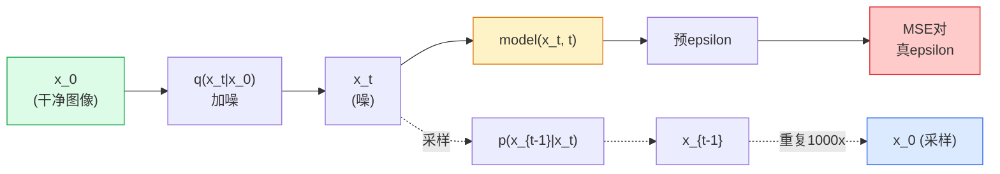

# 图像生成 — 扩散模型

> 扩散模型学去噪。训它从噪图像移小噪，后向重复千次，你就得图像生成器。

**类型:** 构建
**语言:** Python
**前置要求:** 阶段4课程07(U-Net)，阶段1课程06(概率)，阶段3课程06(优化器)
**时间:** ~75分钟

## 学习目标

- 导前向加噪过程`x_0 -> x_1 -> ... -> x_T`并解释为何闭式`q(x_t | x_0)`对任t成立
- 实现DDPM风格训练目标回归每步加噪，和从纯噪走回图像采样器
- 建时间条件U-Net(小到CPU可训)预任时间步噪
- 解释DDPM和DDIM采样差及何时适(课程23深覆盖流匹配和整流流)

## 问题背景

GAN一次性生成:噪入、图出、一前向。快难训。扩散模型迭代生成:从纯噪始、小步去噪、图像浮现。慢易训。过去五年后者性质主导:任小队可训扩散模型得合理样本;GAN训练是你多年失败跑学手艺。

超训练稳定，扩散迭代结构解锁现代图像生成一切:文条件、图像修复、图像编辑、超分辨率、可控风格。采样循环每步是注入新约束地。那钩为何Stable Diffusion、Imagen、DALL-E 3、Midjourney和你将用每可控图像模型皆扩散基。

这课建最小DDPM:前向加噪、后向去噪、训练循环。下节课(Stable Diffusion)线入生产系统带VAE、文编码器和无分类器引导。

## 概念讲解

### 前向过程

取图像`x_0`。加小量高斯噪得`x_1`。再加小量得`x_2`。继续T步直到`x_T`近乎纯高斯噪不可辨。

```
q(x_t | x_{t-1}) = N(x_t; sqrt(1 - beta_t) * x_{t-1},  beta_t * I)
```

`beta_t`是小方差调度，典型线性从0.0001到0.02于T=1000步。每步微缩信号注新噪。

### 闭式跳

一步步加噪是马尔可夫链，但数学折叠:你可从`x_0`一步直接采`x_t`。

```
定义 alpha_t = 1 - beta_t
定义 alpha_bar_t = prod_{s=1..t} alpha_s

那么:
  q(x_t | x_0) = N(x_t; sqrt(alpha_bar_t) * x_0,  (1 - alpha_bar_t) * I)

等价:
  x_t = sqrt(alpha_bar_t) * x_0 + sqrt(1 - alpha_bar_t) * epsilon
  其中 epsilon ~ N(0, I)
```

这单一公式是扩散实用全因。训练时你选随机`t`，从`x_0`一步直接采`x_t`一步训 — 无需模拟全马尔可夫链。

### 反向过程

前向过程固定。反向过程`p(x_{t-1} | x_t)`是神经网络所学。扩散模型不直接预`x_{t-1}`;它们预步t加噪`epsilon`，数学从其导`x_{t-1}`。



### 训练损失

每训练步:

1. 采真实图像`x_0`。
2. 采时间步`t`均匀于[1, T]。
3. 采噪`epsilon ~ N(0, I)`。
4. 算`x_t = sqrt(alpha_bar_t) * x_0 + sqrt(1 - alpha_bar_t) * epsilon`。
5. 用网络预`epsilon_theta(x_t, t)`。
6. 最小`|| epsilon - epsilon_theta(x_t, t) ||^2`。

那就是。神经网络学预任时间步噪。损失是MSE。无对抗游戏、无崩溃、无振荡。

### 采样器(DDPM)

生成:从`x_T ~ N(0, I)`始一步步后走。

```
for t = T, T-1, ..., 1:
    eps = model(x_t, t)
    x_{t-1} = (1 / sqrt(alpha_t)) * (x_t - (beta_t / sqrt(1 - alpha_bar_t)) * eps) + sqrt(beta_t) * z
    其中 z ~ N(0, I) if t > 1, else 0
return x_0
```

键是虽然反向条件一般不知闭式，对这特定高斯前向过程它是。丑看系数是贝叶斯规则所给。

### 为何1000步

前向噪调度选每步加够噪使反向步近高斯。太少步反向步远高斯，网络不能好模。太多步采样变贵增益降。T=1000线性调度是DDPM默认。

### DDIM: 20x快采样

训练同。采样改。DDIM (Song等, 2020)定义确定性反向过程跳时间步无重训。50步DDIM采样近1000步DDPM质量。每生产系统用DDIM或更快变种(DPM-Solver、Euler ancestral)。

### 时间条件

网络`epsilon_theta(x_t, t)`需知哪时间步去噪。现代扩散模型通过正弦时间嵌入(同transformer位置编码想法)注`t`，于每U-Net级加特征图。

```
t_embedding = sinusoidal(t)
feature_map += MLP(t_embedding)
```

无时间条件网络须从图像自猜噪级，工作但样本效率低多。

## 构建

### 步骤1: 噪调度

```python
import torch

def linear_beta_schedule(T=1000, beta_start=1e-4, beta_end=2e-2):
    return torch.linspace(beta_start, beta_end, T)


def precompute_schedule(betas):
    alphas = 1.0 - betas
    alphas_cumprod = torch.cumprod(alphas, dim=0)
    return {
        "betas": betas,
        "alphas": alphas,
        "alphas_cumprod": alphas_cumprod,
        "sqrt_alphas_cumprod": torch.sqrt(alphas_cumprod),
        "sqrt_one_minus_alphas_cumprod": torch.sqrt(1.0 - alphas_cumprod),
        "sqrt_recip_alphas": torch.sqrt(1.0 / alphas),
    }

schedule = precompute_schedule(linear_beta_schedule(T=1000))
```

预一次，训练采样按索引取。

### 步骤2: 前向扩散(q_sample)

```python
def q_sample(x0, t, noise, schedule):
    sqrt_a = schedule["sqrt_alphas_cumprod"][t].view(-1, 1, 1, 1)
    sqrt_one_minus_a = schedule["sqrt_one_minus_alphas_cumprod"][t].view(-1, 1, 1, 1)
    return sqrt_a * x0 + sqrt_one_minus_a * noise
```

单行闭式。`t`是批时间步，批每图像一。

### 步骤3: 小时间条件U-Net

```python
import torch.nn as nn
import torch.nn.functional as F
import math

def timestep_embedding(t, dim=64):
    half = dim // 2
    freqs = torch.exp(-math.log(10000) * torch.arange(half, device=t.device) / half)
    args = t[:, None].float() * freqs[None]
    emb = torch.cat([args.sin(), args.cos()], dim=-1)
    return emb


class TinyUNet(nn.Module):
    def __init__(self, img_channels=3, base=32, t_dim=64):
        super().__init__()
        self.t_mlp = nn.Sequential(
            nn.Linear(t_dim, base * 4),
            nn.SiLU(),
            nn.Linear(base * 4, base * 4),
        )
        self.t_dim = t_dim
        self.enc1 = nn.Conv2d(img_channels, base, 3, padding=1)
        self.enc2 = nn.Conv2d(base, base * 2, 4, stride=2, padding=1)
        self.mid = nn.Conv2d(base * 2, base * 2, 3, padding=1)
        self.dec1 = nn.ConvTranspose2d(base * 2, base, 4, stride=2, padding=1)
        self.dec2 = nn.Conv2d(base * 2, img_channels, 3, padding=1)
        self.time_proj = nn.Linear(base * 4, base * 2)

    def forward(self, x, t):
        t_emb = timestep_embedding(t, self.t_dim)
        t_emb = self.t_mlp(t_emb)
        t_proj = self.time_proj(t_emb)[:, :, None, None]

        h1 = F.silu(self.enc1(x))
        h2 = F.silu(self.enc2(h1)) + t_proj
        h3 = F.silu(self.mid(h2))
        d1 = F.silu(self.dec1(h3))
        d2 = torch.cat([d1, h1], dim=1)
        return self.dec2(d2)
```

两级U-Net时间条件注瓶颈。真图像扩深宽。

### 步骤4: 训练循环

```python
def train_step(model, x0, schedule, optimizer, device, T=1000):
    model.train()
    x0 = x0.to(device)
    bs = x0.size(0)
    t = torch.randint(0, T, (bs,), device=device)
    noise = torch.randn_like(x0)
    x_t = q_sample(x0, t, noise, schedule)
    pred = model(x_t, t)
    loss = F.mse_loss(pred, noise)
    optimizer.zero_grad()
    loss.backward()
    optimizer.step()
    return loss.item()
```

那是全训练循环。无GAN游戏、无特化损失、一MSE调用。

### 步骤5: 采样器(DDPM)

```python
@torch.no_grad()
def sample(model, schedule, shape, T=1000, device="cpu"):
    model.eval()
    x = torch.randn(shape, device=device)
    betas = schedule["betas"].to(device)
    sqrt_one_minus_a = schedule["sqrt_one_minus_alphas_cumprod"].to(device)
    sqrt_recip_alphas = schedule["sqrt_recip_alphas"].to(device)

    for t in reversed(range(T)):
        t_batch = torch.full((shape[0],), t, dtype=torch.long, device=device)
        eps = model(x, t_batch)
        coef = betas[t] / sqrt_one_minus_a[t]
        mean = sqrt_recip_alphas[t] * (x - coef * eps)
        if t > 0:
            x = mean + torch.sqrt(betas[t]) * torch.randn_like(x)
        else:
            x = mean
    return x
```

1000前向产一批样本。实代码你会换DDIM 50步采样器。

### 步骤6: DDIM采样器(确定性, ~20x快)

```python
@torch.no_grad()
def sample_ddim(model, schedule, shape, steps=50, T=1000, device="cpu", eta=0.0):
    model.eval()
    x = torch.randn(shape, device=device)
    alphas_cumprod = schedule["alphas_cumprod"].to(device)

    ts = torch.linspace(T - 1, 0, steps + 1).long()
    for i in range(steps):
        t = ts[i]
        t_prev = ts[i + 1]
        t_batch = torch.full((shape[0],), t, dtype=torch.long, device=device)
        eps = model(x, t_batch)
        a_t = alphas_cumprod[t]
        a_prev = alphas_cumprod[t_prev] if t_prev >= 0 else torch.tensor(1.0, device=device)
        x0_pred = (x - torch.sqrt(1 - a_t) * eps) / torch.sqrt(a_t)
        sigma = eta * torch.sqrt((1 - a_prev) / (1 - a_t) * (1 - a_t / a_prev))
        dir_xt = torch.sqrt(1 - a_prev - sigma ** 2) * eps
        noise = sigma * torch.randn_like(x) if eta > 0 else 0
        x = torch.sqrt(a_prev) * x0_pred + dir_xt + noise
    return x
```

`eta=0`全确定性(同噪输入总产同输出)。`eta=1`恢DDPM。

## 使用

对生产工作，用`diffusers`:

```python
from diffusers import DDPMScheduler, UNet2DModel

unet = UNet2DModel(sample_size=32, in_channels=3, out_channels=3, layers_per_block=2)
scheduler = DDPMScheduler(num_train_timesteps=1000)
```

库船现成调度器(DDPM、DDIM、DPM-Solver、Euler、Heun)、可配U-Nets、文到图和图像到图像管道、LoRA微调助手。

对研究，`k-diffusion` (Katherine Crowson)有最忠实参考实现和最佳采样变种。

## 交付成果

本课程产:

- `outputs/prompt-diffusion-sampler-picker.md` — 基质量目标、延迟预算和条件类型选DDPM / DDIM / DPM-Solver / Euler提示词
- `outputs/skill-noise-schedule-designer.md` — 给T和目标腐败级产线性、余弦或sigmoid beta调度加时信噪比诊断图技能

## 练习题

1. **(易)** 可视前向过程:取一图像绘`x_t`于`t in [0, 100, 250, 500, 750, 1000]`。验证`x_1000`看纯高斯噪。

2. **(中)** 于合成圆数据集训TinyUNet 20 epochs采16圆。比DDPM(1000步)和DDIM(50步)采样 — 它们从同噪种子产相似图像？

3. **(难)** 实现余弦噪调度(Nichol & Dhariwal, 2021): `alpha_bar_t = cos^2((t/T + s) / (1 + s) * pi / 2)`。同模型用线性和余弦调度训并示余弦低步数给更好样本。

## 关键术语

| 术语 | 人们怎么说 | 实际含义 |
|------|----------------|----------------------|
| 前向过程 | "时加噪" | 固定马尔可夫链T步将图像腐成高斯噪 |
| 反向过程 | "步步去噪" | 学分布从噪走回图像 |
| epsilon预测 | "预噪" | 训练目标: `epsilon_theta(x_t, t)`预步t加噪 |
| beta调度 | "噪量" | T小方差序定义每步多少噪入 |
| alpha_bar_t | "累积留因子" | (1 - beta_s)积到时间t;大t意少信号留 |
| DDPM采样器 | "祖先，随机" | 每x_{t-1}从条件高斯采样;1000步 |
| DDIM采样器 | "确定性，快" | 重写采样为确定性ODE;20-100步同质量 |
| 时间条件 | "告模型哪t" | 正弦嵌入t注入U-Net使它知噪级 |

## 延伸阅读

- [Denoising Diffusion Probabilistic Models (Ho等, 2020)](https://arxiv.org/abs/2006.11239) — 使扩散实用并在FID击败GAN论文
- [Improved DDPM (Nichol & Dhariwal, 2021)](https://arxiv.org/abs/2102.09672) — 余弦调度和v参数化
- [DDIM (Song, Meng, Ermon, 2020)](https://arxiv.org/abs/2010.02502) — 使实时推理可能确定性采样器
- [Elucidating the Design Space of Diffusion (Karras等, 2022)](https://arxiv.org/abs/2206.00364) — 统视每扩散设计选择;现最佳参考