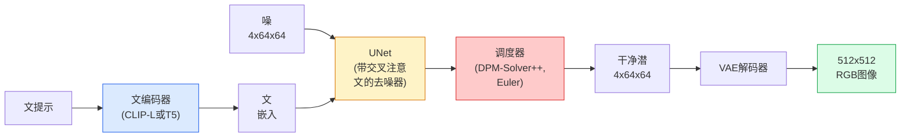

# Stable Diffusion — 架构与微调

> Stable Diffusion是预训VAE潜空间运行的DDPM，经交叉注意条件于文，用快确定性ODE求解器采样，由无分类器引导驾驶。

**类型:** 学 + 用
**语言:** Python
**前置要求:** 阶段4课程10(扩散)，阶段7课程02(自注意)
**时间:** ~75分钟

## 学习目标

- 追Stable Diffusion管道五件:VAE、文编码器、U-Net、调度器、安全检查器 — 和每实做什么
- 解释潜扩散为何在4x64x64潜空间(而非3x512x512图像)训减算48x无质量损失
- 用`diffusers`生成图像、跑图像到图像、修复和ControlNet引导生成
- 在小自定义数据集用LoRA微调Stable Diffusion并在推理加载LoRA适配器

## 问题背景

直接于512x512 RGB图像训DDPM贵。每训练步反向过见3x512x512 = 786,432输入值U-Net，采样50+次同U-Net前向。Stable Diffusion 1.5质量级(2022发)，像素空间扩散需约256 GPU月训练和消费GPU每图像10-30秒。

使开权文到图实用技巧是**潜扩散**(Rombach等, CVPR 2022)。训VAE映3x512x512图像到4x64x64潜张量回，然后于那潜空间做扩散。算降`(3*512*512)/(4*64*64) = 48x`。采样从数十秒降到同GPU下两秒。

几乎每现代图像生成模型 — SDXL、SD3、FLUX、HunyuanDiT、Wan-Video — 是潜扩散模型变自编码器、去噪器(U-Net或DiT)和文条件。学Stable Diffusion你已学模板。

## 概念讲解

### 管道



- **VAE** — 冻结自编码器。编码器转图像为潜(用于img2img和训练)。解码器转潜回图像。
- **文编码器** — CLIP文编码器(SD 1.x/2.x)，CLIP-L + CLIP-G(SDXL)，或T5-XXL(SD3/FLUX)。产token嵌入序列。
- **U-Net** — 去噪器。有交叉注意层每分辨率级从潜注意文嵌入。
- **调度器** — 采样算法(DDIM、Euler、DPM-Solver++)。选sigma、混预噪回潜。
- **安全检查器** — 可选NSFW / 非法内容过滤器输出图像。

### 无分类器引导(CFG)

纯文条件学每提示`c`的`epsilon_theta(x_t, t, c)`。CFG训同网络10%时间`c`丢(替为空嵌入)，给单模型预条件和无条件噪。推理:

```
eps = eps_uncond + w * (eps_cond - eps_uncond)
```

`w`是引导尺度。`w=0`无条件，`w=1`纯条件，`w>1`推输出更"条件于提示"代价多样性。SD默认`w=7.5`。

CFG是文到图生产质量工作因。无它，提示弱偏输出;有它，提示主导。

### 潜空间几何

VAE的4通道潜非仅压缩图像。它是算粗对应语义编辑空间(提示工程 + 插值皆活此)，扩散U-Net已训在此花全建模预算。解码随机4x64x64潜不产随机看图像 — 产垃圾，因仅特定潜子空间解码为有效图像。

两后果:

1. **Img2img** = 编码图像为潜、加部分噪、跑去噪器、解码。图像结构存活因编码近可逆;内容依提示改。
2. **修复** = 同img2img但去噪器仅更新掩区域;未掩区域保编码潜。

### U-Net架构

SD U-Net是课10TinyUNet大版带三加:

- **Transformer块**每空间分辨率，含自注意 + 交叉注意文嵌入。
- **时间嵌入**经正弦编码MLP。
- **跳跃连接**编码器和匹配分辨率解码器间。

SD 1.5总参数:~860M。SDXL:~2.6B。FLUX:~12B。参数跳主要在注意层。

### LoRA微调

Stable Diffusion全微调需20+ GB显存更新860M参数。LoRA(低秩适应)保基模型冻结注入小秩分解矩阵入注意层。SD LoRA适配器典型10-50 MB，单消费GPU训10-60分钟，推理时加载为插入修改。

```
原: W_q : (d_in, d_out)   冻结
LoRA:     W_q + alpha * (A @ B)   其中 A : (d_in, r), B : (r, d_out)

r典型4-32。
```

LoRA是几乎每社区微调分发方式。CivitAI和Hugging Face托管百万。

### 你将见调度器

- **DDIM** — 确定性，~50步，简。
- **Euler ancestral** — 随机，30-50步，稍更有创意样本。
- **DPM-Solver++ 2M Karras** — 确定性，20-30步，生产默认。
- **LCM / TCD / Turbo** — 一致模型和蒸馏变种;1-4步代价些质量。

换调度器是`diffusers`单行改有时无重训修样本问题。

## 构建

这课用`diffusers`端到端而非从零重建Stable Diffusion。你需重建件(VAE、文编码器、U-Net、调度器)是他课主题;此处目标是生产API流利。

### 步骤1: 文到图像

```python
import torch
from diffusers import StableDiffusionPipeline

pipe = StableDiffusionPipeline.from_pretrained(
    "runwayml/stable-diffusion-v1-5",
    torch_dtype=torch.float16,
).to("cuda")

image = pipe(
    prompt="a dog riding a skateboard in tokyo, studio ghibli style",
    guidance_scale=7.5,
    num_inference_steps=25,
    generator=torch.Generator("cuda").manual_seed(42),
).images[0]
image.save("dog.png")
```

`float16`半显存无可见质量损。`num_inference_steps=25`默认DPM-Solver++合`num_inference_steps=50`DDIM。

### 步骤2: 换调度器

```python
from diffusers import DPMSolverMultistepScheduler, EulerAncestralDiscreteScheduler

pipe.scheduler = DPMSolverMultistepScheduler.from_config(pipe.scheduler.config)
pipe.scheduler = EulerAncestralDiscreteScheduler.from_config(pipe.scheduler.config)
```

调度器状态解耦U-Net权重。你可训于DDPM用任调度器采样。

### 步骤3: 图像到图像

```python
from diffusers import StableDiffusionImg2ImgPipeline
from PIL import Image

img2img = StableDiffusionImg2ImgPipeline.from_pretrained(
    "runwayml/stable-diffusion-v1-5",
    torch_dtype=torch.float16,
).to("cuda")

init_image = Image.open("dog.png").convert("RGB").resize((512, 512))
out = img2img(
    prompt="a dog riding a skateboard, oil painting",
    image=init_image,
    strength=0.6,
    guidance_scale=7.5,
).images[0]
```

`strength`是去噪前加多少噪(0.0 = 不改，1.0 = 全再生)。0.5-0.7风格迁移标准范围。

### 步骤4: 修复

```python
from diffusers import StableDiffusionInpaintPipeline

inpaint = StableDiffusionInpaintPipeline.from_pretrained(
    "runwayml/stable-diffusion-inpainting",
    torch_dtype=torch.float16,
).to("cuda")

image = Image.open("dog.png").convert("RGB").resize((512, 512))
mask = Image.open("dog_mask.png").convert("L").resize((512, 512))

out = inpaint(
    prompt="a cat",
    image=image,
    mask_image=mask,
    guidance_scale=7.5,
).images[0]
```

掩中白像素是再生区。黑像素保。

### 步骤5: LoRA加载

```python
pipe.load_lora_weights("sayakpaul/sd-lora-ghibli")
pipe.fuse_lora(lora_scale=0.8)

image = pipe(prompt="a village square in ghibli style").images[0]
```

`lora_scale`控强度;0.0 = 无效，1.0 = 全效。`fuse_lora`就地烘适配器入权重提速，但阻换。加载不同适配器前调`pipe.unfuse_lora()`。

### 步骤6: LoRA训练(草)

真LoRA训练活在`peft`或`diffusers.training`。概:

```python
# 伪代码
for step, batch in enumerate(dataloader):
    images, prompts = batch
    latents = vae.encode(images).latent_dist.sample() * 0.18215

    t = torch.randint(0, num_train_timesteps, (batch_size,))
    noise = torch.randn_like(latents)
    noisy_latents = scheduler.add_noise(latents, noise, t)

    text_emb = text_encoder(tokenizer(prompts))

    pred_noise = unet(noisy_latents, t, text_emb)  # LoRA权重注于此

    loss = F.mse_loss(pred_noise, noise)
    loss.backward()
    optimizer.step()
```

仅LoRA矩阵收梯度;基U-Net、VAE和文编码器冻结。批大小1和梯度检查点适8 GB显存。

## 使用

生产，你实决策:

- **模型族**: SD 1.5开源社区微调，SDXL高保真，SD3 / FLUX最先进和严许可。
- **调度器**: DPM-Solver++ 2M Karras 20-30步，LCM-LoRA延迟低于1s。
- **精度**: `float16`于4080/4090，`bfloat16`于A100和新，`int8`(经`bitsandbytes`或`compel`)显存紧。
- **条件**: 纯文工作;更强控，加ControlNet(canny、深度、姿态)基管道上。

批生成，`AUTO1111` / `ComfyUI`是社区工具;生产API，`diffusers` + `accelerate`或`optimum-nvidia`带TensorRT编译。

## 交付成果

本课程产:

- `outputs/prompt-sd-pipeline-planner.md` — 基延迟预算、保真目标和许可约束选SD 1.5 / SDXL / SD3 / FLUX加调度器和精度提示词
- `outputs/skill-lora-training-setup.md` — 为自定义数据集写全LoRA训练配置含标注、秩、批大小和学习率技能

## 练习题

1. **(易)** 同提示用`guidance_scale`于`[1, 3, 5, 7.5, 10, 15]`生成。描述图像如何变。何引导值伪影现？

2. **(中)** 取任真照，经`StableDiffusionImg2ImgPipeline`于`strength`在`[0.2, 0.4, 0.6, 0.8, 1.0]`跑。何强度保构图换风格？为何1.0全忽略输入？

3. **(难)** 于单主体(宠物、标志、角色)10-20图像训LoRA并生成带该主体新场景。报最佳身份保无过拟合输入图像LoRA秩和训练步。

## 关键术语

| 术语 | 人们怎么说 | 实际含义 |
|------|----------------|----------------------|
| 潜扩散 | "潜内扩散" | 整DDPM在VAE潜空间(4x64x64)而非像素空间(3x512x512)运行;48x算省 |
| VAE缩因子 | "0.18215" | 重缩VAE原潜为约单位方差常数;每SD管道硬编码 |
| 无分类器引导 | "CFG" | 混条件和无条件噪预测;单最有影响推理钮 |
| 调度器 | "采样器" | 将噪 + 模型预测转为去噪潜轨迹算法 |
| LoRA | "低秩适配器" | 小秩分解矩阵微调注意层不触基权重 |
| 交叉注意 | "文图注意" | 潜token到文token注意;每U-Net级注入提示信息 |
| ControlNet | "结构条件" | 分训适配器用额外输入(canny、深度、姿态、分割)驾驶SD |
| DPM-Solver++ | "默认调度器" | 二阶确定性ODE求解器;低步数(20-30)最佳质量于2026 |

## 延伸阅读

- [High-Resolution Image Synthesis with Latent Diffusion (Rombach等, 2022)](https://arxiv.org/abs/2112.10752) — Stable Diffusion论文;含每证设计消融
- [Classifier-Free Diffusion Guidance (Ho & Salimans, 2022)](https://arxiv.org/abs/2207.12598) — CFG论文
- [LoRA: Low-Rank Adaptation of Large Language Models (Hu等, 2021)](https://arxiv.org/abs/2106.09685) — LoRA先NLP;几乎无改转SD
- [diffusers文档](https://huggingface.co/docs/diffusers) — 每SD / SDXL / SD3 / FLUX管道参考