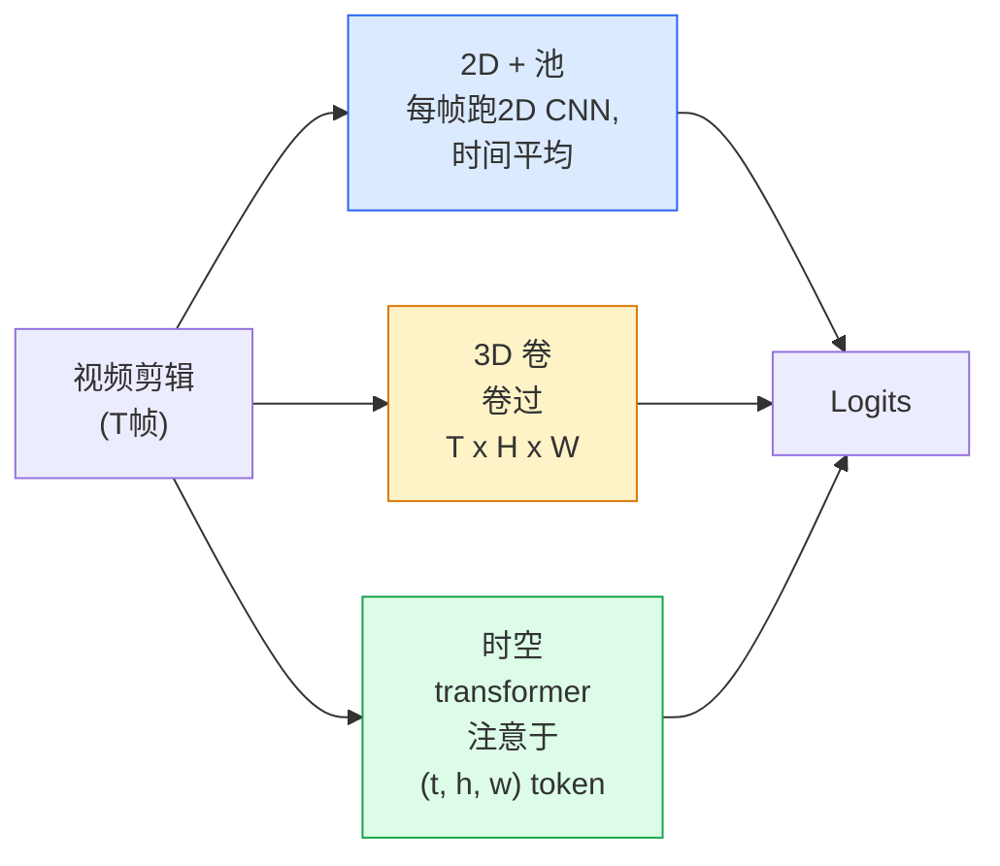

# 视频理解 — 时间建模

> 视频是图像序列加上连接它们的物理规律。每个视频模型要么将时间视为额外轴(3D卷积)、视为需要注意的序列(transformer)，要么提取一次特征后池化(2D+池化)。

**类型:** 学习 + 构建
**语言:** Python
**前置要求:** 阶段4课程03(CNN)，阶段4课程04(图像分类)
**时间:** ~45分钟

## 学习目标

- 区三主流视频建模方法(2D+池、3D卷、时空transformer)并预测其代价和精度权衡
- 实现帧采样、时间池和2D+池基线分类器于PyTorch
- 解释为何I3D"膨胀"3D核从ImageNet权重好转移和分解(2+1)D卷有何不同
- 读标准动作识别数据集和指标:Kinetics-400/600、UCF101、Something-Something V2;剪辑和视频级top-1精度

## 问题背景

30秒视频30帧率是900图像。朴素，视频分类是图像分类跑900次后某聚合。那工作于动作几乎每帧可见(体育、烹饪、健身视频)并坏当动作由运动定义:"从左推物到右"每单帧看像两静物。

每视频架构核心问题是:何时时间结构被建模，如何？答案驱动一切 — 算代价、预训练策略、能否复ImageNet权重、模型训何数据集。

这课故意短于静图像课。核心图像机已就，视频理解主要是时间故事:采样、建模、聚合。

## 概念讲解

### 三架构族



### 2D + 池

取2D CNN(ResNet、EfficientNet、ViT)。独立于每采样帧跑。平均(或最大池、或注意池)每帧嵌入。喂池向量给分类器。

优点:
- ImageNet预训练直转。
- 最简实现。
- 便宜: T帧 * 单图像推理代价。

缺点:
- 不能建模运动。动作 = 外观聚合。
- 时间池序不变;"开门"和"关门"看同。

何时用:外观重任务、小视频数据集迁移学习、初基线。

### 3D卷积

替2D (H, W)核为3D (T, H, W)核。网络于空间和时间卷。早族:C3D、I3D、SlowFast。

I3D技巧:取预训2D ImageNet模型，"膨胀"每2D核沿新时间轴拷。3x3 2D卷积变3x3x3 3D卷积。这给3D模型强预训权重而非从零训。

优点:
- 直建模运动。
- I3D膨胀给免费迁移学习。

缺点:
- T/8倍FLOPs于2D对应(时间核3堆3次)。
- 时间核小;长程运动需金字塔或双流方法。

何时用:运动是信号动作识别(Something-Something V2、带运动重类Kinetics)。

### 时空transformer

Tokenize视频为时空patch网格并注意跨全。TimeSformer、ViViT、Video Swin、VideoMAE。

注意模式重要:
- **联合** — 一大注意于(t, h, w)。`T*H*W`二次;贵。
- **分治** — 每块两注意:一时间、一空间。线性-ish缩。
- **分解** — 时间注意与空间注意跨块交替。

优点:
- 每主要基准SOTA精度。
- 从图像transformer(ViT)经patch膨胀转。
- 支持长上下文视频经稀疏注意。

缺点:
- 算饥。
- 需仔细注意模式选择或运行时间气球。

何时用:大数据集、高保真视频理解、多模视频+文任务。

### 帧采样

10秒剪辑30帧率300帧;喂全300任模型浪费。标准策略:

- **均匀采样** — 跨剪辑均匀选T帧。2D+池默认。
- **密集采样** — 随机连续T帧窗。3D卷积常见因运动需相邻帧。
- **多剪辑** — 从同视频采多T帧窗、分类每、测试时平均预测。

T常8、16、32或64。高T = 更多时间信号更多算。

### 评估

两级:
- **剪辑级精度** — 模型见一T帧剪辑，报top-k。
- **视频级精度** — 每视频多剪辑剪辑级预测平均;更高更稳。

总报两。模型78%剪辑 / 82%视频重赖测试时平均;80% / 81%每剪辑更鲁棒。

### 你将遇数据集

- **Kinetics-400 / 600 / 700** — 通用动作数据集。400k剪辑;YouTube URL(多现死)。
- **Something-Something V2** — 运动定义动作("移X从左到右")。不能2D+池解。
- **UCF-101**、**HMDB-51** — 更老、更小、仍报。
- **AVA** — 时空动作*定位*;比分类更难。

## 构建

### 步骤1: 帧采样器

均匀和密采样器工作于帧列表(或视频张量)。

```python
import numpy as np

def sample_uniform(num_frames_total, T):
    if num_frames_total <= T:
        return list(range(num_frames_total)) + [num_frames_total - 1] * (T - num_frames_total)
    step = num_frames_total / T
    return [int(i * step) for i in range(T)]


def sample_dense(num_frames_total, T, rng=None):
    rng = rng or np.random.default_rng()
    if num_frames_total <= T:
        return list(range(num_frames_total)) + [num_frames_total - 1] * (T - num_frames_total)
    start = int(rng.integers(0, num_frames_total - T + 1))
    return list(range(start, start + T))
```

两者返`T`索引你用来切片视频张量。

### 步骤2: 2D+池基线

每帧跑2D ResNet-18、平均池特征、分类。

```python
import torch
import torch.nn as nn
from torchvision.models import resnet18, ResNet18_Weights

class FramePool(nn.Module):
    def __init__(self, num_classes=400, pretrained=True):
        super().__init__()
        weights = ResNet18_Weights.IMAGENET1K_V1 if pretrained else None
        backbone = resnet18(weights=weights)
        self.features = nn.Sequential(*(list(backbone.children())[:-1]))  # 全平均池保
        self.head = nn.Linear(512, num_classes)

    def forward(self, x):
        # x: (N, T, 3, H, W)
        N, T = x.shape[:2]
        x = x.view(N * T, *x.shape[2:])
        feats = self.features(x).view(N, T, -1)
        pooled = feats.mean(dim=1)
        return self.head(pooled)

model = FramePool(num_classes=10)
x = torch.randn(2, 8, 3, 224, 224)
print(f"输出: {model(x).shape}")
print(f"参数: {sum(p.numel() for p in model.parameters()):,}")
```

1100万参数、ImageNet预训、每帧跑、平均、分类。这基线常在外观重任务正3D模型5-10点内 — 有时更好，因它复更强ImageNet骨干。

### 步骤3: I3D风格膨胀3D卷积

单2D卷积转3D卷积通过沿新时间轴重复权重。

```python
def inflate_2d_to_3d(conv2d, time_kernel=3):
    out_c, in_c, kh, kw = conv2d.weight.shape
    weight_3d = conv2d.weight.data.unsqueeze(2)  # (out, in, 1, kh, kw)
    weight_3d = weight_3d.repeat(1, 1, time_kernel, 1, 1) / time_kernel
    conv3d = nn.Conv3d(in_c, out_c, kernel_size=(time_kernel, kh, kw),
                        padding=(time_kernel // 2, conv2d.padding[0], conv2d.padding[1]),
                        stride=(1, conv2d.stride[0], conv2d.stride[1]),
                        bias=False)
    conv3d.weight.data = weight_3d
    return conv3d

conv2d = nn.Conv2d(3, 64, kernel_size=3, padding=1, bias=False)
conv3d = inflate_2d_to_3d(conv2d, time_kernel=3)
print(f"2D权重形状:  {tuple(conv2d.weight.shape)}")
print(f"3D权重形状:  {tuple(conv3d.weight.shape)}")
x = torch.randn(1, 3, 8, 56, 56)
print(f"3D输出形状:  {tuple(conv3d(x).shape)}")
```

除`time_kernel`保激活大小粗恒 — 重要首过不破批归一化统计。

### 步骤4: 分解(2+1)D卷积

分3D卷积为2D(空间)和1D(时间)卷积。同感受野、少参数、些基准更好精度。

```python
class Conv2Plus1D(nn.Module):
    def __init__(self, in_c, out_c, kernel_size=3):
        super().__init__()
        mid_c = (in_c * out_c * kernel_size * kernel_size * kernel_size) \
                // (in_c * kernel_size * kernel_size + out_c * kernel_size)
        self.spatial = nn.Conv3d(in_c, mid_c, kernel_size=(1, kernel_size, kernel_size),
                                 padding=(0, kernel_size // 2, kernel_size // 2), bias=False)
        self.bn = nn.BatchNorm3d(mid_c)
        self.act = nn.ReLU(inplace=True)
        self.temporal = nn.Conv3d(mid_c, out_c, kernel_size=(kernel_size, 1, 1),
                                  padding=(kernel_size // 2, 0, 0), bias=False)

    def forward(self, x):
        return self.temporal(self.act(self.bn(self.spatial(x))))

c = Conv2Plus1D(3, 64)
x = torch.randn(1, 3, 8, 56, 56)
print(f"(2+1)D输出: {tuple(c(x).shape)}")
```

全R(2+1)D网络同ResNet-18每3x3卷积替为`Conv2Plus1D`。

## 使用

两库覆盖生产视频工作:

- `torchvision.models.video` — R(2+1)D、MViT、Swin3D带预训Kinetics权重。同图像模型API。
- `pytorchvideo` (Meta) — 模型动物园、Kinetics / SSv2 / AVA数据加载器、标准变换。

对视觉语言视频模型(视频描述、视频问答)，用`transformers`(`VideoMAE`、`VideoLLaMA`、`InternVideo`)。

## 交付成果

本课程产:

- `outputs/prompt-video-architecture-picker.md` — 基外观vs运动、数据集大小和算预算选2D+池 / I3D / (2+1)D / transformer提示词
- `outputs/skill-frame-sampler-auditor.md` — 检视频管道采样器并标常见bug:偏一索引、`num_frames < T`不均采样、缺保形裁剪等技能

## 练习题

1. **(易)** 算FramePool T=8近似FLOPs vs I3D风格3D ResNet T=8。论证为何2D+池便宜3-5x。

2. **(中)** 生成合成视频数据集:随机球随机方向移动，按运动方向标签("左到右"、"右到左"、"斜上")。训FramePool于它。示其达近机会精度，证外观不足于运动任务。

3. **(难)** 通过替ResNet-18每Conv2d为`Conv2Plus1D`建R(2+1)D-18。从ImageNet预训ResNet-18膨胀首卷积权重。于练习2运动数据集训并击败FramePool。

## 关键术语

| 术语 | 人们怎么说 | 实际含义 |
|------|----------------|----------------------|
| 2D + 池 | "每帧分类器" | 每采样帧跑2D CNN、跨时间平均池特征、分类 |
| 3D卷积 | "时空核" | 于(T, H, W)卷积核;可原生建模运动 |
| 膨胀 | "升2D权重到3D" | 初始化3D卷积权重通过沿新时间轴重复2D卷积权重，然后除kernel_T保激活缩 |
| (2+1)D | "分解卷积" | 分3D为2D空间 + 1D时间;少参数、中间多非线性 |
| 分治注意 | "时间后空间" | Transformer块每层两注意:一于同帧token、一于同位置token |
| 剪辑 | "T帧窗" | T帧采子序列;视频模型消费单位 |
| 剪辑vs视频精度 | "两评估设置" | 剪辑 = 每视频一样本，视频 = 跨多采剪辑平均 |
| Kinetics | "视频ImageNet" | 400-700动作类、300k+ YouTube剪辑、标准视频预训语料 |

## 延伸阅读

- [I3D: Quo Vadis, Action Recognition (Carreira & Zisserman, 2017)](https://arxiv.org/abs/1705.07750) — 引膨胀和Kinetics数据集
- [R(2+1)D: A Closer Look at Spatiotemporal Convolutions (Tran等, 2018)](https://arxiv.org/abs/1711.11248) — 分解卷积、仍强基线
- [TimeSformer: Is Space-Time Attention All You Need? (Bertasius等, 2021)](https://arxiv.org/abs/2102.05095) — 首强视频transformer
- [VideoMAE (Tong等, 2022)](https://arxiv.org/abs/2203.12602) — 视频掩自编码器预训;现主流预训配方