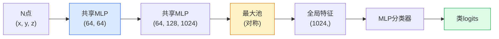

# 3D视觉 — 点云与NeRF

> 3D视觉有两味。点云是传感器的原始输出。NeRF是学习的体积场。两者回答"空间中什么在哪里"。

**类型:** 学 + 构建
**语言:** Python
**前置要求:** 阶段4课程03(CNN)，阶段1课程12(张量操作)
**时间:** ~45分钟

## 学习目标

- 区分显式(点云、网格、体素)和隐式(符号距离场、NeRF)3D表示及何时各用
- 理解PointNet的对称函数技巧使神经网络对无序点集置换不变
- 追NeRF前向过程：光线投射、体积渲染、位置编码、MLP密度+色头
- 用`nerfstudio`或`instant-ngp`从少数位姿图像预训3D重建

## 问题背景

相机产2D图像。LIDAR产无序3D点集。运动恢复结构管道产稀疏3D关键点云。NeRF从少数位姿图像重建整3D场景。这些都是"视觉"但都不像CNN想要的密集张量。

3D视觉重要因几乎每高价值机器人任务在3D运行：抓取、避障、导航、AR遮挡、3D内容捕获。仅懂2D图像的视觉工程师被锁在领域最快增长切片外(AR/VR内容、机器人、自动驾驶栈、NeRF基房地产或建筑3D重建)。

两表示因不同原因主导。点云是传感器免费给的。NeRF和其后继者(3D高斯泼溅、神经SDF)是你让神经网络学场景所得。

## 概念讲解

### 点云

点云是R^3中N点的无序集，可选每点带特征(色、强度、法向量)。

```
cloud = [
  (x1, y1, z1, r1, g1, b1),
  (x2, y2, z2, r2, g2, b2),
  ...
  (xN, yN, zN, rN, gN, bN),
]
```

无网格、无连通性。两性使神经网络难：

- **置换不变** — 输出必不依赖点顺序。
- **变N** — 单模型必处理不同大小云。

PointNet (Qi等, 2017)用一主意解两者：共享MLP跑每点，然后用对称函数(最大池)聚合。结果是固定大小向量不依赖顺序。

```
f(P) = max_{p in P} MLP(p)
```

这是PointNet全核心。深变种(PointNet++、Point Transformer)加层次采样和局部聚合但对称函数技巧不变。

### PointNet架构



"共享MLP"意同MLP独立跑每点。实现为1x1卷过点维度高效。

### 神经辐射场(NeRF)

NeRF (Mildenhall等, 2020)取问"能否从N照片重建3D场景？"用神经网络回答是场景本身。网络映`(x, y, z, viewing_direction)`到`(density, colour)`。渲染新视图是光线投射循环过此网络。

```
NeRF MLP:  (x, y, z, theta, phi) -> (sigma, r, g, b)

渲染像素(u, v)于新视图:
  1. 从相机过像素(u, v)投射光线
  2. 沿光线距t_1, t_2, ..., t_N采样点
  3. 每点查询MLP
  4. 用(1 - exp(-sigma * dt))权重合成色
  5. 和为渲染像素色
```

损失比渲染像素和训练照片真像素。反向过渲染步更新MLP。无3D真值、无显式几何 — 场景存于MLP权重。

### NeRF中位置编码

纯MLP于`(x, y, z)`不能表高频细节因MLP谱偏低频。NeRF通过编码每坐标为傅里叶特征向量于MLP前修：

```
gamma(p) = (sin(2^0 pi p), cos(2^0 pi p), sin(2^1 pi p), cos(2^1 pi p), ...)
```

达L=10频率级。这同transformer位置编码技巧，再现于扩散时间条件(课程10)。无它，NeRF看模糊。

### 体积渲染

```
C(r) = sum_i T_i * (1 - exp(-sigma_i * delta_i)) * c_i

T_i  = exp(- sum_{j<i} sigma_j * delta_j)
delta_i = t_{i+1} - t_i
```

`T_i`是透射率 — 多少光存活到点i。`(1 - exp(-sigma_i * delta_i))`是点i不透明度。`c_i`是色。终像素是沿光线权重和。

### 何替NeRF

纯NeRF训慢(小时)渲染慢(每图像秒)。后继：

- **Instant-NGP** (2022) — 哈希网格编码替MLP位置输入；秒训。
- **Mip-NeRF 360** — 处理无界场景和抗锯齿。
- **3D高斯泼溅** (2023) — 替体积场为百万3D高斯；分钟训，实时渲染。现生产默认。

几乎每2026真NeRF产品实是3D高斯泼溅。心模仍是NeRF。

### 数据集和基准

- **ShapeNet** — 3D CAD模型分类和分割作点云。
- **ScanNet** — 室内真扫描分割。
- **KITTI** — 户外LIDAR点云自动驾驶。
- **NeRF Synthetic** / **Blended MVS** — 位姿图像数据集视图合成。
- **Mip-NeRF 360**数据集 — 无界真场景。

## 构建

### 步骤1: PointNet分类器

```python
import torch
import torch.nn as nn

class PointNet(nn.Module):
    def __init__(self, num_classes=10):
        super().__init__()
        self.mlp1 = nn.Sequential(
            nn.Conv1d(3, 64, 1),    nn.BatchNorm1d(64),   nn.ReLU(inplace=True),
            nn.Conv1d(64, 64, 1),   nn.BatchNorm1d(64),   nn.ReLU(inplace=True),
        )
        self.mlp2 = nn.Sequential(
            nn.Conv1d(64, 128, 1),  nn.BatchNorm1d(128),  nn.ReLU(inplace=True),
            nn.Conv1d(128, 1024, 1), nn.BatchNorm1d(1024), nn.ReLU(inplace=True),
        )
        self.head = nn.Sequential(
            nn.Linear(1024, 512),   nn.BatchNorm1d(512),  nn.ReLU(inplace=True),
            nn.Dropout(0.3),
            nn.Linear(512, 256),    nn.BatchNorm1d(256),  nn.ReLU(inplace=True),
            nn.Dropout(0.3),
            nn.Linear(256, num_classes),
        )

    def forward(self, x):
        # x: (N, 3, num_points) — Conv1d转置
        x = self.mlp1(x)
        x = self.mlp2(x)
        x = torch.max(x, dim=-1)[0]       # (N, 1024)
        return self.head(x)

pts = torch.randn(4, 3, 1024)
net = PointNet(num_classes=10)
print(f"输出: {net(pts).shape}")
print(f"参数: {sum(p.numel() for p in net.parameters()):,}")
```

约160万参数。每云跑1024点。

### 步骤2: 位置编码

```python
def positional_encoding(x, L=10):
    """
    x: (..., D) -> (..., D * 2 * L)
    """
    freqs = 2.0 ** torch.arange(L, dtype=x.dtype, device=x.device)
    args = x.unsqueeze(-1) * freqs * 3.141592653589793
    sinc = torch.cat([args.sin(), args.cos()], dim=-1)
    return sinc.reshape(*x.shape[:-1], -1)

x = torch.randn(5, 3)
y = positional_encoding(x, L=10)
print(f"输入:  {x.shape}")
print(f"编码: {y.shape}     # (5, 60)")
```

乘`2^l * pi`给渐高频。

### 步骤3: 微NeRF MLP

```python
class TinyNeRF(nn.Module):
    def __init__(self, L_pos=10, L_dir=4, hidden=128):
        super().__init__()
        self.L_pos = L_pos
        self.L_dir = L_dir
        pos_dim = 3 * 2 * L_pos
        dir_dim = 3 * 2 * L_dir
        self.trunk = nn.Sequential(
            nn.Linear(pos_dim, hidden), nn.ReLU(inplace=True),
            nn.Linear(hidden, hidden),  nn.ReLU(inplace=True),
            nn.Linear(hidden, hidden),  nn.ReLU(inplace=True),
            nn.Linear(hidden, hidden),  nn.ReLU(inplace=True),
        )
        self.sigma = nn.Linear(hidden, 1)
        self.color = nn.Sequential(
            nn.Linear(hidden + dir_dim, hidden // 2), nn.ReLU(inplace=True),
            nn.Linear(hidden // 2, 3), nn.Sigmoid(),
        )

    def forward(self, x, d):
        x_enc = positional_encoding(x, self.L_pos)
        d_enc = positional_encoding(d, self.L_dir)
        h = self.trunk(x_enc)
        sigma = torch.relu(self.sigma(h)).squeeze(-1)
        rgb = self.color(torch.cat([h, d_enc], dim=-1))
        return sigma, rgb

nerf = TinyNeRF()
x = torch.randn(128, 3)
d = torch.randn(128, 3)
s, c = nerf(x, d)
print(f"sigma: {s.shape}   rgb: {c.shape}")
```

微比原NeRF(有2MLP干深8)。够示架构。

### 步骤4: 沿光线体积渲染

```python
def volumetric_render(sigma, rgb, t_vals):
    """
    sigma: (..., N_samples)
    rgb:   (..., N_samples, 3)
    t_vals: (N_samples,) 光线距
    """
    delta = torch.cat([t_vals[1:] - t_vals[:-1], torch.full_like(t_vals[:1], 1e10)])
    alpha = 1.0 - torch.exp(-sigma * delta)
    trans = torch.cumprod(torch.cat([torch.ones_like(alpha[..., :1]), 1.0 - alpha + 1e-10], dim=-1), dim=-1)[..., :-1]
    weights = alpha * trans
    rendered = (weights.unsqueeze(-1) * rgb).sum(dim=-2)
    depth = (weights * t_vals).sum(dim=-1)
    return rendered, depth, weights


N = 64
t_vals = torch.linspace(2.0, 6.0, N)
sigma = torch.rand(N) * 0.5
rgb = torch.rand(N, 3)
rendered, depth, weights = volumetric_render(sigma, rgb, t_vals)
print(f"渲染色: {rendered.tolist()}")
print(f"深度:           {depth.item():.2f}")
```

一光线，64样本，合为单RGB像素和深度。

## 使用

认真工作：

- `nerfstudio` (Tancik等) — 现NeRF / Instant-NGP / 高斯泼溅参考库。命令行加web查看器。
- `pytorch3d` (Meta) — 可微渲染、点云工具、网格操作。
- `open3d` — 点云处理、配准、可视化。

部署，3D高斯泼溅大替纯NeRF因渲染100x快。重建质量可比。

## 交付成果

本课程产：

- `outputs/prompt-3d-task-router.md` — 基任务和输入数据路由到正3D表示(点云、网格、体素、NeRF、高斯泼溅)提示词
- `outputs/skill-point-cloud-loader.md` — 写PyTorch `Dataset`为.ply / .pcd / .xyz文件带正归一化、居中和点采样技能

## 练习题

1. **(易)** 示PointNet置换不变：同云跑两次，一次点洗牌。验输出同达浮点噪。

2. **(中)** 实现微光线生成函数，给相机内参和位姿，产每像素光线原和向于H x W图像。

3. **(难)** 于色立方渲染视图合成数据集训TinyNeRF(经可微渲染或简光线追踪生成)。报epoch 1、10和100渲染损。何epoch模型产可识视图？

## 关键术语

| 术语 | 人们怎么说 | 实际含义 |
|------|----------------|----------------------|
| 点云 | "LIDAR来的3D点" | 无序(x, y, z)集 + 可选每点特征 |
| PointNet | "首个点云神经网络" | 每点共享MLP + 对称(最大)池；构造成置换不变 |
| NeRF | "是场景的MLP" | 映(x, y, z, dir)到(density, colour)网络；光线投射渲染 |
| 位置编码 | "傅里叶特征" | 编每坐标为多频sin/cos克MLP低频偏 |
| 体积渲染 | "光线积分" | 用透射率和alpha沿光线合样本为单像素 |
| Instant-NGP | "哈希网格NeRF" | 替NeRF坐标MLP为多分辨率哈希网格；100-1000x快 |
| 3D高斯泼溅 | "百万高斯" | 场景 = 3D高斯集；实时渲染，分钟训 |
| SDF | "符号距离场" | 函数返到最近面符号距离；另一隐式表示 |

## 延伸阅读

- [PointNet (Qi等, 2017)](https://arxiv.org/abs/1612.00593) — 置换不变分类器
- [NeRF (Mildenhall等, 2020)](https://arxiv.org/abs/2003.08934) — 使从照片3D重建为神经网络问题论文
- [Instant-NGP (Müller等, 2022)](https://arxiv.org/abs/2201.05989) — 哈希网格，1000x提速
- [3D Gaussian Splatting (Kerbl等, 2023)](https://arxiv.org/abs/2308.04079) — 生产中替NeRF架构