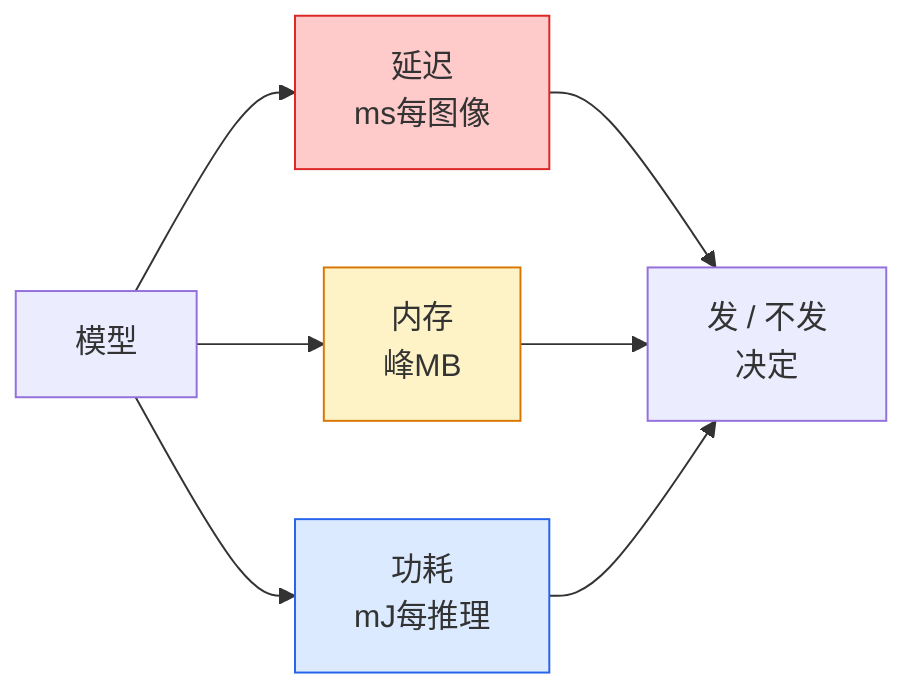

# 实时视觉 — 边缘部署

> 边缘推理是让90%精度的模型在2GB内存设备上以30fps运行的学问。每一个精度百分点都在与延迟毫秒进行权衡。

**类型:** 学习 + 构建
**语言:** Python
**前置要求:** 阶段4课程04(图像分类)，阶段10课程11(量化)
**时间:** ~75分钟

## 学习目标

- 测任PyTorch模型推理延迟、峰内存和吞吐，读FLOPs / 参数 / 延迟权衡
- 用PyTorch后训量化量化视觉模型到INT8并验精度损< 1%
- 导出到ONNX并用ONNX Runtime或TensorRT编译；名三最常导失败及其修
- 解释何时选MobileNetV3、EfficientNet-Lite、ConvNeXt-Tiny或MobileViT为边缘约束

## 问题背景

训时视觉模型是浮点怪兽。100M参数，每前向10 GFLOPs，2 GB显存。无适手机、车信息娱乐单元、工业相机或无人机。发视觉系统意同预测适入100x小预算。

三钮做大工作：模型选择(同配方更小架构)、量化(INT8而非FP32)和推理运行时(ONNX Runtime、TensorRT、Core ML、TFLite)。正做是工作站跑演示和$30相机模块发产品差。

这课先设测量纪律(你不能优化你不能测)，后走三钮。目标非学每边缘运行时而是知何杠杆存和如何验每做你想。

## 概念讲解

### 三预算



- **延迟**: p50、p95、p99。平均仅p50藏实时系统重要的尾行为。
- **峰内存**: 设备见最大，非稳态平均。重要因OOM嵌入目标致命。
- **功耗/能量**: 电池设备每推理毫焦。常代理CPU/GPU利用率 * 时间。

(model, latency, memory, accuracy)表是边缘决定做从。每格于目标设备测，非工作站。

### 测量纪律

每边缘剖析应遵三规则：

1. **Warm up**模型用5-10虚前向过测前。冷缓存和JIT编译产不代表首数。
2. **同步**GPU工作负载用`torch.cuda.synchronize()`于计时块前后。无此你测核派发，非核执行。
3. **固定输入大小**到生产分辨率。224x224延迟非512x512延迟。

### FLOPs作代理

FLOPs(每推理浮点操作)是便宜、设备无关延迟代理。有用架构比较，误导为绝对墙钟。10%多FLOPs模型可实2x快因用硬件友好算(深卷编译好，大7x7卷不)。

规则：用FLOPs为架构搜索，用设备延迟为部署决定。

### 量化一段

替FP32权重和激活为INT8。模型大小降4x，内存带宽降4x，算于有INT8核硬件降2-4x(每现代移动SoC，每NVIDIA Tensor Core GPU)。视觉任务精度损典型后训静态量化0.1-1百分点。

类型：

- **动态** — 量化权重到INT8，激活FP算。易，小提速。
- **静态(后训)** — 量化权重 + 小校准集校准激活范围。比动态快多。
- **量化感知训(QAT)** — 训时模拟量化使模型学绕它。最佳精度，需标注数据。

视觉，后训静态量化给95%益5%力。仅当PTQ精度损不可接受用QAT。

### 剪枝和蒸馏

- **剪枝** — 去不重要权重(量基)或通道(结构)。过参模型工作好；已紧凑架构少有用。
- **蒸馏** — 训小学生模仿大教师logits。常恢缩模型丢精度多。生产边缘模型标准。

### 推理运行时

- **PyTorch eager** — 慢，非部署。仅开发用。
- **TorchScript** — 遗产。被`torch.compile`和ONNX导取代。
- **ONNX Runtime** — 中性运行时。CPU、CUDA、CoreML、TensorRT、OpenVINO皆有ONNX提供者。始这。
- **TensorRT** — NVIDIA编译器。NVIDIA GPU最佳延迟(工作站和Jetson)。与ONNX Runtime集成或独立。
- **Core ML** — Apple iOS/macOS运行时。需`.mlmodel`或`.mlpackage`。
- **TFLite** — Google Android/ARM运行时。需`.tflite`。
- **OpenVINO** — Intel CPU/VPU运行时。需`.xml` + `.bin`。

实：导PyTorch -> ONNX -> 择目标运行时。ONNX是通用语。

### 边缘架构选择器

| 预算 | 模型 | 何 |
|--------|-------|-----|
| < 3M参数 | MobileNetV3-Small | 处处编译，好基线 |
| 3-10M | EfficientNet-Lite-B0 | TFLite每参数最佳精度 |
| 10-20M | ConvNeXt-Tiny | 每参数最佳精度，CPU友好 |
| 20-30M | MobileViT-S或EfficientViT | Transformer带ImageNet精度 |
| 30-80M | Swin-V2-Tiny | 若栈支持窗注意 |

除非有特定原因不，量化所有到INT8。

## 构建

### 步骤1: 正测延迟

```python
import time
import torch

def measure_latency(model, input_shape, device="cpu", warmup=10, iters=50):
    model = model.to(device).eval()
    x = torch.randn(input_shape, device=device)
    with torch.no_grad():
        for _ in range(warmup):
            model(x)
        if device == "cuda":
            torch.cuda.synchronize()
        times = []
        for _ in range(iters):
            if device == "cuda":
                torch.cuda.synchronize()
            t0 = time.perf_counter()
            model(x)
            if device == "cuda":
                torch.cuda.synchronize()
            times.append((time.perf_counter() - t0) * 1000)
    times.sort()
    return {
        "p50_ms": times[len(times) // 2],
        "p95_ms": times[int(len(times) * 0.95)],
        "p99_ms": times[int(len(times) * 0.99)],
        "mean_ms": sum(times) / len(times),
    }
```

Warm up、同步、用`time.perf_counter()`。报百分位，非仅均值。

### 步骤2: 参数和FLOP计数

```python
def parameter_count(model):
    return sum(p.numel() for p in model.parameters())

def flops_estimate(model, input_shape):
    """
    粗FLOP计数为仅conv/linear模型。生产用`fvcore`或`ptflops`。
    """
    total = 0
    def conv_hook(m, inp, out):
        nonlocal total
        c_out, c_in, kh, kw = m.weight.shape
        h, w = out.shape[-2:]
        total += 2 * c_in * c_out * kh * kw * h * w
    def linear_hook(m, inp, out):
        nonlocal total
        total += 2 * m.in_features * m.out_features
    hooks = []
    for m in model.modules():
        if isinstance(m, torch.nn.Conv2d):
            hooks.append(m.register_forward_hook(conv_hook))
        elif isinstance(m, torch.nn.Linear):
            hooks.append(m.register_forward_hook(linear_hook))
    model.eval()
    with torch.no_grad():
        model(torch.randn(input_shape))
    for h in hooks:
        h.remove()
    return total
```

真项目用`fvcore.nn.FlopCountAnalysis`或`ptflops`；它们正确处理每模块类型。

### 步骤3: 后训静态量化

```python
def quantise_ptq(model, calibration_loader, backend="x86"):
    import torch.ao.quantization as tq
    model = model.eval().cpu()
    model.qconfig = tq.get_default_qconfig(backend)
    tq.prepare(model, inplace=True)
    with torch.no_grad():
        for x, _ in calibration_loader:
            model(x)
    tq.convert(model, inplace=True)
    return model
```

三步：配、备(插观察者)、用真数据校准、转(熔 + 量化)。需模型熔(`Conv -> BN -> ReLU` -> `ConvBnReLU`)，`torch.ao.quantization.fuse_modules`处理。

### 步骤4: 导出到ONNX

```python
def export_onnx(model, sample_input, path="model.onnx"):
    model = model.eval()
    torch.onnx.export(
        model,
        sample_input,
        path,
        input_names=["input"],
        output_names=["output"],
        dynamic_axes={"input": {0: "batch"}, "output": {0: "batch"}},
        opset_version=17,
    )
    return path
```

`opset_version=17`是2026安全默认。`dynamic_axes`让你任意批大小跑ONNX模型。

### 步骤5: 基准测试与比较各模式

```python
import torch.nn as nn
from torchvision.models import mobilenet_v3_small

def compare_regimes():
    model = mobilenet_v3_small(weights=None, num_classes=10)
    params = parameter_count(model)
    flops = flops_estimate(model, (1, 3, 224, 224))
    lat_fp32 = measure_latency(model, (1, 3, 224, 224), device="cpu")
    print(f"FP32 MobileNetV3-Small: {params:,}参数  {flops/1e9:.2f} GFLOPs  "
          f"p50={lat_fp32['p50_ms']:.2f}ms  p95={lat_fp32['p95_ms']:.2f}ms")
```

同函数跑`resnet50`、`efficientnet_v2_s`和`convnext_tiny`你有部署决定需比表。

## 使用

生产栈聚三路一：

- **Web / serverless**: PyTorch -> ONNX -> ONNX Runtime (CPU或CUDA提供者)。最易，够多。
- **NVIDIA边缘(Jetson、GPU服务器)**: PyTorch -> ONNX -> TensorRT。最佳延迟，最大工程力。
- **移动**: PyTorch -> ONNX -> Core ML (iOS)或TFLite (Android)。导前量化。

测量，`torch-tb-profiler`、`nvprof` / `nsys`和macOS Instruments给层层剖析。`benchmark_app` (OpenVINO)和`trtexec` (TensorRT)给独立CLI数。

## 交付成果

本课程产：

- `outputs/prompt-edge-deployment-planner.md` — 给目标设备和延迟SLA选骨干、量化策略和运行时提示词
- `outputs/skill-latency-profiler.md` — 写完延迟基准脚本带warmup、同步、百分位和内存追踪技能

## 练习题

1. **(易)** 测`resnet18`、`mobilenet_v3_small`、`efficientnet_v2_s`和`convnext_tiny`于224x224 CPU p50延迟。报表并识何架构有最佳每ms精度。

2. **(中)** 应后训静态量化到`mobilenet_v3_small`。报FP32 vs INT8延迟和CIFAR-10或类似留出子集精度损。

3. **(难)** 导`convnext_tiny`到ONNX，用`onnxruntime`跑`CPUExecutionProvider`并比延迟到PyTorch eager基线。识首层ONNX Runtime更快并解释何。

## 关键术语

| 术语 | 人们怎么说 | 实际含义 |
|------|----------------|----------------------|
| 延迟 | "多快" | 输入到输出时间；p50/p95/p99百分位，非均值 |
| FLOPs | "模型大小" | 每前向浮点操作；算成本粗代理 |
| INT8量化 | "8-bit" | 替FP32权重/激活为8位整数；约4x小，2-4x快 |
| PTQ | "后训量化" | 无重训量化训模型；易，通常够 |
| QAT | "量化感知训" | 训时模拟量化；最佳精度，需标注数据 |
| ONNX | "中性格式" | 每主流推理运行时支持模型交换格式 |
| TensorRT | "NVIDIA编译器" | 编译ONNX为NVIDIA GPU优化引擎 |
| 蒸馏 | "教师 -> 学生" | 训小模型模仿大模型logits；恢多丢精度 |

## 延伸阅读

- [EfficientNet (Tan & Le, 2019)](https://arxiv.org/abs/1905.11946) — 高效架构复合缩放
- [MobileNetV3 (Howard等, 2019)](https://arxiv.org/abs/1905.02244) — 移动优先架构带h-swish和squeeze-excite
- [A Practical Guide to TensorRT Optimization (NVIDIA)](https://developer.nvidia.com/blog/accelerating-model-inference-with-tensorrt-tips-and-best-practices-for-pytorch-users/) — 如何实获论文吞吐数
- [ONNX Runtime文档](https://onnxruntime.ai/docs/) — 量化、图优化、提供者选择