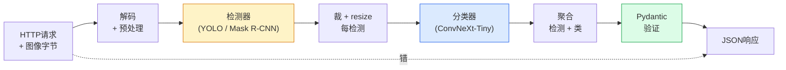

# 构建完整视觉管道 — 毕业设计

> 生产视觉系统是用数据合约缝合在一起的模型和规则链。各部分已在本阶段；毕业设计将它们端到端地连接起来。

**类型:** 构建
**语言:** Python
**前置要求:** 阶段4课程01-15
**时间:** ~120分钟

## 学习目标

- 设计生产视觉管道检物体、分类并发结构JSON — 每失败路径处理
- 插检测器(Mask R-CNN或YOLO)、分类器(ConvNeXt-Tiny)和数据合约(Pydantic)进一服务
- 基准端到端管道并识首瓶颈(常预处理，后检测器)
- 发小FastAPI服务收图像上传、跑管道并返检测带分类

## 问题背景

单视觉模型有用；视觉产品是它们链。零售货架审计是检测器加产品分类器加价格OCR管道。自动驾驶是2D检测器加3D检测器加分割器加跟踪器加规划器。医疗预筛是分割器加区域分类器加临床UI。

线那些链是从ML原型到产品分部分。每模型间接口是新bug地。每坐标变换、每归一化、每掩resize是静失败候选。管道如其最弱接口强。

这毕业设计设最小可行管道：检测 + 分类 + 结构输出 + 服务层。阶段4其他片段槽入这骨架：换Mask R-CNN为YOLOv8、加OCR头、加分割支、加跟踪器。架构稳；片段可插。

## 概念讲解

### 管道



七阶段。两模型阶段贵；五其他阶段是bug活地。

### 用Pydantic数据合约

每模型边界变类型对象。这转静失败为大声。

```
Detection(
    box: tuple[float, float, float, float],   # (x1, y1, x2, y2)，绝像素
    score: float,                              # [0, 1]
    class_id: int,                             # 从检测器标签图
    mask: Optional[list[list[int]]],           # RLE编码若存
)

PipelineResult(
    image_id: str,
    detections: list[Detection],
    classifications: list[Classification],
    inference_ms: float,
)
```

当检测器返`(cx, cy, w, h)`而非`(x1, y1, x2, y2)`框，Pydantic验证在边界失败你立知而非调试下游裁静返空区。

### 延迟何处

三真在几乎每视觉管道：

1. **预处理常是最大单块。** 解JPEG、转色空间、resize — 这些CPU绑且易忘。
2. **检测器主GPU时间。** 70-90% GPU时间在检测前向过。
3. **后处理(NMS、RLE编/解)GPU便宜，CPU贵。** 总用真目标剖析。

知分布是转优化为优先表。

### 失败模式

- **空检测** — 返空列表，不崩。日志。
- **出界框** — 裁前clamp到图像大小。
- **微小裁** — 跳小于分类器最小输入框分类。
- **毁上传** — 400响应带特定错码，非500。
- **模型载失败** — 服务启动失败，非首请求。

生产管道处理每这些无写藏失败泛`try/except`。每失败得命名码和响应。

### 批

生产服务多客户。跨请求批检测和分类倍吞吐。权衡：等批填加延迟。典型设：收请求达20ms、批一起、处理、分响应。`torchserve`和`triton`原生做；可预负载小服务自滚微批器。

## 构建

### 步骤1: 数据合约

```python
from pydantic import BaseModel, Field
from typing import List, Optional, Tuple

class Detection(BaseModel):
    box: Tuple[float, float, float, float]
    score: float = Field(ge=0, le=1)
    class_id: int = Field(ge=0)
    mask_rle: Optional[str] = None


class Classification(BaseModel):
    detection_index: int
    class_id: int
    class_name: str
    score: float = Field(ge=0, le=1)


class PipelineResult(BaseModel):
    image_id: str
    detections: List[Detection]
    classifications: List[Classification]
    inference_ms: float
```

五秒代码省真管道小时调试。

### 步骤2: 微Pipeline类

```python
import time
import numpy as np
import torch
from PIL import Image

class VisionPipeline:
    def __init__(self, detector, classifier, class_names,
                 device="cpu", min_crop=32):
        self.detector = detector.to(device).eval()
        self.classifier = classifier.to(device).eval()
        self.class_names = class_names
        self.device = device
        self.min_crop = min_crop

    def preprocess(self, image):
        """
        image: PIL.Image或np.ndarray (H, W, 3) uint8
        returns: CHW float tensor于device
        """
        if isinstance(image, Image.Image):
            image = np.asarray(image.convert("RGB"))
        tensor = torch.from_numpy(image).permute(2, 0, 1).float() / 255.0
        return tensor.to(self.device)

    @torch.no_grad()
    def detect(self, image_tensor):
        return self.detector([image_tensor])[0]

    @torch.no_grad()
    def classify(self, crops):
        if len(crops) == 0:
            return []
        batch = torch.stack(crops).to(self.device)
        logits = self.classifier(batch)
        probs = logits.softmax(-1)
        scores, cls = probs.max(-1)
        return list(zip(cls.tolist(), scores.tolist()))

    def run(self, image, image_id="anonymous"):
        t0 = time.perf_counter()
        tensor = self.preprocess(image)
        det = self.detect(tensor)

        crops = []
        detections = []
        valid_indices = []
        for i, (box, score, cls) in enumerate(zip(det["boxes"], det["scores"], det["labels"])):
            x1, y1, x2, y2 = [max(0, int(b)) for b in box.tolist()]
            x2 = min(x2, tensor.shape[-1])
            y2 = min(y2, tensor.shape[-2])
            detections.append(Detection(
                box=(x1, y1, x2, y2),
                score=float(score),
                class_id=int(cls),
            ))
            if (x2 - x1) < self.min_crop or (y2 - y1) < self.min_crop:
                continue
            crop = tensor[:, y1:y2, x1:x2]
            crop = torch.nn.functional.interpolate(
                crop.unsqueeze(0),
                size=(224, 224),
                mode="bilinear",
                align_corners=False,
            )[0]
            crops.append(crop)
            valid_indices.append(i)

        class_preds = self.classify(crops)

        classifications = []
        for valid_idx, (cls_id, cls_score) in zip(valid_indices, class_preds):
            classifications.append(Classification(
                detection_index=valid_idx,
                class_id=int(cls_id),
                class_name=self.class_names[cls_id],
                score=float(cls_score),
            ))

        return PipelineResult(
            image_id=image_id,
            detections=detections,
            classifications=classifications,
            inference_ms=(time.perf_counter() - t0) * 1000,
        )
```

每接口类型。每失败路径有特定处理决定。

### 步骤3: 线检测器和分类器

```python
from torchvision.models.detection import maskrcnn_resnet50_fpn_v2
from torchvision.models import convnext_tiny

# 用ImageNet预训权重为真管道无训
detector = maskrcnn_resnet50_fpn_v2(weights="DEFAULT")
classifier = convnext_tiny(weights="DEFAULT")
class_names = [f"imagenet_class_{i}" for i in range(1000)]

pipe = VisionPipeline(detector, classifier, class_names)

# 冒烟测试用合成图像
test_image = (np.random.rand(400, 600, 3) * 255).astype(np.uint8)
result = pipe.run(test_image, image_id="demo")
print(result.model_dump_json(indent=2)[:500])
```

### 步骤4: FastAPI服务

```python
from fastapi import FastAPI, UploadFile, HTTPException
from io import BytesIO

app = FastAPI()
pipe = None  # startup初始化

@app.on_event("startup")
def load():
    global pipe
    detector = maskrcnn_resnet50_fpn_v2(weights="DEFAULT").eval()
    classifier = convnext_tiny(weights="DEFAULT").eval()
    pipe = VisionPipeline(detector, classifier, class_names=[f"c{i}" for i in range(1000)])

@app.post("/detect")
async def detect_endpoint(file: UploadFile):
    if file.content_type not in {"image/jpeg", "image/png", "image/webp"}:
        raise HTTPException(status_code=400, detail="unsupported image type")
    data = await file.read()
    try:
        img = Image.open(BytesIO(data)).convert("RGB")
    except Exception:
        raise HTTPException(status_code=400, detail="cannot decode image")
    result = pipe.run(img, image_id=file.filename or "upload")
    return result.model_dump()
```

用`uvicorn main:app --host 0.0.0.0 --port 8000`跑。用`curl -F 'file=@dog.jpg' http://localhost:8000/detect`测。

### 步骤5: 基准管道

```python
import time

def benchmark(pipe, num_runs=20, image_size=(400, 600)):
    img = (np.random.rand(*image_size, 3) * 255).astype(np.uint8)
    pipe.run(img)  # warm up

    stages = {"preprocess": [], "detect": [], "classify": [], "total": []}
    for _ in range(num_runs):
        t0 = time.perf_counter()
        tensor = pipe.preprocess(img)
        t1 = time.perf_counter()
        det = pipe.detect(tensor)
        t2 = time.perf_counter()
        crops = []
        for box in det["boxes"]:
            x1, y1, x2, y2 = [max(0, int(b)) for b in box.tolist()]
            x2 = min(x2, tensor.shape[-1])
            y2 = min(y2, tensor.shape[-2])
            if (x2 - x1) >= pipe.min_crop and (y2 - y1) >= pipe.min_crop:
                crop = tensor[:, y1:y2, x1:x2]
                crop = torch.nn.functional.interpolate(
                    crop.unsqueeze(0), size=(224, 224), mode="bilinear", align_corners=False
                )[0]
                crops.append(crop)
        pipe.classify(crops)
        t3 = time.perf_counter()
        stages["preprocess"].append((t1 - t0) * 1000)
        stages["detect"].append((t2 - t1) * 1000)
        stages["classify"].append((t3 - t2) * 1000)
        stages["total"].append((t3 - t0) * 1000)

    for stage, times in stages.items():
        times.sort()
        print(f"{stage:12s}  p50={times[len(times)//2]:7.1f} ms  p95={times[int(len(times)*0.95)]:7.1f} ms")
```

CPU典型输出：预处理~3 ms、检测300-500 ms、分类20-40 ms、总350-550 ms。GPU，检测20-40 ms预处理 + 分类相对更重要。

## 使用

生产模板聚同结构，加：

- **模型版本** — 总在响应日志模型名和权重哈希。
- **每请求trace ID** — 每请求日志每阶段时使你可关慢响应到阶段。
- **回退路径** — 若分类器超时，返检测不带分类而非全请求失败。
- **安全滤** — NSFW / PII滤分类后跑，响应离服务前。
- **批端点** — `/detect_batch`收图像URL列表为批处理。

生产服务，`torchserve`、`Triton Inference Server`和`BentoML`外盒处理批、版本、指标和健康检查。直接跑`FastAPI`原型和小规模产品够。

## 交付成果

本课程产：

- `outputs/prompt-vision-service-shape-reviewer.md` — 审视觉服务代码合约/响应形违命名首破bug提示词
- `outputs/skill-pipeline-budget-planner.md` — 给目标延迟和吞吐配每管道阶段时预算并标哪阶段先失预算技能

## 练习题

1. **(易)** 跑管道于任开数据集10图像。报每阶段平均时和每图像检测数分布。

2. **(中)** 加掩输出域到`Detection`并编码为RLE。验JSON留1MB下即使10物图像。

3. **(难)** 加微批器于分类器前：收裁达10 ms、全一GPU调分类、每请求返结果。测5并发请求每秒吞吐增益和加延迟。

## 关键术语

| 术语 | 人们怎么说 | 实际含义 |
|------|----------------|----------------------|
| 管道 | "系统" | 预处理、推理和后处理步有序链每对间有类型接口 |
| 数据合约 | "schema" | Pydantic / dataclass定义每阶段输入输出合；边界捕集成bug |
| 预处理 | "模型前" | 解码、色转、resize、归一化；常最大CPU时间耗 |
| 后处理 | "模型后" | NMS、掩resize、阈值、RLE编码；GPU便宜，CPU贵 |
| 微批器 | "收后转" | 等固定窗多请求聚合器，跑单批前向过 |
| Trace ID | "请求id" | 每请求标识日志每阶段使慢请求可端到端追 |
| 失败码 | "命名错" | 每失败类特定错码而非泛500；启客户端重试逻辑 |
| 健康检查 | "ready探" | 便宜端点报服务可答否；负载均衡器依赖 |

## 延伸阅读

- [Full Stack Deep Learning — Deploying Models](https://fullstackdeeplearning.com/course/2022/lecture-5-deployment/) — 生产ML部署规范概
- [BentoML文档](https://docs.bentoml.com) — 带批、版本和指标服务框架
- [torchserve文档](https://pytorch.org/serve/) — PyTorch官方服务库
- [NVIDIA Triton Inference Server](https://developer.nvidia.com/triton-inference-server) — 带批和多模型支持高吞吐服务