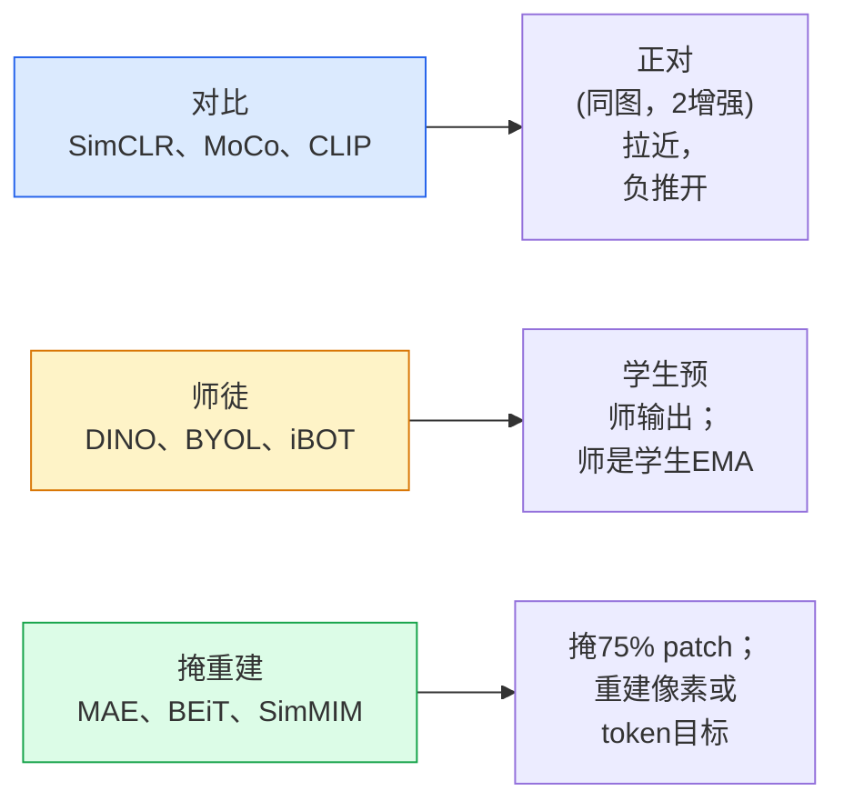

# 自监督视觉 — SimCLR、DINO、MAE

> 标签是监督视觉瓶颈。自监督预训去它们：从100M无标签图像学视觉特征，于10k标签微调。

**类型:** 学 + 构建
**语言:** Python
**前置要求:** 阶段4课程04(图像分类)，阶段4课程14(ViT)
**时间:** ~75分钟

## 学习目标

- 追三主自监督族 — 对比(SimCLR)、师徒(DINO)、掩重建(MAE) — 并述每优化何
- 从零实现InfoNCE损并解释为何512批工作但32批失败
- 解释MAE75%掩比非任意和如何异BERT15%于文
- 用DINOv2或MAE ImageNet检查点为线性探测和零样本检索

## 问题背景

监督ImageNet有1.3M标签图像，估注$10M。医疗和工业数据集更小更贵标签。每视觉队问：能否预训于便宜无标签数据 — YouTube帧、网爬、webcam流、卫星扫 — 后微调于小标签集？

自监督学是答案。现代自监督ViT训于LAION或JFT达或胜监督ImageNet精度微调时。它也更好转下游任务(检测、分割、深度)比监督预训。DINOv2 (Meta, 2023)和MAE (Meta, 2022)是现生产默认为可转视觉特征。

概念移是 pretext 任务 — 模型训做之事 — 非下游任务。重要是它强制模型学有用特征。预灰图色、转图并问模型分类旋转、掩patch并重建 — 皆工作。三扩方法是对比学、师徒蒸馏和掩重建。

## 概念讲解

### 三族



### 对比学(SimCLR)

取一图像，应两随机增强，得两视图。喂两过同编码器加投头。最小损说"这两嵌入应近"和"这嵌入应远批中每其他图像嵌入"。

```
正对(z_i, z_j)于批2N视图损:

   L_ij = -log( exp(sim(z_i, z_j) / tau) / sum_k in batch \ {i} exp(sim(z_i, z_k) / tau) )

sim = 余弦相似
tau = 温度(0.1标准)
```

这是InfoNCE损。它需每正多负，故批大小重要 — SimCLR需512-8192。MoCo引动量队过批解耦负数批大小。

### 师徒(DINO)

两网络同架构：学生和师。师是学生权重指数移动平均(EMA)。两者见增强视图。学生输出训匹配师 — 无显负。

```
loss = CE( student_output(view_1),  teacher_output(view_2) )
     + CE( student_output(view_2),  teacher_output(view_1) )

teacher_weights = m * teacher_weights + (1 - m) * student_weights   (m ≈ 0.996)
```

为何不崩到"预常数"：师输出居中(减每维均值)和锐化(除小温度)。居中防一维主；锐化防输出崩到均匀。

DINO是DINOv2扩，于142M精选图像。结果特征是现零样本视觉检索和密预测SOTA。

### 掩重建(MAE)

掩ViT输入75% patch。仅可见25%过编码器。小解码器收编码器输出加掩位掩token，并训重建掩patch像素。

```
编码器:  可见25% patch -> 特征
解码器:  特征 + 掩位掩token -> 重建像素
损:     仅掩patch重建和原像素MSE
```

MAE工作关键设计：

- **75%掩比** — 高。强制编码器学语义特征；重建25%近平凡(邻像素相关CNN可钉)。
- **非对称编/解** — 大ViT编码器仅见可见patch；小解码器(8层，512维)处理重建。比朴BEiT预训3x快。
- **像素空间重建目标** — 比BEiT token目标简且ViT更好。

预训后，丢解码器。编码器是特征提取器。

### 为何75%而非15%

BERT掩15% token。MAE掩75%。差是信息密度。

- 自然语言每token高熵。预15% token仍难因每掩位有多可信补。
- 图像patch低熵 — 未掩邻常几乎定掩patch像素。使预需语义理解，须激进掩。

75%高够简空间外推不能解题；编码器必表示图像内容。

### 线性探测评估

自监督预训后，标准评估是**线性探测**：冻编码器，于ImageNet标签顶训单线性分类器。报top-1精度。

- SimCLR ResNet-50: ~71% (2020)
- DINO ViT-S/16: ~77% (2021)
- MAE ViT-L/16: ~76% (2022)
- DINOv2 ViT-g/14: ~86% (2023)

线性探测是纯特征质量测；微调典型加2-5点但也混头重训效。

## 构建

### 步骤1: 两视图增强管道

```python
import torch
import torchvision.transforms as T

two_view_train = lambda: T.Compose([
    T.RandomResizedCrop(96, scale=(0.2, 1.0)),
    T.RandomHorizontalFlip(),
    T.ColorJitter(0.4, 0.4, 0.4, 0.1),
    T.RandomGrayscale(p=0.2),
    T.ToTensor(),
])


class TwoViewDataset(torch.utils.data.Dataset):
    def __init__(self, base):
        self.base = base
        self.aug = two_view_train()

    def __len__(self):
        return len(self.base)

    def __getitem__(self, i):
        img, _ = self.base[i]
        v1 = self.aug(img)
        v2 = self.aug(img)
        return v1, v2
```

每__getitem__返同图像两增强视图；标签不需。

### 步骤2: InfoNCE损

```python
import torch.nn.functional as F

def info_nce(z1, z2, tau=0.1):
    """
    z1, z2: (N, D) L2归一化配视图嵌入
    """
    N, D = z1.shape
    z = torch.cat([z1, z2], dim=0)  # (2N, D)
    sim = z @ z.T / tau              # (2N, 2N)

    mask = torch.eye(2 * N, dtype=torch.bool, device=z.device)
    sim = sim.masked_fill(mask, float("-inf"))

    targets = torch.cat([torch.arange(N, 2 * N), torch.arange(0, N)]).to(z.device)
    return F.cross_entropy(sim, targets)
```

调前L2归一化嵌入。`tau=0.1`是SimCLR默认；低使损锐需更多负。

### 步骤3: InfoNCE健全检查

```python
z1 = F.normalize(torch.randn(16, 32), dim=-1)
z2 = z1.clone()
loss_same = info_nce(z1, z2, tau=0.1).item()
z2_random = F.normalize(torch.randn(16, 32), dim=-1)
loss_random = info_nce(z1, z2_random, tau=0.1).item()
print(f"同对InfoNCE:  {loss_same:.3f}")
print(f"随机对InfoNCE:     {loss_random:.3f}")
```

同对应低损(大批和冷温度近0)。随机对应log(2N-1) = ~log(31) = ~3.4于16对批。

### 步骤4: MAE风格掩

```python
def random_mask_indices(num_patches, mask_ratio=0.75, seed=0):
    g = torch.Generator().manual_seed(seed)
    n_keep = int(num_patches * (1 - mask_ratio))
    perm = torch.randperm(num_patches, generator=g)
    visible = perm[:n_keep]
    masked = perm[n_keep:]
    return visible.sort().values, masked.sort().values


num_patches = 196
visible, masked = random_mask_indices(num_patches, mask_ratio=0.75)
print(f"可见: {len(visible)} / {num_patches}")
print(f"掩:  {len(masked)} / {num_patches}")
```

简、快、定种子定。真MAE实现批此保每样本掩。

## 使用

DINOv2是2026生产标准：

```python
import torch
from transformers import AutoImageProcessor, AutoModel

processor = AutoImageProcessor.from_pretrained("facebook/dinov2-base")
model = AutoModel.from_pretrained("facebook/dinov2-base")
model.eval()

# 每图像嵌入为零样本检索
with torch.no_grad():
    inputs = processor(images=[pil_image], return_tensors="pt")
    outputs = model(**inputs)
    embedding = outputs.last_hidden_state[:, 0]  # CLS token
```

结果768维嵌入是现代图像检索、密对应和零样本转管道骨干。下游任务微调少需多于线性头。

图像文嵌入，SigLIP或OpenCLIP是等价；MAE风格微调，`timm`库船每MAE检查点。

## 交付成果

本课程产：

- `outputs/prompt-ssl-pretraining-picker.md` — 给数据集大小、算和下游任务选SimCLR / MAE / DINOv2提示词
- `outputs/skill-linear-probe-runner.md` — 为任冻编码器 + 标签数据集写线性探测评估技能

## 练习题

1. **(易)** 验InfoNCE损降当温降对好对齐嵌入并升当温降对随机嵌入。产`tau in [0.05, 0.1, 0.2, 0.5]` vs损图。

2. **(中)** 实DINO风格居缓冲。示无居中，学生崩到常数向量几epoch内。

3. **(难)** 训MAE于CIFAR-100用课10TinyUNet作骨干。报10、50和200 epoch线性探测精度。示MAE预训线性探测胜同1000图像子集从零监督线性探测。

## 关键术语

| 术语 | 人们怎么说 | 实际含义 |
|------|----------------|----------------------|
| 自监督 | "无标签" | pretext任务从无标签数据产有用表示 |
| pretext任务 | "假任务" | SSL用目标(重建patch、匹配视图)；预训后丢 |
| 线性探测 | "冻编码器 + 线性头" | 标准SSL评估：仅于冻特征顶训线性分类器 |
| InfoNCE | "对比损" | 余弦相似softmax；正对是目标类，其他皆负 |
| EMA师 | "移动平均师" | 师权重是学生指数移动平均；BYOL、MoCo、DINO用 |
| 掩比 | "% patch藏" | MAE掩patch分；视觉75%，文15% |
| 表示崩 | "常数输出" | SSL失败编码器对所有输入出常数向量；居中、锐化或负防 |
| DINOv2 | "生产SSL骨干" | Meta 2023自监督ViT；2026最强通用图像特征 |

## 延伸阅读

- [SimCLR (Chen等, 2020)](https://arxiv.org/abs/2002.05709) — 对比学参考
- [DINO (Caron等, 2021)](https://arxiv.org/abs/2104.14294) — 带动量、居中、锐化师徒
- [MAE (He等, 2022)](https://arxiv.org/abs/2111.06377) — ViT掩自编码器预训
- [DINOv2 (Oquab等, 2023)](https://arxiv.org/abs/2304.07193) — 扩自监督ViT到生产特征