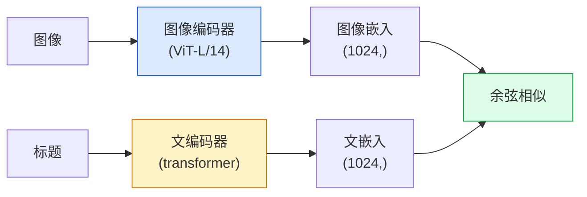

# 开放词汇视觉 — CLIP

> 同时训练图像编码器和文本编码器，使匹配的(图像，标题)对落在共享空间的同一个点。这就是全部的技巧。

**类型:** 构建 + 使用
**语言:** Python
**前置要求:** 阶段4课程14(ViT)，阶段4课程17(自监督)
**时间:** ~45分钟

## 学习目标

- 解释CLIP双塔架构和对比训目标
- 用预训CLIP(或SigLIP)为零样本分类无任何任务特定训
- 从零实现零样本分类：编码类提示、算余弦相似、取argmax
- 区CLIP、SigLIP、OpenCLIP和LLaVA/LLaMA-vision模型 — 2026各何用

## 问题背景

传统分类器闭词汇：1000类ImageNet模型仅能预1000标签。每新类需标签数据和重训头。

CLIP (Radford等, OpenAI 2021)示于400M(图像，标题)对网爬训产模型可推理分类进任类集，纯自然语言描述。你写句子给新类。

那能力 — 零样本转 — 是为何每现代视觉系统始CLIP族检查点。检测(Grounding DINO、OWL-ViT)、分割(CLIPSeg、SAM)、检索、内容审、VLM和文到图生成皆建CLIP风格联合嵌入。

## 概念讲解

### 双塔



两编码器终线性投到同嵌入维(512为CLIP-B/32，1024为CLIP-L/14)。L2归一化算余弦相似。

### 目标

给N(图像，标题)对批，建NxN相似矩阵。训两编码器使对角(匹配对)高相似和不对角(不匹配)低相似。

```
sim_matrix = image_embeddings @ text_embeddings.T / tau

loss_i2t = cross_entropy(sim_matrix,       targets=arange(N))
loss_t2i = cross_entropy(sim_matrix.T,     targets=arange(N))
loss = (loss_i2t + loss_t2i) / 2
```

对称因图像到文和文到图像检索皆应工作。`tau`(温度)典型学为标参数，初始0.07。

### SigLIP: 更好损

SigLIP (Zhai等, 2023)替softmax为每对sigmoid：

```
loss = mean over pairs of log(1 + exp(-y_ij * sim_ij))
y_ij = +1 if matching, -1 otherwise
```

每对损去CLIP需批级归一化。SigLIP小批训更好且等数据匹或胜CLIP。

### 零样本分类

给训CLIP：

1. 每类，组提示："a photo of a {class}"。
2. 用文编码器编码所有类提示 -> `T`形(C, d)。
3. 编码测试图像 -> `I`形(1, d)。
4. 相似 = `I @ T.T`形(1, C)。
5. Argmax -> 预类。

提示工程重要。OpenAI发ImageNet80提示模板("a photo of a {}"、"a blurry photo of a {}"、"a sketch of a {}"等)。每类平均所有模板嵌入额外1-3% top-1精度。

### 2026何处CLIP风格模型用

- **零样本分类** — 直用。
- **图像检索** — 编码所有图像一次，推理嵌查询。
- **文条件检测** — Grounding DINO、OWL-ViT包CLIP文塔围检测器。
- **文条件分割** — CLIPSeg；SAM用CLIP文提示输入。
- **VLM** — LLaVA、Qwen-VL、InternVL线CLIP族视觉编码器进LLM。
- **文到图生成** — Stable Diffusion、DALL-E 3条件CLIP文嵌入。

一旦有共享嵌入空间，每视觉+语言任务变距离计算。

## 构建

### 步骤1: 微双塔模型

真CLIP是ViT + transformer。这课塔是预提取特征上小MLP使训信号CPU可见。

```python
import torch
import torch.nn as nn
import torch.nn.functional as F


class TwoTower(nn.Module):
    def __init__(self, img_in=128, txt_in=64, emb=64):
        super().__init__()
        self.image_proj = nn.Sequential(nn.Linear(img_in, 128), nn.ReLU(), nn.Linear(128, emb))
        self.text_proj = nn.Sequential(nn.Linear(txt_in, 128), nn.ReLU(), nn.Linear(txt_in, emb))
        self.logit_scale = nn.Parameter(torch.ones([]) * 2.6592)  # ln(1/0.07)

    def forward(self, img_feats, txt_feats):
        i = F.normalize(self.image_proj(img_feats), dim=-1)
        t = F.normalize(self.text_proj(txt_feats), dim=-1)
        return i, t, self.logit_scale.exp()
```

两投、共享维输出、学温度。同形真CLIP API。

### 步骤2: 对比损

```python
def clip_loss(image_emb, text_emb, logit_scale):
    N = image_emb.size(0)
    sim = logit_scale * image_emb @ text_emb.T
    targets = torch.arange(N, device=sim.device)
    l_i = F.cross_entropy(sim, targets)
    l_t = F.cross_entropy(sim.T, targets)
    return (l_i + l_t) / 2
```

对称。高logit_scale = 锐softmax = 更信但不稳风险。

### 步骤3: 零样本分类器

```python
@torch.no_grad()
def zero_shot_classify(model, image_feats, class_text_feats, class_names):
    """
    image_feats:      (N, img_in)
    class_text_feats: (C, txt_in)   每类一平均嵌入
    """
    i = F.normalize(model.image_proj(image_feats), dim=-1)
    t = F.normalize(model.text_proj(class_text_feats), dim=-1)
    sim = i @ t.T
    pred = sim.argmax(dim=-1)
    return [class_names[p] for p in pred.tolist()]
```

每步一行。这是生产CLIP检查点零样本过程。

### 步骤4: 健全检查

```python
torch.manual_seed(0)
model = TwoTower()

img = torch.randn(8, 128)
txt = torch.randn(8, 64)
i, t, scale = model(img, txt)
loss = clip_loss(i, t, scale)
print(f"批大小: {i.size(0)}   损: {loss.item():.3f}")
```

损应近`log(N) = log(8) = 2.08`为随机初始化模型 — 当无结构学对称交叉熵目标。

## 使用

OpenCLIP是2026社区默认：

```python
import open_clip
import torch
from PIL import Image

model, _, preprocess = open_clip.create_model_and_transforms("ViT-B-32", pretrained="laion2b_s34b_b79k")
tokenizer = open_clip.get_tokenizer("ViT-B-32")

image = preprocess(Image.open("dog.jpg")).unsqueeze(0)
text = tokenizer(["a photo of a dog", "a photo of a cat", "a photo of a car"])

with torch.no_grad():
    image_features = model.encode_image(image)
    text_features = model.encode_text(text)
    image_features = image_features / image_features.norm(dim=-1, keepdim=True)
    text_features = text_features / text_features.norm(dim=-1, keepdim=True)
    probs = (100.0 * image_features @ text_features.T).softmax(dim=-1)

print(probs)
```

SigLIP新，小规模训更好，新工作偏：`google/siglip-base-patch16-224`。Hugging Face船两者。

## 交付成果

本课程产：

- `outputs/prompt-zero-shot-class-picker.md` — 给类列表和域为零样本CLIP设计类模板提示词
- `outputs/skill-image-text-retriever.md` — 用任CLIP检查点建图像嵌入索引支持文查询和图像查询技能

## 练习题

1. **(易)** 用预训OpenCLIP ViT-B/32和80模板提示集于CIFAR-10零样本分类。报top-1精度；应85-90%左右。

2. **(中)** 比单模板("a photo of a {}")和80模板平均嵌入于同CIFAR-10任务。量化差距并解释为何模板助。

3. **(难)** 建零样本图像检索索引：用CLIP嵌1000图像、建FAISS索引、用自然语言描述查询。报手写20留出查询检索recall@5。

## 关键术语

| 术语 | 人们怎么说 | 实际含义 |
|------|----------------|----------------------|
| 双塔 | "双编码器" | 分图像和文编码器终共享维投头 |
| 零样本 | "无任务特定训" | 推理分类进仅文描述类；无标签触 |
| 温度 / logit_scale | "tau" | 学标缩softmax前相似矩阵 |
| 提示模板 | "A photo of a {}" | 类名自然语言包；平均多模板升零样本精度 |
| CLIP | "图像+文模型" | 2021 OpenAI模型；2026领域词汇 |
| SigLIP | "sigmoid CLIP" | 替softmax为每对sigmoid；小批训更好 |
| OpenCLIP | "开复现" | LAION上社区训CLIP变种；开源管道生产默认 |
| VLM | "视觉语言模型" | CLIP族编码器加LLM，训答图像问题 |

## 延伸阅读

- [CLIP: Learning Transferable Visual Models from Natural Language Supervision (Radford等, 2021)](https://arxiv.org/abs/2103.00020)
- [SigLIP: Sigmoid Loss for Language-Image Pre-Training (Zhai等, 2023)](https://arxiv.org/abs/2303.15343)
- [OpenCLIP](https://github.com/mlfoundations/open_clip) — 社区代码库
- [DINOv2 vs CLIP vs MAE: a features comparison](https://huggingface.co/blog/dinov2) — HF导带并排用例