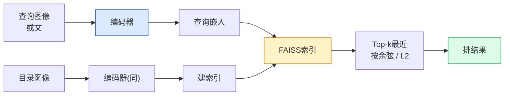

# 图像检索与度量学习

> 检索系统按嵌入空间中的距离对候选项排序。度量学习是塑造那个空间、使距离符合你期望含义的学问。

**类型:** 构建
**语言:** Python
**前置要求:** 阶段4课程14(ViT)，阶段4课程18(CLIP)
**时间:** ~45分钟

## 学习目标

- 解释三元组、对比和代理基度量学习损并给数据集择正一
- 正实现L2归一化和余弦相似并审"同项"和"同类"检索差
- 建FAISS索引、文和图像查询、报留出查询集recall@K
- 用DINOv2、CLIP和SigLIP为现成嵌入骨干并知何时各胜

## 问题背景

检索处皆在生产视觉：重检测、反图像搜、视搜("找相似产品")、脸重识、监控人重ID、电商例级匹配。产品问总同："给这查询图像，排我目录"。

两设计决塑全系统。嵌入 — 何模型产向量。索引 — 何规模找最近邻。两者2026皆商品(DINOv2为嵌入、FAISS为索引)，这提杆：难部分是定义*何算相似*为应用，后塑嵌入空间使距离配。

那塑是度量学习。小但高杠杆纪律。

## 概念讲解

### 检索一瞥



### 四损族

| 损 | 需 | 优 | 缺 |
|------|----------|------|------|
| **对比** | (锚, 正) + 负 | 简，任对标签工作 | 无多负慢收敛 |
| **三元组** | (锚, 正, 负) | 直观；直边控 | 硬三元组挖贵 |
| **NT-Xent / InfoNCE** | 对 + 批挖负 | 扩大批 | 需大批或动量队 |
| **代理基(ProxyNCA)** | 仅类标签 | 快、稳、无挖 | 小数据集可过拟代理 |

多生产用例，始预训骨干仅加度量学习微调若现成嵌入测试集低性能。

### 三元组损形式

```
L = max(0, ||f(a) - f(p)||^2 - ||f(a) - f(n)||^2 + margin)
```

拉锚`a`近正`p`、推远负`n`，带`margin`保隙。三图像结构广到任相似排序。

挖重要：易三元组(`n`已远`a`)贡献零损；仅硬三元组教网。半硬挖(`n`比`p`远但在边内)是2016 FaceNet配方仍主导。

### 余弦相似vs L2

两度量、两惯例：

- **余弦**: 向量间角。需L2归一化嵌入。
- **L2**: 欧氏距。原或归一化嵌入工作，但通常配L2归一化 + 平方L2。

多现代网两者等：`||a - b||^2 = 2 - 2 cos(a, b)`当`||a|| = ||b|| = 1`。择配嵌入训惯例；混静改"最近"意。

### Recall@K

标准检索指标：

```
recall@K = top K结果中至少一正匹配查询分
```

并报recall@1、@5、@10。recall@10 > 0.95但recall@1 < 0.5意嵌入空间结构正但排序噪 — 试更长微调或重排步。

重检测，precision@K更重要因每假阳是用户可见错。视搜，recall@K是产品信号。

### FAISS一段

Facebook AI相似搜索。最近邻搜索事实库。三索引择：

- `IndexFlatIP` / `IndexFlatL2` — 暴力、精确、无训。达~1M向量。
- `IndexIVFFlat` — 分K格、仅搜最近几格。近似、快、需训数据。
- `IndexHNSW` — 图基、多查询最快、大索引大小。

100k向量你可能想`IndexFlatIP`于余弦相似。10M想`IndexIVFFlat`。100M+配产品量化(`IndexIVFPQ`)。

### 例级vs类级检索

两名同问题异：

- **类级** — "找目录中猫"。类条件相似；现成CLIP / DINOv2嵌入工作好。
- **例级** — "找目录中*这精产品*"。需同类视相似物细粒度区分；现成嵌入低性能；度量学习微调重要。

总问解哪个择模型前。

## 构建

### 步骤1: 三元组损

```python
import torch
import torch.nn.functional as F

def triplet_loss(anchor, positive, negative, margin=0.2):
    d_ap = F.pairwise_distance(anchor, positive, p=2)
    d_an = F.pairwise_distance(anchor, negative, p=2)
    return F.relu(d_ap - d_an + margin).mean()
```

一行。L2归一化或原嵌入工作。

### 步骤2: 半硬挖

给批嵌入和标签，找每锚最硬半硬负。

```python
def semi_hard_negatives(emb, labels, margin=0.2):
    dist = torch.cdist(emb, emb)
    same_class = labels[:, None] == labels[None, :]
    diff_class = ~same_class
    N = emb.size(0)

    positives = dist.clone()
    positives[~same_class] = float("-inf")
    positives.fill_diagonal_(float("-inf"))
    pos_idx = positives.argmax(dim=1)

    semi_hard = dist.clone()
    semi_hard[same_class] = float("inf")
    d_ap = dist[torch.arange(N), pos_idx].unsqueeze(1)
    semi_hard[dist <= d_ap] = float("inf")
    neg_idx = semi_hard.argmin(dim=1)

    fallback_mask = semi_hard[torch.arange(N), neg_idx] == float("inf")
    if fallback_mask.any():
        hardest = dist.clone()
        hardest[same_class] = float("inf")
        neg_idx = torch.where(fallback_mask, hardest.argmin(dim=1), neg_idx)
    return pos_idx, neg_idx
```

每锚得类内最硬正和比正远但在边内半硬负。

### 步骤3: Recall@K

```python
def recall_at_k(query_emb, gallery_emb, query_labels, gallery_labels, k=1):
    sim = query_emb @ gallery_emb.T
    _, top_k = sim.topk(k, dim=-1)
    matches = (gallery_labels[top_k] == query_labels[:, None]).any(dim=-1)
    return matches.float().mean().item()
```

L2归一化嵌入内积top-k等余弦top-k。报至少一正邻居查询均比例。

### 步骤4: 合一起

```python
import torch
import torch.nn as nn
from torch.optim import Adam

class Encoder(nn.Module):
    def __init__(self, in_dim=128, emb_dim=64):
        super().__init__()
        self.net = nn.Sequential(
            nn.Linear(in_dim, 128), nn.ReLU(),
            nn.Linear(128, emb_dim),
        )

    def forward(self, x):
        return F.normalize(self.net(x), dim=-1)

torch.manual_seed(0)
num_classes = 6
protos = F.normalize(torch.randn(num_classes, 128), dim=-1)

def sample_batch(bs=32):
    labels = torch.randint(0, num_classes, (bs,))
    x = protos[labels] + 0.15 * torch.randn(bs, 128)
    return x, labels

enc = Encoder()
opt = Adam(enc.parameters(), lr=3e-3)

for step in range(200):
    x, y = sample_batch(32)
    emb = enc(x)
    pos_idx, neg_idx = semi_hard_negatives(emb, y)
    loss = triplet_loss(emb, emb[pos_idx], emb[neg_idx])
    opt.zero_grad(); loss.backward(); opt.step()
```

几百步后嵌入聚类形每类一簇。

## 使用

2026生产栈：

- **DINOv2 + FAISS** — 通用视觉检索。现成工作。
- **CLIP + FAISS** — 文查询时。
- **微调DINOv2 + FAISS** — 例级检索、脸重ID、时尚、电商。
- **Milvus / Weaviate / Qdrant** — FAISS或HNSW托管向量DB包装。

SOTA例检索，配方：DINOv2骨干、加嵌入头、例标对三元组或InfoNCE损微调、FAISS索引。

## 交付成果

本课程产：

- `outputs/prompt-retrieval-loss-picker.md` — 给检索问题选三元组 / InfoNCE / ProxyNCA提示词
- `outputs/skill-recall-at-k-runner.md` — 写清评估 Harness 为recall@K带训/验/目录分和正数据合约技能

## 练习题

1. **(易)** 跑上玩具例。PCA绘训前后嵌入见六簇形。

2. **(中)** 加ProxyNCA损实现：每类一学"代理"、余弦相似标准交叉熵。比玩具数据收敛速vs三元组损。

3. **(难)** 取1000 ImageNet验证图像、HuggingFace DINOv2嵌、建FAISS平索引、报recall@{1, 5, 10}于同图像查询(应1.0)和带ImageNet标签真值留出分。

## 关键术语

| 术语 | 人们怎么说 | 实际含义 |
|------|----------------|----------------------|
| 度量学习 | "塑空间" | 训编码器使输出空间距离映目标相似 |
| 三元组损 | "拉推" | L = max(0, d(a, p) - d(a, n) + margin)；规范度量学习损 |
| 半硬挖 | "有用负" | 比锚离正远但在边内负；经验最信息 |
| 代理基损 | "类原型" | 每类一学代理；相似到代理交叉熵；无对挖 |
| Recall@K | "Top-K命率" | top K中至少一正结果查询分 |
| 例检索 | "找这精物" | 细粒度匹配；现成特征通常低性能 |
| FAISS | "NN库" | Facebook最近邻库；支持精确和近似索引 |
| HNSW | "图索引" | 层次可导航小世界；快近似NN小内存开销 |

## 延伸阅读

- [FaceNet: A Unified Embedding for Face Recognition (Schroff等, 2015)](https://arxiv.org/abs/1503.03832) — 三元组损 / 半硬挖论文
- [In Defense of the Triplet Loss for Person Re-Identification (Hermans等, 2017)](https://arxiv.org/abs/1703.07737) — 三元组微调实践导
- [FAISS文档](https://github.com/facebookresearch/faiss/wiki) — 每索引、每权衡
- [SMoT: Metric Learning Taxonomy (Kim等, 2021)](https://arxiv.org/abs/2010.06927) — 现损及其连调查