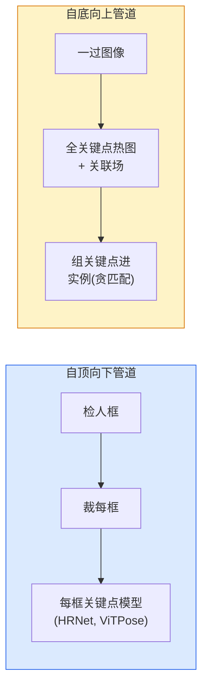

# 关键点检测与姿态估计

> 姿态是有序关键点集。关键点检测器是热图回归器。其余是记账。

**类型:** 构建
**语言:** Python
**前置要求:** 阶段4课程06(检测)，阶段4课程07(U-Net)
**时间:** ~45分钟

## 学习目标

- 区自顶向下和自底向上姿态估计并述何时各用
- 用高斯每关键点目标回归K关键点热图并在推理提取关键点坐标
- 解释部亲和场(PAFs)和自底向上管道如何关联关键点到实例
- 用MediaPipe Pose或MMPose为生产关键点估计并理解其输出格式

## 问题背景

关键点任务藏多名：人姿态(17身关节)、脸标记(68或478点)、手(21点)、动物姿态、机器人物姿态、医疗解剖标记。每同结构：检测物上K离散点并输出其坐标。

姿态估计是动捕、健身app、运动分析、手势控、动画、AR试穿和机器人抓取基。2D案成熟；3D姿态(从单相机估计世界坐标关节位置)是现研前沿。

工程问是规模。单图像、单人姿态是20ms问题。30 fps人群多人姿态是异构异问题。

## 概念讲解

### 自顶向下vs自底向上



- **自顶向下** — 先检人，后每裁跑每人关键点模型。最高精度；线性扩人数。
- **自底向上** — 一前向过预全关键点加关联场；组它们。常时间无关人群大小。

自顶向下(HRNet、ViTPose)是精度领头；自底向上(OpenPose、HigherHRNet)是人群吞吐领头。

### 热图回归

非直回归，每关键点预`H x W`热图高斯blob中心真位。

```
target[k, y, x] = exp(-((x - cx_k)^2 + (y - cy_k)^2) / (2 sigma^2))
```

推理时每热图argmax是预关键点位置。

为何热图比直回归好：网空间结构(conv特征图)自然配空间输出。高斯目标也正则化 — 小定位误差产小损，非零。

### 亚像素定位

Argmax给整数坐标。亚像素精度，抛物线拟argmax及其邻，或用知名偏`(dx, dy) = 0.25 * (heatmap[y, x+1] - heatmap[y, x-1], ...)`方向。

### 部亲和场(PAFs)

OpenPose自底向上关联技巧。每对连关键点(如左肩到左肘)，预2通道场编码单位向量指一到另一。肩配肘，沿连候选对线积PAF；最高积对匹配。

```
每连(肢):
  PAF通道: 2 (单位向量x, y)
  线积分: 采样点(PAF . line_direction)和
  高积 = 强匹配
```

优雅且扩任意人群大小无每人裁。

### COCO关键点

标准身姿数据集：每人17关键点，PCK(正确关键点百分比)和OKS(物关键点相似)为指标。OKS是关键点IoU类比COCO mAP@OKS报。

### 2D vs 3D

- **2D姿态** — 图像坐标；生产质量解(MediaPipe、HRNet、ViTPose)。
- **3D姿态** — 世界 / 相机坐标；仍活跃研究。常见方法：
  - 小MLP举2D预到3D(VideoPose3D)。
  - 图像直3D回归(PyMAF、MHFormer)。
  - 多视设(CMU Panoptic)为真值。

## 构建

### 步骤1: 高斯热图目标

```python
import numpy as np
import torch

def gaussian_heatmap(size, cx, cy, sigma=2.0):
    yy, xx = np.meshgrid(np.arange(size), np.arange(size), indexing="ij")
    return np.exp(-((xx - cx) ** 2 + (yy - cy) ** 2) / (2 * sigma ** 2)).astype(np.float32)

hm = gaussian_heatmap(64, 32, 32, sigma=2.0)
print(f"峰: {hm.max():.3f} 于({hm.argmax() % 64}, {hm.argmax() // 64})")
```

每关键点热图沿通道轴叠给全目标张量。

### 步骤2: 微关键点头

U-Net风格模型输出K热图通道。

```python
import torch.nn as nn
import torch.nn.functional as F

class TinyKeypointNet(nn.Module):
    def __init__(self, num_keypoints=4, base=16):
        super().__init__()
        self.down1 = nn.Sequential(nn.Conv2d(3, base, 3, 2, 1), nn.ReLU(inplace=True))
        self.down2 = nn.Sequential(nn.Conv2d(base, base * 2, 3, 2, 1), nn.ReLU(inplace=True))
        self.mid = nn.Sequential(nn.Conv2d(base * 2, base * 2, 3, 1, 1), nn.ReLU(inplace=True))
        self.up1 = nn.ConvTranspose2d(base * 2, base, 2, 2)
        self.up2 = nn.ConvTranspose2d(base, num_keypoints, 2, 2)

    def forward(self, x):
        h1 = self.down1(x)
        h2 = self.down2(h1)
        h3 = self.mid(h2)
        u1 = self.up1(h3)
        return self.up2(u1)
```

输入`(N, 3, H, W)`，输出`(N, K, H, W)`。损是每像素MSE对高斯目标。

### 步骤3: 推理 — 提关键点坐标

```python
def heatmap_to_coords(heatmaps):
    """
    heatmaps: (N, K, H, W)
    returns:  (N, K, 2) 图像像素浮坐标
    """
    N, K, H, W = heatmaps.shape
    hm = heatmaps.reshape(N, K, -1)
    idx = hm.argmax(dim=-1)
    ys = (idx // W).float()
    xs = (idx % W).float()
    return torch.stack([xs, ys], dim=-1)

coords = heatmap_to_coords(torch.randn(2, 4, 32, 32))
print(f"坐标: {coords.shape}")  # (2, 4, 2)
```

推理一行。亚像素精，argmax周围插值。

### 步骤4: 合成关键点数据集

简：白画布绘四点学预。

```python
def make_synthetic_sample(size=64):
    img = np.ones((3, size, size), dtype=np.float32)
    rng = np.random.default_rng()
    kps = rng.integers(8, size - 8, size=(4, 2))
    for cx, cy in kps:
        img[:, cy - 2:cy + 2, cx - 2:cx + 2] = 0.0
    hms = np.stack([gaussian_heatmap(size, cx, cy) for cx, cy in kps])
    return img, hms, kps
```

微小模型一分钟学够易。

### 步骤5: 训练

```python
model = TinyKeypointNet(num_keypoints=4)
opt = torch.optim.Adam(model.parameters(), lr=3e-3)

for step in range(200):
    batch = [make_synthetic_sample() for _ in range(16)]
    imgs = torch.from_numpy(np.stack([b[0] for b in batch]))
    hms = torch.from_numpy(np.stack([b[1] for b in batch]))
    pred = model(imgs)
    # 上采样pred到全分辨率
    pred = F.interpolate(pred, size=hms.shape[-2:], mode="bilinear", align_corners=False)
    loss = F.mse_loss(pred, hms)
    opt.zero_grad(); loss.backward(); opt.step()
```

## 使用

- **MediaPipe Pose** — Google生产姿态估计器；船WebGL + 移动运行时亚10ms延迟。
- **MMPose** (OpenMMLab) — 全面研代码库；每SOTA架构带预训权重。
- **YOLOv8-pose** — 最快实时多人姿态单前向过。
- **transformers HumanDPT / PoseAnything** — 新视觉语言开词汇姿态方法(任物、任关键点集)。

## 交付成果

本课程产：

- `outputs/prompt-pose-stack-picker.md` — 给延迟、人群大小和2D vs 3D需求选MediaPipe / YOLOv8-pose / HRNet / ViTPose提示词
- `outputs/skill-heatmap-to-coords.md` — 写每生产姿态模型用亚像素热图到坐标例行技能

## 练习题

1. **(易)** 训微关键点模型于合成4点数据集。报200步后预和真关键点均L2误。

2. **(中)** 加亚像素精：给argmax位，从邻像素1D抛物线拟x和y。报整数argmax精度增益。

3. **(难)** 建2人合成数据集每图像显4关键点模式两实例。训自底向上管道带PAFs预哪关键点属哪实例，评OKS。

## 关键术语

| 术语 | 人们怎么说 | 实际含义 |
|------|----------------|----------------------|
| 关键点 | "一标记" | 物上特定有序点(关节、角、特征) |
| 姿态 | "骨骼" | 属一实例有序关键点集 |
| 自顶向下 | "检后姿态" | 两阶段管道：人检 + 每裁关键点模型；最高精度 |
| 自底向上 | "姿态先，组后" | 单过全关键点预 + 组；人群大小常时间 |
| 热图 | "高斯目标" | 每关键点H x W张量峰真位；偏回归目标 |
| PAF | "部亲和场" | 2通道单位向量场编码肢方向；用于组关键点进实例 |
| OKS | "关键点IoU" | 物关键点相似；COCO姿态指标 |
| HRNet | "高分辨率网" | 主导自顶向下关键点架构；全程保高分辨率特征 |

## 延伸阅读

- [OpenPose (Cao等, 2017)](https://arxiv.org/abs/1812.08008) — 带PAFs自底向上；仍是最佳方法写
- [HRNet (Sun等, 2019)](https://arxiv.org/abs/1902.09212) — 自顶向下参考架构
- [ViTPose (Xu等, 2022)](https://arxiv.org/abs/2204.12484) — 纯ViT作姿态骨干；多基准现SOTA
- [MediaPipe Pose](https://developers.google.com/mediapipe/solutions/vision/pose_landmarker) — 生产实时姿态；2026最快部署栈