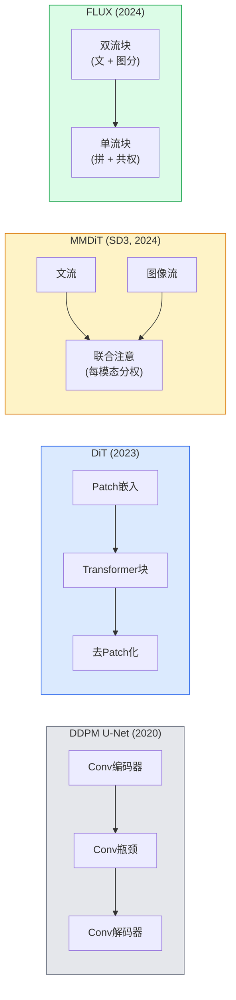

# 扩散Transformer与整流流

> U-Net不是扩散的秘密。用transformer替换它，将噪声调度换成直线流，突然你就有了SD3、FLUX以及所有2026年的文本到图像模型。

**类型:** 学习 + 构建
**语言:** Python
**前置要求:** 阶段4课程10(扩散DDPM)，阶段4课程14(ViT)，阶段7课程02(自注意)
**时间:** ~75分钟

## 学习目标

- 追从U-Net DDPM(课程10)到扩散Transformer(DiT)、MMDiT(SD3)和单+双流DiT(FLUX)演进
- 解释整流流：为何噪和数据间直线轨迹让模型20步而非1000步采样
- 实现微DiT块和整流流训循环，皆少于100行
- 区模型变种(SD3、FLUX.1-dev、FLUX.1-schnell、Z-Image、Qwen-Image)于架构、参数数和许可

## 问题背景

课程10建DDPM用U-Net去噪。那配方主2020-2023：U-Net + beta调度 + 噪预损。产Stable Diffusion 1.5和2.1及DALL-E 2。

每2026最先进文到图模型已过。Stable Diffusion 3、FLUX、SD4、Z-Image、Qwen-Image、Hunyuan-Image — 无用U-Net。用扩散Transformer(DiT)。SD3和FLUX也换DDPM噪调度为整流流，直噪到数据路，启1-4步推理带一致性或蒸馏变种。

移重要因是扩散基图像生成成可控、提示准(SD3/SD4解文渲染)、生产快原因。懂DiT + 整流流是懂2026生成图像栈。

## 概念讲解

### 从U-Net到transformer



- **DiT** (Peebles & Xie, 2023) — 替U-Net为潜patch ViT似transformer。条件经适应层归一化(AdaLN)。
- **MMDiT** (SD3, Esser等, 2024) — 两流文和图像token分权共享联合注意。
- **FLUX** (Black Forest Labs, 2024) — 首N块双流似SD3，后块拼接共享权(单流)高深高效。
- **Z-Image** (2025) — 6B参数高效单流DiT挑战"全尺度"。

### 整流流一段

DDPM定前向过程为噪SDE，`x_t`渐腐。学反向为二SDE，1000小步解。

整流流定**直线**插值净数据和纯噪间：

```
x_t = (1 - t) * x_0 + t * epsilon,     t in [0, 1]
```

训网络预速度`v_theta(x_t, t) = epsilon - x_0` — 净数据到噪直线径前向(`dx_t/dt`)。采样时，反向积这速度从噪步向数据。结果ODE近直线，故少积步采样需。

SD3称此**整流流匹配**。FLUX、Z-Image和多2026模型用同目标。典型推理：20-30 Euler步(确定性) vs旧DDPM域50+ DDIM步。蒸馏 / turbo / schnell / LCM变种降1-4步。

### AdaLN条件

DiTs条件和类/文经**适应层归一化**：从条件向量预`scale`和`shift`并LayerNorm后应。比U-Net FiLM风格调制清，每现代DiT默认。

```
cond -> MLP -> (scale, shift, gate)
norm(x) * (1 + scale) + shift, 后残加 * gate
```

### SD3和FLUX中文编码器

- **SD3**用三文编码器：两CLIP模型 + T5-XXL。嵌入拼接喂图像流为文条件。
- **FLUX**用一CLIP-L + T5-XXL。
- **Qwen-Image / Z-Image**变种用自家文编码器配基LLM。

文编码器是SD3/FLUX比SD1.5更好推理提示大因。T5-XXL单4.7B参数。

### 无分类器引导仍持

整流流换采样器，非条件。无分类器引导(训时10%概率丢文、推理时混条件和无条件预)与整流流同工。多2026模型用引导尺度3.5-5 — 比SD1.5 7.5低因整流流模型默认更紧随提示。

### Consistency、Turbo、Schnell、LCM

四名同想：蒸馏慢多步模型为快少步模型。

- **LCM(潜一致性模型)** — 训学生从任中`x_t`一步预终`x_0`。
- **SDXL Turbo / FLUX schnell** — 1-4步模型用对抗扩散蒸馏训。
- **SD Turbo** — OpenAI风格一致性模型适潜扩散。

新模型生产服务船"全质量"检查点和"turbo / schnell"变种。Schnell("快"德，Black Forest Labs惯例)跑1-4步适实时管道。

### 2026模型景

| 模型 | 大 | 架构 | 许可 |
|-------|------|--------------|---------|
| Stable Diffusion 3 Medium | 2B | MMDiT | SAI社区 |
| Stable Diffusion 3.5 Large | 8B | MMDiT | SAI社区 |
| FLUX.1-dev | 12B | 双 + 单流DiT | 非商业 |
| FLUX.1-schnell | 12B | 同，蒸馏 | Apache 2.0 |
| FLUX.2 | — | 迭FLUX.1 | 混 |
| Z-Image | 6B | S3-DiT(可缩单流) | 许松 |
| Qwen-Image | ~20B | DiT + Qwen文塔 | Apache 2.0 |
| Hunyuan-Image-3.0 | ~80B | DiT | 研 |
| SD4 Turbo | 3B | DiT + 蒸馏 | SAI商业 |

FLUX.1-schnell是2026开源默认。Z-Image是效领头。FLUX.2和SD4是当前质量尖端。

### 为何此相位移重要

DDPM + U-Net工作。DiT + 整流流**更好、更快、更干净缩**。转似NLP从RNN到transformer：两架构解同问题，但transformer缩今主导。每2026图像、视频或3D生成论用DiT形去噪和常整流流目标。U-Net DDPM今主教学(课程10)。

## 构建

### 步骤1: 带AdaLN的DiT块

```python
import torch
import torch.nn as nn


class AdaLNZero(nn.Module):
    """
    带门适应LayerNorm。从条件预(scale, shift, gate)。
    初始化使整块始为身份("零初始化")。
    """

    def __init__(self, dim, cond_dim):
        super().__init__()
        self.norm = nn.LayerNorm(dim, elementwise_affine=False)
        self.mlp = nn.Linear(cond_dim, dim * 3)
        nn.init.zeros_(self.mlp.weight)
        nn.init.zeros_(self.mlp.bias)

    def forward(self, x, cond):
        scale, shift, gate = self.mlp(cond).chunk(3, dim=-1)
        h = self.norm(x) * (1 + scale.unsqueeze(1)) + shift.unsqueeze(1)
        return h, gate.unsqueeze(1)


class DiTBlock(nn.Module):
    def __init__(self, dim=192, heads=3, mlp_ratio=4, cond_dim=192):
        super().__init__()
        self.adaln1 = AdaLNZero(dim, cond_dim)
        self.attn = nn.MultiheadAttention(dim, heads, batch_first=True)
        self.adaln2 = AdaLNZero(dim, cond_dim)
        self.mlp = nn.Sequential(
            nn.Linear(dim, dim * mlp_ratio),
            nn.GELU(),
            nn.Linear(dim * mlp_ratio, dim),
        )

    def forward(self, x, cond):
        h, gate1 = self.adaln1(x, cond)
        a, _ = self.attn(h, h, h, need_weights=False)
        x = x + gate1 * a
        h, gate2 = self.adaln2(x, cond)
        x = x + gate2 * self.mlp(h)
        return x
```

`AdaLNZero`始为身份映射因MLP权重初始化零。训轻推块离身份；这稳深transformer扩散模型。

### 步骤2: 微DiT

```python
def timestep_embedding(t, dim):
    import math
    half = dim // 2
    freqs = torch.exp(-math.log(10000) * torch.arange(half, device=t.device) / half)
    args = t[:, None].float() * freqs[None]
    return torch.cat([args.sin(), args.cos()], dim=-1)


class TinyDiT(nn.Module):
    def __init__(self, image_size=16, patch_size=2, in_channels=3, dim=96, depth=4, heads=3):
        super().__init__()
        self.patch_size = patch_size
        self.num_patches = (image_size // patch_size) ** 2
        self.patch = nn.Conv2d(in_channels, dim, kernel_size=patch_size, stride=patch_size)
        self.pos = nn.Parameter(torch.zeros(1, self.num_patches, dim))
        self.time_mlp = nn.Sequential(
            nn.Linear(dim, dim * 2),
            nn.SiLU(),
            nn.Linear(dim * 2, dim),
        )
        self.blocks = nn.ModuleList([DiTBlock(dim, heads, cond_dim=dim) for _ in range(depth)])
        self.norm_out = nn.LayerNorm(dim, elementwise_affine=False)
        self.head = nn.Linear(dim, patch_size * patch_size * in_channels)

    def forward(self, x, t):
        n = x.size(0)
        x = self.patch(x)
        x = x.flatten(2).transpose(1, 2) + self.pos
        t_emb = self.time_mlp(timestep_embedding(t, self.pos.size(-1)))
        for blk in self.blocks:
            x = blk(x, t_emb)
        x = self.norm_out(x)
        x = self.head(x)
        return self._unpatchify(x, n)

    def _unpatchify(self, x, n):
        p = self.patch_size
        h = w = int(self.num_patches ** 0.5)
        x = x.view(n, h, w, p, p, -1).permute(0, 5, 1, 3, 2, 4).reshape(n, -1, h * p, w * p)
        return x
```

### 步骤3: 整流流训

```python
import torch.nn.functional as F

def rectified_flow_train_step(model, x0, optimizer, device):
    model.train()
    x0 = x0.to(device)
    n = x0.size(0)
    t = torch.rand(n, device=device)
    epsilon = torch.randn_like(x0)
    x_t = (1 - t[:, None, None, None]) * x0 + t[:, None, None, None] * epsilon

    target_velocity = epsilon - x0
    pred_velocity = model(x_t, t)

    loss = F.mse_loss(pred_velocity, target_velocity)
    optimizer.zero_grad()
    loss.backward()
    optimizer.step()
    return loss.item()
```

比DDPM噪预损(课程10)：同结构，异目标。非预噪`epsilon`，预**速度**`epsilon - x_0`，指净数据到噪沿直线插值。

### 步骤4: Euler采样器

整流流是ODE。Euler法最简，对训好整流流模型20+步近高阶求解器精度。

```python
@torch.no_grad()
def rectified_flow_sample(model, shape, steps=20, device="cpu"):
    model.eval()
    x = torch.randn(shape, device=device)
    dt = 1.0 / steps
    t = torch.ones(shape[0], device=device)
    for _ in range(steps):
        v = model(x, t)
        x = x - dt * v
        t = t - dt
    return x
```

20步。训模型这产样比1000步DDPM。

### 步骤5: 端到端冒烟测

```python
import numpy as np

def synthetic_blobs(num=200, size=16, seed=0):
    rng = np.random.default_rng(seed)
    out = np.zeros((num, 3, size, size), dtype=np.float32)
    yy, xx = np.meshgrid(np.arange(size), np.arange(size), indexing="ij")
    for i in range(num):
        cx, cy = rng.uniform(4, size - 4, size=2)
        r = rng.uniform(2, 4)
        mask = (xx - cx) ** 2 + (yy - cy) ** 2 < r ** 2
        colour = rng.uniform(-1, 1, size=3)
        for c in range(3):
            out[i, c][mask] = colour[c]
    return torch.from_numpy(out)
```

用整流流训`TinyDiT`于这。500步后，采样输出应看淡色blob。

## 使用

真图像生成FLUX / SD3 / Z-Image，`diffusers`船每统一API：

```python
from diffusers import FluxPipeline, StableDiffusion3Pipeline
import torch

pipe = FluxPipeline.from_pretrained(
    "black-forest-labs/FLUX.1-schnell",
    torch_dtype=torch.bfloat16,
).to("cuda")

out = pipe(
    prompt="a golden retriever surfing a tsunami, hyperrealistic, studio lighting",
    guidance_scale=0.0,           # schnell训无CFG
    num_inference_steps=4,
    max_sequence_length=256,
).images[0]
out.save("surf.png")
```

三行。`FLUX.1-schnell`四步。换模型id为`black-forest-labs/FLUX.1-dev`高质20-30步CFG。

SD3：

```python
pipe = StableDiffusion3Pipeline.from_pretrained(
    "stabilityai/stable-diffusion-3.5-large",
    torch_dtype=torch.bfloat16,
).to("cuda")
out = pipe(prompt, guidance_scale=3.5, num_inference_steps=28).images[0]
```

## 交付成果

本课程产：

- `outputs/prompt-dit-model-picker.md` — 给质量、延迟和许可约束选SD3、FLUX.1-dev、FLUX.1-schnell、Z-Image、SD4 Turbo提示词
- `outputs/skill-rectified-flow-trainer.md` — 写整流流AdaLN DiT和Euler采样完训循环技能

## 练习题

1. **(易)** 训上TinyDiT于合成blob数据集500步。比10、20和50 Euler步产样。

2. **(中)** 加文条件拼接学类嵌入到时嵌入(10 blob "类"按色)。类0、5和9采样验色配。

3. **(难)** 算整流流和DDPM版同大网同数据同步训生成样Fréchet距(FID代理)。报何收敛更快。

## 关键术语

| 术语 | 人们怎么说 | 实际含义 |
|------|----------------|----------------------|
| DiT | "扩散transformer" | 替U-Net为扩散去噪transformer；patch化潜上操作 |
| AdaLN | "适应层归一化" | 时步/文条件经学scale、shift、gateLayerNorm后应；每现代DiT标准 |
| MMDiT | "多模DiT(SD3)" | 文和图像token分权流共享联合自注意 |
| 单流 / 双流 | "FLUX技巧" | 首N块双流(每模态分权)、后块单流(拼 + 共权)高效 |
| 整流流 | "直线噪到数据" | 数据和噪线插值；网络预速度；推理需少ODE步 |
| 速度目标 | "epsilon - x_0" | 整流流回归目标；指净数据到噪 |
| CFG引导 | "无分类器引导" | 混条件和无条件预；整流流模型仍用 |
| Schnell / turbo / LCM | "1-4步蒸馏" | 全质模型蒸馏小步变种；生产实时 |

## 延伸阅读

- [Scalable Diffusion Models with Transformers (Peebles & Xie, 2023)](https://arxiv.org/abs/2212.09748) — DiT论文
- [Scaling Rectified Flow Transformers (Esser等, SD3论文)](https://arxiv.org/abs/2403.03206) — MMDiT和大规模整流流
- [FLUX.1模型卡和技术报告(Black Forest Labs)](https://huggingface.co/black-forest-labs/FLUX.1-dev) — 双 + 单流细节
- [Z-Image: Efficient Image Generation Foundation Model (2025)](https://arxiv.org/html/2511.22699v1) — 6B单流DiT
- [Elucidating the Design Space of Diffusion (Karras等, 2022)](https://arxiv.org/abs/2206.00364) — 每扩散设计权衡参考
- [Latent Consistency Models (Luo等, 2023)](https://arxiv.org/abs/2310.04378) — LCM-LoRA如何给你4步推理