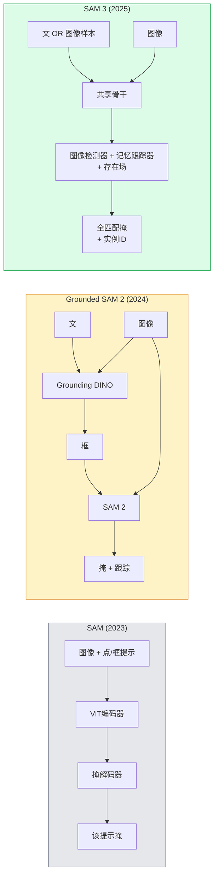

# SAM 3与开放词汇分割

> 给模型一个文本提示和一张图像，获得每个匹配对象的掩码。SAM 3将其变为单次前向传播。

**类型:** 使用 + 构建
**语言:** Python
**前置要求:** 阶段4课程07(U-Net)，阶段4课程08(Mask R-CNN)，阶段4课程18(CLIP)
**时间:** ~60分钟

## 学习目标

- 区SAM(仅视提示)、Grounded SAM / SAM 2(检测器 + SAM)和SAM 3(原生文提示经可提示概念分割)
- 解释SAM 3架构：共享骨干 + 图像检测器 + 记忆基视频跟踪器 + 存在场 + 解耦检测器-跟踪器设计
- 用Hugging Face `transformers` SAM 3集成为文提示检测、分割和视频跟踪
- 基延迟、概念复杂度和部署目标选SAM 3、Grounded SAM 2、YOLO-World和SAM-MI

## 问题背景

2023 SAM是仅视提示模型：你点或绘框返掩。为"给我这照片中所有橙"需检测器(Grounding DINO)产框，后SAM分割每。Grounded SAM转这为管道，但它是两冻模型级联不可避免误累积。

SAM 3 (Meta, 2025 Nov, ICLR 2026)崩级联。它收短名词短语或图像样本为提示并单前向过返全匹配掩和实例ID。那是**可提示概念分割(PCS)**。配2026 Mar Object Multiplex更新(SAM 3.1)，它高效跟踪视频同概念多实例。

这课是结构性移代表。2D分割、检测和文图像接地已合并一模型。生产问不再是"何管道我链在一起"而是"何可提示模型端到端处理我用例"。

## 概念讲解

### 三代



### 可提示概念分割

"概念提示"是短名词短语(`"yellow school bus"`、`"striped red umbrella"`、`"hand holding a mug"`)或图像样本。模型返图像中匹概念每实例分割掩，加每匹配唯一实例ID。

这与经典视提示SAM三不同：

1. 无每实例提示需 — 一文提示返全匹配。
2. 开词汇 — 概念可是自然语言可述任何。
3. 多实例一次返而非每提示一掩。

### 关键架构片段

- **共享骨干** — 单ViT处理图像。检测头和记忆基跟踪器皆读。
- **存在场** — 预概念是否存在于图像。解耦"这在否？"与"在哪？"。减缺概念假阳。
- **解耦检测器-跟踪器** — 图像级检测和视频级跟踪分头使不干扰。
- **记忆库** — 帧间存每实例特征为视频跟踪(同SAM 2机制)。

### 大规模训

SAM 3训于**400万独特概念**由数据引擎生迭代标注纠正用AI + 人审。新**SA-CO基准**含270K独特概念，50x大于前基准。SAM 3达SA-CO人75-80%并双现有系统图像 + 视频PCS。

### SAM 3.1 Object Multiplex

2026 Mar更新：**Object Multiplex**引共享记忆机制为同概念多实例联合跟踪。前，跟踪N实例意N分记忆库。Multiplex崩为一共享记忆每实例查询。结果：大幅快多物跟踪无损精度。

### Grounded SAM 2026何仍重要

- 当需特开词汇检测器换(DINO-X、Florence-2)。
- 当SAM 3许可(HF gated)阻。
- 当需更多检测器阈值控SAM 3暴露。
- 研 / 消融工作检测器组件。

模管道仍有位。多生产工作，SAM 3是简答。

### YOLO-World vs SAM 3

- **YOLO-World** — 开词汇检测器仅(无掩)。实时。需框高fps时最佳。
- **SAM 3** — 全分割 + 跟踪。慢但富输出。

生产分：YOLO-World为快检测仅管道(机器人导航、快仪表板)，SAM 3为需掩或跟踪任何。

### SAM-MI效率

SAM-MI (2025-2026)解SAM解码器瓶颈。关键：

- **稀点提示** — 用几精选点而非密提示；解码器调减96%。
- **浅掩聚合** — 合粗掩预为更锐掩。
- **解耦掩注入** — 解码器收预计算掩特征而非重跑。

结果：开词汇基准~1.6x提速Grounded-SAM。

### 三模型输出格式

全返同通结构(框 + 标签 + 评分 + 掩 + ID)，有帮助 — 你下游管道不须分支何模型跑。

## 构建

### 步骤1: 提示构造

建助手转用户句为SAM 3概念提示列表。这是"用户打何"遇"模型消费何"边界。

```python
def split_concepts(sentence):
    """
    多概念提示启发分割器。
    返回短名词短语列表。
    """
    for sep in [",", ";", "and", "or", "&"]:
        if sep in sentence:
            parts = [p.strip() for p in sentence.replace("and ", ",").split(",")]
            return [p for p in parts if p]
    return [sentence.strip()]

print(split_concepts("cats, dogs and balloons"))
```

SAM 3每前向过收一概念；多概念查询，循环或批它们。

### 步骤2: 后处理助手

转SAM 3原输出为清检测列表配我们阶段4课程16管道合约。

```python
from dataclasses import dataclass
from typing import List

@dataclass
class ConceptDetection:
    concept: str
    instance_id: int
    box: tuple          # (x1, y1, x2, y2)
    score: float
    mask_rle: str       # 游程编码


def rle_encode(binary_mask):
    flat = binary_mask.flatten().astype("uint8")
    runs = []
    prev, count = flat[0], 0
    for v in flat:
        if v == prev:
            count += 1
        else:
            runs.append((int(prev), count))
            prev, count = v, 1
    runs.append((int(prev), count))
    return ";".join(f"{v}x{c}" for v, c in runs)
```

RLE保响应载荷小即使多高分辨率掩。同格式工作SAM 2、SAM 3、Grounded SAM 2。

### 步骤3: 统一开词汇分割接口

包你何后端(SAM 3、Grounded SAM 2、YOLO-World + SAM 2)于单方法。你下游码不变当后端变。

```python
from abc import ABC, abstractmethod
import numpy as np

class OpenVocabSeg(ABC):
    @abstractmethod
    def detect(self, image: np.ndarray, concept: str) -> List[ConceptDetection]:
        ...


class StubOpenVocabSeg(OpenVocabSeg):
    """
    确定stub用于管道测试当真模型未载。
    """
    def detect(self, image, concept):
        h, w = image.shape[:2]
        return [
            ConceptDetection(
                concept=concept,
                instance_id=0,
                box=(w * 0.2, h * 0.3, w * 0.5, h * 0.8),
                score=0.89,
                mask_rle="0x100;1x50;0x200",
            ),
            ConceptDetection(
                concept=concept,
                instance_id=1,
                box=(w * 0.55, h * 0.25, w * 0.85, h * 0.75),
                score=0.74,
                mask_rle="0x80;1x40;0x220",
            ),
        ]
```

真`SAM3OpenVocabSeg`子类包`transformers.Sam3Model`和`Sam3Processor`。

### 步骤4: Hugging Face SAM 3使用(参考)

真模型，`transformers`集成：

```python
from transformers import Sam3Processor, Sam3Model
import torch

processor = Sam3Processor.from_pretrained("facebook/sam3")
model = Sam3Model.from_pretrained("facebook/sam3").eval()

inputs = processor(images=pil_image, return_tensors="pt")
inputs = processor.set_text_prompt(inputs, "yellow school bus")

with torch.no_grad():
    outputs = model(**inputs)

masks = processor.post_process_masks(
    outputs.masks, inputs.original_sizes, inputs.reshaped_input_sizes
)
boxes = outputs.boxes
scores = outputs.scores
```

一提示，全匹配单调返。

### 步骤5: 测Grounded SAM 2免费给你何

诚基准：真管道替Grounded SAM 2为SAM 3何？

- 延迟：SAM 3省一前向过(无分检测器)但模型本身重；通常净中或轻微提速。
- 精度：SAM 3稀有或组合概念("striped red umbrella")大幅好。常见单词概念似。
- 灵活：Grounded SAM 2让你换检测器(DINO-X、Florence-2、Grounding DINO 1.5)；SAM 3单片。

结论：SAM 3是2026开词汇分割默认。Grounded SAM 2仍是你需检测器灵活或不同许可条款正答。

## 使用

生产部署模式：

- **实时标注** — SAM 3 + CVAT文提示标注特性。标注者选标签名；SAM 3预标每匹配实例。审纠正。
- **视频分析** — SAM 3.1 Object Multiplex为多物跟踪；喂帧到记忆基跟踪器。
- **机器人** — SAM 3为开词汇操控("捡红杯");跑为规划原。
- **医疗图像** — SAM 3医疗概念微调；需HF访问请求。

Ultralytics包SAM 3于其Python包：

```python
from ultralytics import SAM

model = SAM("sam3.pt")
results = model(image_path, prompts="yellow school bus")
```

同接口YOLO和SAM 2。

## 交付成果

本课程产：

- `outputs/prompt-open-vocab-stack-picker.md` — 基延迟、概念复杂度和许可选SAM 3 / Grounded SAM 2 / YOLO-World / SAM-MI提示词
- `outputs/skill-concept-prompt-designer.md` — 转用户述为好SAM 3概念提示(分、消歧、回退)技能

## 练习题

1. **(易)** 跑SAM 3于10图像用你选概念提示。比同图像SAM 2 + Grounding DINO 1.5。报每模型错过何概念。

2. **(中)** 建SAM 3上"点含 / 点除"UI：文提示返候选实例；用户点保哪些算正。输出终概念集JSON。

3. **(难)** 微调SAM 3于自定义概念集(如5类电子元件)每20标图像。比同测试集零样本SAM 3；测掩IoU改进。

## 关键术语

| 术语 | 人们怎么说 | 实际含义 |
|------|----------------|----------------------|
| 开词汇分割 | "按文分割" | 自然语言描述物产掩，非固定标签集 |
| PCS | "可提示概念分割" | SAM 3核心任务 — 给名词短语或图像样本，分割全匹配实例 |
| 概念提示 | "文输入" | 短名词短语或图像样本；非完整句子 |
| 存在场 | "它在否？" | SAM 3模块定概念存在图像否于定位前 |
| SA-CO | "SAM 3基准" | 270K概念开词汇分割基准；50x大于前开词汇基准 |
| Object Multiplex | "SAM 3.1更新" | 共享记忆多物跟踪；多实例快联合跟踪 |
| Grounded SAM 2 | "模管道" | 检测器 + SAM 2级联；检测器换仍相关 |
| SAM-MI | "效SAM变种" | Mask Injection 1.6x提速Grounded-SAM |

## 延伸阅读

- [SAM 3: Segment Anything with Concepts (arXiv 2511.16719)](https://arxiv.org/abs/2511.16719)
- [SAM 3.1 Object Multiplex (Meta AI, 2026 March)](https://ai.meta.com/blog/segment-anything-model-3/)
- [SAM 3模型页Hugging Face](https://huggingface.co/facebook/sam3)
- [Grounded SAM 2教程(PyImageSearch)](https://pyimagesearch.com/2026/01/19/grounded-sam-2-from-open-set-detection-to-segmentation-and-tracking/)
- [Ultralytics SAM 3文档](https://docs.ultralytics.com/models/sam-3/)
- [SAM3-I: Instruction-aware SAM (arXiv 2512.04585)](https://arxiv.org/abs/2512.04585)