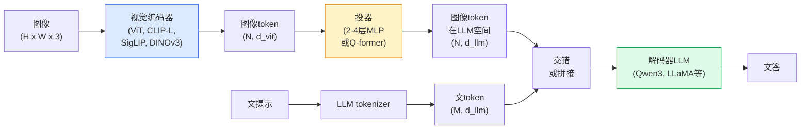

# 视觉语言模型 — ViT-MLP-LLM模式

> 视觉编码器转图像为token。MLP投器映那些token进LLM嵌入空间。语言模型做余。那模式 — ViT-MLP-LLM — 是每2026生产VLM。

**类型:** 学 + 使用
**语言:** Python
**前置要求:** 阶段4课程14(ViT)，阶段4课程18(CLIP)，阶段7课程02(自注意)
**时间:** ~75分钟

## 学习目标

- 述ViT-MLP-LLM架构并解释三组件各贡献何
- 比Qwen3-VL、InternVL3.5、LLaVA-Next和GLM-4.6V于参数数、上下文长和基准性能
- 解释DeepStack：为何多级ViT特征比单末层特征更紧视觉语言对齐
- 生产用Cross-Modal Error Rate (CMER)测VLM幻觉并作信号

## 问题背景

CLIP(阶段4课程18)给你图像和文共享嵌入空间，零样本分类和检索足。不能答"这图像几红车？"因CLIP不生成文 — 仅评分相似。

视觉语言模型(VLM) — Qwen3-VL、InternVL3.5、LLaVA-Next、GLM-4.6V — 螺CLIP族图像编码器到完语言模型。模型看图像加问题并生成答。2026开源VLM多模基准(MMMU、MMBench、DocVQA、ChartQA、MathVista、OSWorld)匹或胜GPT-5和Gemini-2.5-Pro。

三件(ViT、投器、LLM)是标准。模型间差异在哪ViT、哪投器、哪LLM、训数据和配配方。一旦懂模式，换任组件机械。

## 概念讲解

### ViT-MLP-LLM架构



1. **视觉编码器** — 预训ViT(CIP-L/14、SigLIP、DINOv3或微调变种)。产patch token。
2. **投器** — 小模块(2-4层MLP或Q-former)映视觉token进LLM嵌入维。这是大多微调发生地。
3. **LLM** — 解码器仅语言模型(Qwen3、Llama、Mistral、GLM、InternLM)。读序列视觉 + 文token，生成文。

三件皆可训。实，视觉编码器和LLM大冻而投器训 — 几十亿参数信号便宜。

### DeepStack

朴投仅用末ViT层。DeepStack (Qwen3-VL)多ViT深度采样特征并栈。深层带高层语义；浅层带细粒空间和纹理信息。喂两者进LLM闭"图像含何"(语义)和"精确在哪"(空间接地)间隙。

### 三训阶段

现代VLM分阶段训：

1. **对齐** — 冻ViT和LLM。仅训投器于图像-标题对。教投器映视觉空间进语言空间。
2. **预训** — 解冻全。大尺度交错图像文数据(500M+对)训。建模型视觉知识。
3. **指令调** — 精(image, question, answer)三元组微调。教对话行为和任务格式。这是转"视觉觉LM"为可用助手。

多LoRA微调目标阶段3小标数据集。

### 模型族比较(2026早)

| 模型 | 参数 | 视觉编码器 | LLM | 上下文 | 强 |
|-------|--------|----------------|-----|---------|-----------|
| Qwen3-VL-235B-A22B (MoE) | 235B(22B活跃) | 自ViT + DeepStack | Qwen3 | 256K | 通SOTA，GUI代理 |
| Qwen3-VL-30B-A3B (MoE) | 30B(3B活跃) | 自ViT + DeepStack | Qwen3 | 256K | 小MoE替代 |
| Qwen3-VL-8B(密) | 8B | 自ViT | Qwen3 | 128K | 生产密默认 |
| InternVL3.5-38B | 38B | InternViT-6B | Qwen3 + GPT-OSS | 128K | 强MMBench / MMVet |
| InternVL3.5-241B-A28B | 241B(28B活跃) | InternViT-6B | Qwen3 | 128K | 与GPT-4o竞争 |
| LLaVA-Next 72B | 72B | SigLIP | Llama-3 | 32K | 开，易微调 |
| GLM-4.6V | ~70B | 自 | GLM | 64K | 开源，强OCR |
| MiniCPM-V-2.6 | 8B | SigLIP | MiniCPM | 32K | 边缘友好 |

### 视觉代理

Qwen3-VL-235B达OSWorld全球顶 — **视觉代理**(GUI操作)基准。模型看截屏、理解UI、发动作(点、输、滚)。配工具，闭普通桌面任务环。这是多2026"AI PC"演示下跑。

### 代理能力 + RoPE变种

VLM需知视频帧**何时**。Qwen3-VL从T-RoPE(时间旋位置嵌入)演进为**文基时间对齐** — 显时间戳文token与视频帧交错。模型见"`<timestamp 00:32>`帧，提示"并可推理时间关系。

### 对齐问题

爬数据集12%图像文对含描述不完全基于图像。训于这的VLM静学幻觉 — 编物、误读数、造关系。生产这是主导失败模式。

Skywork.ai引**Cross-Modal Error Rate (CMER)**追：

```
CMER = 文置信高但图像文相似(经CLIP族检查器)低输出分
```

高CMER意模型信说无图像接地。监控CMER作生产KPI其部署幻觉率减约35%。窍非"修模型"而是"路由高CMER输出到人审"。

### 用LoRA / QLoRA微调

70B VLM全微调多队不可。LoRA(秩16-64)于注意 + 投器层，或QLoRA 4位基权，适单A100 / H100。成本：5,000-50,000例，$100-$5,000算，2-10小时训。

### 空间推理仍弱

当前VLM空间推理基准50-60%(上-下、左-右、计数、距离)。若你用例依赖"何物在何物上"，重验 — 泛VLM性能低于人。纯空间任务比VLM替代：专关键点/姿态估计器、深模型或检测模型后处理框几何。

## 构建

### 步骤1: 投器

你将最常训部分。2-4层MLP带GELU。

```python
import torch
import torch.nn as nn


class Projector(nn.Module):
    def __init__(self, vit_dim=768, llm_dim=4096, hidden=4096):
        super().__init__()
        self.net = nn.Sequential(
            nn.Linear(vit_dim, hidden),
            nn.GELU(),
            nn.Linear(hidden, llm_dim),
        )

    def forward(self, x):
        return self.net(x)
```

输入`(N_patches, d_vit)`token张量。输出`(N_patches, d_llm)`。LLM视每输出行为另一token。

### 步骤2: 组ViT-MLP-LLM端到端

最小VLM前向骨架。真码用`transformers`；这是概念布局。

```python
class MinimalVLM(nn.Module):
    def __init__(self, vit, projector, llm, image_token_id):
        super().__init__()
        self.vit = vit
        self.projector = projector
        self.llm = llm
        self.image_token_id = image_token_id  # 文提示占位token

    def forward(self, image, input_ids, attention_mask):
        # 1. 视觉特征
        vision_tokens = self.vit(image)                     # (B, N_patches, d_vit)
        vision_embeds = self.projector(vision_tokens)       # (B, N_patches, d_llm)

        # 2. 文嵌入
        text_embeds = self.llm.get_input_embeddings()(input_ids)  # (B, M, d_llm)

        # 3. 替图像占位token为视觉嵌入
        merged = self._merge(text_embeds, vision_embeds, input_ids)

        # 4. 跑LLM
        return self.llm(inputs_embeds=merged, attention_mask=attention_mask)

    def _merge(self, text_embeds, vision_embeds, input_ids):
        out = text_embeds.clone()
        expected = vision_embeds.size(1)
        for b in range(input_ids.size(0)):
            positions = (input_ids[b] == self.image_token_id).nonzero(as_tuple=True)[0]
            if len(positions) != expected:
                raise ValueError(
                    f"批项{b}有{len(positions)}图像token但vision_embeds有{expected} patch。"
                    " 批每样本须预填充到同图像占位token数。")
            out[b, positions] = vision_embeds[b]
        return out
```

文`<image>`占位token替为真图像嵌入 — 同模式LLaVA、Qwen-VL和InternVL用。

### 步骤3: CMER计算

轻运行时检查。

```python
import torch.nn.functional as F


def cross_modal_error_rate(image_emb, text_emb, text_confidence, sim_threshold=0.25, conf_threshold=0.8):
    """
    image_emb, text_emb: 图像和生成文嵌入(内归一化)
    text_confidence:     [0, 1]每token均值概率
    Returns:             高置信低图像文对齐输出分
    """
    image_emb = F.normalize(image_emb, dim=-1)
    text_emb = F.normalize(text_emb, dim=-1)
    sim = (image_emb * text_emb).sum(dim=-1)        # 余弦相似
    high_conf_low_sim = (text_confidence > conf_threshold) & (sim < sim_threshold)
    return high_conf_low_sim.float().mean().item()
```

CMER作生产KPI。每端点、每提示类型、每客户监控。升CMER指示模型某些输入分布始幻觉。

### 步骤4: 玩VLM分类器(可跑)

示投器训。假"ViT特征"入；小LLM风格token预类。

```python
class ToyVLM(nn.Module):
    def __init__(self, vit_dim=32, llm_dim=64, num_classes=5):
        super().__init__()
        self.projector = Projector(vit_dim, llm_dim, hidden=64)
        self.head = nn.Linear(llm_dim, num_classes)

    def forward(self, vision_tokens):
        projected = self.projector(vision_tokens)
        pooled = projected.mean(dim=1)
        return self.head(pooled)
```

可于合成(特征，类)对200步内拟合 — 足示投器模式工作。

## 使用

2026生产队用VLM三路：

- **托管API** — OpenAI Vision、Anthropic Claude Vision、Google Gemini Vision。零基建，供方风险。
- **开源自托** — Qwen3-VL或InternVL3.5经`transformers`和`vllm`。全控，高前力。
- **域微调** — 载Qwen2.5-VL-7B或LLaVA-1.6-7B，LoRA于5k-50k自定义例，`vllm`或`TGI`服务。

```python
from transformers import AutoProcessor, AutoModelForVision2Seq
import torch
from PIL import Image

model_id = "Qwen/Qwen3-VL-8B-Instruct"
processor = AutoProcessor.from_pretrained(model_id)
model = AutoModelForVision2Seq.from_pretrained(model_id, torch_dtype=torch.bfloat16, device_map="auto")

messages = [{
    "role": "user",
    "content": [
        {"type": "image", "image": Image.open("plot.png")},
        {"type": "text", "text": "What does this chart show?"},
    ],
}]
inputs = processor.apply_chat_template(messages, add_generation_prompt=True, tokenize=True, return_dict=True, return_tensors="pt").to("cuda")
generated = model.generate(**inputs, max_new_tokens=256)
answer = processor.decode(generated[0][inputs["input_ids"].shape[1]:], skip_special_tokens=True)
```

`apply_chat_template`藏`<image>`占位token化；模型内处理合并。

## 交付成果

本课程产：

- `outputs/prompt-vlm-selector.md` — 给精度、延迟、上下文长和预算选Qwen3-VL / InternVL3.5 / LLaVA-Next / API提示词
- `outputs/skill-cmer-monitor.md` — 发生产VLM端点跨模错率、每端点仪表板和警阈值仪器码技能

## 练习题

1. **(易)** 跑三提示("这是什么？"、"数物"、"描述场景")通过任开VLM于五图像。手评分每答为正确 / 部分正确 / 幻觉。算初CMER似率。

2. **(中)** LoRA(秩16)微调Qwen2.5-VL-3B或LLaVA-1.6-7B于目标域500图像带标题。比零样本vs微调MMBench风格精度。

3. **(难)** 替VLM图像编码器为DINOv3而非默认SigLIP/CLIP。重训仅投器(冻LLM +冻DINOv3)。测密预任务(计数、空间推理)改进否。

## 关键术语

| 术语 | 人们怎么说 | 实际含义 |
|------|----------------|----------------------|
| ViT-MLP-LLM | "VLM模式" | 视觉编码器 + 投器 + 语言模型；每2026 VLM |
| 投器 | "桥" | 2-4层MLP(或Q-former)映视觉token进LLM嵌入空间 |
| DeepStack | "Qwen3-VL特征技巧" | 多级ViT特征栈而非仅末层 |
| 图像token | "<image>占位" | 文流特殊token替为投视觉嵌入 |
| CMER | "幻觉KPI" | Cross-Modal Error Rate；文置信高图像文相似低时高 |
| 视觉代理 | "点击VLM" | VLM操作GUI(OSWorld、移动、web)带工具调用 |
| Q-former | "固数token桥" | BLIP-2风格投器产固定数视觉查询token |
| 对齐 / 预训 / 指令调 | "三阶段" | 标准VLM训管道 |

## 延伸阅读

- [Qwen3-VL技术报告(arXiv 2511.21631)](https://arxiv.org/abs/2511.21631)
- [InternVL3.5 Advancing Open-Source Multimodal Models (arXiv 2508.18265)](https://arxiv.org/html/2508.18265v1)
- [LLaVA-Next系列](https://llava-vl.github.io/blog/2024-05-10-llava-next-stronger-llms/)
- [BentoML: Best Open-Source VLMs 2026](https://www.bentoml.com/blog/multimodal-ai-a-guide-to-open-source-vision-language-models)
- [MMMU: Multi-discipline Multimodal Understanding基准](https://mmmu-benchmark.github.io/)
- [VLMs在制造(Robotics Tomorrow, 2026 March)](https://www.roboticstomorrow.com/story/2026/03/when-machines-learn-to-see-like-experts-the-rise-of-vision-language-models-in-manufacturing/26335/)