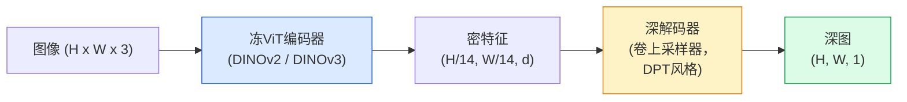

# 单目深度与几何估计

> 深度图是单通道图像每像素是距相机距离。从单RGB帧预它曾无立体或LiDAR不可能。2026冻ViT编码器加轻头得真值几百分比内。

**类型:** 构建 + 使用
**语言:** Python
**前置要求:** 阶段4课程14(ViT)，阶段4课程17(自监督视觉)，阶段4课程07(U-Net)
**时间:** ~60分钟

## 学习目标

- 区相对和度量深度并述何生产模型(MiDaS、Marigold、Depth Anything V3、ZoeDepth)解哪个
- 用Depth Anything V3 (DINOv2骨干)为任意单图像预深度无校准
- 解释为何单图像产深度(透视提示、纹理梯度、学先验)和不能恢复何(绝尺、遮挡几何)
- 用深度图和针孔相机内参举2D检测到3D点

## 问题背景

深是2D计算机视缺轴。给RGB，你知物在图像平面何处；不知多远。深传感器(立体装置、LiDAR、时飞)直解但贵、脆、限范围。

单目深度估计 — 从单RGB帧预深 — 曾产模糊不可靠输出。2026大预训编码器改：Depth Anything V3用冻DINOv2骨干并产深图跨室内、户外、医疗和卫星域泛化。Marigold重深为条件扩散问题。ZoeDepth回归真度量距离。

深也是2D检测和3D理解桥：乘检测框像素深并举2D物入3D点云。那是每AR遮挡系统、每避障管道、每"捡杯"机器人核。

## 概念讲解

### 相对vs度量深

- **相对深** — 有序`z`值无真世界单位。"像素A比像素B近，但距离比未锚米。"
- **度量深** — 绝距米。需模型学图像提示和真距离间统计关系。

MiDaS和Depth Anything V3产相对深。Marigold产相对深。ZoeDepth、UniDepth和Metric3D产度量深。度量模型敏相机内参；相对模型不。

### 编码器-解码器模式



Depth Anything V3冻编码器仅训DPT风格解码器。编码器供富特征；解码器插回图像分辨率并回归深。

### 为何单图像产深

2D图像含多单目提示关深：

- **透视** — 3D平行线在2D收敛。
- **纹理梯度** — 远面小、密纹理。
- **遮挡序** — 近物遮远物。
- **大小恒常** — 知物(车、人)给近似尺。
- **大气透视** — 户外远物模糊蓝。

ViT训于十亿图像内化这些提示。足数据和强骨干，单目深达合理精度无显式3D监督。

### 单目深不能做何

- **绝度量尺**无内参或场景中知物。网络可预"杯比勺远两倍"不知杯是1m或10m。
- **遮挡几何** — 椅背未见不可可靠推。
- **真无纹理 / 反射面** — 镜、玻璃、匀墙。网络报合理但错深。

### Depth Anything V3 2026

- 原DINOv2 ViT-L/14作编码器(冻)。
- DPT解码器。
- 训于多样源位姿图像对(无显深监督仅需光一致性)。
- 从**任意数视觉输入预空间一致几何，有无知相机位姿**。
- SOTA跨单目深、任视几何、视渲染、相机位姿估计。

这是2026需深时调用模型。

### Marigold — 扩散为深

Marigold (Ke等, CVPR 2024)重深估计为条件图像到图像扩散。条件：RGB。目标：深图。用预训Stable Diffusion 2 U-Net作骨干。输出深图物边界极锐。权衡：推理比前馈模型慢(10-50去噪步)。

### 内参和针孔相机

举像素`(u, v)`深`d`到相机坐标3D点`(X, Y, Z)`：

```
fx, fy, cx, cy = 相机内参
X = (u - cx) * d / fx
Y = (v - cy) * d / fy
Z = d
```

内参从EXIF元数据、校准图案或单目内参估计器(Perspective Fields、UniDepth)。无内参，仍可假设60-70° FOV和中分辨率主点渲染点云 — 可视化用，非测量。

### 评估

两标准指标：

- **AbsRel**(绝相对误)：`mean(|d_pred - d_gt| / d_gt)`。低佳。生产模型0.05-0.1。
- **delta < 1.25**(阈值精度)：`max(d_pred/d_gt, d_gt/d_pred) < 1.25`像素分。高佳。SOTA 0.9+。

相对深(Depth Anything V3、MiDaS)，评估用尺移不变版本两者。

## 构建

### 步骤1: 深指标

```python
import torch

def abs_rel_error(pred, target, mask=None):
    if mask is not None:
        pred = pred[mask]
        target = target[mask]
    return (torch.abs(pred - target) / target.clamp(min=1e-6)).mean().item()


def delta_accuracy(pred, target, threshold=1.25, mask=None):
    if mask is not None:
        pred = pred[mask]
        target = target[mask]
    ratio = torch.maximum(pred / target.clamp(min=1e-6), target / pred.clamp(min=1e-6))
    return (ratio < threshold).float().mean().item()
```

总在评估前掩无效深像素(零、NaN、饱和)。

### 步骤2: 尺移对齐

相对深模型，算指标前对齐预到真值。`a * pred + b = target`最小二乘拟合：

```python
def align_scale_shift(pred, target, mask=None):
    if mask is not None:
        p = pred[mask]
        t = target[mask]
    else:
        p = pred.flatten()
        t = target.flatten()
    A = torch.stack([p, torch.ones_like(p)], dim=1)
    coeffs, *_ = torch.linalg.lstsq(A, t.unsqueeze(-1))
    a, b = coeffs[:2, 0]
    return a * pred + b
```

评MiDaS / Depth Anything前跑`align_scale_shift`。

### 步骤3: 举深到点云

```python
import numpy as np

def depth_to_point_cloud(depth, intrinsics):
    H, W = depth.shape
    fx, fy, cx, cy = intrinsics
    v, u = np.meshgrid(np.arange(H), np.arange(W), indexing="ij")
    z = depth
    x = (u - cx) * z / fx
    y = (v - cy) * z / fy
    return np.stack([x, y, z], axis=-1)


depth = np.random.uniform(0.5, 4.0, (240, 320))
intr = (320.0, 320.0, 160.0, 120.0)
pc = depth_to_point_cloud(depth, intr)
print(f"点云形: {pc.shape}  (H, W, 3)")
```

一函数，每3D举应用。导点云`.ply`并MeshLab或CloudCompare开。

### 步骤4: 合成深景冒烟测

```python
def synthetic_depth(size=96):
    yy, xx = np.meshgrid(np.arange(size), np.arange(size), indexing="ij")
    # 地板：近(顶)到远(底)线性梯度
    depth = 1.0 + (yy / size) * 4.0
    # 中盒子：近
    mask = (np.abs(xx - size / 2) < size / 6) & (np.abs(yy - size * 0.6) < size / 6)
    depth[mask] = 2.0
    return depth.astype(np.float32)


gt = torch.from_numpy(synthetic_depth(96))
pred = gt + 0.3 * torch.randn_like(gt)  # 模拟预
aligned = align_scale_shift(pred, gt)
print(f"对齐前  absRel = {abs_rel_error(pred, gt):.3f}")
print(f"对齐后   absRel = {abs_rel_error(aligned, gt):.3f}")
```

### 步骤5: Depth Anything V3使用(参考)

```python
import torch
from transformers import pipeline
from PIL import Image

pipe = pipeline(task="depth-estimation", model="LiheYoung/depth-anything-v2-large")

image = Image.open("street.jpg").convert("RGB")
out = pipe(image)
depth_np = np.array(out["depth"])
```

三行。`out["depth"]`是PIL灰度；转numpy为数学。Depth Anything V3特，发后换模型id；API不变。

## 使用

- **Depth Anything V3** (Meta AI / ByteDance, 2024-2026) — 相对深默认。最快ViT-large骨干生产模型。
- **Marigold** (ETH, 2024) — 最高视质，推理慢。
- **UniDepth** (ETH, 2024) — 带相机内参估计度量深。
- **ZoeDepth** (Intel, 2023) — 度量深；老，仍可靠。
- **MiDaS v3.1** — 遗产但稳；好比基线。

典型集成模式：

1. RGB帧到。
2. 深模型产深图。
3. 检测器产框。
4. 举框心经深到3D；若有可用并点云。
5. 下游：AR遮挡、路径规划、物大估计、立体替。

实时用，Depth Anything V2 Small (INT8量化)消费GPU 518x518达~30 fps。

## 交付成果

本课程产：

- `outputs/prompt-depth-model-picker.md` — 给延迟、度量vs相对需和场景类型选Depth Anything V3、Marigold、UniDepth、MiDaS提示词
- `outputs/skill-depth-to-pointcloud.md` — 建点云从深图正内参处理导`.ply`技能

## 练习题

1. **(易)** 跑Depth Anything V2于你桌任10图像。存深为灰PNG并检。识一物预深看错并解释为何单目提示失败。

2. **(中)** 给RGB + Depth Anything V2深，举到点云并用`open3d`渲染。比两场景(室内/户外)并注哪个更可信。

3. **(难)** 取五图像对仅已知物位置异(如瓶移近30cm)。用UniDepth预两者度量深。报预距离差vs真30cm。

## 关键术语

| 术语 | 人们怎么说 | 实际含义 |
|------|----------------|----------------------|
| 单目深 | "单图像深" | 从单RGB帧深估计，无立体或LiDAR |
| 相对深 | "有序深" | 有序z值无真世界单位 |
| 度量深 | "绝距离" | 米深；需校准或度量监督训模型 |
| AbsRel | "绝相对误" | |d_pred - d_gt| / d_gt均值；标准深指标 |
| Delta精度 | "delta < 1.25" | 预真值25%内像素分 |
| 针孔相机 | "fx, fy, cx, cy" | 举(u, v, d)到(X, Y, Z)用相机模型 |
| DPT | "密预Transformer" | 冻ViT编码器顶用卷解码器为深 |
| DINOv2骨干 | "工作因" | 自监督特征跨域泛化无深标签 |

## 延伸阅读

- [Depth Anything V3论文页](https://depth-anything.github.io/) — SOTA单目深带DINOv2编码器
- [Marigold (Ke等, CVPR 2024)](https://marigoldmonodepth.github.io/) — 扩散基深估计
- [UniDepth (Piccinelli等, 2024)](https://arxiv.org/abs/2403.18913) — 带内参度量深
- [MiDaS v3.1 (Intel ISL)](https://github.com/isl-org/MiDaS) — 规范相对深基线
- [DINOv3博文(Meta)](https://ai.meta.com/blog/dinov3-self-supervised-vision-model/) — 提深精编码器族