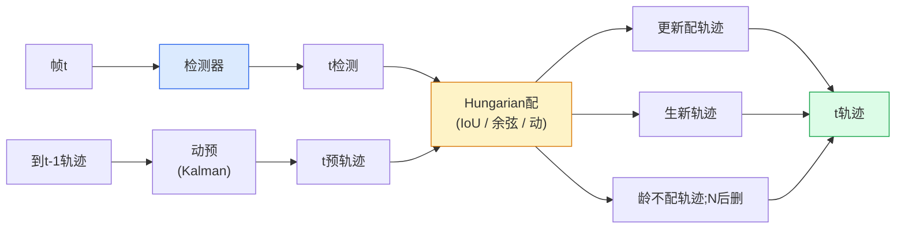

# 多目标跟踪与视频记忆

> 跟踪是检测加关联。每帧都进行检测。将此帧的检测与上一帧的轨迹按ID进行匹配。

**类型:** 构建
**语言:** Python
**前置要求:** 阶段4课程06(YOLO检测)，阶段4课程08(Mask R-CNN)，阶段4课程24(SAM 3)
**时间:** ~60分钟

## 学习目标

- 区跟踪-by-检测和查询基跟踪并名算法族(SORT、DeepSORT、ByteTrack、BoT-SORT、SAM 2记忆跟踪器、SAM 3.1 Object Multiplex)
- 从零实现IoU + Hungarian配为经典跟踪-by-检测
- 解释SAM 2记忆库和为何处理遮挡比IoU基关联好
- 读三跟踪指标(MOTA、IDF1、HOTA)并择何用例重要

## 问题背景

检测器告你单帧物在哪。跟踪器告你帧`t`检测是帧`t-1`检测同一物。无它，你不能数物过线、跟球过遮挡、知"车#4在道8秒"。

跟踪对每视频面产品必要：运动分析、监控、自动驾驶、医疗视频分析、野生动物监控、词计数。核心构件共享：每帧检测器、动模型(Kalman滤或更富)、关联步(IoU / 余弦 / 学特征上Hungarian算法)、轨迹生命周期(生、更新、死)。

2026带两新模式：**SAM 2记忆基跟踪**(特征记忆而非动模型关联)和**SAM 3.1 Object Multiplex**(同概念多实例共享记忆)。这课先走经典栈，后记忆基方法。

## 概念讲解

### 跟踪-by-检测



每你将遇2026跟踪器是此循环变种。差异：

- **SORT** (2016): Kalman滤 + IoU Hungarian。简、快、无外模型。
- **DeepSORT** (2017): SORT + 每轨迹CNN基外特征(ReID嵌入)。处交叉更好。
- **ByteTrack** (2021): 二阶配低置信检测；无外特征需但MOT17顶。
- **BoT-SORT** (2022): Byte + 相机动补偿 + ReID。
- **StrongSORT / OC-SORT** — ByteTrack后代更好动和外。

### Kalman滤一段

Kalman滤保每轨迹态`(x, y, w, h, dx, dy, dw, dh)`带协方差。每帧，**预**态用恒速模型，后用配检测**更新**。更新信检测多当预不确定性高。这给平滑轨迹和短遮挡(1-5帧)续轨能力。

每经典跟踪器用Kalman滤于动预步。

### Hungarian算法

给`M x N`代价矩阵(轨迹 x 检测)，找最小总代价一对一配。代价常`1 - IoU(track_bbox, detection_bbox)`或外特征负余弦似。运行时O((M+N)^3); M,N达~1000 Python`scipy.optimize.linear_sum_assignment`够快。

### ByteTrack关键想

标准跟踪器丢低置信检测(< 0.5)。ByteTrack留作**二阶候选**：配轨迹到高置信检测后，不配轨迹试配低置信检测稍松IoU阈值。恢短遮挡、近人群ID切换。

### SAM 2记忆基跟踪

SAM 2处理视频保**记忆库**每实例时空特征。给一帧提示(点、框、文)，它编实例入记忆。后帧，记忆对新帧特征交叉注意，解码器产新帧同实例掩。

无Kalman滤、无Hungarian配。关联隐于记忆-注意操作。

优：
- 大遮挡鲁(记忆跨多帧载实例身份)。
- SAM 3文提示结合开词汇。
- 无分动模型工作。

缺：
- 多物跟踪比ByteTrack慢。
- 记忆库长；限上下文窗。

### SAM 3.1 Object Multiplex

前SAM 2 / SAM 3跟踪每实例保分记忆库。50物，50记忆库。Object Multiplex(2026 Mar)崩为一共享记忆带**每实例查询token**。成本按实例数亚线性缩。

Multiplex是2026人群跟踪新默认：音乐会人群、仓库工人、交道口。

### 三指标知

- **MOTA(多物跟踪精度)** — 1 - (FN + FP + ID切换) / GT。按误型加权；合并检测和关联失败单指标。
- **IDF1(ID F1)** — ID精度和召回调和均。特聚焦每真轨迹保ID时。比MOTA更ID切换敏任务好。
- **HOTA(高阶跟踪精度)** — 解为检测精度(DetA)和关联精度(AssA)。2020社区标准；最全面。

监控(谁是谁)：IDF1是报。运动分析(数传球)：HOTA。一般学术比：HOTA。

## 构建

### 步骤1: IoU基代价矩阵

```python
import numpy as np


def bbox_iou(a, b):
    """
    a, b: (N, 4) [x1, y1, x2, y2]数组。
    Returns (N_a, N_b) IoU矩阵。
    """
    ax1, ay1, ax2, ay2 = a[:, 0], a[:, 1], a[:, 2], a[:, 3]
    bx1, by1, bx2, by2 = b[:, 0], b[:, 1], b[:, 2], b[:, 3]
    inter_x1 = np.maximum(ax1[:, None], bx1[None, :])
    inter_y1 = np.maximum(ay1[:, None], by1[None, :])
    inter_x2 = np.minimum(ax2[:, None], bx2[None, :])
    inter_y2 = np.minimum(ay2[:, None], by2[None, :])
    inter = np.clip(inter_x2 - inter_x1, 0, None) * np.clip(inter_y2 - inter_y1, 0, None)
    area_a = (ax2 - ax1) * (ay2 - ay1)
    area_b = (bx2 - bx1) * (by2 - by1)
    union = area_a[:, None] + area_b[None, :] - inter
    return inter / np.clip(union, 1e-8, None)
```

### 步骤2: 最小SORT风格跟踪器

固定恒速Kalman略简 — 此用简IoU关联；生产Kalman预必要。`sort` Python包全版。

```python
from scipy.optimize import linear_sum_assignment


class Track:
    def __init__(self, tid, bbox, frame):
        self.id = tid
        self.bbox = bbox
        self.last_frame = frame
        self.hits = 1

    def update(self, bbox, frame):
        self.bbox = bbox
        self.last_frame = frame
        self.hits += 1


class SimpleTracker:
    def __init__(self, iou_threshold=0.3, max_age=5):
        self.tracks = []
        self.next_id = 1
        self.iou_threshold = iou_threshold
        self.max_age = max_age

    def step(self, detections, frame):
        if not self.tracks:
            for d in detections:
                self.tracks.append(Track(self.next_id, d, frame))
                self.next_id += 1
            return [(t.id, t.bbox) for t in self.tracks]

        track_boxes = np.array([t.bbox for t in self.tracks])
        det_boxes = np.array(detections) if len(detections) else np.empty((0, 4))

        iou = bbox_iou(track_boxes, det_boxes) if len(det_boxes) else np.zeros((len(track_boxes), 0))
        cost = 1 - iou
        cost[iou < self.iou_threshold] = 1e6

        matched_track = set()
        matched_det = set()
        if cost.size > 0:
            row, col = linear_sum_assignment(cost)
            for r, c in zip(row, col):
                if cost[r, c] < 1.0:
                    self.tracks[r].update(det_boxes[c], frame)
                    matched_track.add(r); matched_det.add(c)

        for i, d in enumerate(det_boxes):
            if i not in matched_det:
                self.tracks.append(Track(self.next_id, d, frame))
                self.next_id += 1

        self.tracks = [t for t in self.tracks if frame - t.last_frame <= self.max_age]
        return [(t.id, t.bbox) for t in self.tracks]
```

60行。取每帧检测、返每帧轨迹ID。真系统加Kalman预、ByteTrack二阶重配和外特征。

### 步骤3: 合成轨迹测

```python
def synthetic_frames(num_frames=20, num_objects=3, H=240, W=320, seed=0):
    rng = np.random.default_rng(seed)
    starts = rng.uniform(20, 200, size=(num_objects, 2))
    velocities = rng.uniform(-5, 5, size=(num_objects, 2))
    frames = []
    for f in range(num_frames):
        dets = []
        for i in range(num_objects):
            cx, cy = starts[i] + f * velocities[i]
            dets.append([cx - 10, cy - 10, cx + 10, cy + 10])
        frames.append(dets)
    return frames


tracker = SimpleTracker()
for f, dets in enumerate(synthetic_frames()):
    tracks = tracker.step(dets, f)
```

三物直线移动应保ID全20帧。

### 步骤4: ID切换指标

```python
def count_id_switches(tracks_per_frame, gt_per_frame):
    """
    tracks_per_frame:  (track_id, bbox)列表列表
    gt_per_frame:      (gt_id, bbox)列表列表
    Returns ID切换数。
    """
    prev_assignment = {}
    switches = 0
    for tracks, gts in zip(tracks_per_frame, gt_per_frame):
        if not tracks or not gts:
            continue
        t_boxes = np.array([b for _, b in tracks])
        g_boxes = np.array([b for _, b in gts])
        iou = bbox_iou(g_boxes, t_boxes)
        for g_idx, (gt_id, _) in enumerate(gts):
            j = iou[g_idx].argmax()
            if iou[g_idx, j] > 0.5:
                t_id = tracks[j][0]
                if gt_id in prev_assignment and prev_assignment[gt_id] != t_id:
                    switches += 1
                prev_assignment[gt_id] = t_id
    return switches
```

这是简IDF1似指标：数真物何次改配预轨迹ID。真MOTA / IDF1 / HOTA工具在`py-motmetrics`和`TrackEval`。

## 使用

2026生产跟踪器：

- `ultralytics` — YOLOv8 + ByteTrack / BoT-SORT内建。`results = model.track(source, tracker="bytetrack.yaml")`。默认。
- `supervision` (Roboflow) — ByteTrack包装加标注工具。
- SAM 2 / SAM 3.1 — 记忆基跟踪经`processor.track()`。
- 自定义栈：检测器(YOLOv8 / RT-DETR) + `sort-tracker` / `OC-SORT` / `StrongSORT`。

择：

- 人 / 车 / 框30+ fps：**ByteTrack用ultralytics**。
- 一类多实例人群：**SAM 3.1 Object Multiplex**。
- 重遮挡可识外：**DeepSORT / StrongSORT**(ReID特征)。
- 运动 / 复交互：**BoT-SORT**或学跟踪器(MOTRv3)。

## 交付成果

本课程产：

- `outputs/prompt-tracker-picker.md` — 给场景类型、遮挡模式和延迟预算选SORT / ByteTrack / BoT-SORT / SAM 2 / SAM 3.1提示词
- `outputs/skill-mot-evaluator.md` — 写MOTA / IDF1 / HOTA对真轨迹完评估 Harness 技能

## 练习题

1. **(易)** 跑上合成跟踪器用3、10和30物。报每况ID切换数。识简IoU仅关联何处始失败。

2. **(中)** 加恒速Kalman预步于关联前。示短(2-3帧)遮挡不再致ID切换。

3. **(难)** 集`transformers` SAM 2记忆基跟踪器为替代跟踪后端。跑SimpleTracker和SAM 2于人群30秒片段比ID切换数，手标5显著人真ID。

## 关键术语

| 术语 | 人们怎么说 | 实际含义 |
|------|----------------|----------------------|
| 跟踪-by-检测 | "检后关联" | 每帧检测器 + IoU / 外上Hungarian配 |
| Kalman滤 | "动预" | 线动 + 协方差为平滑轨迹预和遮挡处理 |
| Hungarian算法 | "优配" | 解最小代价二分匹配问题；`scipy.optimize.linear_sum_assignment` |
| ByteTrack | "低置信二过" | 重配不配轨迹到低置信检测恢短遮挡 |
| DeepSORT | "SORT + 外" | 加ReID特征跨帧匹配；ID保更好 |
| 记忆库 | "SAM 2技巧" | 每实例时空特征帧间存；交叉注意替显关联 |
| Object Multiplex | "SAM 3.1共享记忆" | 单共享记忆每实例查询为快多物跟踪 |
| HOTA | "现代跟踪指标" | 解为检测和关联精度；社区标准 |

## 延伸阅读

- [SORT (Bewley等, 2016)](https://arxiv.org/abs/1602.00763) — 最小跟踪-by-检测论文
- [DeepSORT (Wojke等, 2017)](https://arxiv.org/abs/1703.07402) — 加外特征
- [ByteTrack (Zhang等, 2022)](https://arxiv.org/abs/2110.06864) — 低置信二过
- [BoT-SORT (Aharon等, 2022)](https://arxiv.org/abs/2206.14651) — 相机动补偿
- [HOTA (Luiten等, 2020)](https://arxiv.org/abs/2009.07736) — 解跟踪指标
- [SAM 2视频分割(Meta, 2024)](https://ai.meta.com/sam2/) — 记忆基跟踪器
- [SAM 3.1 Object Multiplex (Meta, 2026 March)](https://ai.meta.com/blog/segment-anything-model-3/)