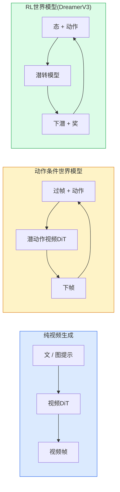

# 世界模型与视频扩散

> 预测场景接下来几秒的视频模型就是世界模拟器。将那个预测以动作为条件，你就得到了一个学习到的游戏引擎。

**类型:** 学习 + 构建
**语言:** Python
**前置要求:** 阶段4课程10(扩散)，阶段4课程12(视频理解)，阶段4课程23(DiT + 整流流)
**时间:** ~75分钟

## 学习目标

- 解释纯视频生成模型(Sora 2)和动作条件世界模型(Genie 3、DreamerV3)差
- 描述视频DiT：时空patch、3D位置编码、(T, H, W) token联合注意
- 追世界模型如何插机器人：VLM计划 → 视频模型模拟 → 反动力学发动作
- 给用例(创视频、交互模拟、自动驾驶合成)选Sora 2、Genie 3、Runway GWM-1 Worlds、Wan-Video和HunyuanVideo

## 问题背景

视频生成和世界建模2026收敛。能生成一致分钟视频模型某种程度学了世界如何动：物恒、重力、因果、风格。若你条件那预于动作(左走、开门)，视频模型成可学模拟器可替游戏引擎、驾驶模拟器或机器人环境。

赌注具体。Genie 3从单图像生可玩环境。Runway GWM-1 Worlds合无限可探索场景。Sora 2产分钟长视频带同步音频和建模物理。NVIDIA Cosmos-Drive、Wayve Gaia-2和Tesla DrivingWorld为自动驾驶训数据生现实驾驶视频。世界模型范式静取机器人sim-to-real。

这课是阶段4"大局"课。它连图像生成、视频理解和代理推理进研主导架构模式。

## 概念讲解

### 三世界建模族



- **Sora 2**是纯视频生成条件于提示。无动作接口。不能中"舵"。
- **Genie 3**、**GWM-1 Worlds**、**Mirage / Magica**是动作条件世界模型。从观视频推潜动作，后条件未来帧预于动作。交互 — 你按键或移相机场景响应。
- **DreamerV3**和经典RL世界模型族在潜空间显动作条件预，训于奖信号。少视；更样效RL用。

### 视频DiT架构

```
视频潜:          (C, T, H, W)
Patch化(空间):   每帧P_h x P_w patch格
Patch化(时间):   P_t帧组为时间patch
Resulting tokens:      (T / P_t) * (H / P_h) * (W / P_w) tokens
```

位置编码是3D：每坐标旋或学嵌入。注意可：

- **全联合** — 全token注意全token。O(N^2)N token。长视频禁。
- **分治** — 交替时间注意(同空间位，跨时间：`(H*W) * T^2`)和空间注意(同时步，跨空间：`T * (H*W)^2`)。TimeSformer和多大视频DiTs用。
- **窗** — 局窗于。Video Swin用。

每2026视频扩散模型用这三模式之一加AdaLN条件(课程23)和整流流。

### 条件于动作：潜动作模型

Genie学每帧**潜动作**通过判预两连续帧间动作。模型解码器后条件于推潜动作 — 非显键盘键。推理，用户可指潜动作(或从新先验采一)模型生成与那动作一致的下帧。

Sora跳动作接口全。解码器从过时空token预下时空token。提示条件始；无中舵。

### 物理合理性

Sora 2 2026发显广告**物理合理性**：重、平衡、物恒、因果-效。队手评合理性评分测量；模型显改进落物、角色碰撞和故意失败(跳失误) vs Sora 1。

合理性仍主导失败模式。2024-2025人吃意面或从玻璃喝水视频揭示模型缺持久物表示。2026模型(Sora 2、Runway Gen-5、HunyuanVideo)减但未消这些。

### 自动驾驶世界模型

驾驶世界模型生现实路景条件于轨迹、边界框或导航图。用：

- **Cosmos-Drive-Dreams** (NVIDIA) — 为RL训生分钟驾驶视频。
- **Gaia-2** (Wayve) — 轨迹条件场景合为策评。
- **DrivingWorld** (Tesla) — 模拟变天气、时日、交条件。
- **Vista** (ByteDance) — 反应驾驶场景合。

它们替昂贵真世界数据收为角例 — 夜行穿、冰交口、异车型 — 否需百万里驾驶。

### 机器人栈：VLM + 视频模型 + 反动力学

新三组件机器人环：

1. **VLM**解析目标("捡红杯")、计划高层动作序列。
2. **视频生成模型**模拟执行每动作看何 — 预N帧前观察。
3. **反动力学模型**提取将产那些观察具体马达命令。

这替奖形和样重RL。世界模型做想象；反动力学闭环于驱动。Genie Envisioner是一实例；多研组聚此结构。

### 评估

- **视质** — FVD (Fréchet Video Distance)、用户研。
- **提示对齐** — CLIPScore每帧、VQA风格评估。
- **物理合理性** — 基准套手评(Sora 2内基准、VBench)。
- **可控性**(交互世界模型) — 动作 → 观察一致性；能否回前态？

### 2026模型景

| 模型 | 用 | 参数 | 输出 | 许可 |
|-------|-----|------------|--------|---------|
| Sora 2 | 文到视频、音频 | — | 1分钟1080p + 音 | API仅 |
| Runway Gen-5 | 文/图到视频 | — | 10秒片段 | API |
| Runway GWM-1 Worlds | 交互世界 | — | 无限3D滚出 | API |
| Genie 3 | 图像交互世界 | 11B+ | 可玩帧 | 研预览 |
| Wan-Video 2.1 | 开文到视频 | 14B | 高质片段 | 非商业 |
| HunyuanVideo | 开文到视频 | 13B | 10秒片段 | 许松 |
| Cosmos / Cosmos-Drive | 自动驾驶模拟 | 7-14B | 驾驶场景 | NVIDIA开 |
| Magica / Mirage 2 | AI原生游戏引擎 | — | 可改世界 | 产品 |

## 构建

### 步骤1: 视频3D patch化

```python
import torch
import torch.nn as nn


class VideoPatch3D(nn.Module):
    def __init__(self, in_channels=4, dim=64, patch_t=2, patch_h=2, patch_w=2):
        super().__init__()
        self.proj = nn.Conv3d(
            in_channels, dim,
            kernel_size=(patch_t, patch_h, patch_w),
            stride=(patch_t, patch_h, patch_w),
        )
        self.patch_t = patch_t
        self.patch_h = patch_h
        self.patch_w = patch_w

    def forward(self, x):
        # x: (N, C, T, H, W)
        x = self.proj(x)
        n, c, t, h, w = x.shape
        tokens = x.reshape(n, c, t * h * w).transpose(1, 2)
        return tokens, (t, h, w)
```

3D卷核等于步幅为时空patch器。`(T, H, W) -> (T/2, H/2, W/2)`token格。

### 步骤2: 3D旋位置编码

Rotary Position Embeddings (RoPE)分别沿`t`、`h`、`w`轴：

```python
def rope_3d(tokens, t_dim, h_dim, w_dim, grid):
    """
    tokens: (N, T*H*W, D)
    grid: (T, H, W)大小
    t_dim + h_dim + w_dim == D
    """
    T, H, W = grid
    n, seq, d = tokens.shape
    if t_dim + h_dim + w_dim != d:
        raise ValueError(f"t_dim+h_dim+w_dim ({t_dim}+{h_dim}+{w_dim})须等D={d}")
    assert seq == T * H * W
    t_idx = torch.arange(T, device=tokens.device).repeat_interleave(H * W)
    h_idx = torch.arange(H, device=tokens.device).repeat_interleave(W).repeat(T)
    w_idx = torch.arange(W, device=tokens.device).repeat(T * H)
    # 简：仅频缩通道。真RoPE旋对。
    freqs_t = torch.exp(-torch.log(torch.tensor(10000.0)) * torch.arange(t_dim // 2, device=tokens.device) / (t_dim // 2))
    freqs_h = torch.exp(-torch.log(torch.tensor(10000.0)) * torch.arange(h_dim // 2, device=tokens.device) / (h_dim // 2))
    freqs_w = torch.exp(-torch.log(torch.tensor(10000.0)) * torch.arange(w_dim // 2, device=tokens.device) / (w_dim // 2))
    emb_t = torch.cat([torch.sin(t_idx[:, None] * freqs_t), torch.cos(t_idx[:, None] * freqs_t)], dim=-1)
    emb_h = torch.cat([torch.sin(h_idx[:, None] * freqs_h), torch.cos(h_idx[:, None] * freqs_h)], dim=-1)
    emb_w = torch.cat([torch.sin(w_idx[:, None] * freqs_w), torch.cos(w_idx[:, None] * freqs_w)], dim=-1)
    return tokens + torch.cat([emb_t, emb_h, emb_w], dim=-1)
```

简加形。真RoPE频旋对通道；位置信息同。

### 步骤3: 分治注意块

```python
class DividedAttentionBlock(nn.Module):
    def __init__(self, dim=64, heads=2):
        super().__init__()
        self.time_attn = nn.MultiheadAttention(dim, heads, batch_first=True)
        self.space_attn = nn.MultiheadAttention(dim, heads, batch_first=True)
        self.ln1 = nn.LayerNorm(dim)
        self.ln2 = nn.LayerNorm(dim)
        self.ln3 = nn.LayerNorm(dim)
        self.mlp = nn.Sequential(nn.Linear(dim, 4 * dim), nn.GELU(), nn.Linear(4 * dim, dim))

    def forward(self, x, grid):
        T, H, W = grid
        n, seq, d = x.shape
        # 时间注意：同，跨t
        xt = x.view(n, T, H * W, d).permute(0, 2, 1, 3).reshape(n * H * W, T, d)
        a, _ = self.time_attn(self.ln1(xt), self.ln1(xt), self.ln1(xt), need_weights=False)
        xt = (xt + a).reshape(n, H * W, T, d).permute(0, 2, 1, 3).reshape(n, seq, d)
        # 空间注意：同t，跨
        xs = xt.view(n, T, H * W, d).reshape(n * T, H * W, d)
        a, _ = self.space_attn(self.ln2(xs), self.ln2(xs), self.ln2(xs), need_weights=False)
        xs = (xs + a).reshape(n, T, H * W, d).reshape(n, seq, d)
        xs = xs + self.mlp(self.ln3(xs))
        return xs
```

时间注意在同空间位跨时间；空间注意在同帧跨位。两O(T^2 + (HW)^2)操作而非一O((THW)^2)。这是TimeSformer和每现代视频DiT核。

### 步骤4: 组微视频DiT

```python
class TinyVideoDiT(nn.Module):
    def __init__(self, in_channels=4, dim=64, depth=2, heads=2):
        super().__init__()
        self.patch = VideoPatch3D(in_channels=in_channels, dim=dim, patch_t=2, patch_h=2, patch_w=2)
        self.blocks = nn.ModuleList([DividedAttentionBlock(dim, heads) for _ in range(depth)])
        self.out = nn.Linear(dim, in_channels * 2 * 2 * 2)

    def forward(self, x):
        tokens, grid = self.patch(x)
        for blk in self.blocks:
            tokens = blk(tokens, grid)
        return self.out(tokens), grid
```

非工作视频生成器；结构示每件形正确。

### 步骤5: 检形

```python
vid = torch.randn(1, 4, 8, 16, 16)  # (N, C, T, H, W)
model = TinyVideoDiT()
out, grid = model(vid)
print(f"输入  {tuple(vid.shape)}")
print(f"token格 {grid}")
print(f"输出 {tuple(out.shape)}")
```

期`grid = (4, 8, 8)`和`out = (1, 256, 32)`patch后；头后投为每token时空patch，备去patch化回视频。

## 使用

2026生产访问模式：

- **Sora 2 API** (OpenAI) — 文到视频、同步音频。高定价。
- **Runway Gen-5 / GWM-1** (Runway) — 图到视频、交互世界。
- **Wan-Video 2.1 / HunyuanVideo** — 开源自托。
- **Cosmos / Cosmos-Drive** (NVIDIA) — 驾驶模拟开权。
- **Genie 3** — 研预览，请求访问。

建交互世界模型演示：始Wan-Video为质，上潜动作适配器为交互。自动驾驶模拟：Cosmos-Drive是2026开参考。

机器人，野栈：

1. 语言目标 -> VLM (Qwen3-VL) -> 高层计划。
2. 计划 -> 潜动作视频模型 -> 想滚出。
3. 滚出 -> 反动力学模型 -> 低层动作。
4. 动作执行 -> 观察馈回步1。

## 交付成果

本课程产：

- `outputs/prompt-video-model-picker.md` — 给任务、许可和延迟选Sora 2 / Runway / Wan / HunyuanVideo / Cosmos提示词
- `outputs/skill-physical-plausibility-checks.md` — 定义自检(物恒、重力、连续)于任生成视频发前跑技能

## 练习题

1. **(易)** 算5秒360p视频patch-t=2、patch-h=8、patch-w=8token数。推理此大注意内存。

2. **(中)** 替上分治注意块为全联合注意块并测形和参数数。解释为何分治注意真视频模型必要。

3. **(难)** 建最小潜动作视频模型：取(frame_t, action_t, frame_{t+1})三元组数据集(任简2D游戏)、训小视频DiT条件于动作嵌入、示异动作产异下帧。

## 关键术语

| 术语 | 人们怎么说 | 实际含义 |
|------|----------------|----------------------|
| 世界模型 | "学模拟器" | 给态和动作预未来观察模型 |
| 视频DiT | "时空transformer" | 带3D patch化和分治注意扩散transformer |
| 潜动作 | "推控" | 从帧对推离散或连续动作潜；用于条件下帧生成 |
| 分治注意 | "时后空" | 每块两注意操作 — 跨时间后跨空间 — 保O(N^2)可管 |
| 物恒 | "物保真" | 视频模型须学场景属性；食、玻璃经典失败模式 |
| FVD | "Fréchet Video距离" | 视频FID等价；主视质指标 |
| 反动力学模型 | "观察到动作" | 给(态，下态)输出连它们动作；闭机器人环 |
| Cosmos-Drive | "NVIDIA驾驶模拟" | RL和评估开权自动驾驶世界模型 |

## 延伸阅读

- [Sora技术报告(OpenAI)](https://openai.com/index/video-generation-models-as-world-simulators/)
- [Genie: Generative Interactive Environments (Bruce等, 2024)](https://arxiv.org/abs/2402.15391) — 潜动作世界模型
- [TimeSformer (Bertasius等, 2021)](https://arxiv.org/abs/2102.05095) — 视频transformer分治注意
- [DreamerV3 (Hafner等, 2023)](https://arxiv.org/abs/2301.04104) — RL世界模型
- [Cosmos-Drive-Dreams (NVIDIA, 2025)](https://research.nvidia.com/labs/toronto-ai/cosmos-drive-dreams/) — 驾驶世界模型
- [Top 10 Video Generation Models 2026 (DataCamp)](https://www.datacamp.com/blog/top-video-generation-models)
- [From Video Generation to World Model — survey repo](https://github.com/ziqihuangg/Awesome-From-Video-Generation-to-World-Model/)