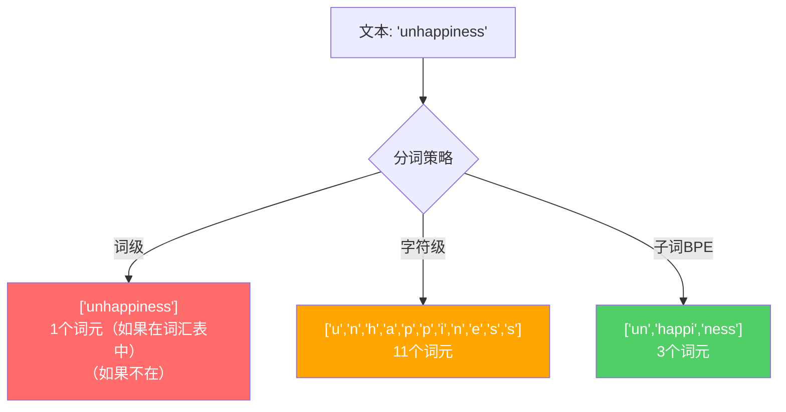
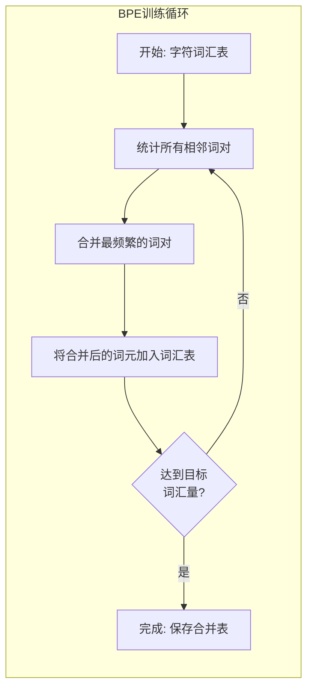
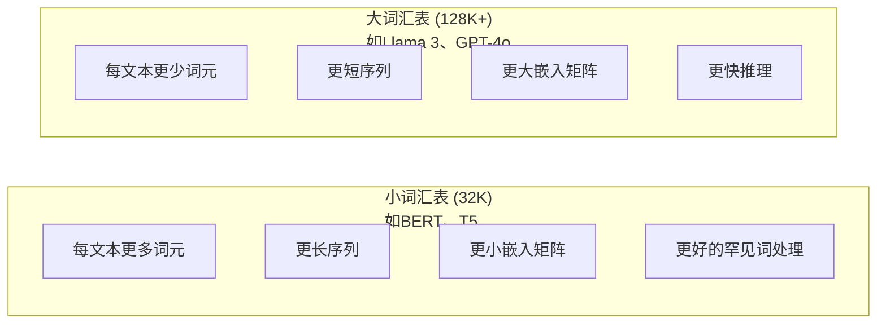

# 分词器：BPE、WordPiece、SentencePiece

> 你的大语言模型不阅读英文。它阅读的是整数。分词器决定了这些整数是承载意义还是被浪费。

**类型：** 构建
**语言：** Python
**前置要求：** 第05阶段（NLP基础）
**时间：** 约90分钟

## 学习目标

- 从零实现BPE、WordPiece和Unigram分词算法，并比较它们的合并策略
- 解释词汇量大小如何影响模型效率：太小会产生长序列，太大会浪费嵌入参数
- 分析不同语言和代码中的分词缺陷，识别特定分词器失效的位置
- 使用tiktoken和sentencepiece库对文本进行分词并检查生成的词元ID

## 问题背景

你的大语言模型不阅读英文。它不阅读任何语言。它阅读的是数字。

在"Hello, world!"和[15496, 11, 995, 0]之间的差距就是分词器。每个单词、每个空格、每个标点符号都必须转换为整数，模型才能处理它。这种转换并非中立。它将假设固化到模型中，之后无法撤销。

如果分词出错，你的模型会浪费容量用多个词元编码常见词汇。"unfortunately"变成了四个词元而不是一个。你128K的上下文窗口对于多音节词汇密集的文本来说缩小了75%。如果分词正确，同样的上下文窗口能容纳两倍的意义。"这个模型能很好地处理代码"和"这个模型在Python上会卡住"之间的区别往往取决于分词器的训练方式。

你对GPT-4或Claude的每次API调用都是按词元计价的。你的模型生成的每个词元都要消耗计算资源。表示输出所需的词元越少，端到端推理就越快。分词不是预处理。它是架构本身。

## 概念讲解

### 三种失败的方法（和一种成功的方法）

有三种明显的方法将文本转换为数字。其中两种在大规模下不起作用。

**词级分词**按空格和标点分割。"The cat sat"变成["The", "cat", "sat"]。简单。但"tokenization"呢？或者"GPT-4o"？或者德语复合词如"Geschwindigkeitsbegrenzung"？词级分词需要巨大的词汇量来覆盖每种语言的每个词汇。错过一个词，你就会得到可怕的`<unk>`词元——模型表示"我不知道这是什么"的方式。仅英语就有超过一百万种词形。加上代码、URL、科学记数法和100种其他语言，你需要无限的词汇量。

**字符级分词**走向另一个极端。"hello"变成["h", "e", "l", "l", "o"]。词汇量很小（几百个字符）。永远不会有未知词元。但序列变得极长。一个用10个词级词元表示的句子变成了50个字符级词元。模型必须学习"t"、"h"、"e"在一起表示"the"——在一个人类三岁就学会的事情上浪费注意力容量。

**子词分词**找到了最佳平衡点。常见词汇保持完整："the"是一个词元。罕见词汇分解为有意义的片段："unhappiness"变成["un", "happi", "ness"]。词汇量保持可控（3万到12.8万词元）。序列保持简短。未知词元基本消失，因为任何词汇都可以用子词片段构建。

每个现代大语言模型都使用子词分词。GPT-2、GPT-4、BERT、Llama 3、Claude——全部如此。问题是使用哪种算法。



### BPE：字节对编码

BPE是一种被重新用于分词的贪婪压缩算法。这个想法简单到可以写在一张索引卡上。

从单个字符开始。统计训练语料库中每对相邻词元。将最频繁的词对合并为一个新词元。重复直到达到目标词汇量。

以下是BPE在包含"lower"、"lowest"和"newest"的小型语料库上的运行过程：

```
语料库（带词频）:
  "lower"  x5
  "lowest" x2
  "newest" x6

第0步 -- 从字符开始:
  l o w e r       (x5)
  l o w e s t     (x2)
  n e w e s t     (x6)

第1步 -- 统计相邻词对:
  (e,s): 8    (s,t): 8    (l,o): 7    (o,w): 7
  (w,e): 13   (e,r): 5    (n,e): 6    ...

第2步 -- 合并最频繁的词对 (w,e) -> "we":
  l o we r        (x5)
  l o we s t      (x2)
  n e we s t      (x6)

第3步 -- 重新统计并合并 (e,s) -> "es":
  l o we r        (x5)
  l o we s t      (x2)    <- 'es'只从'e'+'s'形成，不是'we'+'s'
  n e we s t      (x6)    <- 等等，'we'前的'e'和'we'后的's'

精确跟踪：
  "we"合并后，剩余词对:
  (l,o): 7   (o,we): 7   (we,r): 5   (we,s): 8
  (s,t): 8   (n,e): 6    (e,we): 6

第3步 -- 合并 (we,s) -> "wes" 或 (s,t) -> "st"（并列8，选第一个）:
  合并 (we,s) -> "wes":
  l o we r        (x5)
  l o wes t       (x2)
  n e wes t       (x6)

第4步 -- 合并 (wes,t) -> "west":
  l o we r        (x5)
  l o west        (x2)
  n e west        (x6)

...继续直到达到目标词汇量。
```

合并表就是分词器。要编码新文本，按学习的顺序应用合并。训练语料库决定了哪些合并存在，这个选择永久塑造了模型看到的内容。



### 字节级BPE（GPT-2、GPT-3、GPT-4）

标准BPE在Unicode字符上操作。字节级BPE在原始字节（0-255）上操作。这给你256个基础词汇，能处理任何语言或编码，且不会产生未知词元。

GPT-2引入了这种方法。基础词汇覆盖每个可能的字节。BPE合并在此基础上构建。OpenAI的tiktoken库实现了字节级BPE，词汇量如下：

- GPT-2: 50,257词元
- GPT-3.5/GPT-4: ~100,256词元（cl100k_base编码）
- GPT-4o: 200,019词元（o200k_base编码）

### WordPiece（BERT）

WordPiece看起来与BPE相似，但选择合并的方式不同。它不是使用原始频率，而是最大化训练数据的似然：

```
BPE合并标准:      count(A, B)
WordPiece合并标准: count(AB) / (count(A) * count(B))
```

BPE问："哪个词对出现最频繁？"WordPiece问："哪个词对一起出现的频率比随机概率预期的更高？"这个细微差别产生了不同的词汇表。WordPiece青睐那些共现令人惊讶（而不仅仅是频繁）的合并。

WordPiece还为延续子词使用"##"前缀：

```
"unhappiness" -> ["un", "##happi", "##ness"]
"embedding"   -> ["em", "##bed", "##ding"]
```

"##"前缀告诉你这个片段延续前一个词元。BERT使用WordPiece，词汇量为30,522词元。每个BERT变体——DistilBERT、RoBERTa的分词器实际上是BPE，但BERT本身是WordPiece。

### SentencePiece（Llama、T5）

SentencePiece将输入视为原始Unicode字符流，包括空格。没有预分词步骤。没有关于词边界的语言特定规则。这使它真正与语言无关——适用于中文、日文、泰文等不以空格分隔词汇的语言。

SentencePiece支持两种算法：
- **BPE模式**：与标准BPE相同的合并逻辑，应用于原始字符序列
- **Unigram模式**：从大型词汇表开始，迭代删除对整体似然影响最小的词元。与BPE相反——剪枝而非合并。

Llama 2使用SentencePiece BPE，词汇量为32,000。T5使用SentencePiece Unigram，词汇量为32,000。注意：Llama 3改用基于tiktoken的字节级BPE分词器，词汇量为128,256。

### 词汇量大小的权衡

这是一个有实际后果的工程决策。



具体数字。对于128K词汇量和4,096维嵌入，仅嵌入矩阵就有128,000 x 4,096 = 5.24亿参数。对于32K词汇量，是1.31亿参数。仅分词器选择就有4亿参数的差异。

但更大的词汇表更积极地压缩文本。同样一个英文段落，用32K词汇量需要100词元，用128K词汇量可能只需要70词元。这意味着生成过程中前向传播次数减少30%。对于服务数百万请求的模型，这是计算成本的直接降低。

趋势很明显：词汇量在增长。GPT-2使用50,257。GPT-4使用~100K。Llama 3使用128K。GPT-4o使用200K。

| 模型 | 词汇量 | 分词器类型 | 每英文单词平均词元数 |
|------|--------|-----------|-------------------|
| BERT | 30,522 | WordPiece | ~1.4 |
| GPT-2 | 50,257 | 字节级BPE | ~1.3 |
| Llama 2 | 32,000 | SentencePiece BPE | ~1.4 |
| GPT-4 | ~100,256 | 字节级BPE | ~1.2 |
| Llama 3 | 128,256 | 字节级BPE (tiktoken) | ~1.1 |
| GPT-4o | 200,019 | 字节级BPE | ~1.0 |

### 多语言税

主要在英语上训练的分词器对其他语言很残酷。韩语在GPT-2的分词器中平均每词2-3个词元。中文可能更糟。这意味着韩国用户的有效上下文窗口只有英语用户的一半——支付相同价格却获得更少的信息密度。

这就是Llama 3将词汇量从32K增加到128K的原因。更多词元专门用于非英语脚本意味着跨语言的更公平压缩。

## 动手实践

### 第1步：字符级分词器

从基础开始。字符级分词器将每个字符映射到其Unicode码点。无需训练。没有未知词元。直接映射。

```python
class CharTokenizer:
    def encode(self, text):
        return [ord(c) for c in text]

    def decode(self, tokens):
        return "".join(chr(t) for t in tokens)
```

"hello"变成[104, 101, 108, 108, 111]。每个字符是一个词元。这是我们改进的基线。

### 第2步：从零实现BPE分词器

真正的实现。我们在原始字节上训练（像GPT-2），统计词对，合并最频繁的，按顺序记录每个合并。合并表就是分词器。

```python
from collections import Counter

class BPETokenizer:
    def __init__(self):
        self.merges = {}
        self.vocab = {}

    def _get_pairs(self, tokens):
        pairs = Counter()
        for i in range(len(tokens) - 1):
            pairs[(tokens[i], tokens[i + 1])] += 1
        return pairs

    def _merge_pair(self, tokens, pair, new_token):
        merged = []
        i = 0
        while i < len(tokens):
            if i < len(tokens) - 1 and tokens[i] == pair[0] and tokens[i + 1] == pair[1]:
                merged.append(new_token)
                i += 2
            else:
                merged.append(tokens[i])
                i += 1
        return merged

    def train(self, text, num_merges):
        tokens = list(text.encode("utf-8"))
        self.vocab = {i: bytes([i]) for i in range(256)}

        for i in range(num_merges):
            pairs = self._get_pairs(tokens)
            if not pairs:
                break
            best_pair = max(pairs, key=pairs.get)
            new_token = 256 + i
            tokens = self._merge_pair(tokens, best_pair, new_token)
            self.merges[best_pair] = new_token
            self.vocab[new_token] = self.vocab[best_pair[0]] + self.vocab[best_pair[1]]

        return self

    def encode(self, text):
        tokens = list(text.encode("utf-8"))
        for pair, new_token in self.merges.items():
            tokens = self._merge_pair(tokens, pair, new_token)
        return tokens

    def decode(self, tokens):
        byte_sequence = b"".join(self.vocab[t] for t in tokens)
        return byte_sequence.decode("utf-8", errors="replace")
```

训练循环是BPE的核心：统计词对，合并胜者，重复。每次合并减少总词元数。经过`num_merges`轮后，词汇量从256（基础字节）增长到256 + num_merges。

编码按学习的确切顺序应用合并。这很重要。如果合并1创建了"th"，合并5创建了"the"，编码必须先应用合并1，这样"the"才能在合并5中从"th" + "e"形成。

解码是逆过程：在词汇表中查找每个词元ID，连接字节，解码为UTF-8。

### 第3步：编解码往返测试

```python
corpus = (
    "The cat sat on the mat. The cat ate the rat. "
    "The dog sat on the log. The dog ate the frog. "
    "Natural language processing is the study of how computers "
    "understand and generate human language. "
    "Tokenization is the first step in any NLP pipeline."
)

tokenizer = BPETokenizer()
tokenizer.train(corpus, num_merges=40)

test_sentences = [
    "The cat sat on the mat.",
    "Natural language processing",
    "tokenization pipeline",
    "unhappiness",
]

for sentence in test_sentences:
    encoded = tokenizer.encode(sentence)
    decoded = tokenizer.decode(encoded)
    raw_bytes = len(sentence.encode("utf-8"))
    ratio = len(encoded) / raw_bytes
    print(f"'{sentence}'")
    print(f"  词元数: {len(encoded)}（来自{raw_bytes}字节）-- 比率: {ratio:.2f}")
    print(f"  往返: {'通过' if decoded == sentence else '失败'}")
```

压缩比率告诉你分词器的效率。0.50的比率意味着分词器将文本压缩到原始字节数一半的词元。越低越好。在训练语料库上，比率会很好。在分布外文本如"unhappiness"（不出现在语料库中）上，比率会更差——分词器对未见过的模式回退到字符级编码。

### 第4步：与tiktoken比较

```python
import tiktoken

enc = tiktoken.get_encoding("cl100k_base")

texts = [
    "The cat sat on the mat.",
    "unhappiness",
    "Hello, world!",
    "def fibonacci(n): return n if n < 2 else fibonacci(n-1) + fibonacci(n-2)",
    "Geschwindigkeitsbegrenzung",
]

for text in texts:
    our_tokens = tokenizer.encode(text)
    tiktoken_tokens = enc.encode(text)
    tiktoken_pieces = [enc.decode([t]) for t in tiktoken_tokens]
    print(f"'{text}'")
    print(f"  我们的BPE:   {len(our_tokens)}个词元")
    print(f"  tiktoken:  {len(tiktoken_tokens)}个词元 -> {tiktoken_pieces}")
```

tiktoken使用完全相同的算法，但在数百GB文本上训练，有100,000次合并。算法相同。区别是训练数据和合并次数。你的分词器在一个段落上训练40次合并，无法与tiktoken在巨大语料库上的100K次合并竞争。但机制相同。

### 第5步：词汇表分析

```python
def analyze_vocabulary(tokenizer, test_texts):
    total_tokens = 0
    total_chars = 0
    token_usage = Counter()

    for text in test_texts:
        encoded = tokenizer.encode(text)
        total_tokens += len(encoded)
        total_chars += len(text)
        for t in encoded:
            token_usage[t] += 1

    print(f"词汇表大小: {len(tokenizer.vocab)}")
    print(f"所有文本的词元总数: {total_tokens}")
    print(f"总字符数: {total_chars}")
    print(f"平均每字符词元数: {total_tokens / total_chars:.2f}")

    print(f"\n使用最多的词元:")
    for token_id, count in token_usage.most_common(10):
        token_bytes = tokenizer.vocab[token_id]
        display = token_bytes.decode("utf-8", errors="replace")
        print(f"  词元 {token_id:4d}: '{display}'（使用{count}次）")

    unused = [t for t in tokenizer.vocab if t not in token_usage]
    print(f"\n未使用的词元: {len(unused)} / {len(tokenizer.vocab)}")
```

这揭示了词汇表中的Zipf分布。少数词元占主导（空格、"the"、"e"）。大多数词元很少使用。生产分词器针对这种分布优化——常见模式获得短词元ID，罕见模式获得更长表示。

## 实际应用

你的BPE分词器可以工作了。现在看看生产工具是什么样子。

### tiktoken（OpenAI）

```python
import tiktoken

enc = tiktoken.get_encoding("cl100k_base")

text = "Tokenizers convert text to integers"
tokens = enc.encode(text)
print(f"词元: {tokens}")
print(f"片段: {[enc.decode([t]) for t in tokens]}")
print(f"往返: {enc.decode(tokens)}")
```

tiktoken用Rust编写，带有Python绑定。它每秒编码数百万词元。相同的BPE算法，工业化实现。

### Hugging Face分词器

```python
from tokenizers import Tokenizer
from tokenizers.models import BPE
from tokenizers.trainers import BpeTrainer
from tokenizers.pre_tokenizers import ByteLevel

tokenizer = Tokenizer(BPE())
tokenizer.pre_tokenizer = ByteLevel()

trainer = BpeTrainer(vocab_size=1000, special_tokens=["<pad>", "<eos>", "<unk>"])
tokenizer.train(["corpus.txt"], trainer)

output = tokenizer.encode("The cat sat on the mat.")
print(f"词元: {output.tokens}")
print(f"ID: {output.ids}")
```

Hugging Face分词器库底层也是Rust。它在几秒钟内训练GB级语料库的BPE。训练自己的模型时就用这个。

### 加载Llama的分词器

```python
from transformers import AutoTokenizer

tokenizer = AutoTokenizer.from_pretrained("meta-llama/Llama-3.1-8B")

text = "Tokenizers are the unsung heroes of LLMs"
tokens = tokenizer.encode(text)
print(f"词元ID: {tokens}")
print(f"词元: {tokenizer.convert_ids_to_tokens(tokens)}")
print(f"词汇表大小: {tokenizer.vocab_size}")

multilingual = ["Hello world", "Hola mundo", "Bonjour le monde"]
for text in multilingual:
    ids = tokenizer.encode(text)
    print(f"'{text}' -> {len(ids)}个词元")
```

Llama 3的128K词汇量比GPT-2的50K词汇量显著更好地压缩非英语文本。你可以自己验证——用多种语言编码同一个句子并计算词元数。

## 产出成果

本课产出`outputs/prompt-tokenizer-analyzer.md`——一个可复用的提示，分析任何文本和模型组合的分词效率。输入文本样本，它会告诉你哪个模型的分词器处理得最好。

## 练习题

1. 修改BPE分词器以在每个合并步骤打印词汇表。观察"t" + "h"如何变成"th"，然后"th" + "e"如何变成"the"。追踪常见英语词汇如何一点一点组装。

2. 向BPE分词器添加特殊词元（`<pad>`、`<eos>`、`<unk>`）。将它们分配ID 0、1、2，并相应移动其他所有词元。实现一个在运行BPE之前按空格分割的预分词步骤。

3. 实现WordPiece合并标准（似然比率而非频率）。在相同语料库上用相同合并次数训练BPE和WordPiece。比较结果词汇表——哪个产生更多语言学上有意义的子词？

4. 构建一个多语言分词器效率基准。取10个英语、西班牙语、中文、韩语和阿拉伯语句子。用tiktoken（cl100k_base）对每个进行分词，计算平均每字符词元数。量化每种语言的"多语言税"。

5. 在更大的语料库上训练你的BPE分词器（下载一篇维基百科文章）。调整合并次数以达到与tiktoken在相同文本上相差10%以内的压缩比率。这迫使你理解语料库大小、合并次数和压缩质量之间的关系。

## 关键术语

| 术语 | 人们怎么说 | 实际含义 |
|------|-----------|---------|
| 词元 (Token) | "一个词" | 模型词汇表中的单位——可以是字符、子词、词或多词块 |
| BPE | "某种压缩的东西" | 字节对编码——迭代合并最频繁的相邻词元对，直到达到目标词汇量 |
| WordPiece | "BERT的分词器" | 类似BPE，但合并最大化似然比率count(AB)/(count(A)*count(B))而非原始频率 |
| SentencePiece | "一个分词器库" | 语言无关的分词器，在原始Unicode上操作无需预分词，支持BPE和Unigram算法 |
| 词汇量大小 | "它认识多少词" | 唯一词元的总数：GPT-2有50,257，BERT有30,522，Llama 3有128,256 |
| 词元生成率 (Fertility) | "不是一个分词器术语" | 每词平均词元数——衡量跨语言分词效率（1.0是完美，3.0意味着模型工作三倍努力） |
| 字节级BPE | "GPT的分词器" | 在原始字节（0-255）而非Unicode字符上操作的BPE，保证任何输入都不会产生未知词元 |
| 合并表 | "分词器文件" | 训练期间学习的词对合并的有序列表——这就是分词器，顺序很重要 |
| 预分词 (Pre-tokenization) | "按空格分割" | 子词分词前应用的规则：空格分割、数字分离、标点处理 |
| 压缩比率 | "分词器效率如何" | 产生的词元除以输入字节——越低意味着更好的压缩和更快的推理 |

## 延伸阅读

- [Sennrich et al., 2016 -- "Neural Machine Translation of Rare Words with Subword Units"](https://arxiv.org/abs/1508.07909) —— 将BPE引入NLP的论文，将1994年的压缩算法变成现代分词的基础
- [Kudo & Richardson, 2018 -- "SentencePiece: A simple and language independent subword tokenizer"](https://arxiv.org/abs/1808.06226) —— 使多语言模型成为现实的语言无关分词
- [OpenAI tiktoken repository](https://github.com/openai/tiktoken) —— Rust实现的BPE生产版本，带有Python绑定，GPT-3.5/4/4o使用
- [Hugging Face Tokenizers documentation](https://huggingface.co/docs/tokenizers) —— 具有Rust性能的生产级分词器训练
