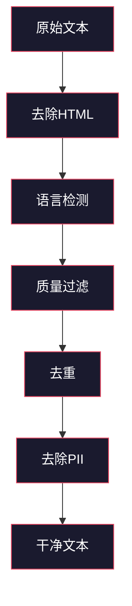
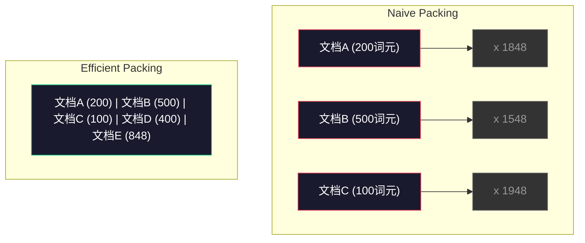

# 预训练的数据管道

> 模型是一面镜子。它反射你喂给它的任何数据。喂给它垃圾，它就以完美的流畅度反射垃圾。

**类型：** 构建
**语言：** Python
**前置要求：** 第10阶段，第01-02课（分词器、构建分词器）
**时间：** 约90分钟

## 学习目标

- 构建一个流式数据管道，对TB级文本进行分词、分块、打乱和批处理，而无需全部加载到内存中
- 实现真实预训练管道中使用的数据质量过滤器（去重、语言检测、内容过滤）
- 创建固定长度的训练序列，使用适当的注意力掩码和文档边界处理
- 分析管道吞吐量，确保数据加载器跟上GPU训练速度

## 问题背景

你有一个分词器。现在你需要数据。

不是一个数据集。不是一个CSV文件。TB级文本——清洗过、去重、过滤质量、分词成固定长度序列，并以足够快的速度提供随机批次，使你的8-GPU集群永远不必等待下一批次。

大多数人认为训练大语言模型是关于模型架构的。不是。Llama 3使用了15.6万亿词元。GPT-3使用了3000亿。DeepSeek-V2使用了8.1万亿。这三个的架构大致相同：堆叠的Transformer块，带有注意力和前馈层。输出质量的差异绝大部分来自数据。

DeepMind的Chinchilla论文明确了这一点。对于给定的计算预算，模型参数与训练词元的最优比率是固定的。Chinchilla表明，2022年大多数模型训练严重不足——它们的参数相对于看到的词元数量太多。一个在1.4万亿词元上训练的70B参数模型（Chinchilla最优）胜过一个在3000亿词元上训练的280B模型（Gopher）。

你的数据管道决定你的模型是学习语言还是学习噪音。

## 概念讲解

### 数据来源

每个大语言模型都在混合来源上训练。大多数实验室的确切组成是严格保密的，但我们知道的足以理解这些类别。

| 来源 | 大小 | 质量 | 使用者 |
|------|------|------|--------|
| Common Crawl | ~250 TB原始 | 低（需要大量过滤） | GPT-3, Llama, 大多数开源模型 |
| Wikipedia | ~20 GB | 高 | 每个主要大语言模型 |
| GitHub代码 | ~1 TB+ | 中（大量重复、死代码） | StarCoder, CodeLlama, DeepSeek-Coder |
| 书籍（BookCorpus, Pile） | ~100 GB | 高 | GPT-2, GPT-3, 早期模型 |
| 学术论文（arXiv, S2ORC） | ~100 GB | STEM领域高 | Llama, Galactica |
| StackOverflow, Reddit | ~100 GB | 中 | Llama, Falcon |
| 精选网络（C4, RefinedWeb） | ~5 TB | 中高（预过滤） | T5, Falcon |

Llama 3披露了它的数据混合：大约50%网络数据、25%代码、13%书籍和学术论文、8%数学数据、4%多语言网络数据。总量是来自超过5TB原始文本来源的15.6万亿词元。

比例和总量一样重要。网络数据太多，模型变成Reddit鹦鹉。代码太少，它不会编程。数学太少，它在推理上失败。把握好这个混合是最难的部分之一，没有公式——需要实验和评估。

### 数据清洗

原始网络数据是脏的。典型的Common Crawl转储包含：

- HTML标签和JavaScript
- 样板页眉、页脚、导航菜单
- 重复页面（完全和近似重复）
- 机器生成的垃圾信息
- 个人身份信息（PII）
- 低质量文本（关键词列表、SEO垃圾）
- 编码为文本的非文本内容

清洗不是可选的。这是产生连贯段落的模型和输出混合HTML标签与产品列表的模型之间的区别。



每一步都消除一类噪音：

**去除HTML：** 移除所有标记。只保留可见文本内容。像`trafilatura`或`readability`这样的库提取文章内容，同时丢弃导航、广告和样板内容。

**语言检测：** 使用fastText的语言识别模型（lid.176.bin）对每篇文档分类。过滤到你的目标语言。置信度低于0.8的英文分类文档可能不是干净的英文。

**质量过滤：** 这里变得有趣。RefinedWeb（Falcon背后的数据集）使用基于困惑度的过滤器：在Wikipedia上训练一个小语言模型，然后给每篇文档打分。高困惑度意味着文档不像Wikipedia——可能是垃圾信息、关键词列表或机器生成的内容。困惑度超过阈值的文档被移除。

**去重：** 单一最有影响力的清洗步骤。Common Crawl包含大量重复页面——法律免责声明、Cookie通知、服务条款。在重复内容上训练浪费计算资源，还可能导致模型逐字记忆和复述特定段落。

**PII去除：** 姓名、电子邮件地址、电话号码、社会安全号码。结构化PII的正则检测，上下文中姓名的NER模型。

### 使用MinHash去重

精确去重很容易：哈希每篇文档，移除重复。但近似重复才是真正的问题。两篇带有略微不同广告的相同新闻文章是近似重复。内容95%相同，但逐字节比较它们不同。

MinHash + 局部敏感哈希（LSH）高效解决这个问题。


思路：

1. **Shingling：** 将每篇文档转换为n-gram集合（例如，词或字符的5-gram）。"the quick brown fox"的3词shingle变成{"the quick brown", "quick brown fox"}。

2. **MinHash：** 对于每篇文档的shingle集合，计算k个哈希值。每个哈希值是所有shingle在不同哈希函数下的最小哈希。这创建一个固定大小的"签名"，近似任意两篇文档之间的Jaccard相似度。

3. **LSH：** 根据MinHash签名的带将文档分组到桶中。同一桶中的文档是候选近似重复。这避免比较每对——只比较候选。

4. **验证：** 对于每个候选对，计算精确Jaccard相似度。如果相似度超过阈值（通常为0.8），移除一个副本。

Llama团队报告通过去重移除了大约38%的网络数据。这不是小数字。超过三分之一的Common Crawl是重复或近似重复内容。

### 序列打包

你的模型期望固定长度的输入序列。你的文档长度可变。有些是50个词元。有些是50,000个词元。

朴素方法：将每篇文档填充到最大序列长度。这在填充词元上浪费大量计算，对学习没有贡献。

更好方法：将多篇文档打包进单个序列，用序列结束词元分隔。一个2048词元的序列可能包含三篇用`</s>`词元连接的短文档。



注意力掩码必须正确设置。文档A的词元不应该关注同一打包序列中文档B的词元。这需要块对角注意力掩码。

长文档在序列边界被截断或分割成分块。分割点很重要：在句子中间分割强制模型看到不完整的想法。一些管道在可能时将分割对齐到段落或句子边界。

### Chinchilla扩展定律

对于固定计算预算C（以FLOP衡量），最优模型大小N和数据集大小D遵循：

```
N_opt ~ C^0.5
D_opt ~ C^0.5
```

实际上，这意味着你应该大致同等地扩展模型大小和数据集大小。参数多10倍的模型需要大约多10倍的训练词元才能达到相同损失。

| 模型 | 参数 | 训练词元 | Chinchilla最优? |
|------|------|----------|---------------|
| GPT-3 | 175B | 300B | 否（训练不足3-4倍） |
| Chinchilla | 70B | 1.4T | 是（设计如此） |
| Llama 2 | 70B | 2T | 过度训练（有意） |
| Llama 3 | 70B | 15T | 严重过度训练 |

Llama 3故意违反Chinchilla定律。Meta发现，在更多数据上过度训练——远超计算最优比率——产生更好的推理模型。额外训练成本只付一次，但更小的模型永远更便宜地服务。这有时被称为"推理最优"扩展方法，自2024年以来已成为行业标准。

## 动手实践

### 第1步：文本清洗

去除HTML、归一化空格、移除非文本内容。我们将使用公共领域文本（Project Gutenberg）作为我们的小型语料库。

```python
import re

def clean_text(text):
    text = re.sub(r"<[^>]+>", "", text)
    text = re.sub(r"http\S+", "", text)
    text = re.sub(r"[^\x20-\x7E\n]", "", text)
    text = re.sub(r"\n{3,}", "\n\n", text)
    text = re.sub(r" {2,}", " ", text)
    return text.strip()

def quality_filter(text, min_words=50, max_ratio_caps=0.3, max_ratio_special=0.1):
    words = text.split()
    if len(words) < min_words:
        return False
    caps_ratio = sum(1 for w in words if w.isupper()) / len(words)
    if caps_ratio > max_ratio_caps:
        return False
    special_chars = sum(1 for c in text if not c.isalnum() and not c.isspace())
    if special_chars / max(len(text), 1) > max_ratio_special:
        return False
    return True
```

质量过滤器捕获SEO垃圾（全大写）、机器生成的噪音（高特殊字符比率）和存根页面（太短）。仅这三个检查就能从网络爬取中移除惊人的垃圾量。

### 第2步：MinHash去重

从零实现MinHash。不需要外部库——只用`hashlib`。

```python
import hashlib
from collections import defaultdict

def get_shingles(text, k=5):
    words = text.lower().split()
    if len(words) < k:
        return set()
    return {" ".join(words[i:i+k]) for i in range(len(words) - k + 1)}

def minhash_signature(shingles, num_hashes=128):
    signature = []
    for i in range(num_hashes):
        min_hash = float("inf")
        for shingle in shingles:
            h = int(hashlib.sha256(f"{i}:{shingle}".encode()).hexdigest(), 16)
            min_hash = min(min_hash, h)
        signature.append(min_hash)
    return signature

def lsh_buckets(signature, bands=16):
    rows_per_band = len(signature) // bands
    buckets = []
    for b in range(bands):
        start = b * rows_per_band
        band_data = tuple(signature[start:start + rows_per_band])
        bucket_hash = hashlib.md5(str(band_data).encode()).hexdigest()
        buckets.append((b, bucket_hash))
    return buckets

def deduplicate(documents, threshold=0.8, num_hashes=128, bands=16):
    signatures = []
    shingle_sets = []
    for doc in documents:
        shingles = get_shingles(doc)
        shingle_sets.append(shingles)
        signatures.append(minhash_signature(shingles, num_hashes))

    bucket_map = defaultdict(list)
    for doc_idx, sig in enumerate(signatures):
        for band_id, bucket_hash in lsh_buckets(sig, bands):
            bucket_map[(band_id, bucket_hash)].append(doc_idx)

    duplicate_pairs = set()
    for bucket_docs in bucket_map.values():
        if len(bucket_docs) < 2:
            continue
        for i in range(len(bucket_docs)):
            for j in range(i + 1, len(bucket_docs)):
                duplicate_pairs.add((bucket_docs[i], bucket_docs[j]))

    removed = set()
    for i, j in duplicate_pairs:
        if i in removed or j in removed:
            continue
        s1, s2 = shingle_sets[i], shingle_sets[j]
        if not s1 or not s2:
            continue
        jaccard = len(s1 & s2) / len(s1 | s2)
        if jaccard >= threshold:
            removed.add(j)

    return [doc for idx, doc in enumerate(documents) if idx not in removed], len(removed)
```

`num_hashes=128`和`bands=16`参数控制精度-召回权衡。更多哈希给出更准确的相似度估计。更多带增加召回（捕获更多重复），但代价是更多假阳性。这些值对典型网络文本有效。

### 第3步：分词和打包序列

获取清洗、去重后的文本，进行分词，打包成固定长度序列用于训练。

```python
def tokenize_corpus(documents, tokenizer):
    all_tokens = []
    for doc in documents:
        tokens = tokenizer.encode(doc)
        all_tokens.extend(tokens)
        all_tokens.append(tokenizer.eos_id)
    return all_tokens

def pack_sequences(token_ids, seq_length, pad_id=0):
    sequences = []
    attention_masks = []
    for i in range(0, len(token_ids), seq_length):
        seq = token_ids[i:i + seq_length]
        mask = [1] * len(seq)
        if len(seq) < seq_length:
            pad_count = seq_length - len(seq)
            seq = seq + [pad_id] * pad_count
            mask = mask + [0] * pad_count
        sequences.append(seq)
        attention_masks.append(mask)
    return sequences, attention_masks
```

### 第4步：训练用DataLoader

产出打包序列的随机批次。这是训练循环消费的内容。

```python
import random

class PreTrainingDataLoader:
    def __init__(self, sequences, attention_masks, batch_size, shuffle=True):
        self.sequences = sequences
        self.attention_masks = attention_masks
        self.batch_size = batch_size
        self.shuffle = shuffle

    def __len__(self):
        return (len(self.sequences) + self.batch_size - 1) // self.batch_size

    def __iter__(self):
        indices = list(range(len(self.sequences)))
        if self.shuffle:
            random.shuffle(indices)
        for start in range(0, len(indices), self.batch_size):
            batch_idx = indices[start:start + self.batch_size]
            batch_seqs = [self.sequences[i] for i in batch_idx]
            batch_masks = [self.attention_masks[i] for i in batch_idx]
            yield batch_seqs, batch_masks
```

### 第5步：数据集统计

计算重要的数字：总词元数、唯一词元数、压缩比率、文档长度分布。

```python
from collections import Counter

def compute_statistics(documents, token_ids, sequences, tokenizer_vocab_size):
    total_chars = sum(len(d) for d in documents)
    total_tokens = len(token_ids)
    unique_tokens = len(set(token_ids))
    compression_ratio = total_chars / total_tokens

    doc_lengths = [len(d.split()) for d in documents]
    avg_doc_length = sum(doc_lengths) / max(len(doc_lengths), 1)
    max_doc_length = max(doc_lengths) if doc_lengths else 0
    min_doc_length = min(doc_lengths) if doc_lengths else 0

    token_counts = Counter(token_ids)
    top_tokens = token_counts.most_common(10)

    non_pad_tokens = sum(sum(1 for t in seq if t != 0) for seq in sequences)
    total_positions = sum(len(seq) for seq in sequences)
    utilization = non_pad_tokens / max(total_positions, 1)

    stats = {
        "total_documents": len(documents),
        "total_characters": total_chars,
        "total_tokens": total_tokens,
        "unique_tokens": unique_tokens,
        "vocab_utilization": unique_tokens / tokenizer_vocab_size,
        "compression_ratio": compression_ratio,
        "avg_doc_length_words": avg_doc_length,
        "max_doc_length_words": max_doc_length,
        "min_doc_length_words": min_doc_length,
        "num_sequences": len(sequences),
        "sequence_utilization": utilization,
        "top_10_tokens": top_tokens,
    }
    return stats
```

压缩比率告诉你分词器在该语料库上的效率。英文文本通常压缩到每词元3-4个字符。如果你看到每词元1.5个字符，你的分词器分割太激进。如果你看到8+，它学习了非常特定领域的合并。

序列利用率告诉你打包序列中有多少是真实数据而非填充。低于90%意味着你的打包效率低下——你在填充词元上浪费计算。

## 实际应用

### 与HuggingFace数据集对比

通过HuggingFace的数据集库加载相同的语料库，比较管道速度。

```python
from datasets import load_dataset
from transformers import AutoTokenizer

ds = load_dataset("wikitext", "wikitext-2-raw-v1", split="train")
tokenizer = AutoTokenizer.from_pretrained("meta-llama/Meta-Llama-3-8B")

import time

start = time.time()
tokenized = ds.map(
    lambda x: tokenizer(x["text"], truncation=True, max_length=2048),
    batched=True,
    num_proc=4,
)
hf_time = time.time() - start
total_tokens = sum(len(t) for t in tokenized["input_ids"])
print(f"HuggingFace: {total_tokens:,}词元 in {hf_time:.2f}s ({total_tokens/hf_time:,.0f}词元/秒)")
```

HuggingFace管道底层使用Rust分词器，并跨4核并行处理。你的纯Python管道会慢10-50倍。这就是生产团队使用编译分词器的原因。算法相同。实现语言是区别。

## 产出成果

这节课产出一个用于验证和调试大语言模型训练管道中数据质量的提示。见`outputs/prompt-data-quality-checker.md`。

## 练习题

1. **简单：** 使用简单启发式（字符集分析）向清洗管道添加语言检测。只过滤英文文档并测量有多少文档被移除。
2. **中等：** 使用SHA-256哈希实现精确去重，与MinHash近似去重一起。在网页爬取语料库上比较每种方法捕获的重复数。
3. **困难：** 构建基于困惑度的质量过滤器。在Wikipedia文本上训练一个小二元语言模型，按困惑度给每篇文档打分，移除底部20%。比较在过滤与未过滤数据上训练时的模型输出质量。

## 关键术语

| 术语 | 人们怎么说 | 实际含义 |
|------|-----------|---------|
| Common Crawl | "互联网" | 一家每月爬取网络的非营利组织——~250TB原始数据，大多数大语言模型训练数据的起点 |
| MinHash | "某种哈希技巧" | 使用固定大小签名估计集合间Jaccard相似度的技术——支持大规模近似重复检测 |
| LSH | "局部敏感哈希" | 将相似项分组到同一桶的方法——将成对比较从O(n^2)减少到近线性 |
| 序列打包 | "连接文档" | 将多文档放入固定长度序列，使用适当注意力掩码——消除填充浪费 |
| Chinchilla扩展 | "用更多数据训练" | 对于固定计算预算，最优性能需要大致同等地扩展模型大小和训练词元 |
| 词元生成率 (Fertility) | "每词词元数" | 每词平均词元数——GPT-4英文为1.3，非拉丁文更高 |
| 数据混合 | "选择训练数据" | 代码vs文本vs数学vs多语言数据的比例——没有公式，需要实验 |
| 困惑度过滤器 | "质量打分" | 使用小语言模型给文档打分——高困惑度意味着文本不像干净的参考数据 |
| 去重 | "移除副本" | 消除完全和近似重复文档——通常移除30-40%原始网络数据 |
| 注意力掩码 | "关注哪些词元" | 阻止打包序列中文档边界注意力的二进制掩码 |

## 延伸阅读

- [Hoffmann et al., 2022 —— 训练计算最优大语言模型（Chinchilla）](https://arxiv.org/abs/2203.15556) —— 改变我们对数据规模思考的论文
- [Penedo et al., 2023 —— Falcon大语言模型的RefinedWeb数据集](https://arxiv.org/abs/2306.01116) —— 如何将Common Crawl过滤成高质量
- [Touvron et al., 2023 —— Llama 2：开放基础和微调对话模型](https://arxiv.org/abs/2307.09288) —— Llama 2的数据管道详情
- [Lee et al., 2022 —— 去重训练数据使语言模型更好](https://arxiv.org/abs/2107.06499) —— 为什么去重比你想的更重要
- [Broder, 1997 —— 关于文档的相似性和包含性](https://ieeexplore.ieee.org/document/666900) —— 原始MinHash论文
- [Meta, 2024 —— Llama 3技术报告](https://arxiv.org/abs/2407.21783) —— 15.6T词元、数据混合比率、过滤管道
