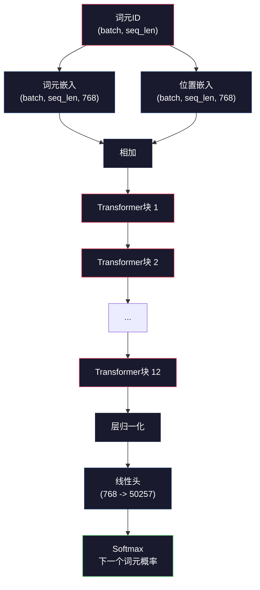
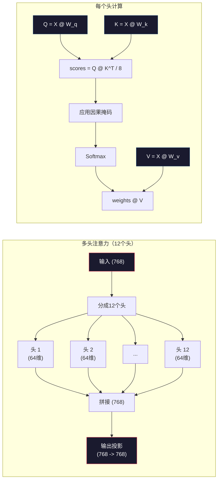
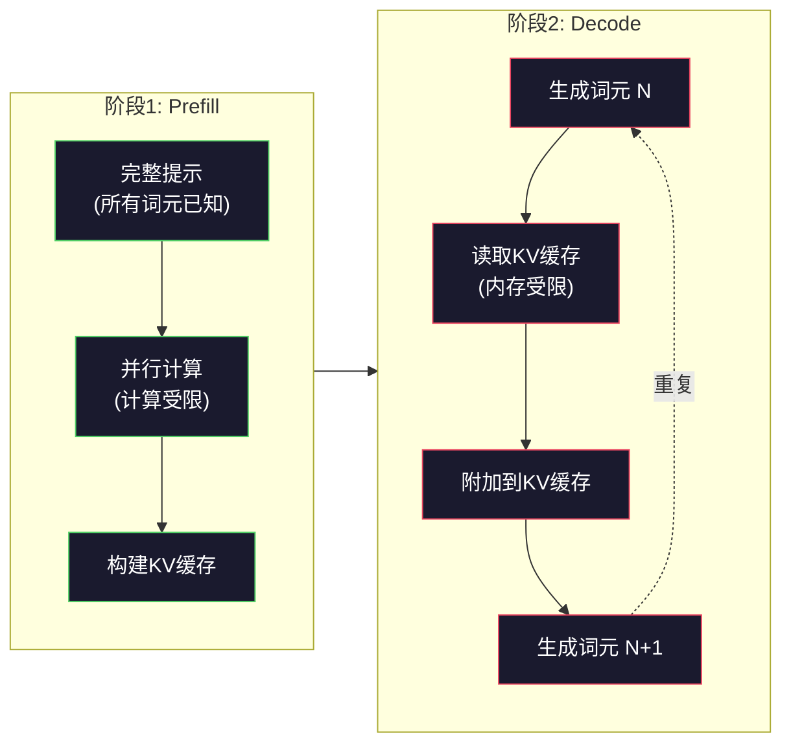

# 预训练一个Mini GPT（124M参数）

> GPT-2 Small有1.24亿参数。那是12个Transformer层、12个注意力头和768维嵌入。你可以在几个小时内用单个GPU从头训练它。大多数人从不这样做。他们使用预训练检查点。但如果你不自己训练一个，你实际上并不理解你在构建产品所使用的模型内部发生了什么。

**类型：** 构建
**语言：** Python（使用numpy）
**前置要求：** 第10阶段，第01-03课（分词器、构建分词器、数据管道）
**时间：** 约120分钟

## 学习目标

- 从零实现完整的GPT-2架构（124M参数）：词元嵌入、位置嵌入、Transformer块和语言模型头
- 在文本语料库上使用下一个词元预测和交叉熵损失训练GPT模型
- 实现自回归文本生成，使用温度采样和top-k/top-p过滤
- 监控训练损失曲线并验证模型学习连贯的语言模式

## 问题背景

你知道什么是Transformer。你读过图表。你可以背诵"attention is all you need"，在白板上画标有"Multi-Head Attention"的方框。

这些都不意味着你理解模型生成文本时发生了什么。

GPT-2 Small有124,438,272个参数（含权重绑定）。每一个参数都是通过运行训练循环设置的：前向传播、计算损失、反向传播、更新权重。12个Transformer块。每个块12个注意力头。768维嵌入空间。50,257个词元的词汇表。每次模型生成词元时，所有1.24亿参数都参与单次矩阵乘法链，该链将词元ID序列转换为下一个词元的概率分布。

如果你从未自己构建过这个，你就是在使用黑盒。你可以使用API。你可以微调。但当出错时——当模型产生幻觉、重复自己、拒绝遵循指令时——你对*为什么*没有心理模型。

这节课从头构建GPT-2 Small。不用PyTorch。用numpy。每次矩阵乘法都可见。每个梯度都由你的代码计算。你会看到1.24亿个数字如何合谋预测下一个词。

## 概念讲解

### GPT架构

GPT是自回归语言模型。"自回归"意味着它一次生成一个词元，每个词元以所有先前词元为条件。架构是Transformer解码器块的堆叠。

这是从词元ID到下一个词元概率的完整计算图：

1. 词元ID输入。形状：(batch_size, seq_len)。
2. 词元嵌入查找。每个ID映射到768维向量。形状：(batch_size, seq_len, 768)。
3. 位置嵌入查找。每个位置（0, 1, 2, ...）映射到768维向量。相同形状。
4. 词元嵌入 + 位置嵌入相加。
5. 通过12个Transformer块。
6. 最终层归一化。
7. 线性投影到词汇表大小。形状：(batch_size, seq_len, vocab_size)。
8. Softmax得到概率。

这就是整个模型。没有卷积。没有循环。只是嵌入、注意力、前馈网络和层归一化堆叠12次。



### Transformer块

12个块中的每一个都遵循相同模式。预归一化架构（GPT-2使用预归一化，不像原始Transformer使用后置归一化）：

1. 层归一化
2. 多头自注意力
3. 残差连接（加回输入）
4. 层归一化
5. 前馈网络（MLP）
6. 残差连接（加回输入）

残差连接至关重要。没有它们，梯度在反向传播时到达第1块之前就会消失。有了它们，梯度可以通过"跳过"路径直接从损失流向任何层。这就是为什么你可以堆叠12、32甚至96个块（GPT-4据传使用120个）。

### 注意力：核心机制

自注意力让每个词元查看每个先前的词元并决定关注每个词元的程度。这是数学。

对于每个词元位置，从输入计算三个向量：
- **查询（Q）**："我在找什么？"
- **键（K）**："我包含什么？"
- **值（V）**："我携带什么信息？"

```
Q = input @ W_q    (768 -> 768)
K = input @ W_k    (768 -> 768)
V = input @ W_v    (768 -> 768)

attention_scores = Q @ K^T / sqrt(d_k)
attention_scores = mask(attention_scores)   # 因果掩码：未来位置为-inf
attention_weights = softmax(attention_scores)
output = attention_weights @ V
```

因果掩码使GPT成为自回归。位置5可以关注位置0-5，但不能关注6、7、8等。这防止模型在训练时通过查看未来词元"作弊"。

**多头注意力**将768维空间分成12个头，每个64维。每个头学习不同的注意力模式。一个头可能跟踪句法关系（主谓一致）。另一个可能跟踪语义相似性（同义词）。另一个可能跟踪位置邻近性（附近的词）。所有12个头的输出被拼接并投影回768维。



除以sqrt(d_k)——sqrt(64) = 8——是缩放。没有它，高维向量的点积变大，将softmax推向梯度几乎为零的区域。这是原始"Attention Is All You Need"论文的关键见解之一。

### KV缓存：为什么推理快

训练期间，你一次性处理整个序列。推理期间，你一次生成一个词元。没有优化，生成词元N需要重新计算所有N-1个先前词元的注意力。这是每生成词元O(N^2)，或长度为N的序列总共O(N^3)。

KV缓存解决这个问题。计算每个词元的K和V后，存储它们。生成词元N+1时，你只需要为新词元计算Q，并查找所有先前词元的缓存K和V。这将每词元成本从O(N)降低到O(1)（K和V计算）。注意力分数计算仍是O(N)，因为你关注所有先前位置，但你避免了输入上的冗余矩阵乘法。

对于12层12头的GPT-2，KV缓存每个词元存储2 (K + V) x 12层 x 12头 x 64维 = 18,432个值。对于1024词元序列，大约是FP32的75MB。对于128层的Llama 3 405B，单个序列的KV缓存可以超过10GB。这就是长上下文推理受内存限制的原因。

### Prefill vs Decode：推理的两个阶段

当你向大语言模型发送提示时，推理发生在两个不同阶段。

**Prefill**并行处理你的整个提示。所有词元都已知，所以模型可以同时为所有位置计算注意力。这个阶段是计算受限的——GPU以全吞吐量进行矩阵乘法。对于A100上的1000词元提示，prefill大约需要20-50毫秒。

**Decode**一次生成一个词元。每个新词元依赖于所有先前词元。这个阶段是内存受限的——瓶颈是从GPU内存读取模型权重和KV缓存，而不是矩阵数学本身。GPU的计算核心大部分空闲，等待内存读取。对于GPT-2，每个解码步骤花费的时间相同，无论矩阵乘法需要多少FLOP，因为内存带宽是限制因素。

这种区别对生产系统很重要。Prefill吞吐量随GPU计算扩展（更多FLOPS = 更快prefill）。Decode吞吐量随内存带宽扩展（更快内存 = 更快解码）。这就是NVIDIA的H100在A100基础上专注于内存带宽改进的原因——它直接加速词元生成。



### 训练循环

训练大语言模型是下一个词元预测。给定词元[0, 1, 2, ..., N-1]，预测词元[1, 2, 3, ..., N]。损失函数是模型预测概率分布与实际下一个词元之间的交叉熵。

一个训练步骤：

1. **前向传播**：运行批次通过所有12个块。获取每个位置的logits（softmax前分数）。
2. **计算损失**：logits与目标词元（输入向后移动一个位置）之间的交叉熵。
3. **反向传播**：使用反向传播计算所有124M参数的梯度。
4. **优化器步骤**：更新权重。GPT-2使用Adam，带有学习率预热和余弦衰减。

学习率调度比你想象的更重要。GPT-2在前2,000步从0预热到峰值学习率，然后遵循余弦曲线衰减。以高学习率开始会导致模型发散。保持恒定高率会导致训练后期的振荡。预热-然后-衰减模式被每个主要大语言模型使用。

### GPT-2 Small：数字

| 组件 | 形状 | 参数 |
|-----------|-------|------------|
| 词元嵌入 | (50257, 768) | 38,597,376 |
| 位置嵌入 | (1024, 768) | 786,432 |
| 每块注意力（W_q, W_k, W_v, W_out） | 4 x (768, 768) | 2,359,296 |
| 每块前馈（up + down） | (768, 3072) + (3072, 768) | 4,718,592 |
| 每块层归一化（2x） | 2 x 768 x 2 | 3,072 |
| 最终层归一化 | 768 x 2 | 1,536 |
| **每块总计** | | **7,080,960** |
| **总计（12块）** | | **85,054,464 + 39,383,808 = 124,438,272** |

输出投影（logits头）与词元嵌入矩阵共享权重。这称为权重绑定——它减少3800万参数并通过强制模型为输入和输出使用相同的表示空间来提高性能。

## 动手实践

### 第1步：嵌入层

词元嵌入将50,257个可能的词元映射到768维向量。位置嵌入添加关于每个词元在序列中位置的信息。两者相加。

```python
import numpy as np

class Embedding:
    def __init__(self, vocab_size, embed_dim, max_seq_len):
        self.token_embed = np.random.randn(vocab_size, embed_dim) * 0.02
        self.pos_embed = np.random.randn(max_seq_len, embed_dim) * 0.02

    def forward(self, token_ids):
        seq_len = token_ids.shape[-1]
        tok_emb = self.token_embed[token_ids]
        pos_emb = self.pos_embed[:seq_len]
        return tok_emb + pos_emb
```

0.02的标准差来自GPT-2论文。太大，初始前向传播产生极端值，破坏训练稳定性。太小，所有输入的初始输出几乎相同，使早期梯度信号无用。

### 第2步：带因果掩码的自注意力

先做单头注意力。因果掩码在softmax前将未来位置设为负无穷，确保每个位置只能关注自己和更早的位置。

```python
def attention(Q, K, V, mask=None):
    d_k = Q.shape[-1]
    scores = Q @ K.transpose(0, -1, -2 if Q.ndim == 4 else 1) / np.sqrt(d_k)
    if mask is not None:
        scores = scores + mask
    weights = np.exp(scores - scores.max(axis=-1, keepdims=True))
    weights = weights / weights.sum(axis=-1, keepdims=True)
    return weights @ V
```

softmax实现在指数化前减去最大值。没有这一步，exp(large_number)会溢出为无穷大。这是一个数值稳定性技巧，不改变输出，因为softmax(x - c) = softmax(x)对于任何常数c。

### 第3步：多头注意力

将768维输入分成12个头，每个64维。每个头独立计算注意力。拼接结果并投影回768维。

```python
class MultiHeadAttention:
    def __init__(self, embed_dim, num_heads):
        self.num_heads = num_heads
        self.head_dim = embed_dim // num_heads
        self.W_q = np.random.randn(embed_dim, embed_dim) * 0.02
        self.W_k = np.random.randn(embed_dim, embed_dim) * 0.02
        self.W_v = np.random.randn(embed_dim, embed_dim) * 0.02
        self.W_out = np.random.randn(embed_dim, embed_dim) * 0.02

    def forward(self, x, mask=None):
        batch, seq_len, d = x.shape
        Q = (x @ self.W_q).reshape(batch, seq_len, self.num_heads, self.head_dim).transpose(0, 2, 1, 3)
        K = (x @ self.W_k).reshape(batch, seq_len, self.num_heads, self.head_dim).transpose(0, 2, 1, 3)
        V = (x @ self.W_v).reshape(batch, seq_len, self.num_heads, self.head_dim).transpose(0, 2, 1, 3)

        scores = Q @ K.transpose(0, 1, 3, 2) / np.sqrt(self.head_dim)
        if mask is not None:
            scores = scores + mask
        weights = np.exp(scores - scores.max(axis=-1, keepdims=True))
        weights = weights / weights.sum(axis=-1, keepdims=True)
        attn_out = weights @ V

        attn_out = attn_out.transpose(0, 2, 1, 3).reshape(batch, seq_len, d)
        return attn_out @ self.W_out
```

reshape-transpose-reshape操作是多头注意力中最令人困惑的部分。这是发生的事情：(batch, seq_len, 768)张量变成(batch, seq_len, 12, 64)，然后(batch, 12, seq_len, 64)。现在12个头中的每一个都有自己的(seq_len, 64)矩阵来运行注意力。注意力之后，我们逆转过程：(batch, 12, seq_len, 64)变成(batch, seq_len, 12, 64)变成(batch, seq_len, 768)。

### 第4步：Transformer块

一个完整的Transformer块：层归一化、带残差的多头注意力、层归一化、带残差的前馈。

```python
class LayerNorm:
    def __init__(self, dim, eps=1e-5):
        self.gamma = np.ones(dim)
        self.beta = np.zeros(dim)
        self.eps = eps

    def forward(self, x):
        mean = x.mean(axis=-1, keepdims=True)
        var = x.var(axis=-1, keepdims=True)
        return self.gamma * (x - mean) / np.sqrt(var + self.eps) + self.beta


class FeedForward:
    def __init__(self, embed_dim, ff_dim):
        self.W1 = np.random.randn(embed_dim, ff_dim) * 0.02
        self.b1 = np.zeros(ff_dim)
        self.W2 = np.random.randn(ff_dim, embed_dim) * 0.02
        self.b2 = np.zeros(embed_dim)

    def forward(self, x):
        h = x @ self.W1 + self.b1
        h = np.maximum(0, h)  # GELU近似：为简单用ReLU
        return h @ self.W2 + self.b2


class TransformerBlock:
    def __init__(self, embed_dim, num_heads, ff_dim):
        self.ln1 = LayerNorm(embed_dim)
        self.attn = MultiHeadAttention(embed_dim, num_heads)
        self.ln2 = LayerNorm(embed_dim)
        self.ffn = FeedForward(embed_dim, ff_dim)

    def forward(self, x, mask=None):
        x = x + self.attn.forward(self.ln1.forward(x), mask)
        x = x + self.ffn.forward(self.ln2.forward(x))
        return x
```

前馈网络将768维输入扩展到3,072维（4倍），应用非线性，然后投影回768。这种扩展-收缩模式让模型在每个位置使用"更宽"的内部表示。GPT-2使用GELU激活，但我们这里用ReLU简单处理——差异对理解架构影响不大。

### 第5步：完整GPT模型

堆叠12个Transformer块。在前端添加嵌入层，后端添加输出投影。

```python
class MiniGPT:
    def __init__(self, vocab_size=50257, embed_dim=768, num_heads=12,
                 num_layers=12, max_seq_len=1024, ff_dim=3072):
        self.embedding = Embedding(vocab_size, embed_dim, max_seq_len)
        self.blocks = [
            TransformerBlock(embed_dim, num_heads, ff_dim)
            for _ in range(num_layers)
        ]
        self.ln_f = LayerNorm(embed_dim)
        self.vocab_size = vocab_size
        self.embed_dim = embed_dim

    def forward(self, token_ids):
        seq_len = token_ids.shape[-1]
        mask = np.triu(np.full((seq_len, seq_len), -1e9), k=1)

        x = self.embedding.forward(token_ids)
        for block in self.blocks:
            x = block.forward(x, mask)
        x = self.ln_f.forward(x)

        logits = x @ self.embedding.token_embed.T
        return logits

    def count_parameters(self):
        total = 0
        total += self.embedding.token_embed.size
        total += self.embedding.pos_embed.size
        for block in self.blocks:
            total += block.attn.W_q.size + block.attn.W_k.size
            total += block.attn.W_v.size + block.attn.W_out.size
            total += block.ffn.W1.size + block.ffn.b1.size
            total += block.ffn.W2.size + block.ffn.b2.size
            total += block.ln1.gamma.size + block.ln1.beta.size
            total += block.ln2.gamma.size + block.ln2.beta.size
        total += self.ln_f.gamma.size + self.ln_f.beta.size
        return total
```

注意权重绑定：`logits = x @ self.embedding.token_embed.T`。输出投影重用词元嵌入矩阵（转置）。这不只是节省参数的技巧。这意味着模型为理解词元（嵌入）和预测词元（输出）使用相同的向量空间。

### 第6步：训练循环

对于124M参数的真实训练运行，你需要GPU和PyTorch。这个训练循环演示了纯numpy的小型模型上的机制。我们使用小模型（4层、4头、128维）使其可处理。

```python
def cross_entropy_loss(logits, targets):
    batch, seq_len, vocab_size = logits.shape
    logits_flat = logits.reshape(-1, vocab_size)
    targets_flat = targets.reshape(-1)

    max_logits = logits_flat.max(axis=-1, keepdims=True)
    log_softmax = logits_flat - max_logits - np.log(
        np.exp(logits_flat - max_logits).sum(axis=-1, keepdims=True)
    )

    loss = -log_softmax[np.arange(len(targets_flat)), targets_flat].mean()
    return loss


def train_mini_gpt(text, vocab_size=256, embed_dim=128, num_heads=4,
                   num_layers=4, seq_len=64, num_steps=200, lr=3e-4):
    tokens = np.array(list(text.encode("utf-8")[:2048]))
    model = MiniGPT(
        vocab_size=vocab_size, embed_dim=embed_dim, num_heads=num_heads,
        num_layers=num_layers, max_seq_len=seq_len, ff_dim=embed_dim * 4
    )

    print(f"模型参数: {model.count_parameters():,}")
    print(f"训练词元: {len(tokens):,}")
    print(f"配置: {num_layers}层, {num_heads}头, {embed_dim}维")
    print()

    for step in range(num_steps):
        start_idx = np.random.randint(0, max(1, len(tokens) - seq_len - 1))
        batch_tokens = tokens[start_idx:start_idx + seq_len + 1]

        input_ids = batch_tokens[:-1].reshape(1, -1)
        target_ids = batch_tokens[1:].reshape(1, -1)

        logits = model.forward(input_ids)
        loss = cross_entropy_loss(logits, target_ids)

        if step % 20 == 0:
            print(f"步骤 {step:4d} | 损失: {loss:.4f}")

    return model
```

损失从ln(vocab_size)附近开始——对于256词元的字节级词汇表，那是ln(256) = 5.55。随机模型为每个词元分配相等概率。随着训练进行，损失下降，因为模型学习预测常见模式："t"后是"h"，句号后是空格，等等。

在生产中，你会使用Adam优化器、梯度累积、学习率预热和梯度裁剪。前向-损失-反向-更新循环相同。优化器更复杂。

### 第7步：文本生成

生成使用训练好的模型一次预测一个词元。每个预测从输出分布中采样（或作为argmax贪婪选择）。

```python
def generate(model, prompt_tokens, max_new_tokens=100, temperature=0.8):
    tokens = list(prompt_tokens)
    seq_len = model.embedding.pos_embed.shape[0]

    for _ in range(max_new_tokens):
        context = np.array(tokens[-seq_len:]).reshape(1, -1)
        logits = model.forward(context)
        next_logits = logits[0, -1, :]

        next_logits = next_logits / temperature
        probs = np.exp(next_logits - next_logits.max())
        probs = probs / probs.sum()

        next_token = np.random.choice(len(probs), p=probs)
        tokens.append(next_token)

    return tokens
```

温度控制随机性。温度1.0使用原始分布。温度0.5锐化它（更确定性——模型更频繁选择其首选）。温度1.5展平它（更随机——低概率词元获得更大机会）。温度0.0是贪婪解码（总是选择最高概率词元）。

`tokens[-seq_len:]`窗口是必需的，因为模型有最大上下文长度（GPT-2是1024）。一旦超过，你必须丢弃最旧的词元。这就是大家都在说的"上下文窗口"。

## 实际应用

### 完整训练和生成演示

```python
corpus = """The transformer architecture has revolutionized natural language processing.
Attention mechanisms allow the model to focus on relevant parts of the input.
Self-attention computes relationships between all pairs of positions in a sequence.
Multi-head attention splits the representation into multiple subspaces.
Each attention head can learn different types of relationships.
The feedforward network provides nonlinear transformations at each position.
Residual connections enable gradient flow through deep networks.
Layer normalization stabilizes training by normalizing activations.
Position embeddings give the model information about token ordering.
The causal mask ensures autoregressive generation during training.
Pre-training on large text corpora teaches the model general language understanding.
Fine-tuning adapts the pre-trained model to specific downstream tasks."""

model = train_mini_gpt(corpus, num_steps=200)

prompt = list("The transformer".encode("utf-8"))
output_tokens = generate(model, prompt, max_new_tokens=100, temperature=0.8)
generated_text = bytes(output_tokens).decode("utf-8", errors="replace")
print(f"\n生成: {generated_text}")
```

在小语料库和小模型上，生成文本充其量是半连贯的。它会从训练文本中学习一些字节级模式，但无法像GPT-2用40GB训练数据和完整124M参数架构那样泛化。重点不是输出质量。重点是你能追踪每一步：嵌入查找、注意力计算、前馈变换、logit投影、softmax和采样。每个操作都可见。

## 产出成果

这节课产出`outputs/prompt-gpt-architecture-analyzer.md`——一个分析任何GPT风格模型中架构选择的提示。输入模型卡或技术报告，它会分解参数分配、注意力设计和扩展决策。

## 练习题

1. 将模型修改为使用24层和16头而不是12/12。计算参数。将深度加倍与宽度加倍（嵌入维度）相比如何？

2. 实现GELU激活函数（GELU(x) = x * 0.5 * (1 + erf(x / sqrt(2))))并替换前馈网络中的ReLU。用每个激活运行500步训练并比较最终损失。

3. 向生成函数添加KV缓存。在第一次前向传播后存储每层的K和V张量，并在后续词元中重用它们。测量加速：用和不用缓存生成200个词元并比较实际时间。

4. 实现top-k采样（只考虑k个最高概率词元）和top-p采样（核采样：考虑累积概率超过p的最小词元集合）。在温度0.8下比较top-k=50与top-p=0.95的输出质量。

5. 构建训练损失曲线绘图器。训练模型1000步并绘制损失vs步骤。识别三个阶段：快速初始下降（学习常见字节）、较慢中期（学习字节模式）、平台期（在小语料库上过拟合）。这个曲线的形状无论你训练128维模型还是GPT-4都相同。

## 关键术语

| 术语 | 人们怎么说 | 实际含义 |
|------|-----------|---------|
| 自回归 | "它一次生成一个词" | 每个输出词元以所有先前词元为条件——模型预测P(token_n \| token_0, ..., token_{n-1}) |
| 因果掩码 | "它看不到未来" | 上三角矩阵的负无穷值，在训练期间阻止对未来位置的注意力 |
| 多头注意力 | "多种注意力模式" | 将Q, K, V拆分为并行头（例如GPT-2的12个头各64维），使每个头可以学习不同类型的关系 |
| KV缓存 | "速度缓存" | 存储先前词元计算的键和值张量，避免自回归生成期间的冗余计算 |
| Prefill | "处理提示" | 第一个推理阶段，所有提示词元并行处理——受GPU FLOPS计算限制 |
| Decode | "生成词元" | 第二个推理阶段，词元逐个生成——受GPU内存带宽限制 |
| 权重绑定 | "共享嵌入" | 对输入词元嵌入和输出投影头使用相同矩阵——在GPT-2中节省3800万参数 |
| 残差连接 | "跳跃连接" | 直接将输入加到子层输出（x + sublayer(x)）——在深度网络中实现梯度流动 |
| 层归一化 | "归一化激活" | 在特征维度上归一化为均值0和方差1，带有可学习的缩放和偏置参数 |
| 交叉熵损失 | "预测的错误程度" | -log(分配给正确下一个词元的概率)，在所有位置上平均——标准大语言模型训练目标 |

## 延伸阅读

- [Radford et al., 2019 —— "Language Models are Unsupervised Multitask Learners" (GPT-2)](https://cdn.openai.com/better-language-models/language_models_are_unsupervised_multitask_learners.pdf) —— 引入124M到1.5B参数族的GPT-2论文
- [Vaswani et al., 2017 —— "Attention Is All You Need"](https://arxiv.org/abs/1706.03762) —— 原始Transformer论文，带有缩放点积注意力和多头注意力
- [Llama 3技术报告](https://arxiv.org/abs/2407.21783) —— Meta如何用16K GPU将GPT架构扩展到405B参数
- [Pope et al., 2022 —— "Efficiently Scaling Transformer Inference"](https://arxiv.org/abs/2211.05102) —— 形式化prefill vs decode和KV缓存分析的论文
