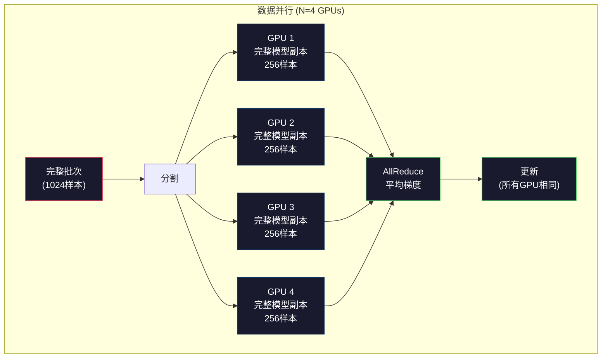
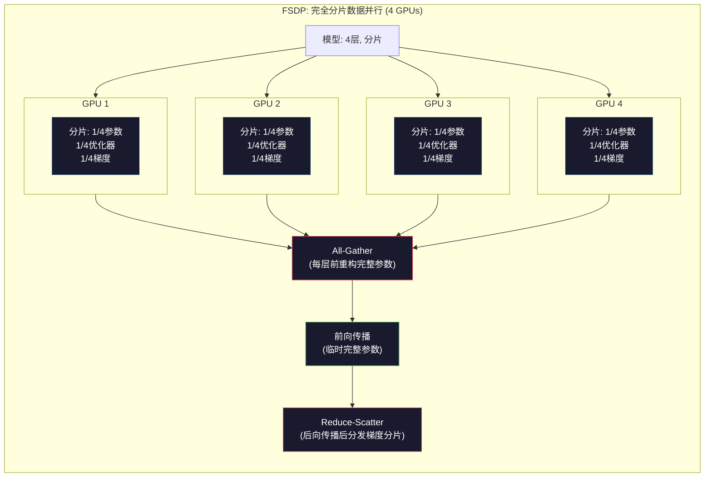
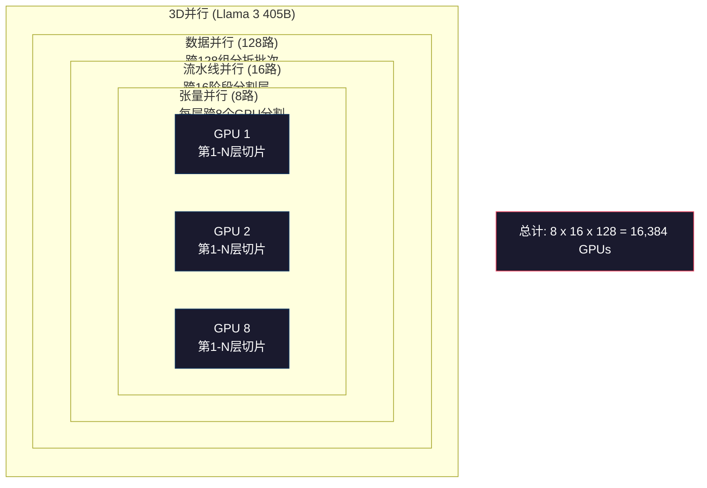

# 扩展：分布式训练、FSDP、DeepSpeed

> 你的124M模型在单个GPU上训练。现在试试70亿参数。模型无法装入内存。数据在单机上需要数周。分布式训练在大规模下不是可选的。它是唯一的前进道路。

**类型：** 构建
**语言：** Python
**前置要求：** 第10阶段，第04课（预训练Mini GPT）
**时间：** 约120分钟

## 学习目标

- 解释三种并行类型（数据、张量、流水线）以及根据模型和集群大小每种何时必要
- 使用PyTorch DDP实现数据并行训练，跨多个GPU进行梯度同步
- 计算给定模型大小的内存预算（权重 + 优化器状态 + 梯度 + 激活），以确定最小硬件需求
- 配置FSDP或DeepSpeed ZeRO阶段，跨GPU分片模型状态，以装入超过单GPU内存的模型

## 问题背景

FP16格式的70亿参数模型仅权重就需要14GB。Adam优化器存储每个参数的两个额外副本（一阶和二阶矩估计）。这又是28GB。反向传播期间的梯度增加14GB。在存储单个激活之前，你已经有56GB了。

NVIDIA A100有80GB内存。

56GB占用80GB。这剩下24GB用于激活——前向传播期间计算的中间值，必须在反向传播期间保持活动状态。对于2048词元序列和4096维模型，单层激活使用约64MB。32层你需要每样本2GB。批次大小8需要16GB。你有24GB。批次大小12会爆炸。

现在试试700亿参数。仅权重：FP16格式140GB。无法装入一个GPU。你至少需要2个A100（2 x 80GB = 160GB）才能容纳权重。添加优化器状态和梯度，你需要更多：至少3个GPU，实际上8-16个取决于分片策略。

Llama 3 405B在16,384个NVIDIA H100 GPU上训练。训练运行估计消耗1亿美元计算成本。DeepSeek V3通过架构（混合专家意味着每词元只激活一小部分参数）和训练效率，以约560万美元训练了一个可比较的模型。

这节课涵盖使大规模训练成为可能的四种策略：数据并行、张量并行、流水线并行和完全分片数据并行。你将在纯Python中模拟每一种，以在接触分布式训练框架之前理解机制。

## 概念讲解

### 为什么需要分布式

这是真实模型的内存计算。每个数字都是计算出来的，不是估计的。

| 模型 | 参数 | 权重(FP16) | Adam状态 | 梯度(FP16) | 总计(无激活) |
|-------|--------|----------------|-------------|------------------|----------------------|
| GPT-2 Small | 124M | 248 MB | 992 MB | 248 MB | 1.5 GB |
| Llama 3 8B | 8B | 16 GB | 64 GB | 16 GB | 96 GB |
| Llama 3 70B | 70B | 140 GB | 560 GB | 140 GB | 840 GB |
| Llama 3 405B | 405B | 810 GB | 3,240 GB | 810 GB | 4,860 GB |

"Adam状态"列是致命的。Adam为每个参数存储运行均值（m）和运行方差（v），都是FP32。对于70B模型，那是70B x 4字节 x 2 = 560GB。仅优化器就需要七个A100。

单个H100有80GB。Llama 3 405B至少需要61个H100来容纳权重、优化器和梯度。添加激活，数字进一步增长。Meta使用16,384个GPU不是因为他们想——而是因为他们必须。

### 数据并行

最简单的分布式策略。将整个模型复制到N个GPU。将每个训练批次分成N等份。每个GPU在其数据分片上运行前向和后向传播。后向传播后，跨所有GPU平均梯度。每个GPU用相同的平均梯度更新其权重副本，保持所有副本同步。

**优点：** 线性吞吐量扩展。N个GPU每步处理N倍数据。通信仅限于梯度平均，可与计算重叠。

**缺点：** 每个GPU持有完整的模型、优化器状态和梯度副本。对于70B模型，每个GPU需要840GB。数据并行不会减少每GPU内存。它只减少训练时间。

**计算：** 有效批次大小 = per_gpu_batch_size x N。对于N=64个GPU，每GPU批次为16，有效批次是1,024。Llama 3每步使用1600万词元的有效批次大小。



### 张量并行

跨GPU分割单个层。单次矩阵乘法在GPU间分割，每个计算结果的一部分。

考虑前馈层中形状为(8192, 8192)的权重矩阵。使用4路张量并行，每个GPU持有(8192, 2048)分片。每个GPU将其输入与分片相乘，产生部分结果。部分结果被组合（通过all-reduce或all-gather）以产生完整输出。

**优点：** 减少模型权重的每GPU内存。跨8个GPU分割的70B模型意味着每个GPU持有约8.75B参数的权重。

**缺点：** 每层后都需要快速的GPU间通信。matmul后的all-reduce增加延迟。这在NVLink上运行良好（同一节点上GPU间900 GB/s），但在InfiniBand连接的节点间表现不佳（400 Gb/s，约50 GB/s）。张量并行几乎总是限于单个节点（8个GPU）。

**实际使用：** Megatron-LM开创了张量并行。Llama 3 405B在每个节点内使用8路张量并行。

### 流水线并行

按层分割模型。GPU 1运行第1-8层。GPU 2运行第9-16层。GPU 3运行第17-24层。GPU 4运行第25-32层。数据流经流水线：GPU 1计算其层并将激活发送到GPU 2，后者计算其层并发送到GPU 3，依此类推。

**优点：** GPU间通信最小——只有层边界的激活，与梯度或权重相比很小。跨节点工作，因为带宽要求低。

**缺点：** 流水线气泡。当GPU 4在微批次1上计算前向传播时，GPU 1、2、3空闲（它们已经转发了自己的部分）。后向传播期间，模式反转。使用朴素流水线，GPU利用率只有1/N，N为流水线阶段数。

**GPipe和PipeDream**通过将批次分成微批次解决气泡问题。GPU 1完成微批次1的转发后立即开始微批次2。这在流水线阶段间重叠计算。有M个微批次和N个阶段，气泡比例降至(N-1)/M。使用M=16微批次和N=4阶段，气泡为3/16 = 18.75%的空闲时间。

### FSDP：完全分片数据并行

FSDP将数据并行的可扩展性与分片的内存效率相结合。每个GPU不是持有模型的完整副本，而是只持有1/N的参数、梯度和优化器状态。

在层的前向传播之前，FSDP运行**all-gather**，将所有GPU的完整参数收集到每个GPU的内存中。前向传播后，每个GPU丢弃非本地参数。后向传播期间，all-gather再次运行以重建梯度计算的参数。后向传播后，**reduce-scatter**分发梯度分片，使每个GPU只存储1/N的梯度。

**8个GPU上70B模型的计算：**

| 组件 | 无FSDP | 有FSDP |
|-----------|-------------|-----------|
| 权重(FP16) | 每GPU 140 GB | 每GPU 17.5 GB |
| Adam状态(FP32) | 每GPU 560 GB | 每GPU 70 GB |
| 梯度(FP16) | 每GPU 140 GB | 每GPU 17.5 GB |
| **总计** | **每GPU 840 GB** | **每GPU 105 GB** |

没有FSDP，你无法在单个80GB GPU上装入70B模型。使用8个GPU的FSDP，每个GPU使用105GB——等等，仍然装不下。你至少需要16个GPU才能降到80GB以下，或者你将FSDP与激活检查点结合（在反向传播期间重新计算激活而不是存储它们）。

通信成本高于普通数据并行，因为每层前的all-gather。但内存节省使以前不可能的训练运行成为可能。



### DeepSpeed ZeRO

DeepSpeed的ZeRO（零冗余优化器）在概念上与FSDP相同，但是由微软独立开发的。它定义三个阶段，每个阶段更激进地分片：

| 阶段 | 分片内容 | 内存节省 | 通信 |
|-------|--------|---------------|---------------|
| ZeRO-1 | 仅优化器状态 | ~4倍减少 | 与数据并行相同 |
| ZeRO-2 | + 梯度 | ~8倍减少 | 略多 |
| ZeRO-3 | + 参数 | ~Nx减少 (N GPUs) | 每层all-gather |

ZeRO-3等同于FSDP。命名不同，机制相同。PyTorch在DeepSpeed证明概念后添加了FSDP作为原生实现。

DeepSpeed还引入了ZeRO-Offload（将优化器状态卸载到CPU RAM，更便宜更大）和ZeRO-Infinity（卸载到NVMe SSD）。这些以计算速度换取内存容量——卸载操作较慢但释放GPU内存。

### 混合精度训练

现代训练同时使用多种浮点格式：

- **前向传播**：FP16或BF16（16位）。FP32内存的一半。Matmul在张量核心上快2倍。
- **主权重**：FP32（32位）。优化器维护用于权重更新期间的数值精度。
- **损失缩放**：后向传播前将损失乘以一个大常数，防止FP16梯度下溢为零。优化器步骤前除以相同常数。

BF16（Brain Float 16）的指数范围与FP32相同（8位指数），但精度降低（7位尾数对比FP32的23位）。它几乎不需要损失缩放，因为它可以表示相同范围的值。FP16有5位指数和10位尾数——它可以表示细粒度值，但在极端幅度处溢出/下溢。

Google的TPU原生使用BF16。NVIDIA的A100和H100同时支持FP16和BF16。行业已基本转向BF16，因为它消除了损失缩放的麻烦。

**70亿模型的内存对比：**

| 精度 | 权重 | 优化器 | 梯度 | 总计 |
|-----------|---------|-----------|-----------|-------|
| 全FP32 | 28 GB | 56 GB | 28 GB | 112 GB |
| 混合(BF16 + FP32主权重) | 14 GB | 56 GB | 14 GB | 84 GB |

混合精度在此模型上节省28GB。无论使用何种精度，优化器状态都保持FP32——这是大部分内存去向。

### Megatron-LM和3D并行

真实的大规模训练结合三种并行：

- **数据并行**跨节点组（扩展批次大小）
- **张量并行**在节点内（跨8个GPU分割层）
- **流水线并行**跨节点（跨机器分割层组）

16,384个H100上的Llama 3 405B：
- 每个节点8路张量并行（每节点8个GPU）
- 跨节点16路流水线并行（16个流水线阶段）
- 剩余维度128路数据并行（16,384 / 8 / 16 = 128）

这种3D分解（8 x 16 x 128 = 16,384）是你扩展到数千GPU的方式。每个GPU看到不同的数据分片（数据并行），持有每层的一个切片（张量并行），并计算不同的层组（流水线并行）。

DeepSeek V3采用了不同的方法。他们的混合专家架构每词元只激活671B参数中的37B。这意味着每个GPU只需要计算（并存储激活）活跃参数。他们在2,048个H800 GPU上训练——不到Meta GPU数量的1/8——花费560万美元对比Meta估计的1亿美元。



## 动手实践

### 第1步：模拟数据并行

在模拟GPU间分割批次。每个GPU在其分片上计算前向传播。平均"梯度"（我们将其模拟为损失值）。

```python
import numpy as np

def simulate_data_parallelism(data, num_gpus, model_fn):
    batch_size = len(data)
    shard_size = batch_size // num_gpus
    remainder = batch_size % num_gpus

    gpu_losses = []
    gpu_gradients = []

    offset = 0
    for gpu_id in range(num_gpus):
        extra = 1 if gpu_id < remainder else 0
        shard = data[offset:offset + shard_size + extra]
        offset += shard_size + extra

        loss, grad = model_fn(shard)
        gpu_losses.append(loss)
        gpu_gradients.append(grad)

    avg_loss = np.mean(gpu_losses)
    avg_gradient = np.mean(gpu_gradients, axis=0)

    return avg_loss, avg_gradient
```

all-reduce操作（平均梯度）是数据并行中唯一的通信。实际上，这在NVIDIA GPU上使用NCCL库，实现环形all-reduce：每个GPU发送1/N的梯度到其邻居，从另一邻居接收1/N，N-1步后每个GPU都有完整的平均值。总通信量：2 x gradient_size x (N-1)/N，对于大N接近2倍梯度大小。

### 第2步：模拟张量并行

跨GPU分割权重矩阵。每个GPU计算部分矩阵乘法。组合结果。

```python
def simulate_tensor_parallelism(input_data, weight_matrix, num_gpus):
    d_in, d_out = weight_matrix.shape
    assert d_out % num_gpus == 0, f"d_out {d_out}不能被num_gpus {num_gpus}整除"
    shard_size = d_out // num_gpus

    partial_results = []
    for gpu_id in range(num_gpus):
        start = gpu_id * shard_size
        end = start + shard_size
        weight_shard = weight_matrix[:, start:end]

        partial = input_data @ weight_shard
        partial_results.append(partial)

    full_output = np.concatenate(partial_results, axis=-1)

    direct_output = input_data @ weight_matrix
    error = np.abs(full_output - direct_output).max()
