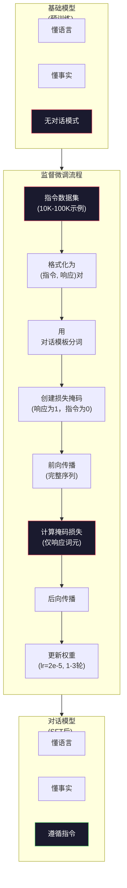

# 指令微调 (SFT)

> 基础模型预测下一个词元。仅此而已。它不遵循指令、不回答问题、也不拒绝有害请求。SFT是将词元预测器与有用助手连接起来的桥梁。你曾经交谈过的每个模型——Claude、GPT、Llama Chat——都经历了这一步。

**类型：** 构建
**语言：** Python (使用numpy)
**前置要求：** 第10阶段，第04课（预训练Mini GPT）
**时间：** 约90分钟

## 学习目标

- 实现监督微调(SFT)，将基础语言模型转换为遵循指令的助手
- 使用系统、用户和助手角色格式化训练数据，使用对话模板，并对非助手词元进行损失掩码
- 解释为什么需要SFT：基础模型续写文本而不是回答问题
- 通过在保留指令集上比较基础模型与微调模型的响应来评估SFT质量

## 问题背景

你在第04课训练了一个模型。它可以给定序列预测下一个词元。输入"The transformer architecture"，它可能继续"has revolutionized natural language processing."。这对下一个词元预测器来说令人印象深刻。

现在试试：输入"What is the capital of France?" 基础模型不会回答"Paris."。它延续模式。它可能产生"What is the capital of Germany? What is the capital of Spain?"因为它从包含问题列表的文档中学习。或者它可能产生"is a question that many people ask"因为这是合理的下一个词元延续。模型没有*回答*的概念。它只知道*续写*。

这是GPT-3（基础模型，2020年6月发布）和ChatGPT（指令微调，2022年11月发布）之间的差距。相同架构。相同预训练。区别是2万到10万个精心制作的（指令，响应）对，教会模型遵循对话模式。

Stanford Alpaca证明你不需要数百万样本。2023年3月，他们在仅52,000个由GPT-3.5生成的指令响应对上微调Llama 7B。总成本：600美元。结果是一个可以遵循指令、回答问题、进行对话的聊天机器人。不如ChatGPT，但对于600美元和几小时训练来说，已经惊人地接近了。

Meta的Llama 2 Chat仅使用约27,000个高质量示例进行初始SFT阶段。关键见解：质量比数量更重要。27,000个由熟练注释员编写的示例胜过100万个从互联网抓取的嘈杂示例。

## 概念讲解

### SFT实际做什么

监督微调继续预训练的相同训练循环——前向传播、计算损失、后向传播、更新权重——但在不同类型的数据上。不是原始文本，而是在结构化对话上训练：

```json
{
  "system": "You are a helpful assistant.",
  "user": "What is the capital of France?",
  "assistant": "The capital of France is Paris."
}
```

模型已经知道巴黎是法国的首都。它在预训练期间从Wikipedia、教科书和网页上学习到了这一点。SFT不教模型新事实。它教模型一种新*行为*：当你看到问题时，产生答案。当你看到指令时，产生补全。当你看到有害请求时，产生拒绝。

这样想。预训练给模型知识。SFT给模型礼仪。

### 数据格式

三种格式主导行业。每种用不同分隔符编码相同信息——谁说了什么。

**Alpaca格式** (Stanford, 2023年3月)：

```json
{
  "instruction": "Summarize the following article in 3 sentences.",
  "input": "The European Central Bank raised interest rates...",
  "output": "The ECB increased rates by 25 basis points..."
}
```

简单且广泛使用。`input`字段是可选的——许多指令不需要额外上下文。Stanford以这种格式发布了52,000个示例，由GPT-3.5生成，花费600美元。这开启了开源指令微调运动。

**ShareGPT格式** (社区, 2023)：

```json
{
  "conversations": [
    {"from": "system", "value": "You are a helpful assistant."},
    {"from": "human", "value": "What causes tides?"},
    {"from": "gpt", "value": "Tides are caused by the gravitational pull of the Moon..."},
    {"from": "human", "value": "How often do they occur?"},
    {"from": "gpt", "value": "Most coastal areas experience two high tides and two low tides per day..."}
  ]
}
```

支持多轮对话。"from"字段按约定使用"human"和"gpt"，无论实际模型是什么。Vicuna在用户共享的ChatGPT转录的70,000个ShareGPT对话上训练。

**ChatML格式** (OpenAI，许多开源模型使用)：

```
<|im_start|>system
You are a helpful assistant.</think>
<|im_start|>user
What is the capital of France?</think>
<|im_start|>assistant
The capital of France is Paris.</think>
```

使用特殊词元（`<|im_start|>`、`</s>`）来分隔角色。这些词元在微调期间添加到分词器的词汇表中。Qwen、Yi和许多其他模型使用ChatML。

所有三种格式完成相同的事情：它们告诉模型"这是指令，这是响应，学习这个模式。"

### 为什么有效

模型已经从预训练中学到了语言。它看到了数十亿个问题后跟答案、指令后跟补全、人之间对话的示例。模式已经编码在权重中。

SFT集中这种潜在能力。不是模型需要从上下文中判断它应该回答问题还是续写文档，SFT明确在对话模式上训练。几千个示例后，模型学会：当你看到助手角色标记时，产生有帮助的响应。

这就是27,000个示例足够的原因。你不是在教模型英语。你不是在教它关于世界的事实。你在教它一种简单行为：响应指令。知识已经在那里了。

### 掩码损失

这是SFT中最重要的技术细节，大多数教程都跳过了。

预训练期间，你对每个词元计算损失。模型学习预测序列中的每个下一个词元。SFT期间，你只计算*响应*词元的损失。指令词元在那里提供上下文，但模型不会因"预测"它们而受到惩罚。

为什么？因为你不想让模型学习*生成*指令。你想让它学习*响应*指令。如果你在指令词元上计算损失，你就在训练模型预测"What is the capital of France?"，好像它在提问。这浪费梯度信号，并可能使模型对其角色感到困惑。

实践中，你创建损失掩码：响应词元为1，指令词元为0。在平均之前将每个词元损失乘以这个掩码。

```
词元:    [SYS] You are helpful [USER] What is the capital? [ASST] Paris is the capital  </s>
损失掩码:   0    0    0     0      0     0   0  0     0       1     1    1   1     1      1
```

只有`[ASST]`后的词元对损失有贡献。模型在前向传播期间看到完整对话（它需要指令来产生正确响应），但只根据预测响应的好坏更新权重。

### 训练超参数

SFT使用与预训练截然不同的超参数。你不是从头训练。你在调整一个已经工作的模型。

| 参数 | 预训练(Llama 2 7B) | SFT (Llama 2 Chat) |
|-----------|---------------------------|---------------------|
| 学习率 | 3e-4 (峰值) | 2e-5 |
| 轮数 | 1（单次遍历数据） | 2 |
| 批次大小 | 4M词元 | 64示例 |
| 预热步数 | 2,000 | 0-100 |
| 权重衰减 | 0.1 | 0.0-0.1 |
| 数据大小 | 2T词元 | 27,000示例 |

SFT的学习率低15倍。这很关键。微调期间的高学习率会破坏预训练知识。模型"忘记"它学到的东西，对小的微调数据集过拟合。这是灾难性遗忘。

两轮意味着模型看到每个训练示例两次。小数据集上超过3轮会导致记忆——模型开始逐字复述训练示例而不是泛化。

### 灾难性遗忘

微调会破坏通用能力。在指令跟随数据上训练太久，模型会失去写代码、做数学或产生创意文本的能力。它在训练数据的特定格式上变得非常好，其他一切都很差。

三种缓解方法：

1. **低学习率。** 1e-5到5e-5。更小的更新意味着对预训练特征的破坏更少。

2. **短训练。** 1-3轮。在模型过拟合前停止。

3. **混合预训练数据。** Llama 2 Chat将一小部分（2-5%）原始预训练数据混合到SFT数据集。这"提醒"模型其通用能力，同时学习新的指令跟随行为。

### 真实数字

在10,000个高质量指令对上微调7B模型，在单个NVIDIA A100 80GB GPU上大约需要1小时。这是计算：

- 10,000示例 x 512词元平均 = 512万词元
- 2轮 = 1024万词元总计
- A100上7B模型微调吞吐量：约3,000词元/秒
- 1024万 / 3,000 = ~3,400秒 = ~57分钟

对于我们的mini GPT（4层，128维），训练几乎是瞬时的。重点是理解机制，不是规模。



## 动手实践

### 第1步：指令数据集

创建合成指令数据集。生产中，像Scale AI和Anthropic这样的公司雇佣人类注释员编写这些。我们将以编程方式创建它们来演示格式。

```python
import numpy as np

INSTRUCTION_DATA = [
    {
        "instruction": "What is the capital of France?",
        "response": "The capital of France is Paris."
    },
    {
        "instruction": "Explain gravity in one sentence.",
        "response": "Gravity is the force that attracts objects with mass toward each other."
    },
    {
        "instruction": "Write a haiku about the ocean.",
        "response": "Waves crash on the shore, salt and foam beneath the sun, endless blue expanse."
    },
    {
        "instruction": "What is 15 multiplied by 7?",
        "response": "15 multiplied by 7 is 105."
    },
    {
        "instruction": "Name three programming languages.",
        "response": "Three programming languages are Python, Rust, and TypeScript."
    },
    {
        "instruction": "Summarize photosynthesis.",
        "response": "Photosynthesis converts sunlight, water, and carbon dioxide into glucose and oxygen."
    },
    {
        "instruction": "What year did World War II end?",
        "response": "World War II ended in 1945."
    },
    {
        "instruction": "Define machine learning.",
        "response": "Machine learning is a field where algorithms learn patterns from data to make predictions."
    },
]
```

八个示例很小。Stanford Alpaca用了52,000。但机制相同，无论你有8个还是52,000：分词、掩码、仅计算响应损失。

### 第2步：用对话模板分词

用特殊角色标记将指令-响应对转换为词元序列。标记告诉模型指令在哪里结束，响应在哪里开始。

```python
SPECIAL_TOKENS = {
    "INST_START": 253,
    "INST_END": 254,
    "RESP_START": 255,
}


def tokenize_instruction_pair(instruction, response, vocab_size=256):
    inst_tokens = list(instruction.encode("utf-8"))
    resp_tokens = list(response.encode("utf-8"))

    inst_tokens = [min(t, vocab_size - 4) for t in inst_tokens]
    resp_tokens = [min(t, vocab_size - 4) for t in resp_tokens]

    tokens = (
        [SPECIAL_TOKENS["INST_START"]]
        + inst_tokens
        + [SPECIAL_TOKENS["INST_END"]]
        + [SPECIAL_TOKENS["RESP_START"]]
        + resp_tokens
    )

    return tokens


def create_loss_mask(tokens):
    mask = np.zeros(len(tokens), dtype=np.float32)
    in_response = False

    for i, token in enumerate(tokens):
        if token == SPECIAL_TOKENS["RESP_START"]:
            in_response = True
            continue
        if in_response:
            mask[i] = 1.0

    return mask
```

损失掩码在指令词元上全为零，在响应词元上全为一。`RESP_START`词元本身得到掩码0，因为它是分隔符，不是响应内容的一部分。

### 第3步：掩码交叉熵损失

标准交叉熵，但乘以损失掩码。只有响应词元对梯度有贡献。

```python
def masked_cross_entropy_loss(logits, targets, loss_mask):
    batch, seq_len, vocab_size = logits.shape
    logits_flat = logits.reshape(-1, vocab_size)
    targets_flat = targets.reshape(-1)
    mask_flat = loss_mask.reshape(-1)

    max_logits = logits_flat.max(axis=-1, keepdims=True)
    log_softmax = logits_flat - max_logits - np.log(
        np.exp(logits_flat - max_logits).sum(axis=-1, keepdims=True)
    )
