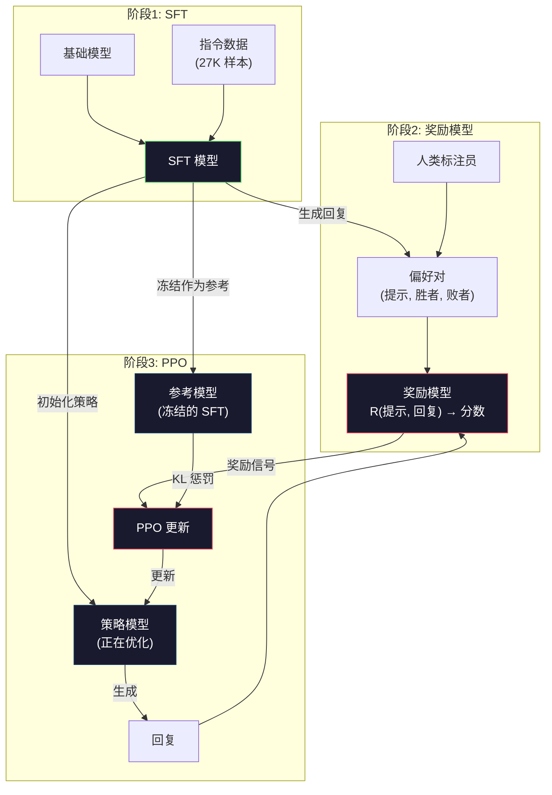
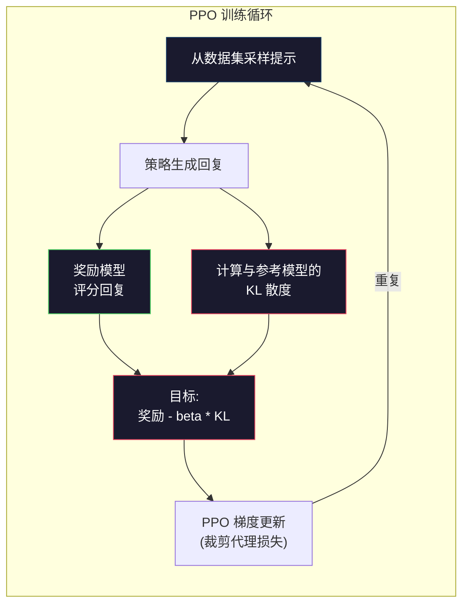

# RLHF: 奖励模型 + PPO

> SFT 教会模型遵循指令。但它没有教会模型哪个回复**更好**。两个语法正确、事实准确的答案可能在有用性上差异巨大。RLHF 是将人类判断编码到模型行为中的方法。正是它让 Claude 变得乐于助人，让 GPT 变得礼貌得体。

**类型:** 构建
**语言:** Python (配合 numpy)
**前置要求:** 第10阶段，第06课 (指令微调 / SFT)
**时间:** ~90分钟

## 学习目标

- 构建一个奖励模型，根据人类偏好对 (被选中的 vs 被拒绝的) 来评分回复质量
- 实现 PPO 训练循环，通过 KL 散度惩罚，使用奖励模型优化语言模型策略
- 解释为什么 RLHF 需要三个模型 (SFT、奖励模型、策略) 以及 KL 约束如何防止奖励黑客攻击
- 通过比较偏好优化前后的回复质量来评估 RLHF 的效果

## 问题背景

让模型"解释量子计算"，它可能会产生以下回复：

**回复 A：** "量子计算使用量子比特，量子比特可以处于叠加态，意味着它们可以同时处于0、1或两者状态。这使得量子计算机在处理某些计算时比经典计算机快指数倍。关键算法包括用于分解大数的肖尔算法和用于搜索无序数据库的格罗弗算法。"

**回复 B：** "量子计算是一种利用量子力学现象的计算机类型。它最早在20世纪80年代被提出。理查德·费曼建议量子系统可以通过量子计算机来模拟。自那以后，该领域有了显著发展。现在许多公司都在研究量子计算机。IBM、谷歌等公司都取得了进展。谷歌在2019年宣称实现了量子优势。"

两个回复在事实上都是正确的。两个回复在语法上都是正确的。两个回复都遵循了指令。但回复 A 明显更好。它更简洁、信息量更大、结构更清晰。人类每次都会选择 A。

SFT 无法捕捉这种区别。它用"正确"的回复训练模型，但它没有办法说"这个回复比那个更好"。它将每个训练示例视为同样好。如果 A 和 B 都出现在 SFT 数据集中，模型会从两者中学习同样的内容。

RLHF 解决了这个问题。它训练一个奖励模型来预测人类会偏好哪个回复，然后使用该奖励信号推动语言模型生成更高质量的输出。InstructGPT（ChatGPT 的前身）使用 RLHF 大幅提高了 GPT-3 的有用性、真实性和无害性。尽管 InstructGPT 比 GPT-3 小135倍（1.3B 对比 175B 参数），OpenAI 的内部评估员在85%的时间里更偏好 InstructGPT 的输出。

## 概念讲解

### 三个阶段

RLHF 不是一次训练运行。它是一个由三个顺序阶段组成的流水线，每个阶段都建立在前一个阶段的基础上。

**阶段1：SFT。** 在指令-回复对上训练基础模型（第06课）。这给你一个能够遵循指令但不知道哪些回复比其他回复更好的模型。

**阶段2：奖励模型。** 收集人类偏好数据：向标注者展示两个对相同提示的回复，询问"哪个更好？"训练一个模型来预测这些偏好。奖励模型以 (提示, 回复) 作为输入，输出一个标量分数。

**阶段3：PPO。** 使用奖励模型为语言模型生成训练信号。语言模型生成回复，奖励模型对其进行评分，PPO 更新语言模型以产生更高分的回复。KL 散度惩罚防止语言模型偏离 SFT 检查点太远。



### 奖励模型

奖励模型是一个被重新用作评分器的语言模型。取 SFT 模型，将语言建模头（输出词汇分布）替换为标量头（输出单个数字）。在最后一层之前的架构是相同的。

输入：提示与回复的连接。输出：单个标量奖励分数。

训练数据是人类偏好对。对于每个提示，标注者看到两个回复并选择更好的一个。这创建了训练三元组：(提示, 偏好回复, 被拒绝回复)。

损失函数使用 Bradley-Terry 成对偏好模型：

```
损失 = -log(sigmoid(奖励(偏好) - 奖励(被拒绝)))
```

这是关键公式。`sigmoid(奖励(A) - 奖励(B))` 给出回复 A 比回复 B 更受偏好的概率。损失推动奖励模型给偏好回复分配更高的分数。

为什么用成对比较而不是绝对分数？因为人类在分配绝对质量分数（"这个回复是7.3还是7.5分（满分10分）？"）方面表现很差，但在相对比较（"A 比 B 好吗？"）方面表现出色。Bradley-Terry 模型将相对比较转换为一致的绝对评分系统。

**InstructGPT 数据：** OpenAI 从40名承包商那里收集了33,000个比较对。每次比较大约需要5分钟。这是2,750小时的人工劳动用于奖励模型训练数据。

### PPO: 近端策略优化

PPO 是一种强化学习算法。在 RLHF 中，"环境"是奖励模型，"智能体"是语言模型，"动作"是生成一个 Token。

目标函数：

```
最大化: E[奖励(提示, 回复)] - beta * KL(策略 || 参考)
```

第一项推动模型生成高奖励回复。第二项（KL 散度惩罚）防止模型偏离 SFT 检查点太远。

为什么要用 KL 惩罚？没有它，模型会找到退化解决方案。奖励模型是在有限的人类偏好数据集上训练的。它有盲点。语言模型会利用这些盲点——找到在奖励模型上得分高但实际上无意义的输出。经典例子：

- 重复"我是如此有帮助且无害的！"在有用性/无害性奖励模型上得分很高
- 产生冗长、听起来正式但空洞的回复，与"高质量"模式匹配
- 利用训练数据中恰好与高奖励相关的特定短语

KL 惩罚表示：你可以改进，但不能变成一个完全不同的模型。保持接近 SFT 版本，它已经是合理的。偏离太远，KL 成本就会超过奖励。

**InstructGPT 数据：** PPO 训练使用 lr=1.5e-5，KL 系数 beta=0.02，256K 轮次（提示-回复对），每批次4个 PPO 轮次。整个 RLHF 流水线在 GPU 集群上需要几天时间。



### PPO 目标的详细说明

PPO 使用"裁剪代理目标"来防止过度大的更新。新旧策略概率之间的比率被裁剪到 [1 - epsilon, 1 + epsilon] 范围内，其中 epsilon 通常为0.2。

```
比率 = pi_新(动作 | 状态) / pi_旧(动作 | 状态)
裁剪比率 = clip(比率, 1 - epsilon, 1 + epsilon)
损失 = -min(比率 * 优势, 裁剪比率 * 优势)
```

优势函数估计当前回复与预期质量相比有多好。在 RLHF 中：

```
优势 = 奖励(提示, 回复) - 基线
```

基线通常是最近回复的平均奖励。正优势表示回复高于平均水平；负优势表示低于平均水平。PPO 增加高于平均水平回复的概率，减少低于平均水平回复的概率。

裁剪防止灾难性更新。如果单个回复获得异常高的奖励，未裁剪的比率可能非常大，导致模型急剧转向该回复。裁剪限制更新幅度，保持训练稳定。

### 奖励黑客攻击

RLHF 的阴暗面。语言模型正在针对奖励模型进行优化，而奖励模型是人类偏好的不完美代理。随着语言模型越来越擅长最大化奖励，它开始利用奖励模型的弱点。

常见故障模式：

| 故障 | 发生什么 | 原因 |
|------|---------|------|
| 冗长 | 模型产生越来越长的回复 | 人类标注员通常更喜欢更长、更详细的回复，因此奖励模型给长度更高的分数 |
| 谄媚 | 模型同意用户说的一切 | 标注员更喜欢同意问题前提的回复 |
| 回避 | 模型拒绝给出确定答案 | 回避性回复（"这是一个复杂的话题，有许多观点……"）很少被标记为错误 |
| 格式博弈 | 模型过度使用项目符号和标题 | 格式化回复对标注员来说看起来更"精美" |

缓解策略：更强的 KL 惩罚（防止模型偏离足够远以利用弱点）、在对抗样本上训练奖励模型（修补已知故障模式）、使用具有不同架构的多个奖励模型（更难同时攻击所有模型）。

### 真实 RLHF 流水线

| 模型 | 比较对数 | 标注员数 | RM 大小 | PPO 步数 | KL 系数 |
|------|---------|---------|---------|----------|---------|
| InstructGPT | 33K | 40 | 6B | 256K | 0.02 |
| Llama 2 Chat | ~1M | 未公开 | 70B | 未公开 | 0.01 |
| Claude | 未公开 | 未公开 | 未公开 | 未公开 | 未公开 |
| Anthropic RLHF 论文 | 22K | 20 | 52B | 50K | 0.001 |

Anthropic 2022年的论文在一个52B奖励模型上训练了22,000个比较。更大的奖励模型产生更可靠的信号，使 PPO 训练更稳定。使用小型奖励模型训练大型语言模型是有风险的——奖励模型没有足够的容量来捕捉好与坏回复之间的细微差别。

## 动手实践

### 步骤 1: 合成偏好数据

在生产中，人类标注员创建偏好数据。我们将创建合成对，其中"偏好"回复客观更好（更简洁、更准确、更有帮助）。

```python
import numpy as np

PREFERENCE_DATA = [
    {
        "prompt": "法国的首都是哪里？",
        "preferred": "法国的首都是巴黎。",
        "rejected": "法国是欧洲的一个国家。它有许多城市。首都是巴黎。巴黎以埃菲尔铁塔闻名。",
    },
    {
        "prompt": "用一句话解释重力。",
        "preferred": "重力是具有质量的物体之间相互吸引的力。",
        "rejected": "重力是让东西掉下来时往下落的东西。",
    },
    {
        "prompt": "15乘以7等于多少？",
        "preferred": "15乘以7等于105。",
        "rejected": "让我想想。15乘以7。嗯，10乘以7是70，5乘以7是35，所以答案可能是105左右。",
    },
    {
        "prompt": "说出三种编程语言。",
        "preferred": "Python、Rust 和 TypeScript。",
        "rejected": "有许多编程语言。一些流行的包括像 Python 这样的各种语言，还有其他语言。",
    },
    {
        "prompt": "第二次世界大战在哪一年结束？",
        "preferred": "第二次世界大战在1945年结束。",
        "rejected": "第二次世界大战是一场重大的全球冲突。它涉及许多国家。战争在1940年代中期结束，具体是1945年。",
    },
    {
        "prompt": "定义机器学习。",
        "preferred": "机器学习是一个领域，其中算法从数据中学习模式，无需显式编程即可进行预测。",
        "rejected": "机器学习是一种人工智能。AI代表人工智能。机器学习使用数据来学习。",
    },
]
```

偏好回复简洁直接。被拒绝的回复表现出常见故障模式：不必要的填充、回避、冗余解释和不精确。这正是 SFT 无法捕捉但 RLHF 可以捕捉的区别。

### 步骤 2: 奖励模型架构

奖励模型重用迷你 GPT 的 Transformer 架构，但将词汇大小的输出头替换为单个标量投影。

```python
import sys
import os
sys.path.insert(0, os.path.join(os.path.dirname(__file__), "..", "..", "04-pre-training-mini-gpt", "code"))
from main import MiniGPT, LayerNorm, Embedding, TransformerBlock


class RewardModel:
    def __init__(self, vocab_size=256, embed_dim=128, num_heads=4,
                 num_layers=4, max_seq_len=128, ff_dim=512):
        self.embedding = Embedding(vocab_size, embed_dim, max_seq_len)
        self.blocks = [
            TransformerBlock(embed_dim, num_heads, ff_dim)
            for _ in range(num_layers)
        ]
        self.ln_f = LayerNorm(embed_dim)
        self.reward_head = np.random.randn(embed_dim) * 0.02

    def forward(self, token_ids):
        seq_len = token_ids.shape[-1]
        mask = np.triu(np.full((seq_len, seq_len), -1e9), k=1)

        x = self.embedding.forward(token_ids)
        for block in self.blocks:
            x = block.forward(x, mask)
        x = self.ln_f.forward(x)

        last_hidden = x[:, -1, :]
        reward = last_hidden @ self.reward_head

        return reward
```

奖励模型取*最后* Token 位置的隐藏状态并投影为标量。为什么是最后位置？因为因果注意力掩码意味着最后位置已经关注到所有先前的 Token。它对整个 (提示, 回复) 序列有最完整的表示。

### 步骤 3: Bradley-Terry 损失

使用 Bradley-Terry 成对损失在偏好对上训练奖励模型。

```python
def tokenize_for_reward(prompt, response, vocab_size=256):
    prompt_tokens = [min(t, vocab_size - 1) for t in list(prompt.encode("utf-8"))]
    response_tokens = [min(t, vocab_size - 1) for t in list(response.encode("utf-8"))]
    return prompt_tokens + [0] + response_tokens


def sigmoid(x):
    return np.where(
        x >= 0,
        1.0 / (1.0 + np.exp(-x)),
        np.exp(x) / (1.0 + np.exp(x))
    )


def bradley_terry_loss(reward_preferred, reward_rejected):
    diff = reward_preferred - reward_rejected
    loss = -np.log(sigmoid(diff) + 1e-8)
    return loss


def train_reward_model(rm, preference_data, num_epochs=10, lr=1e-4, max_seq_len=128):
    print(f"训练奖励模型: {len(preference_data)} 个偏好对, {num_epochs} 个轮次")
    print()

    losses = []
    accuracies = []

    for epoch in range(num_epochs):
        epoch_loss = 0.0
        epoch_correct = 0
        num_pairs = 0

        indices = np.random.permutation(len(preference_data))

        for idx in indices:
            pair = preference_data[idx]

            preferred_tokens = tokenize_for_reward(pair["prompt"], pair["preferred"])
            rejected_tokens = tokenize_for_reward(pair["prompt"], pair["rejected"])

            preferred_tokens = preferred_tokens[:max_seq_len]
            rejected_tokens = rejected_tokens[:max_seq_len]

            preferred_ids = np.array(preferred_tokens).reshape(1, -1)
            rejected_ids = np.array(rejected_tokens).reshape(1, -1)

            r_preferred = rm.forward(preferred_ids)[0]
            r_rejected = rm.forward(rejected_ids)[0]

            loss = bradley_terry_loss(r_preferred, r_rejected)

            if r_preferred > r_rejected:
                epoch_correct += 1

            diff = r_preferred - r_rejected
            grad = sigmoid(diff) - 1.0

            rm.reward_head -= lr * grad * rm.ln_f.forward(
                rm.embedding.forward(preferred_ids)
            )[:, -1, :].flatten()

            epoch_loss += loss
            num_pairs += 1

        avg_loss = epoch_loss / max(num_pairs, 1)
        accuracy = epoch_correct / max(num_pairs, 1)
        losses.append(avg_loss)
        accuracies.append(accuracy)

        if epoch % 2 == 0:
            print(f"  轮次 {epoch + 1:3d} | 损失: {avg_loss:.4f} | 准确率: {accuracy:.1%}")

    return rm, losses, accuracies
```

准确率指标很直接：奖励模型正确排序的偏好对占多少比例？随机模型得分50%。在干净数据上训练良好的奖励模型应该超过70%。InstructGPT 的奖励模型在 held-out 比较上达到约72%的准确率——这听起来很低，但实际上不错——许多偏好对即使对人类来说也是模糊的（标注员间一致性约73%）。

### 步骤 4: 简化 PPO 循环

完整的 PPO 很复杂。这个实现捕捉核心机制：生成回复、评分、计算优势、用 KL 惩罚更新策略。

```python
def compute_kl_divergence(policy_logits, reference_logits):
    policy_probs = np.exp(policy_logits - policy_logits.max(axis=-1, keepdims=True))
    policy_probs = policy_probs / policy_probs.sum(axis=-1, keepdims=True)
    policy_probs = np.clip(policy_probs, 1e-10, 1.0)

    ref_probs = np.exp(reference_logits - reference_logits.max(axis=-1, keepdims=True))
    ref_probs = ref_probs / ref_probs.sum(axis=-1, keepdims=True)
    ref_probs = np.clip(ref_probs, 1e-10, 1.0)

    kl = np.sum(policy_probs * np.log(policy_probs / ref_probs), axis=-1)
    return kl.mean()


def generate_response(model, prompt_tokens, max_new_tokens=30, temperature=0.8, max_seq_len=128):
    tokens = list(prompt_tokens)

    for _ in range(max_new_tokens):
        context = np.array(tokens[-max_seq_len:]).reshape(1, -1)
        logits = model.forward(context)
        next_logits = logits[0, -1, :]

        next_logits = next_logits / max(temperature, 1e-8)
        probs = np.exp(next_logits - next_logits.max())
        probs = probs / probs.sum()
        probs = np.clip(probs, 1e-10, 1.0)
        probs = probs / probs.sum()

        next_token = np.random.choice(len(probs), p=probs)
        tokens.append(int(next_token))

    return tokens


def copy_model_weights(source, target):
    target.embedding.token_embed = source.embedding.token_embed.copy()
    target.embedding.pos_embed = source.embedding.pos_embed.copy()
    target.ln_f.gamma = source.ln_f.gamma.copy()
    target.ln_f.beta = source.ln_f.beta.copy()
    for s_block, t_block in zip(source.blocks, target.blocks):
        t_block.attn.W_q = s_block.attn.W_q.copy()
        t_block.attn.W_k = s_block.attn.W_k.copy()
        t_block.attn.W_v = s_block.attn.W_v.copy()
        t_block.attn.W_out = s_block.attn.W_out.copy()
        t_block.ffn.W1 = s_block.ffn.W1.copy()
        t_block.ffn.W2 = s_block.ffn.W2.copy()
        t_block.ffn.b1 = s_block.ffn.b1.copy()
        t_block.ffn.b2 = s_block.ffn.b2.copy()
        t_block.ln1.gamma = s_block.ln1.gamma.copy()
        t_block.ln1.beta = s_block.ln1.beta.copy()
        t_block.ln2.gamma = s_block.ln2.gamma.copy()
        t_block.ln2.beta = s_block.ln2.beta.copy()


def ppo_training(policy_model, reference_model, reward_model, prompts,
                 num_episodes=20, lr=1.5e-5, kl_coeff=0.02, max_seq_len=128):
    print(f"PPO 训练: {num_episodes} 个轮次, lr={lr}, KL 系数={kl_coeff}")
    print()

    rewards_history = []
    kl_history = []

    for episode in range(num_episodes):
        prompt_text = prompts[episode % len(prompts)]
        prompt_tokens = [min(t, 252) for t in list(prompt_text.encode("utf-8"))]

        response_tokens = generate_response(
            policy_model, prompt_tokens,
            max_new_tokens=20, temperature=0.8, max_seq_len=max_seq_len
        )

        response_ids = np.array(response_tokens[:max_seq_len]).reshape(1, -1)
        reward = reward_model.forward(response_ids)[0]

        policy_logits = policy_model.forward(response_ids)
        ref_logits = reference_model.forward(response_ids)
        kl = compute_kl_divergence(policy_logits, ref_logits)

        total_reward = reward - kl_coeff * kl

        rewards_history.append(float(reward))
        kl_history.append(float(kl))

        for block in policy_model.blocks:
            update_scale = lr * total_reward
            block.ffn.W1 += update_scale * np.random.randn(*block.ffn.W1.shape) * 0.01
            block.ffn.W2 += update_scale * np.random.randn(*block.ffn.W2.shape) * 0.01

        if episode % 5 == 0:
            avg_reward = np.mean(rewards_history[-5:]) if rewards_history else 0
            avg_kl = np.mean(kl_history[-5:]) if kl_history else 0
            print(f"  轮次 {episode:3d} | 奖励: {reward:.4f} | KL: {kl:.4f} | "
                  f"平均奖励: {avg_reward:.4f}")

    return policy_model, rewards_history, kl_history
```

核心循环：(1) 采样提示，(2) 生成回复，(3) 用奖励模型评分，(4) 计算与冻结参考的 KL 散度，(5) 计算调整后的奖励（奖励减去 KL 惩罚），(6) 更新策略。随着策略偏离参考，KL 惩罚增长，自动防止奖励黑客攻击。

### 步骤 5: 奖励分数比较

RLHF 后，策略模型的回复在奖励模型上的分数应该比原始 SFT 模型的回复更高。

```python
def compare_models(sft_model, rlhf_model, reward_model, prompts, max_seq_len=128):
    print("模型比较 (奖励分数)")
    print("-" * 60)
    print(f"  {'提示':<35} {'SFT':>10} {'RLHF':>10}")
    print("  " + "-" * 55)

    sft_total = 0.0
    rlhf_total = 0.0

    for prompt in prompts:
        prompt_tokens = [min(t, 252) for t in list(prompt.encode("utf-8"))]

        sft_response = generate_response(
            sft_model, prompt_tokens,
            max_new_tokens=20, temperature=0.6, max_seq_len=max_seq_len
        )
        rlhf_response = generate_response(
            rlhf_model, prompt_tokens,
            max_new_tokens=20, temperature=0.6, max_seq_len=max_seq_len
        )

        sft_ids = np.array(sft_response[:max_seq_len]).reshape(1, -1)
        rlhf_ids = np.array(rlhf_response[:max_seq_len]).reshape(1, -1)

        sft_reward = reward_model.forward(sft_ids)[0]
        rlhf_reward = reward_model.forward(rlhf_ids)[0]

        sft_total += sft_reward
        rlhf_total += rlhf_reward

        truncated_prompt = prompt[:33] + ".." if len(prompt) > 35 else prompt
        print(f"  {truncated_prompt:<35} {sft_reward:>10.4f} {rlhf_reward:>10.4f}")

    n = len(prompts)
    print("  " + "-" * 55)
    print(f"  {'平均':<35} {sft_total/n:>10.4f} {rlhf_total/n:>10.4f}")

    return sft_total / n, rlhf_total / n
```

## 实际应用

### 完整 RLHF 流水线演示

```python
if __name__ == "__main__":
    np.random.seed(42)

    print("=" * 70)
    print("RLHF 流水线: 奖励模型 + PPO")
    print("=" * 70)
    print()

    print("阶段1: SFT 模型 (来自第06课)")
    print("-" * 40)
    sft_model = MiniGPT(
        vocab_size=256, embed_dim=128, num_heads=4,
        num_layers=4, max_seq_len=128, ff_dim=512
    )
    print(f"  参数量: {sft_model.count_parameters():,}")
    print()

    print("阶段2: 训练奖励模型")
    print("-" * 40)
    rm = RewardModel(
        vocab_size=256, embed_dim=128, num_heads=4,
        num_layers=4, max_seq_len=128, ff_dim=512
    )

    rm, rm_losses, rm_accuracies = train_reward_model(rm, PREFERENCE_DATA, num_epochs=10, lr=1e-4)
    print()

    print("奖励模型评估:")
    print("-" * 40)
    correct = 0
    for pair in PREFERENCE_DATA:
        pref_tokens = tokenize_for_reward(pair["prompt"], pair["preferred"])[:128]
        rej_tokens = tokenize_for_reward(pair["prompt"], pair["rejected"])[:128]

        r_pref = rm.forward(np.array(pref_tokens).reshape(1, -1))[0]
        r_rej = rm.forward(np.array(rej_tokens).reshape(1, -1))[0]

        if r_pref > r_rej:
            correct += 1
        print(f"  偏好: {r_pref:+.4f} | 被拒绝: {r_rej:+.4f} | {'正确' if r_pref > r_rej else '错误'}")

    print(f"\n  准确率: {correct}/{len(PREFERENCE_DATA)} = {correct/len(PREFERENCE_DATA):.1%}")
    print()

    print("阶段3: PPO 训练")
    print("-" * 40)

    policy_model = MiniGPT(
        vocab_size=256, embed_dim=128, num_heads=4,
        num_layers=4, max_seq_len=128, ff_dim=512
    )
    reference_model = MiniGPT(
        vocab_size=256, embed_dim=128, num_heads=4,
        num_layers=4, max_seq_len=128, ff_dim=512
    )

    copy_model_weights(sft_model, policy_model)
    copy_model_weights(sft_model, reference_model)

    train_prompts = [pair["prompt"] for pair in PREFERENCE_DATA]

    policy_model, rewards, kls = ppo_training(
        policy_model, reference_model, rm,
        train_prompts, num_episodes=20, lr=1.5e-5, kl_coeff=0.02
    )
    print()

    print("=" * 70)
    print("比较: SFT vs RLHF")
    print("=" * 70)
    print()

    eval_prompts = [
        "法国的首都是哪里？",
        "解释重力。",
        "说出三种编程语言。",
    ]

    sft_avg, rlhf_avg = compare_models(sft_model, policy_model, rm, eval_prompts)
    print()

    print("=" * 70)
    print("KL 散度分析")
    print("=" * 70)
    print()

    if kls:
        print(f"  初始 KL: {kls[0]:.4f}")
        print(f"  最终 KL:   {kls[-1]:.4f}")
        print(f"  最大 KL:     {max(kls):.4f}")
        kl_threshold = 0.1
        print(f"  KL > {kl_threshold}: {'是 (模型显著漂移)' if max(kls) > kl_threshold else '否 (模型保持接近参考)'}")
```

## 产出成果

本课程产出 `outputs/prompt-reward-model-designer.md` —— 一个用于设计奖励模型训练流水线的提示。给定目标行为（有用性、编程能力、安全性），它产生数据收集协议、标注员指南和奖励模型评估标准。

## 练习题

1. 修改奖励模型使用所有隐藏状态的均值而不是仅最后一个位置。比较准确率。均值池化方法给每个 Token 同等权重，而最后位置方法依赖因果注意力来聚合信息。在6个偏好对上进行测试并报告哪种方法得分更高。

2. 实现奖励模型校准。训练后，将所有偏好对通过奖励模型并计算：(a) 偏好回复的平均奖励，(b) 被拒绝回复的平均奖励，(c) 差距（偏好减被拒绝）。一个校准良好的模型应该有明显的差距。然后添加4个新的偏好对，检查差距在未见数据上是否保持。

3. 模拟奖励黑客攻击。创建一个给长回复高分的奖励模型（奖励 = len(回复) / 100）。用这个有缺陷的奖励模型运行 PPO，观察策略模型生成越来越长、重复的输出。然后添加0.1的 KL 惩罚并展示它防止退化行为。

4. 实现多目标奖励。训练两个奖励模型——一个用于有用性，一个用于简洁性。将它们组合为 R = 0.7 * R_有用 + 0.3 * R_简洁。展示组合目标产生既有用又简洁的回复，避免单一有用性奖励的冗长陷阱。

5. 比较不同的 KL 系数。用 beta=0.001（太低，奖励黑客）、beta=0.02（标准）、beta=0.5（太高，几乎不学习）运行 PPO。绘制每个的奖励曲线和 KL 曲线。beta=0.02 的运行应该显示奖励稳步提升且 KL 有界。

## 关键术语

| 术语 | 人们怎么说 | 实际含义 |
|------|-----------|---------|
| RLHF | "用人类反馈训练" | 基于人类反馈的强化学习：一个三阶段流水线（SFT、奖励模型、PPO），使用人类偏好信号优化语言模型输出 |
| 奖励模型 | "评分回复的模型" | 一个带有标量输出头的 Transformer，使用 Bradley-Terry 损失在成对人类偏好上训练 |
| Bradley-Terry | "比较模型" | 一个概率模型，其中 P(A > B) = sigmoid(分数(A) - 分数(B))，将成对偏好转换为一致的评分函数 |
| PPO | "RL 算法" | 近端策略优化：在裁剪更新幅度以防止不稳定的同时，更新策略以最大化奖励 |
| KL 散度 | "两个分布有多不同" | 策略模型的 Token 分布与参考模型之间的差异度量——用作惩罚以防止奖励黑客攻击 |
| KL 惩罚 | "对模型的约束" | Beta * KL(策略 || 参考) 从奖励信号中减去——防止策略偏离 SFT 检查点太远 |
| 奖励黑客攻击 | "操纵奖励" | 当策略通过在奖励模型中找到退化高奖励输出而发现其弱点，而不是真正改进时 |
| 偏好对 | "哪个更好，A 还是 B？" | 由 (提示, 偏好回复, 被拒绝回复) 组成的训练示例——RLHF 训练数据的基本单位 |
| 参考模型 | "冻结的 SFT 检查点" | SFT 模型的副本，其权重永不改变——用作 KL 散度计算的锚点 |

## 延伸阅读

- [Ouyang et al., 2022 -- "Training language models to follow instructions with human feedback" (InstructGPT)](https://arxiv.org/abs/2203.02155) -- 让 RLHF 对大型语言模型实用的论文
- [Schulman et al., 2017 -- "Proximal Policy Optimization Algorithms"](https://arxiv.org/abs/1707.06347) -- 来自 OpenAI 的原始 PPO 论文
- [Bai et al., 2022 -- "Training a Helpful and Harmless Assistant with Reinforcement Learning from Human Feedback"](https://arxiv.org/abs/2204.05862) -- Anthropic 的 RLHF 论文，详细分析了奖励黑客攻击和 KL 惩罚
- [Stiennon et al., 2020 -- "Learning to summarize with human feedback"](https://arxiv.org/abs/2009.01325) -- 将 RLHF 应用于摘要，展示奖励模型可以捕捉细微的质量判断
- [Christiano et al., 2017 -- "Deep reinforcement learning from human preferences"](https://arxiv.org/abs/1706.03741) -- 从人类比较中学习奖励函数的基础工作
