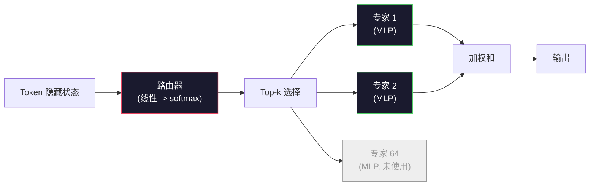

# 开源模型：架构详解

> 你在第04课从零开始构建了一个 GPT-2 Small。2026年的前沿开源模型是同一个家族，只是有五到六个具体的改动。RMSNorm 替代 LayerNorm。SwiGLU 替代 GELU。RoPE 替代学习的位置编码。GQA 或 MLA 替代完整的 MHA。规模化时使用混合专家模型（Mixture-of-Experts）。你已经掌握的数学知识覆盖了其中的95%。本课程并排阅读 Llama 3、DeepSeek-V3、Mixtral、Qwen 和 Gemma，指出每个架构在哪个确切的代码行发生了分歧。

**类型:** 学习
**语言:** Python (stdlib)
**前置要求:** 第10阶段，第04、05、12课 (预训练、扩展、推理)
**时间:** ~45分钟

## 学习目标

- 阅读 Llama 3、Mistral、Mixtral、Gemma 2、Qwen 2.5 和 DeepSeek-V3 的 config.json 并解释每个字段
- 指出每个模型相对于 GPT-2 Small 的具体架构改动，并从第一性原理说明理由
- 仅根据其配置计算任何开源模型的参数量、KV 缓存大小和激活内存
- 根据延迟、内存和能力约束为部署目标选择合适的开源模型

## 问题背景

在第04课中，你写了350行 numpy 代码，实现了一个 GPT-2 形状的模型。Llama 3 405B 有一份200页的技术报告。你的直觉是这些是不同的野兽。它们不是。这200页描述的是同一个对象，只是有五到六个动机明确的修改，加上关于扩展的数千个实现细节。骨架——嵌入、Transformer 块、注意力、MLP、归一化、头——没有改变。

本课程是一个差异对比。对于每个主要的开源模型家族，我们列出相对于 GPT-2 具体改变了什么、为什么改变，以及代价是什么。完成后，你可以阅读一份新的模型卡片并在脑海中将其翻译回 GPT-2 基线。

实际的收益是，当 Meta 发布 Llama 5 或 DeepSeek 发布 V4 时，你不需要新的心智模型。你会查看配置，看到哪些已知旋钮发生了变化，并知道下游影响是什么。2026年的架构是一个有限的工具箱。每个新模型选择不同的子集。

## 概念讲解

### 不变的核心

所有自回归开源模型共享：

- Token 嵌入矩阵 (vocab_size x hidden_dim)。
- N 个解码器块的堆叠：归一化、自注意力、残差、归一化、MLP、残差。
- 最终归一化和线性头，投影到 vocab_size（通常与嵌入权重绑定）。
- 因果掩码，下一个 Token 的交叉熵损失。

这就是形状。其余都是旋钮。

### 实际变动的六个旋钮

跨越每一个2024-2026年的前沿开源模型，同样的六个设计选择被反复挑选：

1. **归一化。** LayerNorm -> RMSNorm。
2. **位置编码。** 学习绝对位置 -> RoPE（加上变体：YaRN、NTK）。
3. **激活函数。** GELU -> SwiGLU（或 GeGLU）。
4. **注意力头共享。** MHA -> GQA -> MQA -> MLA。
5. **稠密 vs 稀疏 MLP。** 稠密 -> 混合专家模型。
6. **前置归一化位置。** 前置归一化保留。后置归一化消失。

其他一切（学习率调度、数据混合、批次大小、上下文长度）都存在于训练配置中，而非架构中。六个旋钮。

### 旋钮1：RMSNorm

LayerNorm 减去均值，除以标准差，缩放，然后平移。RMSNorm 只保留缩放：

```
RMSNorm(x) = x / sqrt(mean(x^2) + eps) * gamma
```

没有减去均值。没有偏置。每个 Token 少一次矩阵乘法。Zhang 和 Sennrich (2019) 认为它在机器翻译上与 LayerNorm 相当，同时快10%。每个现代开源模型都使用它。

代价：无。收益：小幅吞吐量提升，代码更简洁。

### 旋钮2：RoPE

学习的位置嵌入在 GPT-2 中是一个1024槽的查找表。上下文1025就在表的末端之外。模型无法外推到训练长度之外。

旋转位置嵌入（RoPE, Su et al. 2021）通过在注意力点积之前将每个 Q 和 K 向量成对旋转来注入位置。旋转角度是位置的确定性函数，因此没有学习的内容，也没有用完的东西。通过缩放技巧（NTK感知插值、YaRN），一个在8k上下文上训练的模型可以在推理时扩展到128k，精度损失适中。

```
q_旋转 = rotate(q, angle(pos))
k_旋转 = rotate(k, angle(pos))
分数 = q_旋转 . k_旋转
```

每个 Llama、Mistral、Qwen、DeepSeek 和 Gemma 都使用 RoPE。Gemma 2 使用混合（大多数层用 RoPE，其他层用局部滑动窗口注意力）。

### 旋钮3：SwiGLU

GPT-2 的 MLP 是 `x -> gelu(xW1 + b1) -> (...)W2 + b2`。SwiGLU（Shazeer 2020）用门控乘积替代激活：

```
SwiGLU(x) = (xW1) * sigmoid(xW1) * xV
```

两个投影并行，由 Swish 激活门控。在参数量相同的情况下，困惑度经验上更强。Llama 2 采用它，所有人都跟随。MLP 的隐藏大小通常设置为总参数量与原始稠密 MLP 匹配：如果 GPT-2 使用 `ff_dim = 4 * hidden`，SwiGLU 使用 `ff_dim = (2/3) * 4 * hidden = 8/3 * hidden`。

### 旋钮4：注意力头共享

GPT-2 使用**多头注意力（MHA）**：每个头有自己的 Q、K、V 投影。

**多查询注意力（MQA, Shazeer 2019）**在所有头之间共享一个 K 和一个 V。将 KV 缓存减少 num_heads 倍，这在典型模型上是12倍到32倍的减少。在困难基准上准确性略有下降。

**分组查询注意力（GQA, Ainslie et al. 2023）**是中间地带：G 组 Q 头共享一个 K 和一个 V。Llama 3 8B 使用32个 Q 头和8个 KV 头（G=8）的 GQA，因此 KV 缓存相对于完整 MHA 缩小4倍。

**多头潜在注意力（MLA, DeepSeek 2024）**将 K 和 V 压缩成共享的低秩潜在表示，每个头再投影回来。进一步减少 KV 缓存，同时保留每个头的表达能力。DeepSeek-V2 和 V3 依赖这一点实现其长上下文性能。

| 方案 | KV 头 | KV 缓存 | 准确性 |
|------|--------|---------|--------|
| MHA | num_heads | 完整 | 最佳 |
| GQA | num_groups (G < num_heads) | num_heads / G 减少 | 接近 MHA |
| MQA | 1 | num_heads 减少 | 略有下降 |
| MLA | 潜在表示，每个头解压缩 | 比 MQA 更小 | 接近 MHA |

对于任何超过~13B 参数的模型，GQA 或 MLA 实际上是强制的。大规模完整 MHA 是 KV 缓存灾难。

### 旋钮5：混合专家模型

稠密 MLP 为每个 Token 激活其所有参数。MoE MLP 每个块有 K 个专家和一个路由器，为每个 Token 选择 top-k 个专家（通常是 top-2）。只有这些专家的权重看到该 Token 的前向传递。

```
router_logits = xW_r
indices, weights = top_k(router_logits, k=2)
output = sum_i weights[i] * expert[indices[i]](x)
```

吸引力：你可以有64个大小为7B的专家（因此总参数量巨大），而每个 Token 只运行其中2个（因此每个 Token 的计算量与稠密7B模型匹配）。Mixtral 8x7B 有470亿总参数，但每个 Token 只激活130亿。DeepSeek-V3 有6710亿总参数，但每个 Token 只激活370亿。



优点：相同计算量，更多参数，更好的容量。缺点：专家内存仍然必须存在于某处（因此服务需要比稠密等效模型更多的 VRAM），路由器的负载均衡很困难，在微调期间调整路由器是其自身的研究领域。

### 旋钮6：前置归一化保留

原始 Transformer 在每个子层之后应用层归一化。自 GPT-2 以来的每个开源模型都将其放在每个子层*之前*。前置归一化在深度上严格更容易训练。无需争论。

### 逐个模型差异

以下是使所有这些具体化的表格。

| 模型 | 年份 | 总参数量 | 激活参数量 | 归一化 | 激活函数 | 位置编码 | 注意力 | MoE | 上下文 |
|------|------|---------|-----------|--------|---------|---------|--------|-----|--------|
| GPT-2 Small | 2019 | 124M | 124M | LayerNorm | GELU | 学习 | MHA (12头) | 否 | 1k |
| Llama 3 8B | 2024 | 8B | 8B | RMSNorm | SwiGLU | RoPE | GQA (32/8) | 否 | 128k |
| Llama 3 70B | 2024 | 70B | 70B | RMSNorm | SwiGLU | RoPE | GQA (64/8) | 否 | 128k |
| Llama 3 405B | 2024 | 405B | 405B | RMSNorm | SwiGLU | RoPE | GQA (128/16) | 否 | 128k |
| Mistral 7B | 2023 | 7.2B | 7.2B | RMSNorm | SwiGLU | RoPE | GQA | 否 | 32k |
| Mixtral 8x7B | 2023 | 47B | 13B | RMSNorm | SwiGLU | RoPE | GQA | 是 (8专家, top-2) | 32k |
| Gemma 2 9B | 2024 | 9B | 9B | RMSNorm (前+后) | GeGLU | RoPE + 滑动 | GQA | 否 | 8k |
| Qwen 2.5 72B | 2024 | 72B | 72B | RMSNorm | SwiGLU | RoPE (YaRN) | GQA (64/8) | 否 | 128k |
| DeepSeek V2 236B | 2024 | 236B | 21B | RMSNorm | SwiGLU | RoPE | MLA | 是 (160专家, top-6) | 128k |
| DeepSeek V3 | 2024 | 671B | 37B | RMSNorm | SwiGLU | RoPE | MLA | 是 (256专家, top-8) | 128k |

扫描各列。RMSNorm 是通用的。SwiGLU 或其 GeGLU 表亲是通用的。RoPE 是通用的。GQA 在7B以上是通用的，除非被 MLA 替代。MoE 是高端的区别特征。

### 阅读 config.json

Llama 3 8B 配置：

```
{
  "hidden_size": 4096,
  "intermediate_size": 14336,
  "num_hidden_layers": 32,
  "num_attention_heads": 32,
  "num_key_value_heads": 8,
  "max_position_embeddings": 131072,
  "rope_theta": 500000.0,
  "rms_norm_eps": 1e-5,
  "vocab_size": 128256
}
```

每个字段都对应你已经实现的东西。

- `hidden_size`: 嵌入维度。
- `intermediate_size`: MLP 隐藏大小（3.5x 隐藏大小——SwiGLU 数学）。
- `num_hidden_layers`: 堆叠深度。
- `num_attention_heads`: Q 头。
- `num_key_value_heads`: KV 头（GQA）。
- `max_position_embeddings`: 训练上下文长度。
- `rope_theta`: RoPE 基础频率。Meta 将其从默认的10k缩放到500k以实现长上下文外推。
- `rms_norm_eps`: 数值稳定性。
- `vocab_size`: Token 数量。

仅凭这些，你就可以计算总参数量、KV 缓存和峰值激活内存。确切的公式见 `code/main.py`。

### 激活内存预算

激活在几十亿参数以上主导训练内存。预训练的经验法则（使用梯度检查点）：

```
activation_mem ~ batch_size * seq_len * hidden_size * num_layers * bytes_per_element
```

对于 Llama 3 8B，批次1，序列8192，BF16，32层，隐藏4096：仅激活大约8 GB（使用检查点），40 GB（不使用）。这就是 flash-attention 和 ring-attention 重要的原因——它们重写注意力计算，使激活能够容纳。

### KV 缓存预算

对于最大上下文的推理：

```
kv_cache = 2 * num_layers * num_kv_heads * head_dim * max_seq_len * bytes_per_element
```

Llama 3 8B 在128k上下文，BF16，head_dim = hidden / num_heads = 128：
`2 * 32 * 8 * 128 * 131072 * 2 = 17.2 GB` 每个序列。

8B 权重在 BF16 中是16 GB。单个128k序列的 KV 缓存比权重还大。这是推动 GQA、MLA 和 KV 缓存量化研究的内存压力。

### 每个模型何时胜出

- **单个80GB GPU，无 MoE**：Llama 3 8B、Mistral 7B、Gemma 2 9B。易于服务，工具广泛。
- **单节点 (8x80GB)，大容量**：Llama 3 70B、Qwen 2.5 72B。最高的稠密开源能力。
- **最大的开源能力，接受 MoE 复杂性**：DeepSeek V3、Mixtral 8x22B。每个激活 FLOP 的最佳能力。
- **长上下文需求**：Llama 3（128k，使用 RoPE 缩放）、DeepSeek（MLA 优势）。
- **低延迟服务**：Gemma 2 9B（滑动窗口削减长上下文计算）。

## 动手实践

本课程的代码是一个计算器。给定任何 config.json，它按组件打印参数量、最大上下文的 KV 缓存、SwiGLU MLP 比率，以及关于架构（稠密/GQA/MLA/MoE）的简短裁决。

```python
config = {
    "hidden_size": 4096, "intermediate_size": 14336,
    "num_hidden_layers": 32, "num_attention_heads": 32,
    "num_key_value_heads": 8, "vocab_size": 128256,
    "max_position_embeddings": 131072,
}
```

脚本逐字段遍历架构，计算嵌入、注意力（使用 GQA 减少）、MLP（使用 SwiGLU 扩展）、层归一化和头的参数量。然后计算声明的上下文长度的 KV 缓存并打印摘要。

实现见 `code/main.py`。

## 实际应用

在脚本中捆绑的 Llama 3 8B、Mistral 7B、Mixtral 8x7B 和 DeepSeek V3 配置上运行计算器。比较参数分解。注意 MoE 模型的总参数量超过稠密模型，但激活参数量通常更小。注意尽管 DeepSeek V3 的总参数量更大，其 KV 缓存比 Llama 3 405B 更小——这就是 MLA 的作用。

然后插入你本地任何模型的配置，阅读摘要，并决定它是否适合你的 GPU。

## 产出成果

本课程产出 `outputs/skill-open-model-picker.md`。给定部署目标（GPU 类型、VRAM、上下文长度、延迟预算）和任务配置文件（聊天、代码、推理、长上下文），它推荐一个开源模型、来自第11课的量化方案，以及来自第12课的推理堆栈，并明确说明六个架构旋钮的理由。

## 练习题

1. 从 HuggingFace 读取 Qwen 2.5 72B 配置。从头计算总参数量。与 HF 报告的值比较，并确定任何差异的来源（头维度取整、KV 共享因子等）。

2. DeepSeek V3 使用256个专家和 top-8 路由。计算激活专家与总专家的比率，并与 Mixtral 8x7B 的 top-2 of 8 比较。从稀疏（25%）到更密集的稀疏（3%）的转变对每个 FLOP 的容量意味着什么？

3. 计算 Llama 3 405B 在128k上下文的 FP8 和 BF16 的 KV 缓存。在 FP8 中，它是 BF16 数字的一半。在单个 8xH100 节点上（每个80GB = 总共640GB，减去权重内存）可以服务多少个并行序列？

4. Gemma 2 交替使用全注意力和滑动窗口注意力层。写下一半层使用4096 Token 滑动窗口而非全上下文时的 KV 缓存数学。在8k总上下文中这节省了多少内存？

5. 找到本课程撰写后发布的近期前沿开源模型。确定它选择了六个旋钮中的哪些，以及是否引入了第七个旋钮。当新架构发布时，课程会感觉过时——目标是在不重建心智模型的情况下更新你的表格。

## 关键术语

| 术语 | 人们怎么说 | 实际含义 |
|------|-----------|---------|
| RMSNorm | "没有均值的 LayerNorm" | 仅通过均方根归一化，并学习缩放——更便宜且与 LayerNorm 相当 |
| RoPE | "旋转位置" | 将每个 Q 和 K 向量在2D对中旋转一个依赖于位置的角度——通过缩放技巧外推到训练长度之外 |
| SwiGLU | "新的 MLP 激活" | 带 Swish 的门控线性单元：`(xW1) * sigmoid(xW1) * xV`——每个2024+开源模型的标准 |
| GQA | "中间地带注意力" | 分组查询注意力：G 组 Q 头共享一个 K 和一个 V 头——缩小 KV 缓存而不牺牲 MQA 的准确性 |
| MLA | "DeepSeek 的注意力" | 多头潜在注意力：将 K/V 压缩成共享的低秩潜在表示，每个头解压缩——大型模型的最小 KV 缓存 |
| MoE | "稀疏专家" | 混合专家：每个块有 N 个 MLP，路由器为每个 Token 选择 top-k——总参数量巨大，激活参数量小 |
| Top-k 路由 | "为每个 Token 选择 k 个专家" | 路由器计算每个专家的分数并激活最高的 k 个——典型 k 是 2 (Mixtral) 到 8 (DeepSeek) |
| YaRN | "拉伸 RoPE" | 又一个 RoPE 扩展——在推理时将旋转角度插值，将上下文从8k扩展到128k+ |
| 滑动窗口注意力 | "不关注所有内容" | 每个 Token 只关注最后的 W 个 Token——将每个 Token 的注意力成本限制在 O(W)，用于 Gemma 2 和早期 Mistral |
| 激活参数 | "每个 Token 运行什么" | 对于 MoE 模型，每个 Token 看到前向传递的参数量（比总参数量小得多）——支配每个 Token 的 FLOP |

## 延伸阅读

- [Dubey et al., 2024 -- "The Llama 3 Herd of Models"](https://arxiv.org/abs/2407.21783) -- 稠密 Llama 3 家族的架构和训练参考
- [DeepSeek-AI, 2024 -- "DeepSeek-V3 Technical Report"](https://arxiv.org/abs/2412.19437) -- MLA 加上无辅助损失负载均衡加上 671B MoE
- [Jiang et al., 2024 -- "Mixtral of Experts"](https://arxiv.org/abs/2401.04088) -- 经典 MoE 开源模型论文
- [Su et al., 2021 -- "RoFormer: Enhanced Transformer with Rotary Position Embedding"](https://arxiv.org/abs/2104.09864) -- RoPE 论文
- [Shazeer, 2020 -- "GLU Variants Improve Transformer"](https://arxiv.org/abs/2002.05202) -- SwiGLU、GeGLU 及其变体
- [Ainslie et al., 2023 -- "GQA: Training Generalized Multi-Query Transformer Models"](https://arxiv.org/abs/2305.13245) -- GQA 论文
- [Gemma 2 Team, 2024 -- "Gemma 2: Improving Open Language Models at a Practical Size"](https://arxiv.org/abs/2408.00118) -- 混合全+滑动注意力，前+后归一化
- [Qwen Team, 2024 -- "Qwen 2.5 Technical Report"](https://arxiv.org/abs/2412.15115) -- YaRN 上下文扩展和长上下文训练配方
