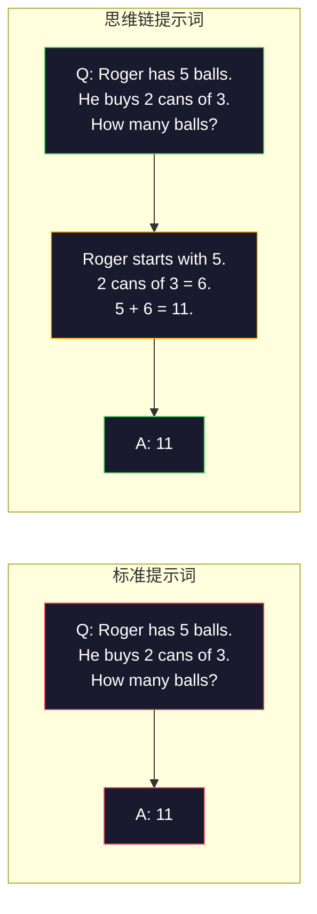
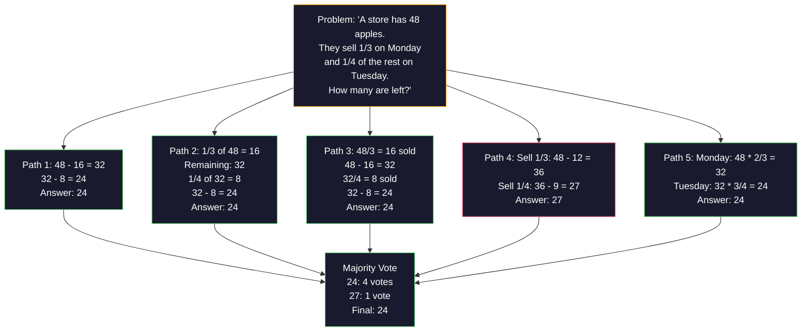
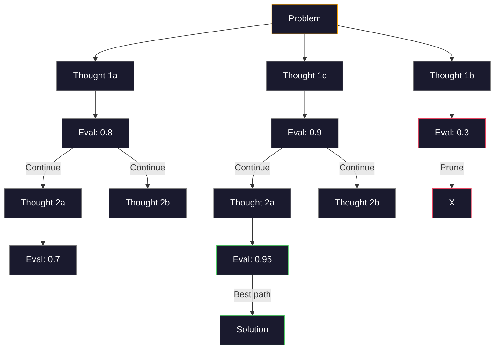

# 少样本、思维链、思维树

> 告模型何做是提示词。示它何思是工程。同模型、同任务、同数据78%与91%准确差距非更好模型。是更好推理策略。

**类型:** 构建
**语言:** Python
**前置要求:** 课程11.01(提示词工程)
**时间:** ~45分钟

## 学习目标

- 实少样本提示词选择和格式化例演示最大化任务准确
- 应用思维链(CoT)推理改进多步问题如数学文问题准确
- 建思维树提示词探索多推理路径择最好
- 测零样本vs少样本vs CoT于标准基准准确改进

## 问题背景

你建数学辅导应用。你提示词说："解这文问题。"GPT-5于GSM8K标准小学数学基准94%时间对。你以为已顶峰。你非——思维链仍加3-4点。

加五词——"Let's think step by step"——准确跳至91%。加几工例达95%。同模型。同温度。同API成本。唯一差是你给了模型草稿纸。

这不是hack。是推理何工作。人类不解多步问题一心理跳。transformer也不。当你强制模型生成中间token，那些token成下token上下文部分。每推理步喂下步。模型字面算其路至答。

但"逐步思考"是始非终。若你采五推理路径取多数票？若你让模型探可能性树，评估和剪枝分支？若你交错推理与工具用？这些非假设。是发表技术有测改进，你将在这课建全。

## 概念讲解

### 零样本vs少样本：何时例胜指令

零样本提示词给模型任务无他。少样本提示词给它例先。

Wei et al. (2022)测跨8基准。简任务如情感分类，零样本和少样本表现2%内。复杂任务如多步算术和符号推理，少样本改进准确10-25%。

直觉：例是压缩指令。不描述输出格式，你示它。不解释推理过程，你演示它。模型模式匹于例比解抽象指令可靠。


**何时少样本胜：**格式敏感任务、分类、结构抽取、域专术语、任模型须匹特模式任务。

**何时零样本胜：**简事实问、创任务例约束创造、找好例比写好指令更难任务。

### 例选择：相似胜随机

非所有例等。择例似于目标输入胜随机选择于分类任务5-15% (Liu et al., 2022)。三原则：

1. **语义相似**：择例最接近输入嵌入空间
2. **标签多样性**：覆所有输出类别你例
3. **难度匹配**：匹目标问题复杂度级

大多任务最优例数3-5。低于3，模型无足够信号提取模式。高于5，你达边际收益降和浪费上下文窗口token。对于多标签分类，每标签用一例。

### 思维链：给模型草稿纸

思维链(CoT)提示词由Wei et al. (2022)于Google Brain引。想法简：不仅问模型答，问它先示推理步。



为何这机械工作？每token transformer生成成下token上下文。无CoT，模型须压缩全推理入单前向传隐态。有CoT，模型外化中间计算为token。每推理token延有效计算深。

**GSM8K基准(小学数学，8.5K问题)：**

| 模型 | 零样本 | 零样本CoT | 少样本CoT |
|-------|-----------|---------------|--------------|
| GPT-4o | 78% | 91% | 95% |
| GPT-5 | 94% | 97% | 98% |
| o4-mini (推理) | 97% | — | — |
| Claude Opus 4.7 | 93% | 97% | 98% |
| Gemini 3 Pro | 92% | 96% | 98% |
| Llama 4 70B | 80% | 89% | 94% |
| DeepSeek-V3.1 | 89% | 94% | 96% |

**关于推理模型注。**模型如OpenAI o系列(o3, o4-mini)和DeepSeek-R1内部思维链后发答。加"Let's think step by step"于推理模型冗且有时反——它们已做。

两味CoT：

**零样本CoT**：附"Let's think step by step"于提示词。无例需。Kojima et al. (2022)示这单句改进准确跨算术、常识和符号推理任务。

**少样本CoT**：提供例含推理步。比零样本CoT更效因模型见你期望确切推理格式。

**何时CoT害：**简事实回忆("What is the capital of France?")、单步分类、速度比准确重要任务。CoT加50-200 token推理开销每查询。高吞吐、低复杂任务，那是浪费成本。

### 自一致：采多，投一

Wang et al. (2023)引自一致。洞察：单CoT路径可含推理错。但若你采N独立推理路径(用temperature > 0)并于终答取多数票，错取消。



自一致改进GSM8K准确从56.5%(单CoT)至74.4%用N=40于原PaLM 540B实验。于GPT-5改进小(97%至98%)因基准确已饱和。技术最耀于模型60-85%基CoT准确——单路径错频但不系统性甜点。对于推理模型(o系列, R1)自一致被内置内采样吞。

权衡：N样本意Nx API成本和延迟。实践，N=5捕多益。N=3是意票最小。N > 10对大多任务边际收益降。

### 思维树：分支探索

Yao et al. (2023)引思维树(ToT)。CoT随一线性推理路径，ToT探多分支并评估何最有望前继续。



ToT有三组件：

1. **思生成**：产多候选下步
2. **态评估**：评分每候选(可用LLM本身作评估器)
3. **搜算法**：BFS或DFS过树，剪低分分支

于Game of 24任务(合4数用算术造24)，GPT-4标准提示词解7.3%问题。有CoT，4.0%(CoT实害这因搜索空间宽)。有ToT，74%。

ToT贵。每树节点需LLM调用。分支因子3和深3树需至39 LLM调用。仅用于搜索空间大但可评问题——规划、解谜、带约束创问题解。

### ReAct：思 + 做

Yao et al. (2022)合推理迹与动作。模型交替思考(生成推理)和行动(调工具、搜、算)。

```mermaid
graph LR
    Q["Question:\nWhat is the\npopulation of the\ncountry where\nthe Eiffel Tower\nis located?"]
    T1["Thought: I need to\nfind which country\nhas the Eiffel Tower"]
    A1["Action: search\n'Eiffel Tower location'"]
    O1["Observation:\nParis, France"]
    T2["Thought: Now I need\nFrance's population"]
    A2["Action: search\n'France population 2024'"]
    O2["Observation:\n68.4 million"]
    T3["Thought: I have\nthe answer"]
    F["Answer:\n68.4 million"]

    Q --> T1 --> A1 --> O1 --> T2 --> A2 --> O2 --> T3 --> F

    style Q fill:#1a1a2e,stroke:#ffa500,color:#fff
    style T1 fill:#1a1a2e,stroke:#51cf66,color:#fff
    style A1 fill:#1a1a2e,stroke:#e94560,color:#fff
    style O1 fill:#1a1a2e,stroke:#808080,color:#fff
    style T2 fill:#1a1a2e,stroke:#51cf66,color:#fff
    style A2 fill:#1a1a2e,stroke:#e94560,color:#fff
    style O2 fill:#1a1a2e,stroke:#808080,color:#fff
    style T3 fill:#1a1a2e,stroke:#51cf66,color:#fff
    style F fill:#1a1a2e,stroke:#51cf66,color:#fff
```



ReAct胜纯CoT于知识密集任务因可基推理于真数据。于HotpotQA(多跳问答)，ReAct用GPT-4达35.1%精确匹vs CoT单29.4%。真力是推理错被观察纠正——模型可中更新计划。

ReAct是现代AI代理基。每代理框架(LangChain、CrewAI、AutoGen)实某变种思-动-察环。你将在阶段14建全代理。这课覆提示词模式。

### 结构提示词：XML标签、分隔符、标题

随提示词复杂，结构防模型混段。三法：

**XML标签** (Claude最好，处处扎实):
```
<context>
You are reviewing a pull request.
The codebase uses TypeScript and React.
</context>

<task>
Review the following diff for bugs, security issues, and style violations.
</task>

<diff>
{diff_content}
</diff>

<output_format>
List each issue with: file, line, severity (critical/warning/info), description.
</output_format>
```

**Markdown标题** (通用):
```
## Role
Senior security engineer at a fintech company.

## Task
Analyze this API endpoint for vulnerabilities.

## Input
{api_code}

## Rules
- Focus on OWASP Top 10
- Rate each finding: critical, high, medium, low
- Include remediation steps
```

**分隔符** (最小但效):
```
---INPUT---
{user_text}
---END INPUT---

---INSTRUCTIONS---
Summarize the above in 3 bullet points.
---END INSTRUCTIONS---
```

### 提示词链：序分解

些任务太复杂单提示词。提示词链裂成步，一提示词输出成下提示词输入。


链胜单提示词三因：

1. **每步更简**：模型处一聚焦任务而非杂一切
2. **中间输出可检**：你可在步间验和纠正
3. **不同步可异模型**：用便宜模型抽取，贵模型推理

### 性能比

| 技术 | 最适 | GSM8K准确(GPT-5) | API调用 | Token开销 | 复杂度 |
|-----------|----------|------------------------|-----------|----------------|------------|
| 零样本 | 简任务 | 94% | 1 | 无 | 微 |
| 少样本 | 格式匹 | 96% | 1 | 200-500 tokens | 低 |
| 零样本CoT | 快推理升 | 97% | 1 | 50-200 tokens | 微 |
| 少样本CoT | 最大单调用准确 | 98% | 1 | 300-600 tokens | 低 |
| 自一致(N=5) | 高风险推理 | 98.5% | 5 | 5x token成本 | 中 |
| 推理模型(o4-mini) | 替CoT | 97% | 1 | hidden (2-10x internal) | 微 |
| 思维树 | 搜索/规划问题 | N/A (74% on Game of 24) | 10-40+ | 10-40x token成本 | 高 |
| ReAct | 知识基推理 | N/A (35.1% on HotpotQA) | 3-10+ | 变 | 高 |
| 提示词链 | 复杂多步任务 | 96% (pipeline) | 2-5 | 2-5x token成本 | 中 |

正确技术依赖三因素：准确要求、延迟预算和成本容忍。对多生产系统，少样本CoT带3样本自一致回退覆90%用例。

## 构建

我们将建数学问题解器合少样本提示词、思维链推理和自一致投票于单管道。后我们加思维树于难问题。

全实`code/advanced_prompting.py`。以下是键组件。

### 步骤1: 少样本例库

首组件管少样本例并择最相关于给定问题。

```python
GSM8K_EXAMPLES = [
    {
        "question": "Janet's ducks lay 16 eggs per day. She eats three for breakfast every morning and bakes muffins for her friends every day with four. She sells every egg at the farmers' market for $2. How much does she make every day at the farmers' market?",
        "reasoning": "Janet's ducks lay 16 eggs per day. She eats 3 and bakes 4, using 3 + 4 = 7 eggs. So she has 16 - 7 = 9 eggs left. She sells each for $2, so she makes 9 * 2 = $18 per day.",
        "answer": "18"
    },
    ...
]
```

每例有三部分：问题、推理链和终答。推理链是何转常少样本例为CoT少样本例。

### 步骤2: 思维链提示词构建器

提示词构建器组系统消息、带推理链少样本例和目标问题于单提示词。

```python
def build_cot_prompt(question, examples, num_examples=3):
    system = (
        "You are a math problem solver. "
        "For each problem, show your step-by-step reasoning, "
        "then give the final numerical answer on the last line "
        "in the format: 'The answer is [number]'."
    )

    example_text = ""
    for ex in examples[:num_examples]:
        example_text += f"Q: {ex['question']}\n"
        example_text += f"A: {ex['reasoning']} The answer is {ex['answer']}.\n\n"

    user = f"{example_text}Q: {question}\nA:"
    return system, user
```

格式约束("The answer is [number]")关键。无它，自一致不可提取和比跨样本答。

### 步骤3: 自一致投票

采N推理路径取多数答。

```python
def self_consistency_solve(question, examples, client, model, n_samples=5):
    system, user = build_cot_prompt(question, examples)

    answers = []
    reasonings = []
    for _ in range(n_samples):
        response = client.chat.completions.create(
            model=model,
            messages=[
                {"role": "system", "content": system},
                {"role": "user", "content": user}
            ],
            temperature=0.7
        )
        text = response.choices[0].message.content
        reasonings.append(text)
        answer = extract_answer(text)
        if answer is not None:
            answers.append(answer)

    vote_counts = Counter(answers)
    best_answer = vote_counts.most_common(1)[0][0] if vote_counts else None
    confidence = vote_counts[best_answer] / len(answers) if best_answer else 0

    return best_answer, confidence, reasonings, vote_counts
```

温度0.7重要。于温度0.0，全N样本会同，败目的。你需要足够随机多样推理路径但不多模型产废话。

### 步骤4: 思维树解器

对于线性推理败问题，ToT探多法并评估何方向最有望。

```python
def tree_of_thought_solve(question, client, model, breadth=3, depth=3):
    thoughts = generate_initial_thoughts(question, client, model, breadth)
    scored = [(t, evaluate_thought(t, question, client, model)) for t in thoughts]
    scored.sort(key=lambda x: x[1], reverse=True)

    for current_depth in range(1, depth):
        next_thoughts = []
        for thought, score in scored[:2]:
            extensions = extend_thought(thought, question, client, model, breadth)
            for ext in extensions:
                ext_score = evaluate_thought(ext, question, client, model)
                next_thoughts.append((ext, ext_score))
        scored = sorted(next_thoughts, key=lambda x: x[1], reverse=True)

    best_thought = scored[0][0] if scored else ""
    return extract_answer(best_thought), best_thought
```

评估器本身LLM调用。你问模型："On a scale of 0.0 to 1.0, how promising is this reasoning path for solving the problem?"这是ToT键洞察——模型评估自己部分解。

### 步骤5: 全管道

管道合全技术带升策略。

```python
def solve_with_escalation(question, examples, client, model):
    system, user = build_cot_prompt(question, examples)
    single_response = call_llm(client, model, system, user, temperature=0.0)
    single_answer = extract_answer(single_response)

    sc_answer, confidence, _, _ = self_consistency_solve(
        question, examples, client, model, n_samples=5
    )

    if confidence >= 0.8:
        return sc_answer, "self_consistency", confidence

    tot_answer, _ = tree_of_thought_solve(question, client, model)
    return tot_answer, "tree_of_thought", None
```

升逻辑：试便宜(单CoT)先。若自一致置信低于0.8(少于4于5样本同意)，升至ToT。这平衡成本和准确——多问题便宜解，难问题得更多算。

## 使用

### LangChain

LangChain提供内建支持提示词模板和输出解析简少样本和CoT模式：

```python
from langchain_core.prompts import FewShotPromptTemplate, PromptTemplate
from langchain_openai import ChatOpenAI

example_prompt = PromptTemplate(
    input_variables=["question", "reasoning", "answer"],
    template="Q: {question}\nA: {reasoning} The answer is {answer}."
)

few_shot_prompt = FewShotPromptTemplate(
    examples=examples,
    example_prompt=example_prompt,
    suffix="Q: {input}\nA: Let's think step by step.",
    input_variables=["input"]
)

llm = ChatOpenAI(model="gpt-4o", temperature=0.7)
chain = few_shot_prompt | llm
result = chain.invoke({"input": "If a train travels 120 km in 2 hours..."})
```

LangChain也有`ExampleSelector`类语义相似选择：

```python
from langchain_core.example_selectors import SemanticSimilarityExampleSelector
from langchain_openai import OpenAIEmbeddings

selector = SemanticSimilarityExampleSelector.from_examples(
    examples,
    OpenAIEmbeddings(),
    k=3
)
```

### DSPy

DSPy把提示词策略作可优模块。不手工CoT提示词，你定义签名并让DSPy优提示词：

```python
import dspy

dspy.configure(lm=dspy.LM("openai/gpt-4o", temperature=0.7))

class MathSolver(dspy.Module):
    def __init__(self):
        self.solve = dspy.ChainOfThought("question -> answer")

    def forward(self, question):
        return self.solve(question=question)

solver = MathSolver()
result = solver(question="Janet's ducks lay 16 eggs per day...")
```

DSPy的`ChainOfThought`自动加推理迹。`dspy.majority`实自一致：

```python
result = dspy.majority(
    [solver(question=q) for _ in range(5)],
    field="answer"
)
```

### 比：从零vs框架

| 特 | 从零(这课) | LangChain | DSPy |
|---------|--------------------------|-----------|------|
| 提示词格式控 | 全 | 模板基 | 自动 |
| 自一致 | 手投 | 手 | 内(`dspy.majority`) |
| 例选择 | 自定义逻辑 | `ExampleSelector` | `dspy.BootstrapFewShot` |
| 思维树 | 自树搜 | 社区链 | 未内建 |
| 提示词优化 | 手迭代 | 手 | 自动编译 |
| 最适 | 学、自定义管道 | 标准工作流 | 研、优化 |

## 交付成果

这课产两制品。

**1. 推理链提示词** (`outputs/prompt-reasoning-chain.md`):生产就绪提示词模板少样本CoT带自一致。插入你例和问题域。

**2. CoT模式选择技能** (`outputs/skill-cot-patterns.md`): 决框架择正确推理技术基于任务类型、准确要求和成本约束。

## 练习题

1. **测差距**：取10 GSM8K问题。每用零样本、少样本、零样本CoT和少样本CoT解。记每准确。何技术给你模型最大升？

2. **例选择实验**：对同10问题，比随机例选择vs手选相似例。测准确差。何时例质量比例数量更重要？

3. **自一致成本曲线**：跑自一致用N=1, 3, 5, 7, 10于20 GSM8K问题。绘准确vs成本(总token)。你模型曲线膝在哪？

4. **建ReAct环**：延管道加计算器工具。当模型生成数学表达式，用Python `eval()`执行(沙箱)并喂结果回。测工具基推理胜纯CoT否。

5. **ToT创任务**：适配思维树解器创写任务："Write a 6-word story that is both funny and sad." 用LLM作评估器。分支探索产更好创输出胜单次生成？

## 关键术语

| 术语 | 人们怎么说 | 实际含义 |
|------|----------------|----------------------|
| 少样本提示词 | "给些例" | 含输入/输出演示在提示词锚模型输出格式和行为 |
| 思维链 | "让它逐步思考" | 引中间推理token延模型有效计算前产终答 |
| 自一致 | "跑多次" | 用temperature > 0采N多样推理路径并择最常终答多数票 |
| 思维树 | "让它探索选项" | 结构搜索推理分支每部分解评估仅有望路径扩 |
| ReAct | "思考 + 工具用" | 交错推理迹与外动作(搜索、计算、API调用)思-动-察环 |
| 提示词链 | "裂成步" | 分解复杂任务序提示词每输出喂下输入 |
| 零样本CoT | "加'逐步思考'" | 附推理触发短语于提示词无例，依赖模型潜推理能力 |

## 延伸阅读

- [Chain-of-Thought Prompting Elicits Reasoning in Large Language Models](https://arxiv.org/abs/2201.11903) — Wei et al. 2022. Google Brain原CoT论文。读节2-3核心结果。
- [Self-Consistency Improves Chain of Thought Reasoning in Language Models](https://arxiv.org/abs/2203.11171) — Wang et al. 2023. 自一致论文。表1有你需全数。
- [Tree of Thoughts: Deliberate Problem Solving with Large Language Models](https://arxiv.org/abs/2305.10601) — Yao et al. 2023. ToT论文。Game of 24结果节4亮点。
- [ReAct: Synergizing Reasoning and Acting in Language Models](https://arxiv.org/abs/2210.03629) — Yao et al. 2022. 现代AI代理基。节3解思-动-察环。
- [Large Language Models are Zero-Shot Reasoners](https://arxiv.org/abs/2205.11916) — Kojima et al. 2022. "Let's think step by step"论文。简但惊效。
- [DSPy: Compiling Declarative Language Model Calls into Self-Improving Pipelines](https://arxiv.org/abs/2310.03714) — Khattab et al. 2023. 把提示词当编译问题。读若想移超手工提示词工程。
- [OpenAI — Reasoning models guide](https://platform.openai.com/docs/guides/reasoning) — 供方指导何时思维链成内按token计价"推理"模式vs提示词级窍。
- [Lightman et al., "Let's Verify Step by Step" (2023)](https://arxiv.org/abs/2305.20050) — 过程奖模型(PRM)评分链每步；推理监督信号胜纯结果奖。
- [Snell et al., "Scaling LLM Test-Time Compute Optimally" (2024)](https://arxiv.org/abs/2408.03314) — CoT长、自一致采样和MCTS系统研究；"逐步思考"何去当准确比延迟重要。