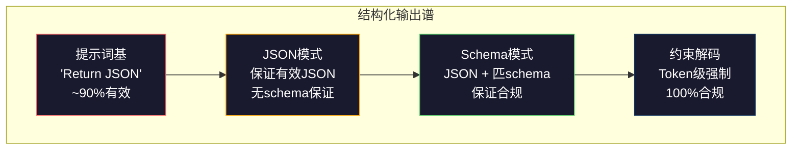
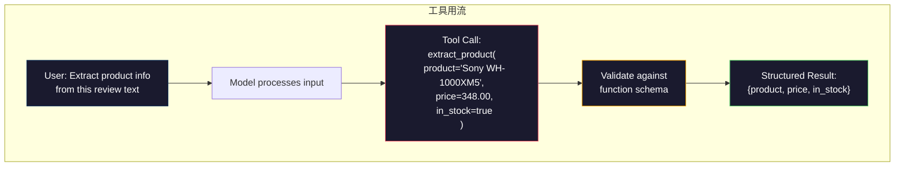

# 结构化输出：JSON、Schema验证、约束解码

> 你LLM返串。你应用需JSON。那差距崩比任模型幻觉多生产系统。结构化输出是自然语言与类型数据间桥。得正确你LLM成可靠API。得错你凌晨3点用正则解析自由文。

**类型:** 构建
**语言:** Python
**前置要求:** 阶段10课程01-05(从零LLM)
**时间:** ~90分钟
**相关:** 阶段5课程20(结构化输出&约束解码)覆解码级理论(FSM/CFG logit处理器、Outlines、XGrammar)。这课聚焦生产SDK面(OpenAI `response_format`、Anthropic tool use、Instructor) — 若想解API下何先读阶段5课程20。

## 学习目标

- 用OpenAI和Anthropic API参数实JSON模式和schema约束输出
- Pydantic验证层拒畸形LLM输出并带错反馈重试
- 解释约束解码何在token级强制有效JSON无后处理
- 设计健抽取提示词可靠转非结构文为类型数据结构

## 问题背景

你问LLM："从这文抽产品名、价格和库存。"它响应：

```
The product is the Sony WH-1000XM5 headphones, which cost $348.00 and are currently in stock.
```

那是完全正确答。它也对你的应用完全无用。你库存系统需`{"product": "Sony WH-1000XM5", "price": 348.00, "in_stock": true}`。你需要JSON对象带特定键、特定类型和特定值约束。你不需要句。

朴素解：加"Respond in JSON"到你提示词。这90%时间工作。他10%模型包JSON于markdown代码围栏，或加前言如"Here's the JSON:"，或产语法无效JSON因它早关括。你JSON解析崩。你管道断。你加try/except和重试环。重试有时产不同数据。现你有一致性问题加解析问题。

这不是提示词工程问题。是解码问题。模型左到右生成token。每位置，它从100K+选项词表择最似下token。多那些选项会在任给定位置产无效JSON。若模型刚发`{"price":`，下token须是数、引(串)、`null`、`true`、`false`或负号。他他产无效JSON。无约束，模型可择完全合理英文词语法灾难错。

## 概念讲解

### 结构化输出谱

有四级结构化输出控，每级比前更可靠。



**提示词基** ("Respond in valid JSON"): 无强制。模型常合规有时不。可靠：~90%。失败模式：markdown围栏、前言文、截输出、错结构。

**JSON模式**: API保证输出有效JSON。OpenAI `response_format: { type: "json_object" }`启。输出会解析无错。但它可不匹你期望schema — 多键、错类型、缺字段。

**Schema模式**: API取JSON Schema并保证输出匹它。2026每主供方原生支：OpenAI `response_format: { type: "json_schema", json_schema: {...} }` (也作`tool_choice="required"`)、Anthropic tool use带`input_schema`、Gemini `response_schema` + `response_mime_type: "application/json"`。输出有确切键、类型和约束你指定。

**约束解码**: 每token位置生成时，解码器掩全会产无效输出token。若schema需数模型将发字母，那token概率置零。模型只能产token致有效输出。这是OpenAI结构化输出模式和库如Outlines和Guidance内实。

### JSON Schema: 契约语言

JSON Schema是你告诉模型(或验证层)输出形何。每主结构化输出系统用。

```json
{
  "type": "object",
  "properties": {
    "product": { "type": "string" },
    "price": { "type": "number", "minimum": 0 },
    "in_stock": { "type": "boolean" },
    "categories": {
      "type": "array",
      "items": { "type": "string" }
    }
  },
  "required": ["product", "price", "in_stock"]
}
```

这schema说：输出须是对象带串`product`、非负数`price`、布尔`in_stock`和可选串数组`categories`。任何不匹输出拒。

schema处理难例：嵌对象、带类型项数组、enum(约束串至特定值)、模式匹(串上正则)和组合器(oneOf、anyOf、allOf多变输出)。

### Pydantic模式

Python，你不手写JSON Schema。你定义Pydantic模型它为你生成schema。

```python
from pydantic import BaseModel

class Product(BaseModel):
    product: str
    price: float
    in_stock: bool
    categories: list[str] = []
```

这产同上JSON Schema。Instructor库(和OpenAI SDK)接Pydantic模型直：传模型类，返验证实例。若LLM输出不匹，Instructor自动重试。

### 函数调用/工具用

同问题替代接口。不问模型直产JSON，你定义"工具"(函数)带类型参数。模型输出带结构参数函数调用。OpenAI叫这"函数调用"。Anthropic叫"工具用"。结果同：结构数据。



工具用偏好当模型须择何函数调用，非仅填参数。若你有10不同抽取schema模型须基于输入择正确，工具用给你schema选择和结构化输出。

### 常失败模式

即使有schema强制，结构化输出可微方式失败。

**幻觉值**：输出匹schema但含虚构数据。模型产`{"price": 299.99}`当文说$348。Schema验证不可捕这 — 类型对，值错。

**Enum混淆**：你约束字段至`["in_stock", "out_of_stock", "preorder"]`。模型输`"available"` — 语义对，但不允集。好约束解码防这。提示词基法不。

**嵌对象深**：深嵌schema(4+级)产更多错。每嵌级是另一模型可失结构处。

**数组长度**：模型可产数组中太多或太少项。Schema支`minItems`和`maxItems`但非所有供方在解码级强制。

**可选字段遗漏**：模型漏技术上可选但你用例语义重要字段。在schema设为required即使数据有时缺 — 强模型显产`null`。

## 构建

### 步骤1: JSON Schema验证器

从零建验证器检查Python对象是否匹JSON Schema。这是输出侧运行验合规。

```python
import json

def validate_schema(data, schema):
    errors = []
    _validate(data, schema, "", errors)
    return errors

def _validate(data, schema, path, errors):
    schema_type = schema.get("type")

    if schema_type == "object":
        if not isinstance(data, dict):
            errors.append(f"{path}: expected object, got {type(data).__name__}")
            return
        for key in schema.get("required", []):
            if key not in data:
                errors.append(f"{path}.{key}: required field missing")
        properties = schema.get("properties", {})
        for key, value in data.items():
            if key in properties:
                _validate(value, properties[key], f"{path}.{key}", errors)

    elif schema_type == "array":
        if not isinstance(data, list):
            errors.append(f"{path}: expected array, got {type(data).__name__}")
            return
        min_items = schema.get("minItems", 0)
        max_items = schema.get("maxItems", float("inf"))
        if len(data) < min_items:
            errors.append(f"{path}: array has {len(data)} items, minimum is {min_items}")
        if len(data) > max_items:
            errors.append(f"{path}: array has {len(data)} items, maximum is {max_items}")
        items_schema = schema.get("items", {})
        for i, item in enumerate(data):
            _validate(item, items_schema, f"{path}[{i}]", errors)

    elif schema_type == "string":
        if not isinstance(data, str):
            errors.append(f"{path}: expected string, got {type(data).__name__}")
            return
        enum_values = schema.get("enum")
        if enum_values and data not in enum_values:
            errors.append(f"{path}: '{data}' not in allowed values {enum_values}")

    elif schema_type == "number":
        if not isinstance(data, (int, float)):
            errors.append(f"{path}: expected number, got {type(data).__name__}")
            return
        minimum = schema.get("minimum")
        maximum = schema.get("maximum")
        if minimum is not None and data < minimum:
            errors.append(f"{path}: {data} is less than minimum {minimum}")
        if maximum is not None and data > maximum:
            errors.append(f"{path}: {data} is greater than maximum {maximum}")

    elif schema_type == "boolean":
        if not isinstance(data, bool):
            errors.append(f"{path}: expected boolean, got {type(data).__name__}")

    elif schema_type == "integer":
        if not isinstance(data, int) or isinstance(data, bool):
            errors.append(f"{path}: expected integer, got {type(data).__name__}")
```

### 步骤2: Pydantic风格模型至Schema

建最小类至schema转换器。定义Python类并自动生成其JSON Schema。

```python
class SchemaField:
    def __init__(self, field_type, required=True, default=None, enum=None, minimum=None, maximum=None):
        self.field_type = field_type
        self.required = required
        self.default = default
        self.enum = enum
        self.minimum = minimum
        self.maximum = maximum

def python_type_to_schema(field):
    type_map = {
        str: "string",
        int: "integer",
        float: "number",
        bool: "boolean",
    }

    schema = {}

    if field.field_type in type_map:
        schema["type"] = type_map[field.field_type]
    elif field.field_type == list:
        schema["type"] = "array"
        schema["items"] = {"type": "string"}
    elif isinstance(field.field_type, dict):
        schema = field.field_type

    if field.enum:
        schema["enum"] = field.enum
    if field.minimum is not None:
        schema["minimum"] = field.minimum
    if field.maximum is not None:
        schema["maximum"] = field.maximum

    return schema

def model_to_schema(name, fields):
    properties = {}
    required = []

    for field_name, field in fields.items():
        properties[field_name] = python_type_to_schema(field)
        if field.required:
            required.append(field_name)

    return {
        "type": "object",
        "properties": properties,
        "required": required,
    }
```

### 步骤3: 约束Token过滤器

模拟约束解码。给定部分JSON串和schema，确定当前位置何token类别有效。

```python
def next_valid_tokens(partial_json, schema):
    stripped = partial_json.strip()

    if not stripped:
        return ["{"]

    try:
        json.loads(stripped)
        return ["<EOS>"]
    except json.JSONDecodeError:
        pass

    last_char = stripped[-1] if stripped else ""

    if last_char == "{":
        return ['"', "}"]
    elif last_char == '"':
        if stripped.endswith('":'):
            return ['"', "0-9", "true", "false", "null", "[", "{"]
        return ["a-z", '"']
    elif last_char == ":":
        return [" ", '"', "0-9", "true", "false", "null", "[", "{"]
    elif last_char == ",":
        return [" ", '"', "{", "["]
    elif last_char in "0123456789":
        return ["0-9", ".", ",", "}", "]"]
    elif last_char == "}":
        return [",", "}", "]", "<EOS>"]
    elif last_char == "]":
        return [",", "}", "<EOS>"]
    elif last_char == "[":
        return ['"', "0-9", "true", "false", "null", "{", "[", "]"]
    else:
        return ["any"]

def demonstrate_constrained_decoding():
    partial_states = [
        '',
        '{',
        '{"product"',
        '{"product":',
        '{"product": "Sony"',
        '{"product": "Sony",',
        '{"product": "Sony", "price":',
        '{"product": "Sony", "price": 348',
        '{"product": "Sony", "price": 348}',
    ]

    print(f"{'Partial JSON':<45} {'Valid Next Tokens'}")
    print("-" * 80)
    for state in partial_states:
        valid = next_valid_tokens(state, {})
        display = state if state else "(empty)"
        print(f"{display:<45} {valid}")
```

### 步骤4: 抽取管道

合一切为抽取管道：定义schema、模拟LLM产结构化输出、验证输出并处理重试。

```python
def simulate_llm_extraction(text, schema, attempt=0):
    if "headphones" in text.lower() or "sony" in text.lower():
        if attempt == 0:
            return '{"product": "Sony WH-1000XM5", "price": 348.00, "in_stock": true, "categories": ["audio", "headphones"]}'
        return '{"product": "Sony WH-1000XM5", "price": 348.00, "in_stock": true}'

    if "laptop" in text.lower():
        return '{"product": "MacBook Pro 16", "price": 2499.00, "in_stock": false, "categories": ["computers"]}'

    return '{"product": "Unknown", "price": 0, "in_stock": false}'

def extract_with_retry(text, schema, max_retries=3):
    for attempt in range(max_retries):
        raw = simulate_llm_extraction(text, schema, attempt)

        try:
            data = json.loads(raw)
        except json.JSONDecodeError as e:
            print(f"  Attempt {attempt + 1}: JSON parse error -- {e}")
            continue

        errors = validate_schema(data, schema)
        if not errors:
            return data

        print(f"  Attempt {attempt + 1}: Schema validation errors -- {errors}")

    return None

product_schema = {
    "type": "object",
    "properties": {
        "product": {"type": "string"},
        "price": {"type": "number", "minimum": 0},
        "in_stock": {"type": "boolean"},
        "categories": {"type": "array", "items": {"type": "string"}},
    },
    "required": ["product", "price", "in_stock"],
}
```

### 步骤5: 运全管道

```python
def run_demo():
    print("=" * 60)
    print("  Structured Output Pipeline Demo")
    print("=" * 60)

    print("\n--- Schema Definition ---")
    product_fields = {
        "product": SchemaField(str),
        "price": SchemaField(float, minimum=0),
        "in_stock": SchemaField(bool),
        "categories": SchemaField(list, required=False),
    }
    generated_schema = model_to_schema("Product", product_fields)
    print(json.dumps(generated_schema, indent=2))

    print("\n--- Schema Validation ---")
    test_cases = [
        ({"product": "Test", "price": 10.0, "in_stock": True}, "Valid object"),
        ({"product": "Test", "price": -5.0, "in_stock": True}, "Negative price"),
        ({"product": "Test", "in_stock": True}, "Missing price"),
        ({"product": "Test", "price": "ten", "in_stock": True}, "String as price"),
        ("not an object", "String instead of object"),
    ]

    for data, label in test_cases:
        errors = validate_schema(data, product_schema)
        status = "PASS" if not errors else f"FAIL: {errors}"
        print(f"  {label}: {status}")

    print("\n--- Constrained Decoding Simulation ---")
    demonstrate_constrained_decoding()

    print("\n--- Extraction Pipeline ---")
    texts = [
        "The Sony WH-1000XM5 headphones are priced at $348 and currently available.",
        "The new MacBook Pro 16-inch laptop costs $2499 but is sold out.",
        "This is a random sentence with no product info.",
    ]

    for text in texts:
        print(f"\n  Input: {text[:60]}...")
        result = extract_with_retry(text, product_schema)
        if result:
            print(f"  Output: {json.dumps(result)}")
        else:
            print(f"  Output: FAILED after retries")
```

## 使用

### OpenAI结构化输出

```python
# from openai import OpenAI
# from pydantic import BaseModel
#
# client = OpenAI()
#
# class Product(BaseModel):
#     product: str
#     price: float
#     in_stock: bool
#
# response = client.beta.chat.completions.parse(
#     model="gpt-5-mini",
#     messages=[
#         {"role": "system", "content": "Extract product information."},
#         {"role": "user", "content": "Sony WH-1000XM5, $348, in stock"},
#     ],
#     response_format=Product,
# )
#
# product = response.choices[0].message.parsed
# print(product.product, product.price, product.in_stock)
```

OpenAI结构化输出模式内用约束解码。每模型生成token保证产匹Pydantic schema输出。无重试需。无验证需。约束烘焙入解码过程。

### Anthropic工具用

```python
# import anthropic
#
# client = anthropic.Anthropic()
#
# response = client.messages.create(
#     model="claude-opus-4-7",
#     max_tokens=1024,
#     tools=[{
#         "name": "extract_product",
#         "description": "Extract product information from text",
#         "input_schema": {
#             "type": "object",
#             "properties": {
#                 "product": {"type": "string"},
#                 "price": {"type": "number"},
#                 "in_stock": {"type": "boolean"},
#             },
#             "required": ["product", "price", "in_stock"],
#         },
#     }],
#     messages=[{"role": "user", "content": "Extract: Sony WH-1000XM5, $348, in stock"}],
# )
```

Anthropic通过工具用实现结构化输出。模型发带结构参数工具调用匹input_schema。同结果，不同API面。

### Instructor库

```python
# pip install instructor
# import instructor
# from openai import OpenAI
# from pydantic import BaseModel
#
# client = instructor.from_openai(OpenAI())
#
# class Product(BaseModel):
#     product: str
#     price: float
#     in_stock: bool
#
# product = client.chat.completions.create(
#     model="gpt-5-mini",
#     response_model=Product,
#     messages=[{"role": "user", "content": "Sony WH-1000XM5, $348, in stock"}],
# )
```

Instructor包任何LLM客户端加自动重试带验证。若首尝试失败验证，它发错回模型作上下文并请它修输出。这工作于任何供方，非仅OpenAI。

## 交付成果

这课产`outputs/prompt-structured-extractor.md` — 可复提示词模板从任何文抽取结构数据给定schema定义。喂它JSON Schema和非结构文，它返验证JSON。

也产`outputs/skill-structured-outputs.md` — 决框架择正确结构化输出策略基于你供方、可靠性要求和schema复杂度。

## 练习题

1. 扩schema验证器支`oneOf`(数据须匹数schema中确切一)。这处理多变输出 — 例如，字段可是`Product`或`Service`对象带不同形。

2. 建"schema diff"工具比两schema识破改(删required字段、改类型)vs非破改(加可选字段、放约束)。这对生产版你抽取schema关键。

3. 实更现实约束解码模拟器。给JSON Schema和100 token词表(字母、数、标点、关键词)，逐步走生成，每位置掩无效token。测每步词表百分比有效。

4. 抽取评估套。创50产品描述带手标JSON输出。于全50跑你抽取管道测精确匹、字段级准确和类型合规。识何字段最难正确抽取。

5. 加"置信分"到你抽取管道。对每抽字段，估模型置信(基于token概率，或跑抽取3次测一致性)。标低置信字段人审。

## 关键术语

| 术语 | 人们怎么说 | 实际含义 |
|------|----------------|----------------------|
| JSON模式 | "返JSON" | API标志保证语法有效JSON输出，但不强任何特schema |
| 结构化输出 | "类型JSON" | 匹特JSON Schema输出带正确键、类型和约束 |
| 约束解码 | "导生成" | 每token位置掩会产无效输出token — 保证100% schema合规 |
| JSON Schema | "JSON模板" | 描述JSON数据结构、类型和约束声明语言(用于OpenAPI、JSON Forms等) |
| Pydantic | "Python dataclasses+" | Python库定义数据模型带类型验证，用于FastAPI和Instructor生成JSON Schema |
| 函数调用 | "工具用" | LLM输出结构函数调用(名+类型参数)代自由文 — OpenAI和Anthropic都支 |
| Instructor | "LLM的Pydantic" | Python库包LLM客户端返验证Pydantic实例，验证失败自动重试 |
| Token掩 | "过滤词表" | 生成时设置特定token概率为零使模型不可产它们 |
| Schema合规 | "匹形" | 输出有每required字段、正确类型、值在约束内和无多禁字段 |
| 重试环 | "试到工作" | 发验证错回模型并请它修输出 — Instructor自动做，至可配最大 |

## 延伸阅读

- [OpenAI结构化输出指南](https://platform.openai.com/docs/guides/structured-outputs) — OpenAI API JSON Schema基约束解码官方文档
- [Willard & Louf, 2023 — "Efficient Guided Generation for Large Language Models"](https://arxiv.org/abs/2307.09702) — Outlines论文，描述何编译JSON Schema为有限状态机token级约束
- [Instructor文档](https://python.useinstructor.com/) — 从任何LLM得结构化输出带Pydantic验证和重试标准库
- [Anthropic工具用指南](https://docs.anthropic.com/en/docs/tool-use) — Claude何通过工具用带JSON Schema input_schema实现结构化输出
- [JSON Schema规范](https://json-schema.org/) — 每主结构化输出系统用schema语言全规
- [Outlines库](https://github.com/outlines-dev/outlines) — 用正则和JSON Schema编译为有限状态机开源约束生成
- [Dong et al., "XGrammar: Flexible and Efficient Structured Generation Engine for Large Language Models" (MLSys 2025)](https://arxiv.org/abs/2411.15100) — 当前最佳grammar引擎；下推自动机编译掩token约100 ns/token。
- [Beurer-Kellner et al., "Prompting Is Programming: A Query Language for Large Language Models" (LMQL)](https://arxiv.org/abs/2212.06094) — LMQL论文把约束解码框架为带类型和值约束查询语言。
- [Microsoft Guidance (framework docs)](https://github.com/guidance-ai/guidance) — 模板驱约束生成；Outlines和XGrammar供方无感补充。