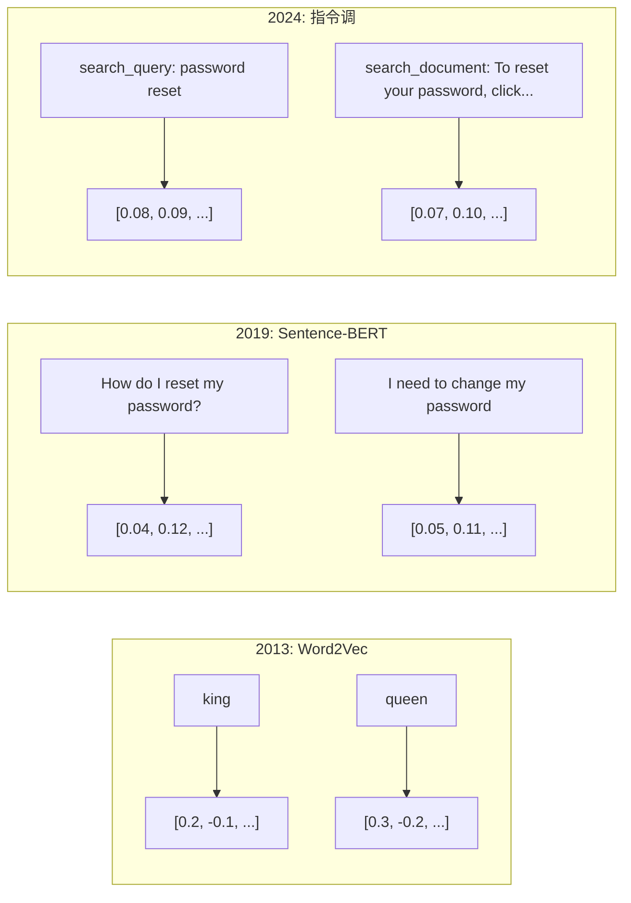
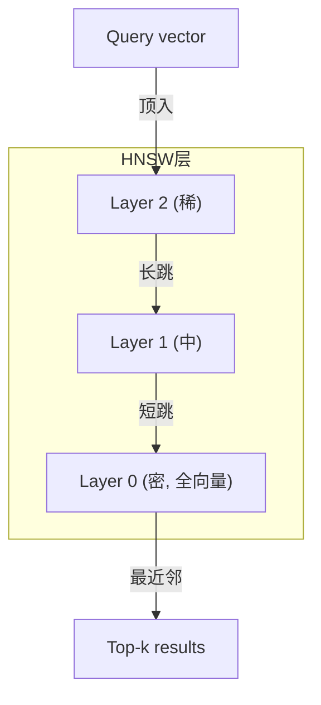

# 嵌入与向量表示

> 文是离散。数是连续。每次你请LLM找"相似"文档、比含义或搜索超关键词，你依赖这两世界间桥。那桥是嵌入。若你不解嵌入，你不解现代AI。你仅用它。

**类型:** 构建
**语言:** Python
**前置要求:** 阶段11课程01(提示词工程)
**时间:** ~75分钟
**相关:** 阶段5课程22(嵌入模型深潜)覆密vs稀vs多向量、Matryoshka截断和每轴模型选择。这课聚焦生产管道(向量DB、HNSW、相似数)。择模型前读阶段5课程22。

## 学习目标

- 用API提供方和开源模型生成文嵌入，并算它们间余弦相似
- 解释为何嵌入解关键词搜索不可处词表不配问题
- 语义搜索索引按含义而非精确关键词匹检索文档
- 用检索基准(precision@k、recall)评估嵌入质量并为任务择正确嵌入模型

## 问题背景

你有10,000支持票。客户写"my payment didn't go through."你需找似过去票。关键词搜索找含"payment"和"didn't go through"票。它漏"transaction failed"、"charge was declined"和"billing error."这些票描述完全同问题完全异词。

这是词表不配问题。人类语言有数十法说同事。关键词搜索把每词作独立符号无含义。它不可知"declined"和"didn't go through"指同概念。

你需要文本表示含义而非拼写定相似。你需要法放"my payment didn't go through"和"transaction was declined"近于某数学空间，而推"my payment arrived on time"远尽管共享词"payment."

那表示是嵌入。

## 概念讲解

### 何是嵌入？

嵌入是表示文含义浮点数密向量。"密"重要 — 每维载信息，不像稀疏表示(词袋、TF-IDF)多大维为零。

"The cat sat on the mat"成某如`[0.023, -0.041, 0.087, ..., 0.012]` — 768到3072数列表依赖模型。这些数编码含义。你永不直检。你比。

### Word2Vec突破

2013年，Tomas Mikolov和同事于Google发Word2Vec。核心洞察：训神经网络从邻居预词(或从词预邻居)，隐层权重成有意义向量表示。

著名结果：

```
king - man + woman = queen
```

词嵌入上向量算捕语义关系。"man"到"woman"方向大致同于"king"到"queen."这是域意识到几何可编码含义时刻。

Word2Vec产300维向量。每词得一向量无关上下文。"Bank"于"river bank"和"bank account"有同嵌入。这限制驱下十年研。

### 从词到句

词嵌入表示单token。生产系统需嵌入全句、段落或文档。四法现：

**平均**：取句中全词向量均值。便宜、损、短文惊好。全失词序 — "dog bites man"和"man bites dog"得同嵌入。

**CLS token**：transformer模型(BERT, 2018)输特殊[CLS] token嵌入表示全输入。比平均好但[CLS] token训于下句预测，非相似。

**对比学习**：显训模型推相似对近和不相似对远。Sentence-BERT (Reimers & Gurevych, 2019)用此法成现代嵌入模型基。给"How do I reset my password?"和"I need to change my password,"模型学这些应有几乎同向量。

**指令调嵌入**：最新法。模型如E5和GTE接受任务前缀("search_query:"、"search_document:")告诉模型产何嵌入。这让一模型服多任务。



### 现代嵌入模型

市场已定于 handful生产级选项(MTEB分数2026初，MTEB v2):

| 模型 | 提供方 | 维 | MTEB | 上下文 | 成本/1M tokens |
|-------|----------|-----------|------|---------|------------------|
| Gemini Embedding 2 | Google | 3072 (Matryoshka) | 67.7 (retrieval) | 8192 | $0.15 |
| embed-v4 | Cohere | 1024 (Matryoshka) | 65.2 | 128K | $0.12 |
| voyage-4 | Voyage AI | 1024/2048 (Matryoshka) | 66.8 | 32K | $0.12 |
| text-embedding-3-large | OpenAI | 3072 (Matryoshka) | 64.6 | 8192 | $0.13 |
| text-embedding-3-small | OpenAI | 1536 (Matryoshka) | 62.3 | 8192 | $0.02 |
| BGE-M3 | BAAI | 1024 (密+稀+ColBERT) | 63.0多语言 | 8192 | 开权重 |
| Qwen3-Embedding | Alibaba | 4096 (Matryoshka) | 66.9 | 32K | 开权重 |
| Nomic-embed-v2 | Nomic | 768 (Matryoshka) | 63.1 | 8192 | 开权重 |

MTEB (Massive Text Embedding Benchmark) v2覆100+任务跨检索、分类、聚类、重排和总结。高好。2026，开权重模型(Qwen3-Embedding、BGE-M3)匹或胜闭托管模型于多轴。Gemini Embedding 2纯检索领先；Voyage/Cohere特定域领先(金融、法律、代码)。总是你自查询基准前承诺。

### 相似度指标

给两嵌入向量，三法测何相似：

**余弦相似**：两向量间角余弦。范围-1(相反)到1(同向)。忽略大小 — 10词句和500词文档可得分1.0若指向同方向。这是90%用例默。

```
cosine_sim(a, b) = dot(a, b) / (||a|| * ||b||)
```

**点积**：两向量原内积。当向量归一化(单位长)同于余弦相似。更快算。OpenAI嵌入归一化，故点积和余弦给同排。

```
dot(a, b) = sum(a_i * b_i)
```

**欧氏(L2)距离**：向量空间直线距离。小=更相似。敏大小差。用于绝对空间位置重要而非仅方向。

```
L2(a, b) = sqrt(sum((a_i - b_i)^2))
```

何时用何：

| 指标 | 何时用 | 避免何时 |
|--------|----------|------------|
| 余弦相似 | 比异长文本；多检索任务 | 大小载信息 |
| 点积 | 嵌入已归一化；最大速 | 向量有异大小 |
| 欧氏距离 | 聚类；空间最近邻问题 | 比狂异长文档 |

### 向量数据库和HNSW

暴力相似搜索比查询向量对每存向量。于100万向量1536维，那是每查询15亿乘加操作。太慢。

向量数据库用近似最近邻(ANN)算法解。主导算法HNSW (Hierarchical Navigable Small World):

1. 建向量多层图
2. 顶层稀 — 远簇间长连接
3. 底层密 — 近向量间细粒连接
4. 搜索始顶层，贪心下降精化
5. 返回近似top-k结果O(log n)时间代O(n)

HNSW交小准确损(典型95-99%召回)巨大速益。于1000万向量，暴力秒。HNSW毫秒。



生产选项：

| 数据库 | 类型 | 最适 | 最大规模 |
|----------|------|----------|-----------|
| Pinecone | 托管SaaS | 零运生产 | 十亿 |
| Weaviate | 开源 | 自托、混搜索 | 100M+ |
| Qdrant | 开源 | 高性能、过滤 | 100M+ |
| ChromaDB | 嵌入 | 原型、本地开发 | 1M |
| pgvector | Postgres扩展 | 已用Postgres | 10M |
| FAISS | 库 | 进程、研 | 1B+ |

### 分块策略

文档太长嵌入为单向量。50页PDF覆十主题 — 其嵌入成一切平均，似无具体。你裂文档为块并嵌入每块。

**定大分块**：每N token裂带M token重叠。简可预测。当文档无清晰结构工作好。512 token块带50 token重叠：块1是token 0-511，块2是token 462-973。

**句基分块**：于句边界裂，组句至达token限。每块至少一完整句。比定大好因你永不裂思半。

**递归分块**：先试裂于最大边界(节标题)。若仍太大，试段落边界。后句边界。后字符限。这是LangChain `RecursiveCharacterTextSplitter`对混格式语料工作好。

**语义分块**：嵌入每句，后组连续句嵌入相似。当嵌入相似降至阈值下，始新块。贵(需嵌入每句单独)但产最一致块。

| 策略 | 复杂 | 质量 | 最适 |
|----------|-----------|---------|----------|
| 定大 | 低 | 尚可 | 无结构文、日志 |
| 句基 | 低 | 好 | 文章、邮件 |
| 递归 | 中 | 好 | Markdown、HTML、混文档 |
| 语义 | 高 | 最佳 | 关键检索质量 |

多系统甜点：256-512 token块带50 token重叠。

### 双编码器vs交叉编码器

双编码器独立嵌入查询和文档，后比向量。快 — 你嵌入查询一次比预计算文档嵌入。这是你用于检索。

交叉编码器取查询和文档作单输入并输出相关分。慢 — 它处理每查询文档对通过全模型。但更准确因可跨查询和文档token同时注意。

生产模式：双编码器检索top-100候选，交叉编码器重排它们至top-10。这是检索后重排管道。


重排模型：Cohere Rerank 3.5 ($2每1000查询)、BGE-reranker-v2 (免、开源)、Jina Reranker v2 (免、开源)。

### Matryoshka嵌入

传统嵌入全或无。1536维向量用1536浮。你不可截至256维无重训。

Matryoshka表示学习(Kusupati et al., 2022)修这。模型训使首N维捕最重要信息，像俄套娃。截1536维Matryoshka嵌入至256维失些准确但仍功能。

OpenAI text-embedding-3-small和text-embedding-3-large支Matryoshka截通过`dimensions`参数。请求256维代1536省存6x约3-5%准确损于MTEB基准。

### 二值量化

1536维嵌入存为float32用6,144字节。乘1000万文档：仅向量61 GB。

二值量化转换每浮为单比特：正值成1，负值成0。存从6,144字节降至192字节 — 32x减。相似用Hamming距离(数不同比特)，CPU可单指令做。

准确击约5-10%检索召回。常见模式：二值量化百万向量首轮搜索，后用全精向量重排top-1000。这得95%+全精准确32x少内存。

## 构建

我们从零建语义搜索引擎。无向量数据库。无外嵌入API。纯Python用numpy做数。

### 步骤1: 文分块

```python
def chunk_text(text, chunk_size=200, overlap=50):
    words = text.split()
    chunks = []
    start = 0
    while start < len(words):
        end = start + chunk_size
        chunk = " ".join(words[start:end])
        chunks.append(chunk)
        start += chunk_size - overlap
    return chunks


def chunk_by_sentences(text, max_chunk_tokens=200):
    sentences = text.replace("\n", " ").split(".")
    sentences = [s.strip() + "." for s in sentences if s.strip()]
    chunks = []
    current_chunk = []
    current_length = 0
    for sentence in sentences:
        sentence_length = len(sentence.split())
        if current_length + sentence_length > max_chunk_tokens and current_chunk:
            chunks.append(" ".join(current_chunk))
            current_chunk = []
            current_length = 0
        current_chunk.append(sentence)
        current_length += sentence_length
    if current_chunk:
        chunks.append(" ".join(current_chunk))
    return chunks
```

### 步骤2: 从零建嵌入

我们实简密嵌入用TF-IDF带L2归一化。这不是神经嵌入，但遵同契约：文入，定大向量出，似文产似向量。

```python
import math
import numpy as np
from collections import Counter

class SimpleEmbedder:
    def __init__(self):
        self.vocab = []
        self.idf = []
        self.word_to_idx = {}

    def fit(self, documents):
        vocab_set = set()
        for doc in documents:
            vocab_set.update(doc.lower().split())
        self.vocab = sorted(vocab_set)
        self.word_to_idx = {w: i for i, w in enumerate(self.vocab)}
        n = len(documents)
        self.idf = np.zeros(len(self.vocab))
        for i, word in enumerate(self.vocab):
            doc_count = sum(1 for doc in documents if word in doc.lower().split())
            self.idf[i] = math.log((n + 1) / (doc_count + 1)) + 1

    def embed(self, text):
        words = text.lower().split()
        count = Counter(words)
        total = len(words) if words else 1
        vec = np.zeros(len(self.vocab))
        for word, freq in count.items():
            if word in self.word_to_idx:
                tf = freq / total
                vec[self.word_to_idx[word]] = tf * self.idf[self.word_to_idx[word]]
        norm = np.linalg.norm(vec)
        if norm > 0:
            vec = vec / norm
        return vec
```

### 步骤3: 相似函数

```python
def cosine_similarity(a, b):
    dot = np.dot(a, b)
    norm_a = np.linalg.norm(a)
    norm_b = np.linalg.norm(b)
    if norm_a == 0 or norm_b == 0:
        return 0.0
    return float(dot / (norm_a * norm_b))


def dot_product(a, b):
    return float(np.dot(a, b))


def euclidean_distance(a, b):
    return float(np.linalg.norm(a - b))
```

### 步骤4: 向量索引带暴力搜索

```python
class VectorIndex:
    def __init__(self):
        self.vectors = []
        self.texts = []
        self.metadata = []

    def add(self, vector, text, meta=None):
        self.vectors.append(vector)
        self.texts.append(text)
        self.metadata.append(meta or {})

    def search(self, query_vector, top_k=5, metric="cosine"):
        scores = []
        for i, vec in enumerate(self.vectors):
            if metric == "cosine":
                score = cosine_similarity(query_vector, vec)
            elif metric == "dot":
                score = dot_product(query_vector, vec)
            elif metric == "euclidean":
                score = -euclidean_distance(query_vector, vec)
            else:
                raise ValueError(f"Unknown metric: {metric}")
            scores.append((i, score))
        scores.sort(key=lambda x: x[1], reverse=True)
        results = []
        for idx, score in scores[:top_k]:
            results.append({
                "text": self.texts[idx],
                "score": score,
                "metadata": self.metadata[idx],
                "index": idx
            })
        return results

    def size(self):
        return len(self.vectors)
```

### 步骤5: 语义搜索引擎

```python
class SemanticSearchEngine:
    def __init__(self, chunk_size=200, overlap=50):
        self.embedder = SimpleEmbedder()
        self.index = VectorIndex()
        self.chunk_size = chunk_size
        self.overlap = overlap

    def index_documents(self, documents, source_names=None):
        all_chunks = []
        all_sources = []
        for i, doc in enumerate(documents):
            chunks = chunk_text(doc, self.chunk_size, self.overlap)
            all_chunks.extend(chunks)
            name = source_names[i] if source_names else f"doc_{i}"
            all_sources.extend([name] * len(chunks))
        self.embedder.fit(all_chunks)
        for chunk, source in zip(all_chunks, all_sources):
            vec = self.embedder.embed(chunk)
            self.index.add(vec, chunk, {"source": source})
        return len(all_chunks)

    def search(self, query, top_k=5, metric="cosine"):
        query_vec = self.embedder.embed(query)
        return self.index.search(query_vec, top_k, metric)

    def search_with_scores(self, query, top_k=5):
        results = self.search(query, top_k)
        return [
            {
                "text": r["text"][:200],
                "source": r["metadata"].get("source", "unknown"),
                "score": round(r["score"], 4)
            }
            for r in results
        ]
```

### 步骤6: 比相似度指标

```python
def compare_metrics(engine, query, top_k=3):
    results = {}
    for metric in ["cosine", "dot", "euclidean"]:
        hits = engine.search(query, top_k=top_k, metric=metric)
        results[metric] = [
            {"score": round(h["score"], 4), "preview": h["text"][:80]}
            for h in hits
        ]
    return results
```

## 使用

用生产嵌入API，架构持同。仅嵌入器变：

```python
from openai import OpenAI

client = OpenAI()

def openai_embed(texts, model="text-embedding-3-small", dimensions=None):
    kwargs = {"model": model, "input": texts}
    if dimensions:
        kwargs["dimensions"] = dimensions
    response = client.embeddings.create(**kwargs)
    return [item.embedding for item in response.data]
```

Matryoshka截用OpenAI — 同模型，少维，低存：

```python
full = openai_embed(["semantic search query"], dimensions=1536)
compact = openai_embed(["semantic search query"], dimensions=256)
```

256维向量用6x少存。于1000万文档，那是10 GB vs 61 GB。准确损约3-5%于标准基准。

Cohere重排：

```python
import cohere

co = cohere.ClientV2()

results = co.rerank(
    model="rerank-v3.5",
    query="What is the refund policy?",
    documents=["Full refund within 30 days...", "No refunds after 90 days..."],
    top_n=3
)
```

本地嵌入无API依赖：

```python
from sentence_transformers import SentenceTransformer

model = SentenceTransformer("BAAI/bge-small-en-v1.5")
embeddings = model.encode(["semantic search query", "another document"])
```

VectorIndex类从我们构建工作于任这些。换嵌入函数，持搜索逻辑。

## 交付成果

这课产：
- `outputs/prompt-embedding-advisor.md` — 为特定用例择嵌入模型和策略提示词
- `outputs/skill-embedding-patterns.md` — 教代理何在生产有效用嵌入技能

## 练习题

1. **指标比**：用余弦相似、点积和欧氏距离对样文档跑同5查询。记每top-3结果。何查询指标不一致？为何？

2. **分块大小实验**：用分块大小50、100、200和500词索引样文档。每，跑5查询记top-1相似分。绘分块大小与检索质量关系。找大块始损点。

3. **Matryoshka模拟**：建产500维向量SimpleEmbedder。截至50、100、200和500维。测每截检索召回降。这模拟Matryoshka行为不需真训练窍。

4. **二值量化**：取搜索引擎嵌入，转它们为二值(1若正，0若负)，并实Hamming距离搜索。比top-10结果对全精余弦相似。测重叠百分比。

5. **句基分块**：替定大分块为`chunk_by_sentences`。跑同查询比检索分。尊句边界改进结果否？

## 关键术语

| 术语 | 人们怎么说 | 实际含义 |
|------|----------------|----------------------|
| 嵌入 | "文转数" | 密向量几何近编码语义相似 |
| Word2Vec | "OG嵌入" | 2013模型通过预上下文词学词向量；证向量算编码含义 |
| 余弦相似 | "两向量何相似" | 向量间角余弦；1 = 同向，0 = 正交，-1 = 反 |
| HNSW | "快向量搜索" | Hierarchical Navigable Small World图 — 多层结构O(log n)近似最近邻搜索 |
| 双编码器 | "分嵌，快比" | 独编码查询和文档为向量；可预计算快检索 |
| 交叉编码器 | "慢但准重排器" | 联处理查询文档对通过全模型；更高准确，无预计算 |
| Matryoshka嵌入 | "可截向量" | 训嵌入使首N维捕最重要信息，可变大小存 |
| 二值量化 | "1比特嵌入" | 转浮向量为二值(仅符号比特)32x存减Hamming距离搜索 |
| 分块 | "裂文档嵌入" | 裂文档为256-512 token段使每可独立嵌入检索 |
| 向量数据库 | "嵌入搜索引擎" | 数据存优存向量并大规模近似最近邻搜索 |
| 对比学习 | "通过比训" | 训法推相似对嵌入近和不相似对嵌入远 |
| MTEB | "嵌入基准" | Massive Text Embedding Benchmark — 8任务56数据集；比嵌入模型标准 |

## 延伸阅读

- Mikolov et al., "Efficient Estimation of Word Representations in Vector Space" (2013) — Word2Vec论文始嵌入革命king-queen类比
- Reimers & Gurevych, "Sentence-BERT: Sentence Embeddings using Siamese BERT-Networks" (2019) — 何训双编码器句级相似，现代嵌入模型基
- Kusupati et al., "Matryoshka Representation Learning" (2022) — OpenAI为text-embedding-3采用可变维嵌入技术
- Malkov & Yashunin, "Efficient and Robust Approximate Nearest Neighbor using Hierarchical Navigable Small World Graphs" (2018) — HNSW论文，多生产向量搜索后算法
- OpenAI Embeddings Guide (platform.openai.com/docs/guides/embeddings) — text-embedding-3模型实用参考含Matryoshka维减
- MTEB Leaderboard (huggingface.co/spaces/mteb/leaderboard) — 活基准跨任务语言比全嵌入模型
- [Muennighoff et al., "MTEB: Massive Text Embedding Benchmark" (EACL 2023)](https://arxiv.org/abs/2210.07316) — 定义8任务类别(分类、聚类、对分类、重排、检索、STS、总结、双文挖掘)基准；排行榜报；信任任单MTEB分前读。
- [Sentence Transformers文档](https://www.sbert.net/) — 双编码器vs交叉编码器、池策略和ingest-split-embed-store RAG管道规范参考这课实。