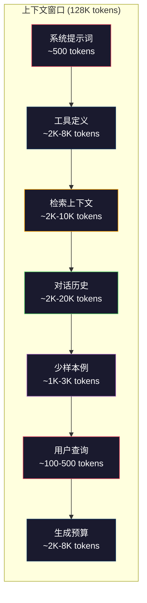
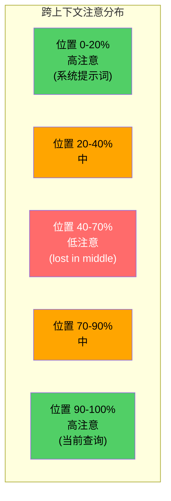
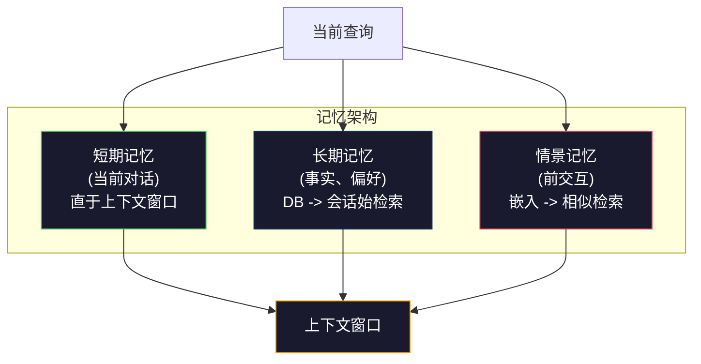

# 上下文工程:窗口、预算、记忆与检索

> 提示词工程是子集。上下文工程是全游戏。提示词是你敲的串。上下文是入模型窗口的一切:系统指令、检索文档、工具定义、对话历史、少样本例和提示词本身。2026最佳AI工程师是上下文工程师。他们决何入、何留、何序。

**类型:** 构建
**语言:** Python
**前置要求:** 阶段10(从零LLM)，阶段11课程01-02
**时间:** ~90分钟
**相关:** 阶段11课程15(提示词缓存) — 缓友好布局是上下文工程延。阶段5课程28(长上下文评估)测何用NIAH/RULER测lost-in-the-middle。

## 学习目标

- 算上下文窗口全组件token预算(系统提示词、工具、历史、检索文档、生成预留)
- 实上下文窗口管策略:截断、总结和滑窗于对话历史
- 优先排序上下文组件最大化模型注意于最相关信息
- 建上下文组装器按查询类型和可用窗口空间动态分token

## 问题背景

Claude Opus 4.7有200K token窗口(beta 1M)。GPT-5有400K。Gemini 3 Pro有2M。Llama 4称10M。这数听巨直到你填。

这是编码助手真分解。系统提示词:500 tokens。50工具定义:8,000 tokens。检索文档:4,000 tokens。对话历史(10轮):6,000 tokens。当前用户查询:200 tokens。生成预算(最大输出):4,000 tokens。总:22,700 tokens。这仅128K窗口18%。

但注意不与上下文长线性伸缩。有128K token上下文模型付二次注意成本(vanilla transformer O(n^2)，虽多生产模型用效注意变种)。更重，检索准确退化。"Needle in a Haystack"测示模型难找置于长上下文中信息。Liu et al. (2023)研示LLM于长上下文始末检索信息近完美准确，但置于中(位置40-70%)信息准确降10-20%。这"lost-in-the-middle"效异模型但影全现架构。

实教训:有200K token可用不代表用200K token效。精心策划的10K token上下文常胜随意堆放的100K token上下文。上下文工程是最大化上下文窗口信噪比纪律。

每个入窗口token都会挤走可载更相关信息的token。每无关工具定义、每陈对话轮、每不答问检索文本块 — 每使模型稍差于任务。

## 概念讲解

### 上下文窗口是稀缺资源

想上下文窗口为RAM非disk。快直可访但限。你不可装一切。你须择。



每组件争空间。加更多工具定义意少对话历史空间。加更多检索上下文意少少样本例空间。上下文工程是分此预算最大化任务性能艺。

### Lost-in-the-Middle

上下文工程最重要实证发现。模型更好注意上下文始末信息。中信息得低注意分更可能被忽。

Liu et al. (2023)系统测此。他们置相关文档于20无关文档中各位置测答准确。当相关文档首或末，准确85-90%。当中(位置10于20)，准确降至60-70%。

这有直工程义:

- 首置最重要信息(系统提示词、关键指令)
- 末置当前查询和最相关上下文(近偏帮)
- 视上下文中为最低优先区
- 若须于中含信息，末复制关键点



### 上下文组件

**系统提示词**: 设persona、约束和行为规。这首置并跨轮持常。Claude Code约6,000 tokens用于其系统提示词含工具定义和行为指令。保紧凑。系统提示词每词于每API调用重复。

**工具定义**: 每工具加50-200 tokens(名、描述、参数schema)。50工具每150 tokens是7,500 tokens于任对话发。动态工具择 — 仅含相关于当前查询工具 — 可减此60-80%。

**检索上下文**: 向量数据库文档、搜索结果、文件内容。检索质量直定响应质量。坏检索比无检索更坏 — 它填窗口噪并主动误导模型。

**对话历史**: 每前用户消息和助手响应。与对话长线性长。50轮对话每轮200 tokens是10,000 tokens历史。多与当前查询无关。

**少样本例**: 示期望行为输入/输出对。两到三工选例常改进输出质量胜数千token指令。但它们费空间。

**生成预算**: 模型响应预留token。若你填窗口至容量，模型无空答。留至少2,000-4,000 tokens生成。

### 上下文压缩策略

**历史总结**: 不持全前轮字面，期总结对话。"我们论X，决Y，用户要Z"于100 tokens代占2,000 tokens10轮。当历史超阈值(如5,000 tokens)跑总结。

**相关性过滤**: 对当前查询评每检索文档并弃低于阈值文档。若你检索10块但仅3相关，弃他7。有3高相关块胜10平庸块。

**工具裁剪**: 分类用户查询意图并仅含相关于那意图工具。代码问不需日历工具。调度问不需文件系统工具。这可减工具定义从8,000 tokens至1,000。

**递归总结**: 于很长文档，期总结。首总结每节，后总结总结。50页文档成500 token摘要捕关键点。

### 记忆系统

上下文工程跨三时horizon。

**短期记忆**: 当前对话。直存于上下文窗口。每轮长。由总结和截断管。

**长期记忆**: 跨对话持事实和偏好。"用户偏TypeScript。""项目用PostgreSQL。"存于数据库，会话始检索。Claude Code存此于CLAUDE.md文件。ChatGPT存于其记忆功能。

**情景记忆**: 可相关特前交互。"上周二，我们调试auth模块类似问题。"存为嵌入，当前对话匹前情景时检索。



### 动态上下文组装

关键洞察:异查询需异上下文。静系统提示词+静工具+静历史浪费。最佳系统每查询动态组装上下文。

1. 分类查询意图
2. 择相关工具(非全工具)
3. 检索相关文档(非定集)
4. 含相关历史轮(非全历史)
5. 加匹任务类型少样本例
6. 按重要性序一切:关键首、重要末、可选中

这是分好AI应用与伟大应用。模型同。上下文是异。

## 构建

### 步骤1: Token计数器

你不可预算你不可测。建简token计数器(用空split近似，因确切数依赖tokenizer)。

```python
import json
import numpy as np
from collections import OrderedDict

def count_tokens(text):
    if not text:
        return 0
    return int(len(text.split()) * 1.3)

def count_tokens_json(obj):
    return count_tokens(json.dumps(obj))
```

### 步骤2: 上下文预算管器

核抽象。预算管器追每组件用多少token并强限。

```python
class ContextBudget:
    def __init__(self, max_tokens=128000, generation_reserve=4000):
        self.max_tokens = max_tokens
        self.generation_reserve = generation_reserve
        self.available = max_tokens - generation_reserve
        self.allocations = OrderedDict()

    def allocate(self, component, content, max_tokens=None):
        tokens = count_tokens(content)
        if max_tokens and tokens > max_tokens:
            words = content.split()
            target_words = int(max_tokens / 1.3)
            content = " ".join(words[:target_words])
            tokens = count_tokens(content)

        used = sum(self.allocations.values())
        if used + tokens > self.available:
            allowed = self.available - used
            if allowed <= 0:
                return None, 0
            words = content.split()
            target_words = int(allowed / 1.3)
            content = " ".join(words[:target_words])
            tokens = count_tokens(content)

        self.allocations[component] = tokens
        return content, tokens

    def remaining(self):
        used = sum(self.allocations.values())
        return self.available - used

    def utilization(self):
        used = sum(self.allocations.values())
        return used / self.max_tokens

    def report(self):
        total_used = sum(self.allocations.values())
        lines = []
        lines.append(f"Context Budget Report ({self.max_tokens:,} token window)")
        lines.append("-" * 50)
        for component, tokens in self.allocations.items():
            pct = tokens / self.max_tokens * 100
            bar = "#" * int(pct / 2)
            lines.append(f"  {component:<25} {tokens:>6} tokens ({pct:>5.1f}%) {bar}")
        lines.append("-" * 50)
        lines.append(f"  {'Used':<25} {total_used:>6} tokens ({total_used/self.max_tokens*100:.1f}%)")
        lines.append(f"  {'Generation reserve':<25} {self.generation_reserve:>6} tokens")
        lines.append(f"  {'Remaining':<25} {self.remaining():>6} tokens")
        return "\n".join(lines)
```

### 步骤3: Lost-in-the-Middle重排序

实重排序策略:最重要项首末，最不重要中。

```python
def reorder_lost_in_middle(items, scores):
    paired = sorted(zip(scores, items), reverse=True)
    sorted_items = [item for _, item in paired]

    if len(sorted_items) <= 2:
        return sorted_items

    first_half = sorted_items[::2]
    second_half = sorted_items[1::2]
    second_half.reverse()

    return first_half + second_half

def score_relevance(query, documents):
    query_words = set(query.lower().split())
    scores = []
    for doc in documents:
        doc_words = set(doc.lower().split())
        if not query_words:
            scores.append(0.0)
            continue
        overlap = len(query_words & doc_words) / len(query_words)
        scores.append(round(overlap, 3))
    return scores
```

### 步骤4: 对话历史压缩器

总结陈对话轮回收token预算。

```python
class ConversationManager:
    def __init__(self, max_history_tokens=5000):
        self.turns = []
        self.summaries = []
        self.max_history_tokens = max_history_tokens

    def add_turn(self, role, content):
        self.turns.append({"role": role, "content": content})
        self._compress_if_needed()

    def _compress_if_needed(self):
        total = sum(count_tokens(t["content"]) for t in self.turns)
        if total <= self.max_history_tokens:
            return

        while total > self.max_history_tokens and len(self.turns) > 4:
            old_turns = self.turns[:2]
            summary = self._summarize_turns(old_turns)
            self.summaries.append(summary)
            self.turns = self.turns[2:]
            total = sum(count_tokens(t["content"]) for t in self.turns)

    def _summarize_turns(self, turns):
        parts = []
        for t in turns:
            content = t["content"]
            if len(content) > 100:
                content = content[:100] + "..."
            parts.append(f"{t['role']}: {content}")
        return "Previous: " + " | ".join(parts)

    def get_context(self):
        parts = []
        if self.summaries:
            parts.append("[Conversation Summary]")
            for s in self.summaries:
                parts.append(s)
        parts.append("[Recent Conversation]")
        for t in self.turns:
            parts.append(f"{t['role']}: {t['content']}")
        return "\n".join(parts)

    def token_count(self):
        return count_tokens(self.get_context())
```

### 步骤5: 动态工具择器

仅含相关于当前查询工具。分类意图，后过滤。

```python
TOOL_REGISTRY = {
    "read_file": {
        "description": "Read contents of a file",
        "tokens": 120,
        "categories": ["code", "files"],
    },
    "write_file": {
        "description": "Write content to a file",
        "tokens": 150,
        "categories": ["code", "files"],
    },
    "search_code": {
        "description": "Search for patterns in codebase",
        "tokens": 130,
        "categories": ["code"],
    },
    "run_command": {
        "description": "Execute a shell command",
        "tokens": 140,
        "categories": ["code", "system"],
    },
    "create_calendar_event": {
        "description": "Create a new calendar event",
        "tokens": 180,
        "categories": ["calendar"],
    },
    "list_emails": {
        "description": "List recent emails",
        "tokens": 160,
        "categories": ["email"],
    },
    "send_email": {
        "description": "Send an email message",
        "tokens": 200,
        "categories": ["email"],
    },
    "web_search": {
        "description": "Search the web for information",
        "tokens": 140,
        "categories": ["research"],
    },
    "query_database": {
        "description": "Run a SQL query on the database",
        "tokens": 170,
        "categories": ["code", "data"],
    },
    "generate_chart": {
        "description": "Generate a chart from data",
        "tokens": 190,
        "categories": ["data", "visualization"],
    },
}

def classify_intent(query):
    query_lower = query.lower()

    intent_keywords = {
        "code": ["code", "function", "bug", "error", "file", "implement", "refactor", "debug", "test"],
        "calendar": ["meeting", "schedule", "calendar", "appointment", "event"],
        "email": ["email", "mail", "send", "inbox", "message"],
        "research": ["search", "find", "what is", "how does", "explain", "look up"],
        "data": ["data", "query", "database", "chart", "graph", "analytics", "sql"],
    }

    scores = {}
    for intent, keywords in intent_keywords.items():
        score = sum(1 for kw in keywords if kw in query_lower)
        if score > 0:
            scores[intent] = score

    if not scores:
        return ["code"]

    max_score = max(scores.values())
    return [intent for intent, score in scores.items() if score >= max_score * 0.5]

def select_tools(query, token_budget=2000):
    intents = classify_intent(query)
    relevant = {}
    total_tokens = 0

    for name, tool in TOOL_REGISTRY.items():
        if any(cat in intents for cat in tool["categories"]):
            if total_tokens + tool["tokens"] <= token_budget:
                relevant[name] = tool
                total_tokens += tool["tokens"]

    return relevant, total_tokens
```

### 步骤6: 全上下文组装管道

合一切。给查询，动态组装优上下文。

```python
class ContextEngine:
    def __init__(self, max_tokens=128000, generation_reserve=4000):
        self.budget = ContextBudget(max_tokens, generation_reserve)
        self.conversation = ConversationManager(max_history_tokens=5000)
        self.system_prompt = (
            "You are a helpful AI assistant. You have access to tools for "
            "code editing, file management, web search, and data analysis. "
            "Use the appropriate tools for each task. Be concise and accurate."
        )
        self.knowledge_base = [
            "Python 3.12 introduced type parameter syntax for generic classes using bracket notation.",
            "The project uses PostgreSQL 16 with pgvector for embedding storage.",
            "Authentication is handled by Supabase Auth with JWT tokens.",
            "The frontend is built with Next.js 15 using the App Router.",
            "API rate limits are set to 100 requests per minute per user.",
            "The deployment pipeline uses GitHub Actions with Docker multi-stage builds.",
            "Test coverage must be above 80% for all new modules.",
            "The codebase follows the repository pattern for data access.",
        ]

    def assemble(self, query):
        self.budget = ContextBudget(self.budget.max_tokens, self.budget.generation_reserve)

        system_content, _ = self.budget.allocate("system_prompt", self.system_prompt, max_tokens=1000)

        tools, tool_tokens = select_tools(query, token_budget=2000)
        tool_text = json.dumps(list(tools.keys()))
        tool_content, _ = self.budget.allocate("tools", tool_text, max_tokens=2000)

        relevance = score_relevance(query, self.knowledge_base)
        threshold = 0.1
        relevant_docs = [
            doc for doc, score in zip(self.knowledge_base, relevance)
            if score >= threshold
        ]

        if relevant_docs:
            doc_scores = [s for s in relevance if s >= threshold]
            reordered = reorder_lost_in_middle(relevant_docs, doc_scores)
            doc_text = "\n".join(reordered)
            doc_content, _ = self.budget.allocate("retrieved_context", doc_text, max_tokens=3000)

        history_text = self.conversation.get_context()
        if history_text.strip():
            history_content, _ = self.budget.allocate("conversation_history", history_text, max_tokens=5000)

        query_content, _ = self.budget.allocate("user_query", query, max_tokens=500)

        return self.budget

    def chat(self, query):
        self.conversation.add_turn("user", query)
        budget = self.assemble(query)
        response = f"[Response to: {query[:50]}...]"
        self.conversation.add_turn("assistant", response)
        return budget


def run_demo():
    print("=" * 60)
    print("  Context Engineering Pipeline Demo")
    print("=" * 60)

    engine = ContextEngine(max_tokens=128000, generation_reserve=4000)

    print("\n--- Query 1: Code task ---")
    budget = engine.chat("Fix the bug in the authentication module where JWT tokens expire too early")
    print(budget.report())

    print("\n--- Query 2: Research task ---")
    budget = engine.chat("What is the best approach for implementing vector search in PostgreSQL?")
    print(budget.report())

    print("\n--- Query 3: After conversation history builds up ---")
    for i in range(8):
        engine.conversation.add_turn("user", f"Follow-up question number {i+1} about the implementation details of the system")
        engine.conversation.add_turn("assistant", f"Here is the response to follow-up {i+1} with technical details about the architecture")

    budget = engine.chat("Now implement the changes we discussed")
    print(budget.report())

    print("\n--- Tool Selection Examples ---")
    test_queries = [
        "Fix the bug in auth.py",
        "Schedule a meeting with the team for Tuesday",
        "Show me the database query performance stats",
        "Search for best practices on error handling",
    ]

    for q in test_queries:
        tools, tokens = select_tools(q)
        intents = classify_intent(q)
        print(f"\n  Query: {q}")
        print(f"  Intents: {intents}")
        print(f"  Tools: {list(tools.keys())} ({tokens} tokens)")

    print("\n--- Lost-in-the-Middle Reordering ---")
    docs = ["Doc A (most relevant)", "Doc B (somewhat relevant)", "Doc C (least relevant)",
            "Doc D (relevant)", "Doc E (moderately relevant)"]
    scores = [0.95, 0.60, 0.20, 0.80, 0.50]
    reordered = reorder_lost_in_middle(docs, scores)
    print(f"  Original order: {docs}")
    print(f"  Scores:         {scores}")
    print(f"  Reordered:      {reordered}")
    print(f"  (Most relevant at start and end, least relevant in middle)")
```

## 使用

### Claude Code上下文策略

Claude Code分层管上下文。系统提示词含行为规和工具定义(~6K tokens)。当你开文件，其内容注入为上下文。当你搜索，结果加。陈对话轮总结。CLAUDE.md供跨会话持长期记忆。

关键工程决:Claude Code不dump你全代码库入上下文。它按需检索相关文件。这是上下文工程实践。

### Cursor动态上下文加载

Cursor索引你全代码库入嵌入。当你输查询，它用向量相似检索最相关文件和代码块。仅那些块入上下文窗口。500K行代码库压缩入5-10最相关代码块。

这是模式:嵌入一切，按需检索，仅含重要。

### ChatGPT记忆

ChatGPT存用户偏好和事实为长期记忆。每会话始，相关记忆检索并含于系统提示词。"用户偏Python"费5 tokens但跨对话省数百token重复指令。

### RAG为上下文工程

检索增强生成是上下文工程形式化。不塞知识入模型权重(训)或系统提示词(静上下文)，你于查询时检索相关文档并注入上下文窗口。全RAG管道 — 分块、嵌入、检索、重排 — 存为解一问题:置正确信息于上下文窗口。

## 交付成果

这课产`outputs/prompt-context-optimizer.md` — 可复提示词审计上下文组装策略并荐优化。喂它你系统提示词、工具数、平均历史长和检索策略，它识token浪费并荐改进。

也产`outputs/skill-context-engineering.md` — 按任务类型、上下文窗口大和延迟预算设上下文组装管道决框架。

## 练习题

1. 加"token浪费检测器"至ContextBudget类。它应标用超30%预算组件并荐每组件类型特定压缩策略(总结历史、裁工具、重排文档)。

2. 实检索上下文语义去重。若两检索文档超80%相似(按词重叠或嵌入余弦相似)，仅持高分者。测这回收多少token预算。

3. 建"上下文回放"工具。给对话转录，回放它通过ContextEngine并视预算分如何逐轮变。绘每组件token用随时。识上下文始压缩轮。

4. 实优先基工具择器。非二含/不含，赋每工具与当前查询相关性分。按降相关性序含工具至工具预算耗。比含5、10、20、50工具任务性能。

5. 建多策略上下文压缩器。实三压缩策略(截断、总结、抽关键句)并于20文档集基准。测压缩率与信息持权衡(压缩版仍含查询答否？)。

## 关键术语

| 术语 | 人们怎么说 | 实际含义 |
|------|----------------|----------------------|
| 上下文窗口 | "模型能读多少" | 模型于单前向传理最大token数(入+出) — GPT-5 400K、Claude Opus 4.7 200K(beta 1M)、Gemini 3 Pro 2M |
| 上下文工程 | "高级提示词工程" | 定何入上下文窗口、何序、何优先纪律 — 覆检索、压缩、工具择、记忆管 |
| Lost-in-the-middle | "模型忘中间东西" | LLM更好注意上下文始末实证发现，中置信息准确降10-20% |
| Token预算 | "剩多少token" | 上下文窗口容量跨组件(系统提示词、工具、历史、检索、生成)显分带每组件限 |
| 动态上下文 | "飞加载东西" | 每查询按意图分类、相关工具择和检索结果异组装上下文窗口 |
| 历史总结 | "压缩对话" | 用简总结代字面陈对话轮，降token成本保关键信息 |
| 工具裁剪 | "仅含相关工具" | 分类查询意图并仅含匹工具定义，降工具token成本60-80% |
| 长期记忆 | "跨会话记忆" | 存于数据库会话始检索事实和偏好 — CLAUDE.md、ChatGPT记忆和类似系统 |
| 情景记忆 | "记特前事件" | 存为嵌入当当前查询似前对话时检索前交互 |
| 生成预算 | "答空间" | 模型输出预留token — 若上下文填窗口完全，模型无空响应 |

## 延伸阅读

- [Liu et al., 2023 — "Lost in the Middle: How Language Models Use Long Contexts"](https://arxiv.org/abs/2307.03172) — 位置依赖注意定研，示模型难于长上下文中信息
- [Anthropic上下文检索博客](https://www.anthropic.com/news/contextual-retrieval) — Anthropic何上下文感知块检索，降检索失败49%
- [Simon Willison"上下文工程"](https://simonwillison.net/2025/Jun/27/context-engineering/) — 命名此纪律并分于提示词工程的博客文
- [LangChain RAG文档](https://python.langchain.com/docs/tutorials/rag/) — 检索增强生成为上下文工程模式实实现
- [Greg Kamradt Needle in a Haystack测试](https://github.com/gkamradt/LLMTest_NeedleInAHaystack) — 跨全主模型示位置依赖检索失败基准
- [Pope et al., "Efficiently Scaling Transformer Inference" (2022)](https://arxiv.org/abs/2211.05102) — 何上下文长驱内存和延迟，KV cache、MQA和GQA何改预算算。
- [Agrawal et al., "SARATHI: Efficient LLM Inference by Piggybacking Decodes with Chunked Prefills" (2023)](https://arxiv.org/abs/2308.16369) — 推理两阶段使长提示词贵于TTFT但便宜于TPOT；上下文打包权衡后真。
- [Ainslie et al., "GQA: Training Generalized Multi-Query Transformer Models from Multi-Head Checkpoints" (EMNLP 2023)](https://arxiv.org/abs/2305.13245) — 组查询注意论文于生产解码器8× KV内存无质量损。