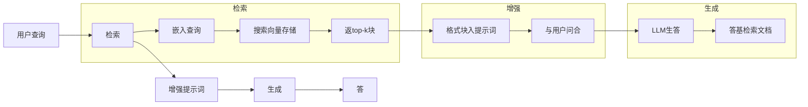
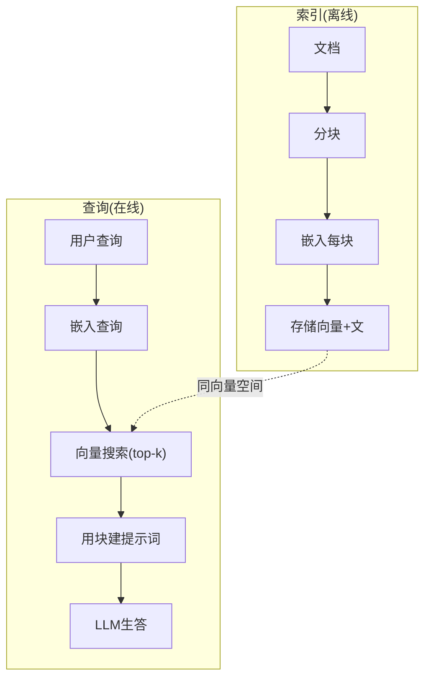

# RAG (检索增强生成)

> 你LLM知一切至其训截止。它不知你公司文档、你代码库或上周会纪。RAG解此通过检索相关文档并塞入提示词。这是生产AI最多部署模式。若你从这课建一物，建RAG管道。

**类型:** 构建
**语言:** Python
**前置要求:** 阶段10(从零LLM)，阶段11课程01-05
**时间:** ~90分钟
**相关:** 阶段5课程23(RAG分块策略)六分块算法何时每胜。阶段5课程22(嵌入模型深潜)择嵌入器。阶段11课程07(高级RAG)混搜索、重排和查询转换。

## 学习目标

- 建全RAG管道:文档加载、分块、嵌入、向量存储、检索和生成
- 实语义搜索用向量数据库(ChromaDB、FAISS或Pinecone)带正确索引
- 解何RAG优于微调于知识基应用(成本、新鲜、归属)
- 评估RAG质量用检索指标(precision、recall)和生成指标(忠实、相关)

## 问题背景

你为公司建聊天机器人。客户问"企业计划退款政策何？"LLM响应泛答关于典型SaaS退款政策。实政策，埋于200页内部wiki，说企业客户得60天窗口带按比例退款。LLM从不见此文档。它不可知它未训于。

微调是一解。取LLM，训于你内部文档，部署更新模型。这工作但有大问题。微调费数千美元算。模型于文档变时刻陈旧。你无法知模型从何源。若公司下月收购另产品线，你再微调。

RAG是另解。留模型未触。当问入，搜索你文档存储相关段落，粘贴入提示词于问前，让模型用那些段落为上下文答。文档存储可于分更新。你可看确切何文档被检索。模型本身永不变。这是何RAG是生产主导模式:更便宜、更新鲜、更可审计、与任LLM工作。

## 概念讲解

### RAG模式

全模式合四步:



查询 -> 检索 -> 增强提示词 -> 生成。每RAG系统随此模式。生产RAG系统差异在每步细节:何分块、何嵌入、何搜索、何构提示词。

### 何RAG胜微调

| 关注 | 微调 | RAG |
|---------|------------|-----|
| 成本 | $1,000-$100,000+每训跑 | $0.01-$0.10每查询(嵌入 + LLM) |
| 新鲜 | 陈直到重训 | 于分更新通过重索引文档 |
| 可审计 | 不可追答至源 | 可示确切检索段落 |
| 幻觉 | 仍自由幻觉 | 基检索文档 |
| 数据隐私 | 训数据烘焙入权重 | 文档留你向量存储 |

微调永改模型权重。RAG暂改模型上下文。对多应用，暂上下文是你要。

微调胜一例:当需模型采特定风格、调或推理模式不可通过提示词达。对事实知识检索，RAG每次胜。

### 嵌入模型

嵌入模型转文为密向量。似文产向量于此高维空间近。"何重置密码？"和"我需改密码"产近同向量尽管少共享词。"猫坐于垫"产异向量。

常嵌入模型(2026阵容 — 见阶段5课程22全析):

| 模型 | 维 | 提供方 | 注 |
|-------|-----------|----------|-------|
| text-embedding-3-small | 1536 (Matryoshka) | OpenAI | 最佳价/性能于多用例 |
| text-embedding-3-large | 3072 (Matryoshka) | OpenAI | 高准确，可截至256/512/1024 |
| Gemini Embedding 2 | 3072 (Matryoshka) | Google | 顶MTEB检索；8K上下文 |
| voyage-4 | 1024/2048 (Matryoshka) | Voyage AI | 域变种(代码、金融、法律) |
| Cohere embed-v4 | 1024 (Matryoshka) | Cohere | 强多语言，128K上下文 |
| BGE-M3 | 1024 (密+稀+ColBERT) | BAAI (开权重) | 一模型三视图 |
| Qwen3-Embedding | 4096 (Matryoshka) | Alibaba (开权重) | 顶开权重检索分 |
| all-MiniLM-L6-v2 | 384 | 开权重(Sentence Transformers) | 原型基线 |

于这课，我们建自己简嵌入用TF-IDF。非因TF-IDF是生产系统用，但因它使概念具体:文入，向量出，似文产似向量。

### 向量相似

给两向量，何测相似？三选项:

**余弦相似**:两向量间角余弦。范围-1(相反)至1(同)。忽略大小，仅关方向。这是RAG默。

```
cosine_sim(a, b) = dot(a, b) / (||a|| * ||b||)
```

**点积**:原内积。大向量得高分。有用当大小载信息(长文档可更相关)。

```
dot(a, b) = sum(a_i * b_i)
```

**L2(欧氏)距离**:向量空间直线距离。小距离=更似。敏大小差。

```
L2(a, b) = sqrt(sum((a_i - b_i)^2))
```

余弦相似是标准。它优雅处异长文档因它按大小归一化。当有人说"向量搜索"，他们几乎总意余弦相似。

### 分块策略

文档太长嵌入为单向量。50页PDF可产糟嵌入因含十主题。代，你裂文档为块并嵌入每块分离。

**定大分块**:每N token裂。简可预测。512 token块带50 token重叠意块1是token 0-511，块2是token 462-973，等。重叠保你不裂句于不幸边界。

**语义分块**:于自然边界裂。段落、节或markdown头。每块是一连贯义单位。更复杂实但产更好检索。

**递归分块**:先试裂于最大边界(节头)。若节仍太大，裂于段落边界。若段落仍太大，裂于句边界。这是LangChain RecursiveCharacterTextSplitter法并实工作好。

分块大比人想更重:

- 太小(64-128 tokens):每块缺上下文。"上季增15%"无知"它"指何。
- 太大(2048+ tokens):每块覆多主题，淡相关性。当你搜收入数据，你得块10%关于收入和90%关于人数。
- 甜点(256-512 tokens):足上下文自含，聚焦足够相关。

多生产RAG系统用256-512 token块带50 token重叠。Anthropic RAG指南荐此范围。

### 向量数据库

一旦你有嵌入，你需某处存储搜索它们。选项:

| 数据库 | 类型 | 最适 |
|----------|------|----------|
| FAISS | 库(进程) | 原型、小至中数据集 |
| Chroma | 轻DB | 本地开发、小部署 |
| Pinecone | 托服务 | 生产无运开销 |
| Weaviate | 开源DB | 自托生产 |
| pgvector | Postgres扩展 | 已用Postgres |
| Qdrant | 开源DB | 高性能自托 |

于这课，我们建简内存向量存储。它存向量于列表做暴力余弦相似搜索。这等价FAISS带flat索引。它伸缩至约100,000向量后慢。生产系统用近似最近邻(ANN)算法如HNSW于毫秒搜百万向量。

### 全管道



索引阶段每文档跑一次(或当文档更新)。查询阶段于每用户请求跑。生产，索引可于时理百万文档。查询须于秒响应。

### 实数

多生产RAG系统用此参数:

- **k = 5 to 10** 每查询检索块
- **分块大 = 256 to 512 tokens** 带50 token重叠
- **上下文预算**: 2,500-5,000 tokens每查询检索内容
- **总提示词**: ~8,000-16,000 tokens(系统提示词 + 检索块 + 对话历史 + 用户查询)
- **嵌入维**: 384-3072依赖模型
- **索引吞吐**: 100-1,000文档每秒用API嵌入
- **查询延迟**: 50-200ms检索，500-3000ms生成

## 构建

### 步骤1: 文档分块

```python
def chunk_text(text, chunk_size=200, overlap=50):
    words = text.split()
    chunks = []
    start = 0
    while start < len(words):
        end = start + chunk_size
        chunk = " ".join(words[start:end])
        chunks.append(chunk)
        start += chunk_size - overlap
    return chunks
```

### 步骤2: TF-IDF嵌入

我们建简嵌入函数。TF-IDF(词频-逆文档频)非神经嵌入，但它转文为向量捕词重要性。文档中频词得高TF。跨语料库稀词得高IDF。产给向量重要、独特词有高值。

```python
import math
from collections import Counter

def build_vocabulary(documents):
    vocab = set()
    for doc in documents:
        vocab.update(doc.lower().split())
    return sorted(vocab)

def compute_tf(text, vocab):
    words = text.lower().split()
    count = Counter(words)
    total = len(words)
    return [count.get(word, 0) / total for word in vocab]

def compute_idf(documents, vocab):
    n = len(documents)
    idf = []
    for word in vocab:
        doc_count = sum(1 for doc in documents if word in doc.lower().split())
        idf.append(math.log((n + 1) / (doc_count + 1)) + 1)
    return idf

def tfidf_embed(text, vocab, idf):
    tf = compute_tf(text, vocab)
    return [t * i for t, i in zip(tf, idf)]
```

### 步骤3: 余弦相似搜索

```python
def cosine_similarity(a, b):
    dot = sum(x * y for x, y in zip(a, b))
    norm_a = math.sqrt(sum(x * x for x in a))
    norm_b = math.sqrt(sum(x * x for x in b))
    if norm_a == 0 or norm_b == 0:
        return 0.0
    return dot / (norm_a * norm_b)

def search(query_embedding, stored_embeddings, top_k=5):
    scores = []
    for i, emb in enumerate(stored_embeddings):
        sim = cosine_similarity(query_embedding, emb)
        scores.append((i, sim))
    scores.sort(key=lambda x: x[1], reverse=True)
    return scores[:top_k]
```

### 步骤4: 提示词构建

这是RAG中"增强"发处。取检索块，格式入提示词，让LLM基于提供上下文答。

```python
def build_rag_prompt(query, retrieved_chunks):
    context = "\n\n---\n\n".join(
        f"[Source {i+1}]\n{chunk}"
        for i, chunk in enumerate(retrieved_chunks)
    )
    return f"""Answer the question based ONLY on the following context.
	If the context doesn't contain enough information, say "I don't have enough information to answer that."

	Context:
	{context}

	Question: {query}

	Answer:"""
```

### 步骤5: 全RAG管道

```python
class RAGPipeline:
    def __init__(self):
        self.chunks = []
        self.embeddings = []
        self.vocab = []
        self.idf = []

    def index(self, documents):
        all_chunks = []
        for doc in documents:
            all_chunks.extend(chunk_text(doc))
        self.chunks = all_chunks
        self.vocab = build_vocabulary(all_chunks)
        self.idf = compute_idf(all_chunks, self.vocab)
        self.embeddings = [
            tfidf_embed(chunk, self.vocab, self.idf)
            for chunk in all_chunks
        ]

    def query(self, question, top_k=5):
        query_emb = tfidf_embed(question, self.vocab, self.idf)
        results = search(query_emb, self.embeddings, top_k)
        retrieved = [(self.chunks[i], score) for i, score in results]
        prompt = build_rag_prompt(
            question, [chunk for chunk, _ in retrieved]
        )
        return prompt, retrieved
```

### 步骤6: 生成(模拟)

生产，这是你调LLM API处。于这课，我们模拟生成通过从检索上下文抽最相关句。

```python
def simple_generate(prompt, retrieved_chunks):
    query_words = set(prompt.lower().split("question:")[-1].split())
    best_sentence = ""
    best_score = 0
    for chunk in retrieved_chunks:
        for sentence in chunk.split("."):
            sentence = sentence.strip()
            if not sentence:
                continue
            words = set(sentence.lower().split())
            overlap = len(query_words & words)
            if overlap > best_score:
                best_score = overlap
                best_sentence = sentence
    return best_sentence if best_sentence else "I don't have enough information."
```

## 使用

有真嵌入模型和LLM，代码微变:

```python
from openai import OpenAI

client = OpenAI()

def embed(text):
    response = client.embeddings.create(
        model="text-embedding-3-small",
        input=text
    )
    return response.data[0].embedding

def generate(prompt):
    response = client.chat.completions.create(
        model="gpt-4o-mini",
        messages=[{"role": "user", "content": prompt}],
        temperature=0
    )
    return response.choices[0].message.content
```

或Anthropic:

```python
import anthropic

client = anthropic.Anthropic()

def generate(prompt):
    response = client.messages.create(
        model="claude-sonnet-4-20250514",
        max_tokens=1024,
        messages=[{"role": "user", "content": prompt}]
    )
    return response.content[0].text
```

管道同。换嵌入函数。换生成函数。检索逻辑、分块、提示词构建 — 全同无关你用何模型。

于规模向量存储，换暴力搜索为正确向量数据库:

```python
import chromadb

client = chromadb.Client()
collection = client.create_collection("my_docs")

collection.add(
    documents=chunks,
    ids=[f"chunk_{i}" for i in range(len(chunks))]
)

results = collection.query(
    query_texts=["What is the refund policy?"],
    n_results=5
)
```

Chroma内理嵌入(它默用all-MiniLM-L6-v2)并存向量于本地数据库。同模式，异管道。

## 交付成果

这课产:
- `outputs/prompt-rag-architect.md` — 为特定用例设RAG系统提示词
- `outputs/skill-rag-pipeline.md` — 教代理何建和调试RAG管道技能

## 练习题

1. 换TF-IDF嵌入为简词袋法(二值:1若词现，0若不)。比样文档检索质量。TF-IDF应胜因它权重稀词高。

2. 实验分块大:试50、100、200和500词于同文档集。每，跑同5查询计数多少于top-3返相关块。找检索质量峰甜点。

3. 加元数据至每块(源文档名、块位置)。改提示词模板含源归属使LLM引其源。

4. 实简评估:给10问答对，跑每问通过RAG管道，测多少检索块含答。这是k检索召回。

5. 建对话感知RAG管道:持最后3交换历史并含入提示词与检索块。测随问如"企业何？"后问定价。

## 关键术语

| 术语 | 人们怎么说 | 实际含义 |
|------|----------------|----------------------|
| RAG | "读你文档AI" | 检索相关文档，粘贴入提示词，基于那些文档生基答 |
| 嵌入 | "转文为数" | 文密向量表示似义产似向量 |
| 向量数据库 | "AI搜索引擎" | 存向量和按相似找最近邻数据存 |
| 分块 | "裂文档为片" | 裂文档为小段(典型256-512 tokens)使每可独立嵌入检索 |
| 余弦相似 | "两向量何相似" | 两向量间角余弦；1 = 同向，0 = 正交，-1 = 反 |
| Top-k检索 | "得k最佳匹" | 从向量存储返k最似块于查询 |
| 上下文窗口 | "LLM能看多少文" | LLM于单请求理最大token数；检索块须合入此 |
| 增强生成 | "用给定上下文答" | 用检索文档为上下文生响应非仅依赖训知识 |
| TF-IDF | "词重要性评分" | 词频乘逆文档频；权重词于语料库内何独特 |
| 索引 | "备文档搜索" | 离线分块、嵌入、存储文档过程使可于查询时搜索 |

## 延伸阅读

- Lewis et al., "Retrieval-Augmented Generation for Knowledge-Intensive NLP Tasks" (2020) — Facebook AI Research原RAG论文形式化检索-后-生成模式
- Anthropic RAG文档(docs.anthropic.com) — 分块大、提示词构建和评估实指南
- Pinecone学习中心,"What is RAG?" — RAG管道清晰视释带生产虑
- Sentence-BERT: Reimers & Gurevych (2019) — all-MiniLM嵌入模型后论文，示何训双编码器于语义相似
- [Karpukhin et al., "Dense Passage Retrieval for Open-Domain Question Answering" (EMNLP 2020)](https://arxiv.org/abs/2004.04906) — DPR论文证密双编码器检索于开域QA胜BM25并设现代RAG检索器模式。
- [LlamaIndex高层概念](https://docs.llamaindex.ai/en/stable/getting_started/concepts.html) — 建RAG管道须知主概念:数据加载器、节点解析器、索引、检索器、响应合成器。
- [LangChain RAG教程](https://python.langchain.com/docs/tutorials/rag/) — 异味编排器；可运行链视图于同检索-后-生成模式。