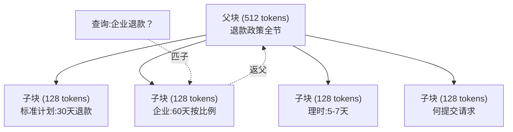
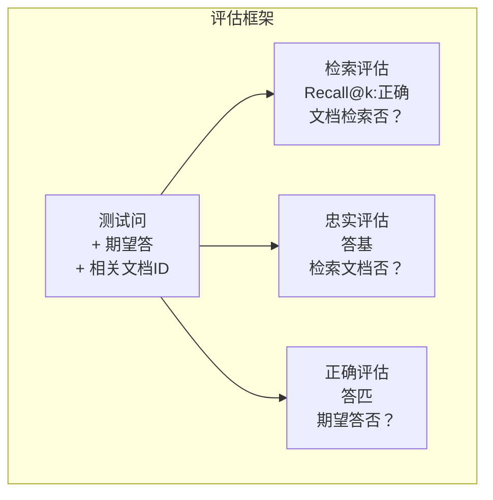

# 高级RAG (分块、重排、混搜索)

> 基础RAG检索top-k最似块。这工作于简问题。它崩于多跳推理、模糊查询和大语料库。高级RAG是于10文档工作演示和于10百万工作系统差。

**类型:** 构建
**语言:** Python
**前置要求:** 阶段11课程06(RAG)
**时间:** ~90分钟
**相关:** 阶段5课程23(RAG分块策略)覆全六分块算法 — 递归、语义、句、父文档、晚分块、上下文检索 — 带Vectara/Anthropic基准。这课建上:混搜索、重排、查询转换。

## 学习目标

- 实高级分块策略(语义、递归、父子)保文档结构和上下文
- 建混搜索管道合BM25关键词匹与语义向量搜索和交叉编码重排器
- 应用查询转换技术(HyDE、多查询、退)改进模糊或复杂问检索
- 诊断和修常RAG失败:错块检索、答不在上下文、多跳推理崩

## 问题背景

你于课程06建基础RAG管道。它工作于小语料库直问。现试这:

**模糊查询**: "上季收入何？"语义搜索返关于收入策略、收入预测和CFO对收入长思块。全语义似于词"收入。"无含实数。正块说"$47.2M于Q3 2025"但用词"收益"代"收入。"嵌入模型认为"收入策略"比"Q3收益$47.2M"更近查询。

**多跳问**: "何团队有最高客户满意度分改进？"这需找每团队满意度分、比它们、识最大。无单块含答。信息散于团队报告。

**大语料库问题**: 你有2百万块。正答于块#1,847,293。你top-5检索拉块#14、#89,201、#1,200,000、#44和#901,333。嵌入空间近，但无含答。于此规模，近似最近邻搜索引足够错使相关结果被推出top-k。

基础RAG败因向量相似不等于相关性。块可语义似于查询无用于答它。高级RAG用四技术解:混搜索(加关键词匹)、重排(更细评候选)、查询转换(搜索前修查询)、更好分块(正确粒度检索)。

## 概念讲解

### 混搜索:语义+关键词

语义搜索(向量相似)好于解含义。"何取消订阅？"匹"终止计划步骤"尽管它们共享无词。但它漏精确匹。"错误码E-4021"可不匹含"E-4021"块若嵌入模型视它为噪。

关键词搜索(BM25)相反。它精于精确匹。"E-4021"完美匹。但"取消订阅"返零结果若文档说"终止计划。"

混搜索跑两，后合结果。

**BM25** (Best Matching 25)是标准关键词搜索算法。它是搜索引擎脊梁自1990s。公式:

```
BM25(q, d) = sum over terms t in q:
    IDF(t) * (tf(t,d) * (k1 + 1)) / (tf(t,d) + k1 * (1 - b + b * |d| / avgdl))
```

其中tf(t,d)是词t于文档d频，IDF(t)是逆文档频，|d|是文档长，avgdl是平均文档长，k1控词频饱和(默1.2)，b控长归一化(默0.75)。

简:BM25评文档高当含查询词(特别是稀词)，但重复词递减回报。含词"收入"50次文档不比含一次50x更相关。

### 互秩融合(RRF)

你有两排列表:一从向量搜索，一从BM25。何合它们？互秩融合是标准法。

```
RRF_score(d) = sum over rankings R:
    1 / (k + rank_R(d))
```

其中k是常数(典型60)防顶排结果主导。

一文档于向量搜索排#1和BM25排#5得: 1/(60+1) + 1/(60+5) = 0.0164 + 0.0154 = 0.0318

一文档于向量搜索排#3和BM25排#2得: 1/(60+3) + 1/(60+2) = 0.0159 + 0.0161 = 0.0320

RRF自然平衡两信号。一文档于两列表高排得最佳分。一文档于一列表排#1但无于另一得中等分。这健壮因它用秩非原始分，故两系统间分分布差无关。

### 重排

检索(向量、关键词或混)快但不精。它用双编码器:查询和每文档独立嵌入，后比。嵌入算一次缓存。这伸缩至百万文档。

重排用交叉编码器:查询和候选文档合喂入模型输出相关性分。模型同时见两文可捕它们间细交互。交叉编码器可解"Q3收益何？"高度相关于含"$47.2M于Q3"块即使双编码器漏连接。

权衡:交叉编码器比双编码器慢100-1000x因它们合理查询-文档对。你不可为百万文档预算交叉编码分。解:检索更大候选集(混搜索top-50)，后用交叉编码重排得终top-5。


常重排模型(2026阵容):
- Cohere Rerank 3.5: 托API、多语言、混语料最佳召回增益
- Voyage rerank-2.5: 托API、托选项最低延迟
- Jina-Reranker-v2 Multilingual: 开权重、100+语言
- bge-reranker-v2-m3: 开权重、强基线
- cross-encoder/ms-marco-MiniLM-L-6-v2: 开权重、CPU原型跑
- ColBERTv2 / Jina-ColBERT-v2: 晚交互多向量重排器 — O(tokens)非O(docs)于评分时

### 查询转换

有时问题非检索而是查询本身。"新政策改何事？"是糟搜索查询。它含无特定词。嵌入模糊。无检索系统可从这找正确文档。

**查询重写**: 重述用户查询为更好搜索查询。LLM可做:

```
用户: "新政策改何事？"
重写: "近期政策改和更新"
```

**HyDE (假设文档嵌入)**: 不用查询搜索，生假设答，嵌入它，搜索似真实文档。

```
查询: "企业退款政策何？"
假设答: "企业客户购后60天内全额退款。
退款按剩订阅期按比例并于5-7工作日理。"
```

嵌入假设答并搜索似真实文档。直觉:假设答嵌入空间住更近真实答于原问。问题和答有异语言结构。通过生假设答，你桥"问题空间"和"答空间"嵌入差距。

HyDE检索前加一LLM调用。这增延迟500-2000ms。值当原始查询检索质量差。

### 父子分块

标准分块强权衡:小块精检索，大块足上下文。父子分块消此权衡。

索引小块(128 tokens)检索。当小块被检索，返其父块(512 tokens)于提示词。小块精确匹查询。父块提供足上下文让LLM生好答。



查询"企业退款？"精确匹子块C2。但提示词得全父块P，含理时和提交过程周上下文。

### 元数据过滤

向量搜索前，按元数据过滤语料库:日期、源、分类、作者、语言。这减搜索空间防无关结果。

"上月安全政策何改？"应仅搜最近30天安全分类文档。无元数据过滤，你搜全语料库可检索2年前安全文档碰巧语义似。

生产RAG系统存元数据与每块:源文档、创日期、分类、作者、版。向量数据库支元数据预过滤于相似搜索前，这于规模性能关键。

### 评估

你建RAG系统。何知它工作？三指标:

**检索相关性(Recall@k)**: 对已知相关文档测试问集，多少相关文档现于top-k结果？若问题答于块#47，块#47现于top-5否？

**忠实**: 生答基检索文档否？若检索块说"60天退款窗"和模型说"90天退款窗"，那是忠实失败。模型幻觉尽管有正确上下文。

**答正确**: 生答匹期望答否？这是端到端指标。它合检索质量和生成质量。

简忠实检:取生答每主张并验它现(实质)于检索块。若答含事实不在任检索块，它可能幻觉。



## 构建

### 步骤1: BM25实现

```python
import math
from collections import Counter

class BM25:
    def __init__(self, k1=1.2, b=0.75):
        self.k1 = k1
        self.b = b
        self.docs = []
        self.doc_lengths = []
        self.avg_dl = 0
        self.doc_freqs = {}
        self.n_docs = 0

    def index(self, documents):
        self.docs = documents
        self.n_docs = len(documents)
        self.doc_lengths = []
        self.doc_freqs = {}

        for doc in documents:
            words = doc.lower().split()
            self.doc_lengths.append(len(words))
            unique_words = set(words)
            for word in unique_words:
                self.doc_freqs[word] = self.doc_freqs.get(word, 0) + 1

        self.avg_dl = sum(self.doc_lengths) / self.n_docs if self.n_docs else 1

    def score(self, query, doc_idx):
        query_words = query.lower().split()
        doc_words = self.docs[doc_idx].lower().split()
        doc_len = self.doc_lengths[doc_idx]
        word_counts = Counter(doc_words)
        score = 0.0

        for term in query_words:
            if term not in word_counts:
                continue
            tf = word_counts[term]
            df = self.doc_freqs.get(term, 0)
            idf = math.log((self.n_docs - df + 0.5) / (df + 0.5) + 1)
            numerator = tf * (self.k1 + 1)
            denominator = tf + self.k1 * (1 - self.b + self.b * doc_len / self.avg_dl)
            score += idf * numerator / denominator

        return score

    def search(self, query, top_k=10):
        scores = [(i, self.score(query, i)) for i in range(self.n_docs)]
        scores.sort(key=lambda x: x[1], reverse=True)
        return scores[:top_k]
```

### 步骤2: 互秩融合

```python
def reciprocal_rank_fusion(ranked_lists, k=60):
    scores = {}
    for ranked_list in ranked_lists:
        for rank, (doc_id, _) in enumerate(ranked_list):
            if doc_id not in scores:
                scores[doc_id] = 0.0
            scores[doc_id] += 1.0 / (k + rank + 1)
    fused = sorted(scores.items(), key=lambda x: x[1], reverse=True)
    return fused
```

### 步骤3: 混搜索管道

```python
def hybrid_search(query, chunks, vector_embeddings, vocab, idf, bm25_index, top_k=5, fusion_k=60):
    query_emb = tfidf_embed(query, vocab, idf)
    vector_results = search(query_emb, vector_embeddings, top_k=top_k * 3)
    bm25_results = bm25_index.search(query, top_k=top_k * 3)
    fused = reciprocal_rank_fusion([vector_results, bm25_results], k=fusion_k)
    return fused[:top_k]
```

### 步骤4: 简重排器

生产，你用交叉编码模型。这我们建重排器用词重叠、词重要和短语匹评查询-文档相关性。

```python
def rerank(query, candidates, chunks):
    query_words = set(query.lower().split())
    stop_words = {"the", "a", "an", "is", "are", "was", "were", "what", "how",
                  "why", "when", "where", "do", "does", "for", "of", "in", "to",
                  "and", "or", "on", "at", "by", "it", "its", "this", "that",
                  "with", "from", "be", "has", "have", "had", "not", "but"}
    query_terms = query_words - stop_words

    scored = []
    for doc_id, initial_score in candidates:
        chunk = chunks[doc_id].lower()
        chunk_words = set(chunk.split())

        term_overlap = len(query_terms & chunk_words)

        query_bigrams = set()
        q_list = [w for w in query.lower().split() if w not in stop_words]
        for i in range(len(q_list) - 1):
            query_bigrams.add(q_list[i] + " " + q_list[i + 1])
        bigram_matches = sum(1 for bg in query_bigrams if bg in chunk)

        position_boost = 0
        for term in query_terms:
            pos = chunk.find(term)
            if pos != -1 and pos < len(chunk) // 3:
                position_boost += 0.5

        rerank_score = (
            term_overlap * 1.0
            + bigram_matches * 2.0
            + position_boost
            + initial_score * 5.0
        )
        scored.append((doc_id, rerank_score))

    scored.sort(key=lambda x: x[1], reverse=True)
    return scored
```

### 步骤5: HyDE (假设文档嵌入)

```python
def hyde_generate_hypothesis(query):
    templates = {
        "what": "The answer to '{query}' is as follows: Based on our documentation, {topic} involves specific policies and procedures that define how the process works.",
        "how": "To address '{query}': The process involves several steps. First, you need to initiate the request. Then, the system processes it according to the defined rules.",
        "default": "Regarding '{query}': Our records indicate specific details and policies related to this topic that provide a comprehensive answer."
    }
    query_lower = query.lower()
    if query_lower.startswith("what"):
        template = templates["what"]
    elif query_lower.startswith("how"):
        template = templates["how"]
    else:
        template = templates["default"]

    topic_words = [w for w in query.lower().split()
                   if w not in {"what", "is", "the", "how", "do", "does", "a", "an",
                                "for", "of", "to", "in", "on", "at", "by", "and", "or"}]
    topic = " ".join(topic_words) if topic_words else "this topic"

    return template.format(query=query, topic=topic)


def hyde_search(query, chunks, vector_embeddings, vocab, idf, top_k=5):
    hypothesis = hyde_generate_hypothesis(query)
    hypothesis_emb = tfidf_embed(hypothesis, vocab, idf)
    results = search(hypothesis_emb, vector_embeddings, top_k)
    return results, hypothesis
```

### 步骤6: 父子分块

```python
def create_parent_child_chunks(text, parent_size=200, child_size=50):
    words = text.split()
    parents = []
    children = []
    child_to_parent = {}

    parent_idx = 0
    start = 0
    while start < len(words):
        parent_end = min(start + parent_size, len(words))
        parent_text = " ".join(words[start:parent_end])
        parents.append(parent_text)

        child_start = start
        while child_start < parent_end:
            child_end = min(child_start + child_size, parent_end)
            child_text = " ".join(words[child_start:child_end])
            child_idx = len(children)
            children.append(child_text)
            child_to_parent[child_idx] = parent_idx
            child_start += child_size

        parent_idx += 1
        start += parent_size

    return parents, children, child_to_parent
```

### 步骤7: 忠实评估

```python
def evaluate_faithfulness(answer, retrieved_chunks):
    answer_sentences = [s.strip() for s in answer.split(".") if len(s.strip()) > 10]
    if not answer_sentences:
        return 1.0, []

    grounded = 0
    ungrounded = []
    context = " ".join(retrieved_chunks).lower()

    for sentence in answer_sentences:
        words = set(sentence.lower().split())
        stop_words = {"the", "a", "an", "is", "are", "was", "were", "and", "or",
                      "to", "of", "in", "for", "on", "at", "by", "it", "this", "that"}
        content_words = words - stop_words
        if not content_words:
            grounded += 1
            continue

        matched = sum(1 for w in content_words if w in context)
        ratio = matched / len(content_words) if content_words else 0

        if ratio >= 0.5:
            grounded += 1
        else:
            ungrounded.append(sentence)

    score = grounded / len(answer_sentences) if answer_sentences else 1.0
    return score, ungrounded


def evaluate_retrieval_recall(queries_with_relevant, retrieval_fn, k=5):
    total_recall = 0.0
    results = []

    for query, relevant_indices in queries_with_relevant:
        retrieved = retrieval_fn(query, k)
        retrieved_indices = set(idx for idx, _ in retrieved)
        relevant_set = set(relevant_indices)
        hits = len(retrieved_indices & relevant_set)
        recall = hits / len(relevant_set) if relevant_set else 1.0
        total_recall += recall
        results.append({
            "query": query,
            "recall": recall,
            "hits": hits,
            "total_relevant": len(relevant_set)
        })

    avg_recall = total_recall / len(queries_with_relevant) if queries_with_relevant else 0
    return avg_recall, results
```

## 使用

有真交叉编码器重排:

```python
from sentence_transformers import CrossEncoder

reranker = CrossEncoder("cross-encoder/ms-marco-MiniLM-L-6-v2")

def rerank_with_cross_encoder(query, candidates, chunks, top_k=5):
    pairs = [(query, chunks[doc_id]) for doc_id, _ in candidates]
    scores = reranker.predict(pairs)
    scored = list(zip([doc_id for doc_id, _ in candidates], scores))
    scored.sort(key=lambda x: x[1], reverse=True)
    return scored[:top_k]
```

有Cohere托重排器:

```python
import cohere

co = cohere.Client()

def rerank_with_cohere(query, candidates, chunks, top_k=5):
    docs = [chunks[doc_id] for doc_id, _ in candidates]
    response = co.rerank(
        model="rerank-english-v3.0",
        query=query,
        documents=docs,
        top_n=top_k
    )
    return [(candidates[r.index][0], r.relevance_score) for r in response.results]
```

HyDE有真LLM:

```python
import anthropic

client = anthropic.Anthropic()

def hyde_with_llm(query):
    response = client.messages.create(
        model="claude-sonnet-4-20250514",
        max_tokens=256,
        messages=[{
            "role": "user",
            "content": f"Write a short paragraph that would be a good answer to this question. Do not say you don't know. Just write what the answer would look like.\n\nQuestion: {query}"
        }]
    )
    return response.content[0].text
```

生产混搜索有Weaviate:

```python
import weaviate

client = weaviate.connect_to_local()

collection = client.collections.get("Documents")
response = collection.query.hybrid(
    query="enterprise refund policy",
    alpha=0.5,
    limit=10
)
```

alpha参数控平衡:0.0 = 纯关键词(BM25)，1.0 = 纯向量，0.5 = 等权。多生产系统用alpha于0.3和0.7间。

## 交付成果

这课产:
- `outputs/prompt-advanced-rag-debugger.md` — 诊断和修RAG质量问题提示词
- `outputs/skill-advanced-rag.md` — 建生产级RAG带混搜索和重排技能

## 练习题

1. 比BM25 vs向量搜索vs混搜索于样文档。对每5测试查询，记何法返最相关块于位置#1。混搜索应胜至少3于5。

2. 实元数据过滤器。加"分类"字段至每文档(安全、账单、api、产品)。向量搜索前，过滤块仅相关分类。测"何加密用？"并验仅搜安全分类块。

3. 建全HyDE管道用课程06简生函数。比检索质量(top-3相关性)于全5测试查询间直查询搜索和HyDE搜索。HyDE应改进模糊查询结果。

4. 实父子分块策略于样文档。用child_size=30和parent_size=100。用子块搜索但返父块于提示词。比生答于标准分块带chunk_size=50。

5. 创评估数据集:10已知答块问。测Recall@3、Recall@5和Recall@10于、BM25仅、混搜索、混+重排。绘结果并识重排何助最。

## 关键术语

| 术语 | 人们怎么说 | 实际含义 |
|------|----------------|----------------------|
| BM25 | "关键词搜索" | 概率排算法按词频、逆文档频和文档长归一化评文档 |
| 混搜索 | "两世界最佳" | 并跑语义(向量)和关键词(BM25)搜索，后秩融合合结果 |
| 互秩融合 | "合排列表" | 合多排列表通过对每文档跨全列表求1/(k + rank) |
| 重排 | "二评" | 用更贵交叉编码模型从初检索候选集重评分 |
| 交叉编码器 | "联合查询-文档模型" | 取查询和文档为单输入产相关性分模型；比双编码器更准确但全语料库搜索太慢 |
| 双编码器 | "独立嵌入模型" | 独嵌入查询和文档模型；快因嵌入预算，但比交叉编码器不准 |
| HyDE | "用假答搜索" | 生查询假设答，嵌入它，搜索似真实文档 |
| 父子分块 | "小搜大上下文" | 索引小块精检索但返更大父块提供足上下文 |
| 元数据过滤 | "搜索前窄" | 按属性(日期、源、分类)过滤文档于向量搜索前减搜索空间 |
| 忠实 | "它保持基否" | 生答是否被检索文档支，而非从模型训数据幻觉 |

## 延伸阅读

- Robertson & Zaragoza, "The Probabilistic Relevance Framework: BM25 and Beyond" (2009) — BM25定参，释公式后概率基
- Cormack et al., "Reciprocal Rank Fusion Outperforms Condorcet and Individual Rank Learning Methods" (2009) — 原RRF论文示它胜更复杂融合法
- Gao et al., "Precise Zero-Shot Dense Retrieval without Relevance Labels" (2022) — HyDE论文示假设文档嵌入改进检索无任训数据
- Nogueira & Cho, "Passage Re-ranking with BERT" (2019) — 示BM25上交叉编码重排显著改进检索质量
- [Khattab et al., "DSPy: Compiling Declarative Language Model Calls into Self-Improving Pipelines" (2023)](https://arxiv.org/abs/2310.03714) — 把提示词构建和权择为检索管道优化问题；读此为"程LLM"代"提示LLM"。
- [Edge et al., "From Local to Global: A Graph RAG Approach to Query-Focused Summarization" (Microsoft Research 2024)](https://arxiv.org/abs/2404.16130) — GraphRAG论文:实体-关系抽取+Leiden社区检测于查询聚焦总结；全局vs局部检索区分。
- [Asai et al., "Self-RAG: Learning to Retrieve, Generate, and Critique through Self-Reflection" (ICLR 2024)](https://arxiv.org/abs/2310.11511) — 自评RAG带反思token；代理前沿静检索-后-生成。
- [LangChain查询构建博客](https://blog.langchain.dev/query-construction/) — 何转自然语言查询为结构数据库查询(Text-to-SQL、Cypher)为预检索步。