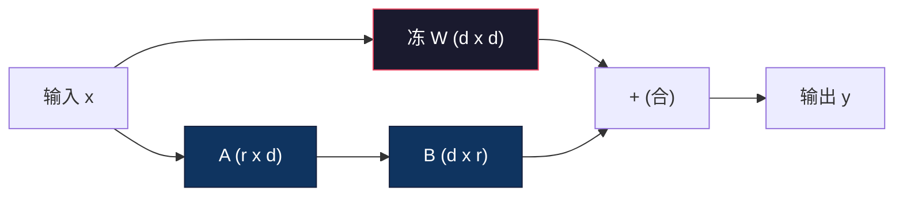
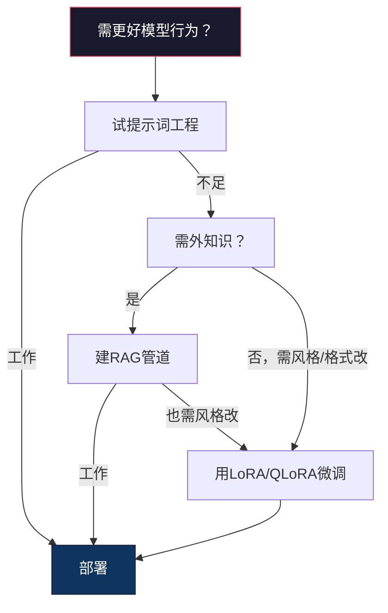

# LoRA与QLoRA微调

> 全微调7B模型需56GB VRAM。你无那。多公司也无。LoRA让你于6GB微调同模型通过训小于1%参数。这不是妥协 — 它于多任务匹全微调质量。全开源微调生态运行于此一窍。

**类型:** 构建
**语言:** Python
**前置要求:** 阶段10课程06(指令调/SFT)
**时间:** ~75分钟
**相关:** 阶段10覆从零SFT/DPO环。这课插那些入2026 PEFT工具包(PEFT、TRL、Unsloth、Axolotl、LLaMA-Factory)。

## 学习目标

- 实LoRA通过注低秩适配矩阵(A和B)入预训模型注意层
- 算LoRA vs全微调参数省:秩r带d_model维训2*r*d参数代d^2
- 用QLoRA(4位量化基+LoRA适配)微调模型合消费GPU内存
- 合LoRA权重回基模型于部署并比带和不带适配推理速

## 问题背景

你有基模型。Llama 3 8B。你欲它以你公司声答客户支持票。SFT是答。但SFT有成本问题。

全微调更新模型每参数。Llama 3 8B有8亿参数。于fp16，每参数占2字节。那是16GB仅载权重。训时，你还需梯度(16GB)、Adam优态(32GB用于动量+方差)和激活。总:约56GB VRAM用于单8B模型。

A100 80GB勉强合此。两A100于云提供方费$3-4/hour。于50,000例3 epoch训需6-10小时。那是$30-40每实验。跑10实验得超参正确你花$400于部署任前。

伸缩此至Llama 3 70B数荒谬。仅权重140GB。你需集群。每实验$100+。

有更深问题。全微调改模型每权重。若你于客户支持数据微调，你可退化模型通能力。它叫灾难遗忘。模型更好于你任务更差于一切他。

你需法训更少参数、用更少内存、不毁模型现知。

## 概念讲解

### LoRA: 低秩适配

Edward Hu和同事于Microsoft于2021年6月发LoRA。论文洞察:微调时权重更新有低内秩。你不需更新4096x4096权重矩阵中全16.7百万参数。更新中可用信息可被秩16或32矩阵捕。

这是数。标准线性层算:

```
y = Wx
```

其中W是d_out x d_in矩阵。于4096x4096注意投影，那是16,777,216参数。

LoRA冻W加低秩分解:

```
y = Wx + BAx
```

其中B是(d_out x r)和A是(r x d_in)。秩r比d小多 — 典型8、16或32。

于r=16于4096x4096层:
- 原参数: 4096 x 4096 = 16,777,216
- LoRA参数: (4096 x 16) + (16 x 4096) = 65,536 + 65,536 = 131,072
- 减: 131,072 / 16,777,216 = 0.78%

你训0.78%参数得95-100%质量。



A用缩随机值初。B初为零。这意LoRA贡献始于零 — 模型始训于其原行为渐学适配。

### 缩因子: Alpha

LoRA引缩因子alpha控低秩更新何影输出:

```
y = Wx + (alpha / r) * BAx
```

当alpha = r，缩为1x。当alpha = 2r(常默)，缩为2x。这超参控LoRA路学习率独立于基学习率。

实指导:
- alpha = 2 * rank是常社区约定(原论文于多实验用alpha = rank)
- alpha = rank给1x缩，保守但稳
- 高alpha意每步更大更新，可速收敛或致不稳

### 何处应用LoRA

transformer有多线性层。你不需加LoRA于全。原论文测异合:

| 目标层 | 可训参数(7B) | 质量 |
|--------------|----------------------|---------|
| 仅q_proj | 4.7M | 好 |
| q_proj + v_proj | 9.4M | 更好 |
| q_proj + k_proj + v_proj + o_proj | 18.9M | 注意最佳 |
| 全线性(注意+MLP) | 37.7M | 边际增益，2x参数 |

多任务甜点: q_proj + v_proj。这目自注意中查询和值投影，它控模型注意何和何信息抽。加MLP层助复杂任务如代码生成但倍参数数于简任务边际回报。

### 秩择

秩r控适配表达性:

| 秩 | 每层可训参数 | 最适 |
|------|---------------------------|----------|
| 4 | 32,768 | 简分类、情感 |
| 8 | 65,536 | 单域问答、总结 |
| 16 | 131,072 | 多域任务、指令随 |
| 32 | 262,144 | 复杂推理、代码生成 |
| 64 | 524,288 | 多任务边际回报 |
| 128 | 1,048,576 | 少证 |

Hu et al.示r=4已捕简任务大多适配。r=8和r=16是实践中最常择。超r=64少改进质量始失LoRA内存优势。

### QLoRA: 4位量化+LoRA

Tim Dettmers和同事于University of Washington于2023年5月发QLoRA。想法:量化冻基模型至4位精度，后于上附fp16 LoRA适配。

这戏剧性改内存等:

| 法 | 权重内存(7B) | 训内存(7B) | GPU需 |
|--------|-------------------|---------------------|-------------|
| 全微调(fp16) | 14GB | ~56GB | 1x A100 80GB |
| LoRA(fp16基) | 14GB | ~18GB | 1x A100 40GB |
| QLoRA(4位基) | 3.5GB | ~6GB | 1x RTX 3090 24GB |

QLoRA作三技术贡献:

**NF4 (Normal Float 4-bit)**: 为神经网权重专设新数据类型。神经网权重大致正态分布。NF4置其16量化级于标准正态分布分位。这对正态分布数据信息论优。它比均匀4位量化(INT4)或标准Float4失更少信息。

**双量化**: 量化常数本身占内存。每64权重块需fp32缩因子(4字节)。于7B模型，那是额0.4GB。双量化量化这些常数至fp8，减开销至0.1GB。小但加。

**分页优**: 训时，优态(Adam动量和方差)可于长序列超GPU内存。分页优用NVIDIA统一内存自动分优态至CPU RAM当GPU内存耗尽，需时分回。这防OOM崩以吞吐代价。

### 质量问

减参数或量化基伤质量否？多论文结果:

| 法 | MMLU(5-shot) | MT-Bench | HumanEval |
|--------|--------------|----------|-----------|
| 全微调(Llama 2 7B) | 48.3 | 6.72 | 14.6 |
| LoRA r=16 | 47.9 | 6.68 | 14.0 |
| QLoRA r=16 (NF4) | 47.5 | 6.61 | 13.4 |
| QLoRA r=64 (NF4) | 48.1 | 6.70 | 14.2 |

LoRA于r=16于多基准在全微调1%内。QLoRA于r=16失另分数百分比。QLoRA于r=64基本匹全微调同时用90%少内存。

### 实世界成本

于50,000例(3 epoch)微调Llama 3 8B:

| 法 | GPU | 时 | 成本 |
|--------|-----|------|------|
| 全微调 | 2x A100 80GB | 8小时 | ~$32 |
| LoRA r=16 | 1x A100 40GB | 4小时 | ~$8 |
| QLoRA r=16 | 1x RTX 4090 24GB | 6小时 | ~$5 |
| QLoRA r=16 (Unsloth) | 1x RTX 4090 24GB | 2.5小时 | ~$2 |
| QLoRA r=16 | 1x T4 16GB | 12小时 | ~$4 |

QLoRA于单消费GPU成本低午餐。这是何开源微调社区于2023爆和何下每训框架默QLoRA于2026。

### 2026 PEFT栈

| 框架 | 何 | 择何时 |
|-----------|-----------|-----------|
| **Hugging Face PEFT** | 规范LoRA/QLoRA/DoRA/IA3库 | 你要原始控和你训环已于`transformers.Trainer` |
| **TRL** | HF强化反馈训器(SFT、DPO、GRPO、PPO、ORPO) | 你需SFT后DPO/GRPO；建PEFT上 |
| **Unsloth** | Triton核改写前/后传 | 你要2-5x速+半VRAM无损；Llama/Mistral/Qwen族 |
| **Axolotl** | YAML配包PEFT+TRL+DeepSpeed+Unsloth | 你要可复、版控训跑 |
| **LLaMA-Factory** | GUI/CLI/API包PEFT+TRL | 你要零码微调；100+模型族支 |
| **torchtune** | 原PyTorch配方，无`transformers`依赖 | 你要最小依赖和你组已标准于PyTorch |

规则:研用或一次实验 → PEFT。可复生产管道 → Axolotl启用Unsloth核。抛原型 → LLaMA-Factory。

### 合适配

训后，你有两物:冻基模型和小LoRA适配(典型10-100MB)。你可:

1. **保持分离**: 载基模型，于上载适配。异任务换适配。这是何你从一基模型服多微调变种。

2. **永合**: 算W' = W + (alpha/r) * BA并存结果为新全模型。合模型同大如原。无推理开销。无适配管。

于服多任务(客户支持适配、代码适配、翻译适配)，保持分离。于部署单专模型，合。

合多适配高级技术:

- **TIES-Merging** (Yadav et al. 2023): 剪小幅参数、解符号冲突、后合。减适配间干扰。
- **DARE** (Yu et al. 2023): 合前随机弃适配参数并重缩剩。惊效于合能力。
- **任务算**: 简加或减适配权重。加"代码"适配和"数学"适配常产好于两者模型。

### 何时不微调

微调是第三选项非第一。

**第一:提示词工程。** 写更好系统提示词。加少样本例。用思维链。这成本无费分。若提示词得你80%，你可能不需微调。

**第二:RAG。** 若模型需知你特数据(文档、知识库、产品目录)，检索比烘焙入权重更便宜更可维护。见课程06。

**第三:微调。** 用此当需模型采特定风格、格式或推理模式不可通过提示词达。当你需一致结构输出。当你需蒸馏大模型入小。当延迟重你不可付少样本提示词额token。



## 构建

我们于纯PyTorch从零实LoRA。无库。无魔术。你将建LoRA层、注入模型、训它、合权重回。

### 步骤1: LoRA层

```python
import torch
import torch.nn as nn
import math

class LoRALayer(nn.Module):
    def __init__(self, in_features, out_features, rank=8, alpha=16):
        super().__init__()
        self.rank = rank
        self.alpha = alpha
        self.scaling = alpha / rank

        self.A = nn.Parameter(torch.randn(in_features, rank) * (1 / math.sqrt(rank)))
        self.B = nn.Parameter(torch.zeros(rank, out_features))

    def forward(self, x):
        return (x @ self.A @ self.B) * self.scaling
```

A用缩随机值初。B初为零。产品BA始于零，故模型始于原行为。

### 步骤2: LoRA包线性层

```python
class LinearWithLoRA(nn.Module):
    def __init__(self, linear, rank=8, alpha=16):
        super().__init__()
        self.linear = linear
        self.lora = LoRALayer(
            linear.in_features, linear.out_features, rank, alpha
        )

        for param in self.linear.parameters():
            param.requires_grad = False

    def forward(self, x):
        return self.linear(x) + self.lora(x)
```

原线性层冻。仅LoRA参数(A和B)可训。

### 步骤3: 注LoRA入模型

```python
def inject_lora(model, target_modules, rank=8, alpha=16):
    for param in model.parameters():
        param.requires_grad = False

    lora_layers = {}
    for name, module in model.named_modules():
        if isinstance(module, nn.Linear):
            if any(t in name for t in target_modules):
                parent_name = ".".join(name.split(".")[:-1])
                child_name = name.split(".")[-1]
                parent = dict(model.named_modules())[parent_name]
                lora_linear = LinearWithLoRA(module, rank, alpha)
                setattr(parent, child_name, lora_linear)
                lora_layers[name] = lora_linear
    return lora_layers
```

首，冻模型每参数。后走模型树，找匹你目名线性层，换它们为LoRA包版本。LoRA A和B矩阵是全模型仅可训参数。

### 步骤4: 计参数

```python
def count_parameters(model):
    total = sum(p.numel() for p in model.parameters())
    trainable = sum(p.numel() for p in model.parameters() if p.requires_grad)
    frozen = total - trainable
    return {
        "total": total,
        "trainable": trainable,
        "frozen": frozen,
        "trainable_pct": 100 * trainable / total if total > 0 else 0
    }
```

### 步骤5: 合权重回

```python
def merge_lora_weights(model):
    for name, module in model.named_modules():
        if isinstance(module, LinearWithLoRA):
            with torch.no_grad():
                merged = (
                    module.lora.A @ module.lora.B
                ) * module.lora.scaling
                module.linear.weight.data += merged.T
            parent_name = ".".join(name.split(".")[:-1])
            child_name = name.split(".")[-1]
            if parent_name:
                parent = dict(model.named_modules())[parent_name]
            else:
                parent = model
            setattr(parent, child_name, module.linear)
```

合后，LoRA层去。模型同大如原带适配烘焙入权重。无推理开销。

### 步骤6: 模拟QLoRA量化

```python
def quantize_to_nf4(tensor, block_size=64):
    blocks = tensor.reshape(-1, block_size)
    scales = blocks.abs().max(dim=1, keepdim=True).values / 7.0
    scales = torch.clamp(scales, min=1e-8)
    quantized = torch.round(blocks / scales).clamp(-8, 7).to(torch.int8)
    return quantized, scales

def dequantize_from_nf4(quantized, scales, original_shape):
    dequantized = quantized.float() * scales
    return dequantized.reshape(original_shape)
```

这模拟4位量化通过映权重入64块内16离散级。生产QLoRA用bitsandbytes库于GPU真NF4。

### 步骤7: 训环

```python
def train_lora(model, data, epochs=5, lr=1e-3, batch_size=4):
    optimizer = torch.optim.AdamW(
        [p for p in model.parameters() if p.requires_grad], lr=lr
    )
    criterion = nn.MSELoss()

    losses = []
    for epoch in range(epochs):
        epoch_loss = 0.0
        n_batches = 0
        indices = torch.randperm(len(data["inputs"]))

        for i in range(0, len(indices), batch_size):
            batch_idx = indices[i:i + batch_size]
            x = data["inputs"][batch_idx]
            y = data["targets"][batch_idx]

            output = model(x)
            loss = criterion(output, y)

            optimizer.zero_grad()
            loss.backward()
            optimizer.step()

            epoch_loss += loss.item()
            n_batches += 1

        avg_loss = epoch_loss / n_batches
        losses.append(avg_loss)

    return losses
```

### 步骤8: 全演示

```python
def demo():
    torch.manual_seed(42)
    d_model = 256
    n_classes = 10

    model = nn.Sequential(
        nn.Linear(d_model, 512),
        nn.ReLU(),
        nn.Linear(512, 512),
        nn.ReLU(),
        nn.Linear(512, n_classes),
    )

    n_samples = 500
    x = torch.randn(n_samples, d_model)
    y = torch.randint(0, n_classes, (n_samples,))
    y_onehot = torch.zeros(n_samples, n_classes).scatter_(1, y.unsqueeze(1), 1.0)

    data = {"inputs": x, "targets": y_onehot}

    params_before = count_parameters(model)

    lora_layers = inject_lora(
        model, target_modules=["0", "2"], rank=8, alpha=16
    )

    params_after = count_parameters(model)

    losses = train_lora(model, data, epochs=20, lr=1e-3)

    merge_lora_weights(model)
    params_merged = count_parameters(model)

    return {
        "params_before": params_before,
        "params_after": params_after,
        "params_merged": params_merged,
        "losses": losses,
    }
```

演示创小模型、注LoRA入两层、训它、合权重回。参数数从全可训降至~1%于LoRA训，后回原架构合后。

## 使用

有Hugging Face生态，LoRA于真模型约20行:

```python
from transformers import AutoModelForCausalLM, AutoTokenizer
from peft import LoraConfig, get_peft_model, TaskType

model = AutoModelForCausalLM.from_pretrained("meta-llama/Llama-3.1-8B")
tokenizer = AutoTokenizer.from_pretrained("meta-llama/Llama-3.1-8B")

lora_config = LoraConfig(
    task_type=TaskType.CAUSAL_LM,
    r=16,
    lora_alpha=32,
    lora_dropout=0.05,
    target_modules=["q_proj", "v_proj"],
)

model = get_peft_model(model, lora_config)
model.print_trainable_parameters()
```

于QLoRA，加bitsandbytes量化:

```python
from transformers import BitsAndBytesConfig

bnb_config = BitsAndBytesConfig(
    load_in_4bit=True,
    bnb_4bit_quant_type="nf4",
    bnb_4bit_compute_dtype=torch.bfloat16,
    bnb_4bit_use_double_quant=True,
)

model = AutoModelForCausalLM.from_pretrained(
    "meta-llama/Llama-3.1-8B",
    quantization_config=bnb_config,
    device_map="auto",
)

model = get_peft_model(model, lora_config)
```

就是。同训环。同数据管道。基模型现住4位，LoRA适配于fp16训，全合入6GB。

于Hugging Face Trainer训:

```python
from transformers import TrainingArguments, Trainer
from datasets import load_dataset

dataset = load_dataset("tatsu-lab/alpaca", split="train[:5000]")

training_args = TrainingArguments(
    output_dir="./lora-llama",
    num_train_epochs=3,
    per_device_train_batch_size=4,
    gradient_accumulation_steps=4,
    learning_rate=2e-4,
    fp16=True,
    logging_steps=10,
    save_strategy="epoch",
    optim="paged_adamw_8bit",
)

trainer = Trainer(
    model=model,
    args=training_args,
    train_dataset=dataset,
)

trainer.train()

model.save_pretrained("./lora-adapter")
```

存适配10-100MB。基模型未触。你可于Hugging Face Hub分享适配无重分全模型。

## 交付成果

这课产:
- `outputs/prompt-lora-advisor.md` — 助你决LoRA秩、目模块和超参于你特任务提示词
- `outputs/skill-fine-tuning-guide.md` — 教代理何时何微调决树技能

## 练习题

1. **秩消研。** 用秩2、4、8、16、32和64跑演示。绘终损失vs秩。找边际回报点倍秩不再半损失。于256维特征简分类任务，这应于r=8-16。

2. **目模块比。** 改inject_lora目仅层"0"、仅层"2"、仅层"4"和全三。每变种训20 epoch。比收敛速和终损失。这镜像实决目q_proj vs v_proj vs全线性层。

3. **量化误析。** 取训模型权重矩阵前后quantize_to_nf4 / dequantize_from_nf4。算均方误、最大绝对误和原与重构权重间相关性。实验block_size值32、64、128和256。

4. **多适配服。** 于数据异子集(偶索引vs奇索引)训两LoRA适配。存两适配。载基模型一次，后换适配并验每于同输入产异输出。这是何生产系统从一基服多微调模型。

5. **合vs不合推理。** 比LoRA模型前后merge_lora_weights于同100输入输出。验输出同(浮点容1e-5内)。后基准两推理速 — 合应稍快因单矩阵乘代两。

## 关键术语

| 术语 | 人们怎么说 | 实际含义 |
|------|----------------|----------------------|
| LoRA | "效微调" | 低秩适配:冻基权重，训两小矩阵A和B其产品近似全权重更新 |
| QLoRA | "笔记本微调" | 量化LoRA:载基模型于4位NF4，于上fp16训LoRA适配，使7B微调于6GB VRAM |
| 秩(r) | "模型能学多少" | A和B矩阵内维；控表达性vs参数数 |
| Alpha | "LoRA学习率" | LoRA输出用缩因子；alpha/r缩适配贡献于终输出 |
| NF4 | "4位量化" | Normal Float 4:4位数据类型量化级于正态分布分位，神经网权重优 |
| 适配 | "小训部分" | LoRA A和B矩阵存为分离文件(10-100MB)，可于基模型任副本上载 |
| 目模块 | "何层LoRA" | 注LoRA适配特定线性层(q_proj、v_proj等) |
| 合 | "烘焙入" | 算W + (alpha/r) * BA并换原权重，消适配推理开销 |
| 分页优 | "训时勿OOM" | 当GPU内存耗尽分优态(Adam动量、方差)至CPU |
| 灾难遗忘 | "微调毁他一切" | 当更新全权重致模型失前学能力 |

## 延伸阅读

- Hu et al., "LoRA: Low-Rank Adaptation of Large Language Models" (2021) — 引低秩分解法原论文，于GPT-3 175B测秩低至4
- Dettmers et al., "QLoRA: Efficient Finetuning of Quantized Language Models" (2023) — 引NF4、双量化、分页优，使65B微调于单48GB GPU
- PEFT库文档(huggingface.co/docs/peft) — Hugging Face生态LoRA、QLoRA和他参数效法标准库
- Yadav et al., "TIES-Merging: Resolving Interference When Merging Models" (2023) — 合多LoRA适配无质量退化技术
- [Rafailov et al., "Direct Preference Optimization: Your Language Model is Secretly a Reward Model" (NeurIPS 2023)](https://arxiv.org/abs/2305.18290) — DPO推导；SFT后偏好调阶段，无需奖模型。
- [TRL文档](https://huggingface.co/docs/trl/) — `SFTTrainer`、`DPOTrainer`、`KTOTrainer`官方参考和PEFT/bitsandbytes/Unsloth集面。
- [Unsloth文档](https://docs.unsloth.ai/) — 融核倍微调吞吐和半内存；TRL下性能层。
- [Axolotl文档](https://axolotl-ai-cloud.github.io/axolotl/) — YAML配多GPU SFT/DPO/QLoRA训器；配即码替代手写脚本。