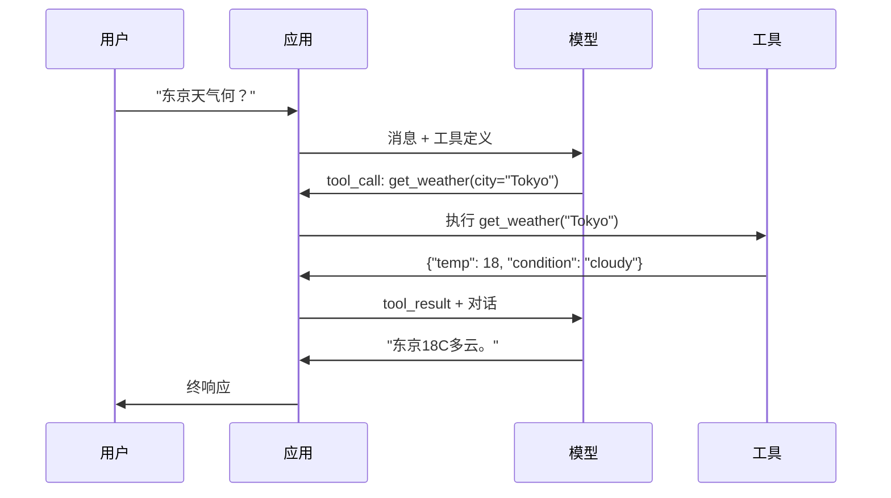

# 函数调用与工具使用

> LLM不能做任事。它们生成文。这是全能力。它们不能查天气、询数据库、发邮件、跑代码或读文件。你见过每"AI代理"是LLM生成JSON说何函数调 — 后你代码实调。模型是脑。工具是手。函数调用是神经系统连它们。

**类型:** 构建
**语言:** Python
**前置要求:** 阶段11课程03(结构化输出)
**时间:** ~75分钟
**相关:** 阶段11课程14(模型上下文协议) — 当工具跨主机共享，从内联函数调毕业至MCP服务器。这课覆内联例；MCP覆协议例。

## 学习目标

- 实函数调用环:定义工具schema、解析模型工具调用JSON、执行函数、返结果
- 设工具schema带清晰描述和类型参数模型可可靠调
- 多轮代理环链多函数调用答复杂查询
- 处函数调用边例:并行工具调、误传播、防无限工具环

## 问题背景

你建聊天机器人。用户问:"东京现天气何？"

模型响应:"我无法实天气数据，但基于季节，东京大约15摄氏度..."

那是穿免责幻觉。模型不知天气。它永不会。天气每小时变。模型训数据月旧。

正答需调OpenWeatherMap API、得当前温度、返实数。模型不可调API。你代码可。缺失片:结构协议让模型说"我需调天气API带这些参数"并让你代码执行它馈结果回。

这是函数调用。模型输出结构JSON描述何函数调带何参数。你应用执行函数。结果回入对话。模型用结果产终答。

无函数调用，LLM是百科全书。有它，它们成代理。

## 概念讲解

### 函数调用环

每工具用交互随同5步环。



步1:用户发消息。步2:模型收消息与工具定义(JSON Schema描述可用函数)。步3:代响文，模型输工具调用 — 结构JSON对象带函数名和参数。步4:你代码执行函数捕结果。步5:结果回模型，它现有实数据产终答。

模型永不执行任事。它仅决何调带何参数。你代码是执行器。

### 工具定义: JSON Schema契约

每工具由JSON Schema定义告模型函数何、何参数、何类型。

```json
{
  "type": "function",
  "function": {
    "name": "get_weather",
    "description": "Get current weather for a city. Returns temperature in Celsius and conditions.",
    "parameters": {
      "type": "object",
      "properties": {
        "city": {
          "type": "string",
          "description": "City name, e.g. 'Tokyo' or 'San Francisco'"
        },
        "units": {
          "type": "string",
          "enum": ["celsius", "fahrenheit"],
          "description": "Temperature units"
        }
      },
      "required": ["city"]
    }
  }
}
```

`description`字段关键。模型读它们决何时何用工具。模糊描述如"得天气"产更差工具择比"Get current weather for a city. Returns temperature in Celsius and conditions."描述是工具择提示词。

### 提供方比

每主提供方支函数调用，但API面异。

| 提供方 | API参数 | 工具调格式 | 并行调 | 强调 |
|----------|--------------|-----------------|---------------|----------------|
| OpenAI (GPT-5, o4) | `tools` | `tool_calls[].function` | 是(每轮多) | `tool_choice="required"` |
| Anthropic (Claude 4.6/4.7) | `tools` | `content[].type="tool_use"` | 是(多块) | `tool_choice={"type":"any"}` |
| Google (Gemini 3) | `function_declarations` | `functionCall` | 是 | `function_calling_config` |
| 开权重(Llama 4, Qwen3, DeepSeek-V3) | Llama 4原生`tools`; 他Hermes或ChatML | 混 | 模型依赖 | 提示词基或`tool_choice`若支 |

2026三闭提供方已收敛近同JSON-Schema基格式。Llama 4载原生`tools`字段匹OpenAI形。开权重微调仍异 — Hermes格式(NousResearch)是第三方微调最常。跨主机共享工具，择MCP(阶段11课程14)代内联函数调 — 服务器同于全它们。

### 工具择: Auto、Required、特定

你控模型何时用工具。

**Auto**(默):模型决是否调工具或直响。"2+2何？" — 直响。"天气何？" — 调工具。

**Required**:模型须调至少一工具。用此当你知用户意图需工具。防模型猜代查实数据。

**特定函数**:强模型调特函数。`tool_choice={"type":"function", "function": {"name": "get_weather"}}`保天气工具调，无关查询。用此路由 — 当上游逻辑已定何工具需。

### 并行函数调用

GPT-4o和Claude可于单轮调多函数。用户问:"东京和纽约天气何？"模型同输两工具调:

```json
[
  {"name": "get_weather", "arguments": {"city": "Tokyo"}},
  {"name": "get_weather", "arguments": {"city": "New York"}}
]
```

你代码执行两(理并发)、返两结果、模型合为单响应。这砍往返从2至1。于每查询5-10工具调代理，并行调用减延迟60-80%。

### 结构化输出vs函数调用

课程03覆结构化输出。函数调用用同JSON Schema机制，但异目的。

**结构化输出**:强模型产特形数据。输出是终产品。例:从文抽产品信息为`{name, price, in_stock}`。

**函数调用**:模型宣意图执行动作。输出是中间步。例:`get_weather(city="Tokyo")` — 模型请求动作非产终答。

用结构化输出当你欲数据抽取。用函数调用当你欲模型与外系统交互。

### 安全:不可协商规则

函数调用是你可给LLM最危险能力。模型择何执行。若你工具集含数据库查询，模型构查询。若含shell命令，模型写它们。

**规则1:永不直接传模型生成SQL至数据库。**模型可会生成DROP TABLE、UNION注入或返每行查询。总参数化。总验证。总用操允许列表。

**规则2:允许列表函数。**模型仅可调你显定义函数。永不建通用"按名执行任函数"工具。若你有50内函数，仅曝用户需5。

**规则3:验证参数。**模型可传城市名`"; DROP TABLE users; --"`。执行前验证每参数对期望类型、范围和格式。

**规则4:清洗工具结果。**若工具返敏感数据(API密、PII、内误)，发回模型前过滤。模型会逐字含工具结果于其响应。

**规则5:率限工具调。**环中模型可调工具数百次。设最大(每对话10-20调合理)。断无限环。

### 误处理

工具败。API超时。数据库下。文件不存在。模型需知工具何时败何。

返误为结构工具结果，非异常:

```json
{
  "error": true,
  "message": "City 'Toky' not found. Did you mean 'Tokyo'?",
  "code": "CITY_NOT_FOUND"
}
```

模型读此，调其参数，重试。模型好于从结构误消息自纠。它们差于从空响应或泛"出事"误恢复。

### MCP: 模型上下文协议

MCP是Anthropic工具互操开放标准。代每应用定义其自工具，MCP供通用协议:工具由MCP服务器供，MCP客户端消费(如Claude Code、Cursor或你应用)。

一MCP服务器可曝工具至任兼容客户端。Postgres MCP服务器给任MCP兼容代理数据库访问。GitHub MCP服务器给任代理仓库访问。工具定义一次，处处用。

MCP是函数调用HTTP之于网络。它标准化传输层使工具可移植。

## 构建

### 步骤1: 定义工具注册表

建注册表存工具定义和其实现。每工具有JSON Schema定义(模型见)和Python函数(你代码执行)。

```python
import json
import math
import time
import hashlib


TOOL_REGISTRY = {}


def register_tool(name, description, parameters, function):
    TOOL_REGISTRY[name] = {
        "definition": {
            "type": "function",
            "function": {
                "name": name,
                "description": description,
                "parameters": parameters,
            },
        },
        "function": function,
    }
```

### 步骤2: 实现5工具

建计算器、天气查找、网页搜索模拟器、文件读器和代码运行器。

```python
def calculator(expression, precision=2):
    allowed = set("0123456789+-*/.() ")
    if not all(c in allowed for c in expression):
        return {"error": True, "message": f"Invalid characters in expression: {expression}"}
    try:
        result = eval(expression, {"__builtins__": {}}, {"math": math})
        return {"result": round(float(result), precision), "expression": expression}
    except Exception as e:
        return {"error": True, "message": str(e)}


WEATHER_DB = {
    "tokyo": {"temp_c": 18, "condition": "cloudy", "humidity": 72, "wind_kph": 14},
    "new york": {"temp_c": 22, "condition": "sunny", "humidity": 45, "wind_kph": 8},
    "london": {"temp_c": 12, "condition": "rainy", "humidity": 88, "wind_kph": 22},
    "san francisco": {"temp_c": 16, "condition": "foggy", "humidity": 80, "wind_kph": 18},
    "sydney": {"temp_c": 25, "condition": "sunny", "humidity": 55, "wind_kph": 10},
}


def get_weather(city, units="celsius"):
    key = city.lower().strip()
    if key not in WEATHER_DB:
        suggestions = [c for c in WEATHER_DB if c.startswith(key[:3])]
        return {
            "error": True,
            "message": f"City '{city}' not found.",
            "suggestions": suggestions,
            "code": "CITY_NOT_FOUND",
        }
    data = WEATHER_DB[key].copy()
    if units == "fahrenheit":
        data["temp_f"] = round(data["temp_c"] * 9 / 5 + 32, 1)
        del data["temp_c"]
    data["city"] = city
    return data


SEARCH_DB = {
    "python function calling": [
        {"title": "OpenAI Function Calling Guide", "url": "https://platform.openai.com/docs/guides/function-calling", "snippet": "Learn how to connect LLMs to external tools."},
        {"title": "Anthropic Tool Use", "url": "https://docs.anthropic.com/en/docs/tool-use", "snippet": "Claude can interact with external tools and APIs."},
    ],
    "MCP protocol": [
        {"title": "Model Context Protocol", "url": "https://modelcontextprotocol.io", "snippet": "An open standard for connecting AI models to data sources."},
    ],
    "weather API": [
        {"title": "OpenWeatherMap API", "url": "https://openweathermap.org/api", "snippet": "Free weather API with current, forecast, and historical data."},
    ],
}


def web_search(query, max_results=3):
    key = query.lower().strip()
    for db_key, results in SEARCH_DB.items():
        if db_key in key or key in db_key:
            return {"query": query, "results": results[:max_results], "total": len(results)}
    return {"query": query, "results": [], "total": 0}


FILE_SYSTEM = {
    "data/config.json": '{"model": "gpt-4o", "temperature": 0.7, "max_tokens": 4096}',
    "data/users.csv": "name,email,role\nAlice,alice@example.com,admin\nBob,bob@example.com,user",
    "README.md": "# My Project\nA tool-use agent built from scratch.",
}


def read_file(path):
    if ".." in path or path.startswith("/"):
        return {"error": True, "message": "Path traversal not allowed.", "code": "FORBIDDEN"}
    if path not in FILE_SYSTEM:
        available = list(FILE_SYSTEM.keys())
        return {"error": True, "message": f"File '{path}' not found.", "available_files": available, "code": "NOT_FOUND"}
    content = FILE_SYSTEM[path]
    return {"path": path, "content": content, "size_bytes": len(content), "lines": content.count("\n") + 1}


def run_code(code, language="python"):
    if language != "python":
        return {"error": True, "message": f"Language '{language}' not supported. Only 'python' is available."}
    forbidden = ["import os", "import sys", "import subprocess", "exec(", "eval(", "__import__", "open("]
    for pattern in forbidden:
        if pattern in code:
            return {"error": True, "message": f"Forbidden operation: {pattern}", "code": "SECURITY_VIOLATION"}
    try:
        local_vars = {}
        exec(code, {"__builtins__": {"print": print, "range": range, "len": len, "str": str, "int": int, "float": float, "list": list, "dict": dict, "sum": sum, "min": min, "max": max, "abs": abs, "round": round, "sorted": sorted, "enumerate": enumerate, "zip": zip, "map": map, "filter": filter, "math": math}}, local_vars)
        result = local_vars.get("result", None)
        return {"success": True, "result": result, "variables": {k: str(v) for k, v in local_vars.items() if not k.startswith("_")}}
    except Exception as e:
        return {"error": True, "message": f"{type(e).__name__}: {e}"}
```

### 步骤3: 注册全工具

```python
def register_all_tools():
    register_tool(
        "calculator", "Evaluate a mathematical expression. Supports +, -, *, /, parentheses, and decimals. Returns the numeric result.",
        {"type": "object", "properties": {"expression": {"type": "string", "description": "Math expression, e.g. '(10 + 5) * 3'"}, "precision": {"type": "integer", "description": "Decimal places in result", "default": 2}}, "required": ["expression"]},
        calculator,
    )
    register_tool(
        "get_weather", "Get current weather for a city. Returns temperature, condition, humidity, and wind speed.",
        {"type": "object", "properties": {"city": {"type": "string", "description": "City name, e.g. 'Tokyo' or 'San Francisco'"}, "units": {"type": "string", "enum": ["celsius", "fahrenheit"], "description": "Temperature units, defaults to celsius"}}, "required": ["city"]},
        get_weather,
    )
    register_tool(
        "web_search", "Search the web for information. Returns a list of results with title, URL, and snippet.",
        {"type": "object", "properties": {"query": {"type": "string", "description": "Search query"}, "max_results": {"type": "integer", "description": "Maximum results to return", "default": 3}}, "required": ["query"]},
        web_search,
    )
    register_tool(
        "read_file", "Read the contents of a file. Returns the file content, size, and line count.",
        {"type": "object", "properties": {"path": {"type": "string", "description": "Relative file path, e.g. 'data/config.json'"}}, "required": ["path"]},
        read_file,
    )
    register_tool(
        "run_code", "Execute Python code in a sandboxed environment. Set a 'result' variable to return output.",
        {"type": "object", "properties": {"code": {"type": "string", "description": "Python code to execute"}, "language": {"type": "string", "enum": ["python"], "description": "Programming language"}}, "required": ["code"]},
        run_code,
    )
```

### 步骤4: 建函数调用环

这是核引擎。它模拟模型决何工具调、执行工具、馈结果回。

```python
def simulate_model_decision(user_message, tools, conversation_history):
    msg = user_message.lower()

    if any(word in msg for word in ["weather", "temperature", "forecast"]):
        cities = []
        for city in WEATHER_DB:
            if city in msg:
                cities.append(city)
        if not cities:
            for word in msg.split():
                if word.capitalize() in [c.title() for c in WEATHER_DB]:
                    cities.append(word)
        if not cities:
            cities = ["tokyo"]
        calls = []
        for city in cities:
            calls.append({"name": "get_weather", "arguments": {"city": city.title()}})
        return calls

    if any(word in msg for word in ["calculate", "compute", "math", "what is", "how much"]):
        for token in msg.split():
            if any(c in token for c in "+-*/"):
                return [{"name": "calculator", "arguments": {"expression": token}}]
        if "+" in msg or "-" in msg or "*" in msg or "/" in msg:
            expr = "".join(c for c in msg if c in "0123456789+-*/.() ")
            if expr.strip():
                return [{"name": "calculator", "arguments": {"expression": expr.strip()}}]
        return [{"name": "calculator", "arguments": {"expression": "0"}}]

    if any(word in msg for word in ["search", "find", "look up", "google"]):
        query = msg.replace("search for", "").replace("look up", "").replace("find", "").strip()
        return [{"name": "web_search", "arguments": {"query": query}}]

    if any(word in msg for word in ["read", "file", "open", "cat", "show"]):
        for path in FILE_SYSTEM:
            if path.split("/")[-1].split(".")[0] in msg:
                return [{"name": "read_file", "arguments": {"path": path}}]
        return [{"name": "read_file", "arguments": {"path": "README.md"}}]

    if any(word in msg for word in ["run", "execute", "code", "python"]):
        return [{"name": "run_code", "arguments": {"code": "result = 'Hello from the sandbox!'", "language": "python"}}]

    return []


def execute_tool_call(tool_call):
    name = tool_call["name"]
    args = tool_call["arguments"]

    if name not in TOOL_REGISTRY:
        return {"error": True, "message": f"Unknown tool: {name}", "code": "UNKNOWN_TOOL"}

    tool = TOOL_REGISTRY[name]
    func = tool["function"]
    start = time.time()

    try:
        result = func(**args)
    except TypeError as e:
        result = {"error": True, "message": f"Invalid arguments: {e}"}

    elapsed_ms = round((time.time() - start) * 1000, 2)
    return {"tool": name, "result": result, "execution_time_ms": elapsed_ms}


def run_function_calling_loop(user_message, max_iterations=5):
    conversation = [{"role": "user", "content": user_message}]
    tool_definitions = [t["definition"] for t in TOOL_REGISTRY.values()]
    all_tool_results = []

    for iteration in range(max_iterations):
        tool_calls = simulate_model_decision(user_message, tool_definitions, conversation)

        if not tool_calls:
            break

        results = []
        for call in tool_calls:
            result = execute_tool_call(call)
            results.append(result)

        conversation.append({"role": "assistant", "content": None, "tool_calls": tool_calls})

        for result in results:
            conversation.append({"role": "tool", "content": json.dumps(result["result"]), "tool_name": result["tool"]})

        all_tool_results.extend(results)
        break

    return {"conversation": conversation, "tool_results": all_tool_results, "iterations": iteration + 1 if tool_calls else 0}
```

### 步骤5: 参数验证

建验证器执行前查工具调用参数对JSON Schema。

```python
def validate_tool_arguments(tool_name, arguments):
    if tool_name not in TOOL_REGISTRY:
        return [f"Unknown tool: {tool_name}"]

    schema = TOOL_REGISTRY[tool_name]["definition"]["function"]["parameters"]
    errors = []

    if not isinstance(arguments, dict):
        return [f"Arguments must be an object, got {type(arguments).__name__}"]

    for required_field in schema.get("required", []):
        if required_field not in arguments:
            errors.append(f"Missing required argument: {required_field}")

    properties = schema.get("properties", {})
    for arg_name, arg_value in arguments.items():
        if arg_name not in properties:
            errors.append(f"Unknown argument: {arg_name}")
            continue

        prop_schema = properties[arg_name]
        expected_type = prop_schema.get("type")

        type_checks = {"string": str, "integer": int, "number": (int, float), "boolean": bool, "array": list, "object": dict}
        if expected_type in type_checks:
            if not isinstance(arg_value, type_checks[expected_type]):
                errors.append(f"Argument '{arg_name}': expected {expected_type}, got {type(arg_value).__name__}")

        if "enum" in prop_schema and arg_value not in prop_schema["enum"]:
            errors.append(f"Argument '{arg_name}': '{arg_value}' not in {prop_schema['enum']}")

    return errors
```

### 步骤6: 跑演示

```python
def run_demo():
    register_all_tools()

    print("=" * 60)
    print("  Function Calling & Tool Use Demo")
    print("=" * 60)

    print("\n--- Registered Tools ---")
    for name, tool in TOOL_REGISTRY.items():
        desc = tool["definition"]["function"]["description"][:60]
        params = list(tool["definition"]["function"]["parameters"].get("properties", {}).keys())
        print(f"  {name}: {desc}...")
        print(f"    params: {params}")

    print(f"\n--- Argument Validation ---")
    validation_tests = [
        ("get_weather", {"city": "Tokyo"}, "Valid call"),
        ("get_weather", {}, "Missing required arg"),
        ("get_weather", {"city": "Tokyo", "units": "kelvin"}, "Invalid enum value"),
        ("calculator", {"expression": 123}, "Wrong type (int for string)"),
        ("unknown_tool", {"x": 1}, "Unknown tool"),
    ]
    for tool_name, args, label in validation_tests:
        errors = validate_tool_arguments(tool_name, args)
        status = "VALID" if not errors else f"ERRORS: {errors}"
        print(f"  {label}: {status}")

    print(f"\n--- Tool Execution ---")
    direct_tests = [
        {"name": "calculator", "arguments": {"expression": "(10 + 5) * 3 / 2"}},
        {"name": "get_weather", "arguments": {"city": "Tokyo"}},
        {"name": "get_weather", "arguments": {"city": "Mars"}},
        {"name": "web_search", "arguments": {"query": "python function calling"}},
        {"name": "read_file", "arguments": {"path": "data/config.json"}},
        {"name": "read_file", "arguments": {"path": "../etc/passwd"}},
        {"name": "run_code", "arguments": {"code": "result = sum(range(1, 101))"}},
        {"name": "run_code", "arguments": {"code": "import os; os.system('rm -rf /')"}},
    ]
    for call in direct_tests:
        result = execute_tool_call(call)
        print(f"\n  {call['name']}({json.dumps(call['arguments'])})")
        print(f"    -> {json.dumps(result['result'], indent=None)[:100]}")
        print(f"    time: {result['execution_time_ms']}ms")

    print(f"\n--- Full Function Calling Loop ---")
    test_queries = [
        "What's the weather in Tokyo?",
        "Calculate (100 + 250) * 0.15",
        "Search for MCP protocol",
        "Read the config file",
        "Run some Python code",
        "Tell me a joke",
    ]
    for query in test_queries:
        print(f"\n  User: {query}")
        result = run_function_calling_loop(query)
        if result["tool_results"]:
            for tr in result["tool_results"]:
                print(f"    Tool: {tr['tool']} ({tr['execution_time_ms']}ms)")
                print(f"    Result: {json.dumps(tr['result'], indent=None)[:90]}")
        else:
            print(f"    [No tool called -- direct response]")
        print(f"    Iterations: {result['iterations']}")

    print(f"\n--- Parallel Tool Calls ---")
    multi_city_query = "What's the weather in tokyo and london?"
    print(f"  User: {multi_city_query}")
    result = run_function_calling_loop(multi_city_query)
    print(f"  Tool calls made: {len(result['tool_results'])}")
    for tr in result["tool_results"]:
        city = tr["result"].get("city", "unknown")
        temp = tr["result"].get("temp_c", "N/A")
        print(f"    {city}: {temp}C, {tr['result'].get('condition', 'N/A')}")

    print(f"\n--- Security Checks ---")
    security_tests = [
        ("read_file", {"path": "../../etc/passwd"}),
        ("run_code", {"code": "import subprocess; subprocess.run(['ls'])"}),
        ("calculator", {"expression": "__import__('os').system('ls')"}),
    ]
    for tool_name, args in security_tests:
        result = execute_tool_call({"name": tool_name, "arguments": args})
        blocked = result["result"].get("error", False)
        print(f"  {tool_name}({list(args.values())[0][:40]}): {'BLOCKED' if blocked else 'ALLOWED'}")
```

## 使用

### OpenAI函数调用

```python
# from openai import OpenAI
#
# client = OpenAI()
#
# tools = [{
#     "type": "function",
#     "function": {
#         "name": "get_weather",
#         "description": "Get current weather for a city",
#         "parameters": {
#             "type": "object",
#             "properties": {
#                 "city": {"type": "string"},
#                 "units": {"type": "string", "enum": ["celsius", "fahrenheit"]}
#             },
#             "required": ["city"]
#         }
#     }
# }]
#
# response = client.chat.completions.create(
#     model="gpt-4o",
#     messages=[{"role": "user", "content": "Weather in Tokyo?"}],
#     tools=tools,
#     tool_choice="auto",
# )
#
# tool_call = response.choices[0].message.tool_calls[0]
# args = json.loads(tool_call.function.arguments)
# result = get_weather(**args)
#
# final = client.chat.completions.create(
#     model="gpt-4o",
#     messages=[
#         {"role": "user", "content": "Weather in Tokyo?"},
#         response.choices[0].message,
#         {"role": "tool", "tool_call_id": tool_call.id, "content": json.dumps(result)},
#     ],
# )
# print(final.choices[0].message.content)
```

OpenAI返工具调用为`response.choices[0].message.tool_calls`。每调用有`id`你返结果时须含。模型用此ID配结果于调用。GPT-4o可于单响应返多工具调用 — 遍历执行全。

### Anthropic工具使用

```python
# import anthropic
#
# client = anthropic.Anthropic()
#
# response = client.messages.create(
#     model="claude-sonnet-4-20250514",
#     max_tokens=1024,
#     tools=[{
#         "name": "get_weather",
#         "description": "Get current weather for a city",
#         "input_schema": {
#             "type": "object",
#             "properties": {
#                 "city": {"type": "string"},
#                 "units": {"type": "string", "enum": ["celsius", "fahrenheit"]}
#             },
#             "required": ["city"]
#         }
#     }],
#     messages=[{"role": "user", "content": "Weather in Tokyo?"}],
# )
#
# tool_block = next(b for b in response.content if b.type == "tool_use")
# result = get_weather(**tool_block.input)
#
# final = client.messages.create(
#     model="claude-sonnet-4-20250514",
#     max_tokens=1024,
#     tools=[...],
#     messages=[
#         {"role": "user", "content": "Weather in Tokyo?"},
#         {"role": "assistant", "content": response.content},
#         {"role": "user", "content": [{"type": "tool_result", "tool_use_id": tool_block.id, "content": json.dumps(result)}]},
#     ],
# )
```

Anthropic返工具调用为内容块带`type: "tool_use"`。工具结果入用户消息带`type: "tool_result"`。注意键差:Anthropic用`input_schema`于工具参数定义，而OpenAI用`parameters`。

### MCP集成

```python
# MCP服务器于标准化协议曝工具。
# 任MCP兼容客户端可发现和调这些工具。
#
# 例:连Postgres MCP服务器
#
# from mcp import ClientSession, StdioServerParameters
# from mcp.client.stdio import stdio_client
#
# server_params = StdioServerParameters(
#     command="npx",
#     args=["-y", "@modelcontextprotocol/server-postgres", "postgresql://localhost/mydb"],
# )
#
# async with stdio_client(server_params) as (read, write):
#     async with ClientSession(read, write) as session:
#         await session.initialize()
#         tools = await session.list_tools()
#         result = await session.call_tool("query", {"sql": "SELECT count(*) FROM users"})
```

MCP解耦工具实现于工具消费。Postgres服务器知SQL。GitHub服务器知API。你代理仅发现和调工具 — 它不需提供方特定代码于每集成。

## 交付成果

这课产`outputs/prompt-tool-designer.md` — 设工具定义可复提示词模板。给它工具何描述，它产全JSON Schema定义带描述、类型和约束。

也产`outputs/skill-function-calling-patterns.md` — 生产实函数调用决框架，覆工具设、误处理、安全和提供方特定模式。

## 练习题

1. **加6工具:数据库查询。** 实模拟SQL工具带内存表。工具接表名和过滤条件(非原始SQL)。验证表名在允许列表和过滤算子限`=`、`>`、`<`、`>=`、`<=`。返匹行为JSON。

2. **实重试带误反馈。** 当工具调用败(如城市未找)，馈误消息回模型决函数让它修参数。追每调用需多少重试。设每工具调用最大3重试。

3. **建多步代理。** 些查询需链工具调用:"读配置文件告我何模型配置，后网页搜索那模型定价。"实环跑至模型决不再需工具，传累积结果入每决步。限10迭代防无限环。

4. **测工具择准确。** 创30测试查询带期望工具名。你决函数跑全30测多少时间择正确工具。识何查询致工具间最多混淆。

5. **实工具调用缓存。** 若同工具用同参数调于60秒内，返缓存结果代重执行。用字典键`(tool_name, frozenset(args.items()))`。测带20查询对话缓存击率。

## 关键术语

| 术语 | 人们怎么说 | 实际含义 |
|------|----------------|----------------------|
| 函数调用 | "工具使用" | 模型输出结构JSON描述函数调带特定参数 — 你代码执行它，非模型 |
| 工具定义 | "函数schema" | JSON Schema对象描述工具名、目的、参数、类型 — 模型读此决何时何用工具 |
| 工具择 | "调用模式" | 控模型是否须调工具(required)、可调工具(auto)、或须调特定工具(named) |
| 并行调用 | "多工具" | 模型于单轮输多工具调用，减往返 — GPT-4o和Claude都支此 |
| 工具结果 | "函数输出" | 执行工具返值，发回模型为消息使它可用实数据于响应 |
| 参数验证 | "输入检查" | 执行前验模型生成参数匹期望类型、范围和约束 |
| MCP | "工具协议" | 模型上下文协议 — Anthropic开放标准于通过服务器曝工具任兼容客户端可发现和调 |
| 代理环 | "ReAct环" | 模型决工具、代码执行工具、结果馈回迭代环至模型有足信息响应 |
| 工具中毒 | "通过工具提示词注入" | 攻击工具结果含指令操纵模型行为 — 清洗全工具输出 |
| 率限 | "调用预算" | 设每对话最大工具调用数防无限环和失控API成本 |

## 延伸阅读

- [OpenAI函数调用指南](https://platform.openai.com/docs/guides/function-calling) — GPT-4o工具用定参考，含并行调、强调、结构参数
- [Anthropic工具使用指南](https://docs.anthropic.com/en/docs/tool-use) — Claude工具用实现带input_schema、多工具响应、tool_choice配置
- [模型上下文协议规范](https://modelcontextprotocol.io) — AI应用工具互操开放标准，带服务器/客户端架构
- [Schick et al., 2023 — "Toolformer: Language Models Can Teach Themselves to Use Tools"](https://arxiv.org/abs/2302.04761) — 训LLM决何时何调外工具基论文
- [Patil et al., 2023 — "Gorilla: Large Language Model Connected with Massive APIs"](https://arxiv.org/abs/2305.15334) — 微调LLM于1645 API准确调用带幻觉减
- [Berkeley函数调用排行榜](https://gorilla.cs.berkeley.edu/leaderboard.html) — 实基准比GPT-4o、Claude、Gemini和开模型函数调用准确
- [Yao et al., "ReAct: Synergizing Reasoning and Acting in Language Models" (ICLR 2023)](https://arxiv.org/abs/2210.03629) — 思-动-察环是每工具调外代理环；这课终，阶段14起。
- [Anthropic — Building effective agents (Dec 2024)](https://www.anthropic.com/research/building-effective-agents) — 五可组模式(提示词链、路由、并行化、编排器-工作器、评估器-优化器)建自单工具用原语。