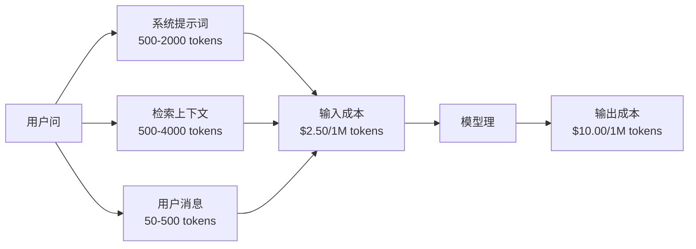
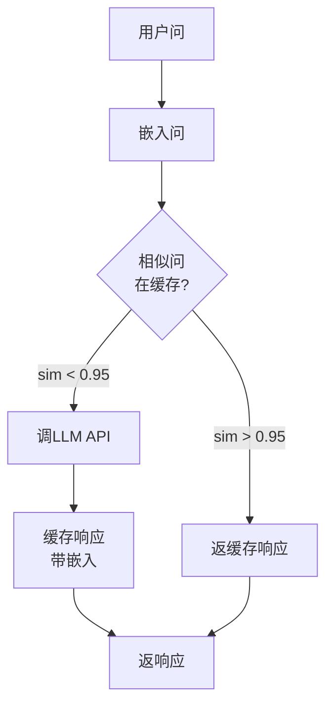
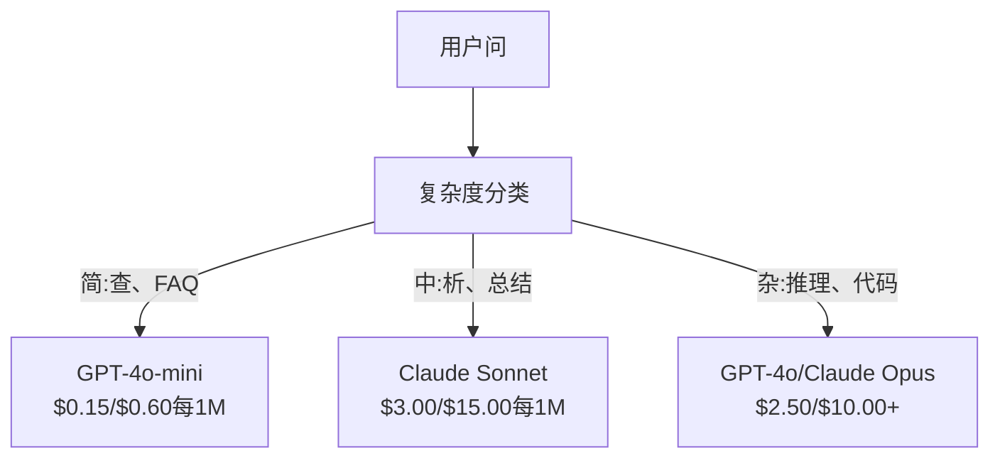

# 缓存、限流与成本优化

> 多AI初创公司非死于坏模型。死于坏单位经济。单GPT-4o调用费分厘。万用户日十调用仅输入token费$250—于你收单分前。存活公司把每API调用当金融交非函数调用。

**类型:** 构建
**语言:** Python
**前置要求:** 阶段11课程09(函数调用)
**时间:** ~45分钟
**相关:** 阶段11课程15(提示词缓存)—这课覆应用层缓存(语义缓存、精确hash缓存、模型路由)。课程15覆提供方层提示词缓存(Anthropic cache_control、OpenAI自动、Gemini CachedContent)。合两得50-95%成本减。

## 学习目标

- 实语义缓存从缓存服重复或相似问而非新API调用
- 算跨提供方每请求成本实token感知限流和预算警
- 建成本优化层带提示词压缩、模型路由(贵vs便宜)和响应缓存
- 设分层缓存策略用精确匹、语义相似和前缀缓存于异问类型

## 问题背景

你建RAG聊天机器人。它工作美。用户爱它。

然后发票到。

GPT-5费$5每百万输入token和$15每百万输出。Claude Opus 4.7费$15输入/$75输出。Gemini 3 Pro费$1.25输入/$5输出。GPT-5-mini是$0.25/$2。下价示例;总查提供方当前定价页。

这是杀初创数学:

- 10,000日活用户
- 每用户日10问
- 每问1,000输入token(系统提示词+上下文+用户消息)
- 每响应500输出token

**日输入成本:** 10,000 x 10 x 1,000 / 1,000,000 x $2.50 = **$250/日**
**日输出成本:** 10,000 x 10 x 500 / 1,000,000 x $10.00 = **$500/日**
**月总计:** **$22,500/月**

那仅LLM。加嵌入、向量数据库托管、基础设施。你看聊天机器人$30,000/月。

残酷部:40-60%那些问近重复。用户以稍异词问同问题。你系统提示词—每请求同—每单次计费。RAG检索上下文文档于问同话题用户间重复。

你付全价为冗余算。

## 概念讲解

### LLM调用成本解剖

每API调用有五成本组件。



系统提示词是静杀手。1,500-token系统提示词随每请求费$3.75每百万请求仅那前缀。于日100K请求，那是$375/日—$11,250/月—于永不改文。

### 提供方缓存:内折扣

2026三主提供方供提供方侧提示词缓存，但机制异。见阶段11课程15深潜。

| 提供方 | 机制 | 折扣 | 最小 | 缓存持续 |
|----------|-----------|----------|---------|----------------|
| Anthropic | 显cache_control标记 | 90%缓存击(写付25%额) | 1,024 tokens(Sonnet/Opus), 2,048(Haiku) | 5分默;1h延展(2x写溢价) |
| OpenAI | 自动前缀匹 | 50%缓存击 | 1,024 tokens |尽力至1时 |
| Google Gemini | 显CachedContent API | ~75%减(加存储) | 4,096(Flash)/32,768(Pro) | 用户配TTL |

**Anthropic法**显式。你用`cache_control: {"type": "ephemeral"}`标提示词节。首请求付25%写溢价。后同前缀请求得90%折扣。2,000-token系统提示词正费$0.005缓存击费$0.000625。于100K请求，那省$437.50/日。

**OpenAI法**自动。任匹前请求的提示词前缀得50%折扣。无需标记。权衡:少折扣、少控，但零实努力。

### 语义缓存:你自定义层

提供方缓存仅工作于同前缀。语义缓存理更难例:异问同义。

"退货政策何?"和"何退一件?"异串同意图。语义缓存嵌入两问，算余弦相似，若相似超阈值(典型0.92-0.95)返缓存响应。



嵌入成本可忽略。OpenAI text-embedding-3-small费$0.02每百万token。查缓存费几乎无比全LLM调用。

### 精确缓存:Hash与匹

于定调用(temperature=0、同模型、同提示词)，精确缓存更简更快。Hash全提示词，查缓存，若现返。

这完美工作于:
- 系统提示词+定上下文+同用户问
- 函数调用带同工具定义
- 批理同文档理多遍

### 限流:保护你预算

限流非仅关于公平。关于存活。

**Token桶算法:**每用户得N token桶以每秒速率R补充。请求从桶消费token。若桶空，请求拒。这允突发(一次用全桶)同时强平速率。

**每用户配额:**定日/月token限每用户层。

| 层 | 日Token限 | 最大请求/分 | 模型访 |
|------|------------------|------------------|-------------|
| 免费 | 50,000 | 10 | 仅GPT-4o-mini |
| Pro | 500,000 | 60 | GPT-4o、Claude Sonnet |
| 企业 | 5,000,000 | 300 | 全模型 |

### 模型路由:适模型适任务

非每问需GPT-4o。

"店何时关?"不需$10/M输出模型。GPT-4o-mini于$0.60/M输出完美理。Claude Haiku于$1.25/M输出理。简分类器路由便宜问至便宜模型复杂问至贵模型。



好调路由单省40-70%模型成本。

### 成本追:知钱何去

你不可优化你不可测。日志每API调用带:

- 时间戳
- 模型名
- 输入token
- 输出token
- 延迟(ms)
- 算成本($)
- 用户ID
- 缓存击/失
- 请求分类

这数据示何功能贵、何用户重消费者、何处缓存最影。

### 批理:批量折扣

OpenAI批API异步理50%折扣请求。你交至50,000请求批，结果于24小时内回。

用批理于:
- 夜文档理
- 批分类
- 评估跑
- 数据富化管道

非用于:实用户面问(延迟重)。

### 预警与熔断器

熔断器于你达限停消费。无一，bug或滥用可于时烧完你月预算。

设三阈值:
1. **警**(70%预算):发警
2. **流**(85%预算):仅换至便宜模型
3. **停**(95%预算):拒新请求，仅返缓存响应

### 优化栈

序应用这些技术。每层建于前层。

| 层 | 技术 | 典省 | 实努力 |
|-------|-----------|----------------|----------------------|
| 1 | 提供方提示词缓存 | 30-50% | 低(加缓存标记) |
| 2 | 精确缓存 | 10-20% | 低(hash + dict) |
| 3 | 语义缓存 | 15-30% | 中(嵌入 + 相似) |
| 4 | 模型路由 | 40-70% | 中(分类) |
| 5 | 限流 | 预算保护 | 低(token桶) |
| 6 | 提示词压缩 | 10-30% | 中(重写提示词) |
| 7 | 批理 | 符合50% | 低(批API) |

应用层1-5 RAG应用典型减成本从$22,500/月至$4,000-6,000/月。那是燃跑道与建业务差。

### 实省:前后

这里是服10,000 DAU RAG聊天机器人实分解。

| 指标 | 优化前 | 优化后 | 省 |
|--------|--------------------|--------------------|---------|
| 月LLM成本 | $22,500 | $5,200 | 77% |
| 平每问成本 | $0.0075 | $0.0017 | 77% |
| 缓存击率 | 0% | 52% | -- |
| 路由至mini问 | 0% | 65% | -- |
| P95延迟 | 2,800ms | 900ms(缓存击:50ms) | 68% |
| 月嵌入成本 | $0 | $180 | (新成本) |
| 月总成本 | $22,500 | $5,380 | 76% |

语义缓存嵌入成本($180/月)于首时缓存击内付回。

## 构建

### 步骤1:成本计算器

建知主模型当前定价token成本计算器。

```python
import hashlib
import time
import json
import math
from dataclasses import dataclass, field


MODEL_PRICING = {
    "gpt-4o": {"input": 2.50, "output": 10.00, "cached_input": 1.25},
    "gpt-4o-mini": {"input": 0.15, "output": 0.60, "cached_input": 0.075},
    "gpt-4.1": {"input": 2.00, "output": 8.00, "cached_input": 0.50},
    "gpt-4.1-mini": {"input": 0.40, "output": 1.60, "cached_input": 0.10},
    "gpt-4.1-nano": {"input": 0.10, "output": 0.40, "cached_input": 0.025},
    "o3": {"input": 2.00, "output": 8.00, "cached_input": 0.50},
    "o3-mini": {"input": 1.10, "output": 4.40, "cached_input": 0.55},
    "o4-mini": {"input": 1.10, "output": 4.40, "cached_input": 0.275},
    "claude-opus-4": {"input": 15.00, "output": 75.00, "cached_input": 1.50},
    "claude-sonnet-4": {"input": 3.00, "output": 15.00, "cached_input": 0.30},
    "claude-haiku-3.5": {"input": 0.80, "output": 4.00, "cached_input": 0.08},
    "gemini-2.5-pro": {"input": 1.25, "output": 10.00, "cached_input": 0.3125},
    "gemini-2.5-flash": {"input": 0.15, "output": 0.60, "cached_input": 0.0375},
}


def calculate_cost(model, input_tokens, output_tokens, cached_input_tokens=0):
    if model not in MODEL_PRICING:
        return {"error": f"未知模型: {model}"}
    pricing = MODEL_PRICING[model]
    non_cached = input_tokens - cached_input_tokens
    input_cost = (non_cached / 1_000_000) * pricing["input"]
    cached_cost = (cached_input_tokens / 1_000_000) * pricing["cached_input"]
    output_cost = (output_tokens / 1_000_000) * pricing["output"]
    total = input_cost + cached_cost + output_cost
    return {
        "model": model,
        "input_tokens": input_tokens,
        "output_tokens": output_tokens,
        "cached_input_tokens": cached_input_tokens,
        "input_cost": round(input_cost, 6),
        "cached_input_cost": round(cached_cost, 6),
        "output_cost": round(output_cost, 6),
        "total_cost": round(total, 6),
    }
```

### 步骤2:精确缓存

Hash全提示词并返同请求缓存响应。

```python
class ExactCache:
    def __init__(self, max_size=1000, ttl_seconds=3600):
        self.cache = {}
        self.max_size = max_size
        self.ttl = ttl_seconds
        self.hits = 0
        self.misses = 0

    def _hash(self, model, messages, temperature):
        key_data = json.dumps({"model": model, "messages": messages, "temperature": temperature}, sort_keys=True)
        return hashlib.sha256(key_data.encode()).hexdigest()

    def get(self, model, messages, temperature=0.0):
        if temperature > 0:
            self.misses += 1
            return None
        key = self._hash(model, messages, temperature)
        if key in self.cache:
            entry = self.cache[key]
            if time.time() - entry["timestamp"] < self.ttl:
                self.hits += 1
                entry["access_count"] += 1
                return entry["response"]
            del self.cache[key]
        self.misses += 1
        return None

    def put(self, model, messages, temperature, response):
        if temperature > 0:
            return
        if len(self.cache) >= self.max_size:
            oldest_key = min(self.cache, key=lambda k: self.cache[k]["timestamp"])
            del self.cache[oldest_key]
        key = self._hash(model, messages, temperature)
        self.cache[key] = {
            "response": response,
            "timestamp": time.time(),
            "access_count": 1,
        }

    def stats(self):
        total = self.hits + self.misses
        return {
            "hits": self.hits,
            "misses": self.misses,
            "hit_rate": round(self.hits / total, 4) if total > 0 else 0,
            "cache_size": len(self.cache),
        }
```

### 步骤3:语义缓存

嵌入问当相似超阈值返缓存响应。

```python
def simple_embed(text):
    words = text.lower().split()
    vocab = {}
    for w in words:
        vocab[w] = vocab.get(w, 0) + 1
    norm = math.sqrt(sum(v * v for v in vocab.values()))
    if norm == 0:
        return {}
    return {k: v / norm for k, v in vocab.items()}


def cosine_similarity(a, b):
    if not a or not b:
        return 0.0
    all_keys = set(a) | set(b)
    dot = sum(a.get(k, 0) * b.get(k, 0) for k in all_keys)
    return dot


class SemanticCache:
    def __init__(self, similarity_threshold=0.85, max_size=500, ttl_seconds=3600):
        self.entries = []
        self.threshold = similarity_threshold
        self.max_size = max_size
        self.ttl = ttl_seconds
        self.hits = 0
        self.misses = 0

    def get(self, query):
        query_embedding = simple_embed(query)
        now = time.time()
        best_match = None
        best_sim = 0.0
        for entry in self.entries:
            if now - entry["timestamp"] > self.ttl:
                continue
            sim = cosine_similarity(query_embedding, entry["embedding"])
            if sim > best_sim:
                best_sim = sim
                best_match = entry
        if best_match and best_sim >= self.threshold:
            self.hits += 1
            best_match["access_count"] += 1
            return {"response": best_match["response"], "similarity": round(best_sim, 4), "original_query": best_match["query"]}
        self.misses += 1
        return None

    def put(self, query, response):
        if len(self.entries) >= self.max_size:
            self.entries.sort(key=lambda e: e["timestamp"])
            self.entries.pop(0)
        self.entries.append({
            "query": query,
            "embedding": simple_embed(query),
            "response": response,
            "timestamp": time.time(),
            "access_count": 1,
        })

    def stats(self):
        total = self.hits + self.misses
        return {
            "hits": self.hits,
            "misses": self.misses,
            "hit_rate": round(self.hits / total, 4) if total > 0 else 0,
            "cache_size": len(self.entries),
        }
```

### 步骤4:限流器

Token桶限流器带每用户配额。

```python
class TokenBucketRateLimiter:
    def __init__(self):
        self.buckets = {}
        self.tiers = {
            "free": {"capacity": 50_000, "refill_rate": 500, "max_requests_per_min": 10},
            "pro": {"capacity": 500_000, "refill_rate": 5_000, "max_requests_per_min": 60},
            "enterprise": {"capacity": 5_000_000, "refill_rate": 50_000, "max_requests_per_min": 300},
        }

    def _get_bucket(self, user_id, tier="free"):
        if user_id not in self.buckets:
            tier_config = self.tiers.get(tier, self.tiers["free"])
            self.buckets[user_id] = {
                "tokens": tier_config["capacity"],
                "capacity": tier_config["capacity"],
                "refill_rate": tier_config["refill_rate"],
                "last_refill": time.time(),
                "request_timestamps": [],
                "max_rpm": tier_config["max_requests_per_min"],
                "tier": tier,
                "total_tokens_used": 0,
            }
        return self.buckets[user_id]

    def _refill(self, bucket):
        now = time.time()
        elapsed = now - bucket["last_refill"]
        refill = int(elapsed * bucket["refill_rate"])
        if refill > 0:
            bucket["tokens"] = min(bucket["capacity"], bucket["tokens"] + refill)
            bucket["last_refill"] = now

    def check(self, user_id, tokens_needed, tier="free"):
        bucket = self._get_bucket(user_id, tier)
        self._refill(bucket)
        now = time.time()
        bucket["request_timestamps"] = [t for t in bucket["request_timestamps"] if now - t < 60]
        if len(bucket["request_timestamps"]) >= bucket["max_rpm"]:
            return {"allowed": False, "reason": "rate_limit", "retry_after_seconds": 60 - (now - bucket["request_timestamps"][0])}
        if bucket["tokens"] < tokens_needed:
            deficit = tokens_needed - bucket["tokens"]
            wait = deficit / bucket["refill_rate"]
            return {"allowed": False, "reason": "token_limit", "tokens_available": bucket["tokens"], "retry_after_seconds": round(wait, 1)}
        return {"allowed": True, "tokens_available": bucket["tokens"]}

    def consume(self, user_id, tokens_used, tier="free"):
        bucket = self._get_bucket(user_id, tier)
        bucket["tokens"] -= tokens_used
        bucket["request_timestamps"].append(time.time())
        bucket["total_tokens_used"] += tokens_used

    def get_usage(self, user_id):
        if user_id not in self.buckets:
            return {"error": "用户未找"}
        b = self.buckets[user_id]
        return {
            "user_id": user_id,
            "tier": b["tier"],
            "tokens_remaining": b["tokens"],
            "capacity": b["capacity"],
            "total_tokens_used": b["total_tokens_used"],
            "utilization": round(b["total_tokens_used"] / b["capacity"], 4) if b["capacity"] else 0,
        }
```

### 步骤5:成本追器

日志每调用算运行总。

```python
class CostTracker:
    def __init__(self, monthly_budget=1000.0):
        self.logs = []
        self.monthly_budget = monthly_budget
        self.alerts = []

    def log_call(self, model, input_tokens, output_tokens, cached_input_tokens=0, latency_ms=0, user_id="anonymous", cache_status="miss"):
        cost = calculate_cost(model, input_tokens, output_tokens, cached_input_tokens)
        entry = {
            "timestamp": time.time(),
            "model": model,
            "input_tokens": input_tokens,
            "output_tokens": output_tokens,
            "cached_input_tokens": cached_input_tokens,
            "latency_ms": latency_ms,
            "cost": cost["total_cost"],
            "user_id": user_id,
            "cache_status": cache_status,
        }
        self.logs.append(entry)
        self._check_budget()
        return entry

    def _check_budget(self):
        total = self.total_cost()
        pct = total / self.monthly_budget if self.monthly_budget > 0 else 0
        if pct >= 0.95 and not any(a["level"] == "stop" for a in self.alerts):
            self.alerts.append({"level": "stop", "message": f"预算95%消费: ${total:.2f}/${self.monthly_budget:.2f}", "timestamp": time.time()})
        elif pct >= 0.85 and not any(a["level"] == "throttle" for a in self.alerts):
            self.alerts.append({"level": "throttle", "message": f"预算85%消费: ${total:.2f}/${self.monthly_budget:.2f}", "timestamp": time.time()})
        elif pct >= 0.70 and not any(a["level"] == "warning" for a in self.alerts):
            self.alerts.append({"level": "warning", "message": f"预算70%消费: ${total:.2f}/${self.monthly_budget:.2f}", "timestamp": time.time()})

    def total_cost(self):
        return round(sum(e["cost"] for e in self.logs), 6)

    def cost_by_model(self):
        by_model = {}
        for e in self.logs:
            m = e["model"]
            if m not in by_model:
                by_model[m] = {"calls": 0, "cost": 0, "input_tokens": 0, "output_tokens": 0}
            by_model[m]["calls"] += 1
            by_model[m]["cost"] = round(by_model[m]["cost"] + e["cost"], 6)
            by_model[m]["input_tokens"] += e["input_tokens"]
            by_model[m]["output_tokens"] += e["output_tokens"]
        return by_model

    def cache_savings(self):
        cache_hits = [e for e in self.logs if e["cache_status"] == "hit"]
        if not cache_hits:
            return {"saved": 0, "cache_hits": 0}
        saved = 0
        for e in cache_hits:
            full_cost = calculate_cost(e["model"], e["input_tokens"], e["output_tokens"])
            saved += full_cost["total_cost"]
        return {"saved": round(saved, 4), "cache_hits": len(cache_hits)}

    def summary(self):
        if not self.logs:
            return {"total_calls": 0, "total_cost": 0}
        total_latency = sum(e["latency_ms"] for e in self.logs)
        cache_hits = sum(1 for e in self.logs if e["cache_status"] == "hit")
        return {
            "total_calls": len(self.logs),
            "total_cost": self.total_cost(),
            "avg_cost_per_call": round(self.total_cost() / len(self.logs), 6),
            "avg_latency_ms": round(total_latency / len(self.logs), 1),
            "cache_hit_rate": round(cache_hits / len(self.logs), 4),
            "cost_by_model": self.cost_by_model(),
            "cache_savings": self.cache_savings(),
            "budget_remaining": round(self.monthly_budget - self.total_cost(), 2),
            "budget_utilization": round(self.total_cost() / self.monthly_budget, 4) if self.monthly_budget > 0 else 0,
            "alerts": self.alerts,
        }
```

### 步骤6:模型路由器

路由问至可理它们最便宜模型。

```python
SIMPLE_KEYWORDS = ["何时", "小时", "地址", "电话", "价", "退货政策", "你好", "嗨", "谢", "是", "否"]
COMPLEX_KEYWORDS = ["析", "比", "释何", "写代码", "调试", "架构", "设计", "权衡", "评估"]


def classify_complexity(query):
    q = query.lower()
    if len(q.split()) <= 5 or any(kw in q for kw in SIMPLE_KEYWORDS):
        return "simple"
    if any(kw in q for kw in COMPLEX_KEYWORDS):
        return "complex"
    return "medium"


def route_model(query, tier="pro"):
    complexity = classify_complexity(query)
    routing_table = {
        "simple": {"free": "gpt-4.1-nano", "pro": "gpt-4o-mini", "enterprise": "gpt-4o-mini"},
        "medium": {"free": "gpt-4o-mini", "pro": "claude-sonnet-4", "enterprise": "claude-sonnet-4"},
        "complex": {"free": "gpt-4o-mini", "pro": "gpt-4o", "enterprise": "claude-opus-4"},
    }
    model = routing_table[complexity].get(tier, "gpt-4o-mini")
    return {"query": query, "complexity": complexity, "model": model, "tier": tier}
```

### 步骤7:跑演示

```python
def simulate_llm_call(model, query):
    input_tokens = len(query.split()) * 4 + 500
    output_tokens = 150 + (len(query.split()) * 2)
    latency = 200 + (output_tokens * 2)
    return {
        "model": model,
        "response": f"[模拟{model}响应: {query[:50]}...]",
        "input_tokens": input_tokens,
        "output_tokens": output_tokens,
        "latency_ms": latency,
    }


def run_demo():
    print("=" * 60)
    print("  缓存、限流与成本优化演示")
    print("=" * 60)

    print("\n--- 模型定价 ---")
    for model, pricing in list(MODEL_PRICING.items())[:6]:
        cost_1k = calculate_cost(model, 1000, 500)
        print(f"  {model}: ${cost_1k['total_cost']:.6f} 每1K入+500出")

    print("\n--- 成本比: 100K请求 ---")
    for model in ["gpt-4o", "gpt-4o-mini", "claude-sonnet-4", "claude-haiku-3.5"]:
        cost = calculate_cost(model, 1000 * 100_000, 500 * 100_000)
        print(f"  {model}: ${cost['total_cost']:.2f}")

    print("\n--- Anthropic缓存省 ---")
    no_cache = calculate_cost("claude-sonnet-4", 2000, 500, 0)
    with_cache = calculate_cost("claude-sonnet-4", 2000, 500, 1500)
    saving = no_cache["total_cost"] - with_cache["total_cost"]
    print(f"  无缓存: ${no_cache['total_cost']:.6f}")
    print(f"  有1500缓存token: ${with_cache['total_cost']:.6f}")
    print(f"  每调用省: ${saving:.6f} ({saving/no_cache['total_cost']*100:.1f}%)")

    exact_cache = ExactCache(max_size=100, ttl_seconds=300)
    semantic_cache = SemanticCache(similarity_threshold=0.75, max_size=100)
    rate_limiter = TokenBucketRateLimiter()
    tracker = CostTracker(monthly_budget=100.0)

    print("\n--- 精确缓存 ---")
    messages_1 = [{"role": "user", "content": "退货政策何?"}]
    result = exact_cache.get("gpt-4o-mini", messages_1, 0.0)
    print(f"  首查: {'击' if result else '失'}")
    exact_cache.put("gpt-4o-mini", messages_1, 0.0, "你可于30天内退货。")
    result = exact_cache.get("gpt-4o-mini", messages_1, 0.0)
    print(f"  次查: {'击' if result else '失'} -> {result}")
    result = exact_cache.get("gpt-4o-mini", messages_1, 0.7)
    print(f"  温度=0.7: {'击' if result else '失(不定,跳缓存)'}")
    print(f"  统计: {exact_cache.stats()}")

    print("\n--- 语义缓存 ---")
    test_queries = [
        ("退货政策何?", "商品可于30天内带收据退货。"),
        ("何退货?", None),
        ("店营业时间何?", "我们周一至周六9am-9pm营业。"),
        ("店何时开?", None),
        ("释量子计算", "量子计算机用qubits..."),
        ("释量子力学", None),
    ]
    for query, response in test_queries:
        cached = semantic_cache.get(query)
        if cached:
            print(f"  '{query[:40]}' -> 缓存击(sim={cached['similarity']}, 原='{cached['original_query'][:40]}')")
        elif response:
            semantic_cache.put(query, response)
            print(f"  '{query[:40]}' -> 失(存)")
        else:
            print(f"  '{query[:40]}' -> 失(无匹)")
    print(f"  统计: {semantic_cache.stats()}")

    print("\n--- 限流 ---")
    for i in range(12):
        check = rate_limiter.check("user_1", 1000, "free")
        if check["allowed"]:
            rate_limiter.consume("user_1", 1000, "free")
        status = "OK" if check["allowed"] else f"阻({check['reason']})"
        if i < 5 or not check["allowed"]:
            print(f"  请求{i+1}: {status}")
    print(f"  用量: {rate_limiter.get_usage('user_1')}")

    print("\n--- 模型路由 ---")
    routing_queries = [
        "你何时关?",
        "总结这季度收入报告",
        "析微服务与单体权衡",
        "你好",
        "写带删除二叉搜树代码",
    ]
    for q in routing_queries:
        route = route_model(q, "pro")
        print(f"  '{q[:50]}' -> {route['model']} ({route['complexity']})")

    print("\n--- 全管道: 优化前后 ---")
    queries = [
        "退货政策何?",
        "何退货?",
        "营业时间何?",
        "何时开?",
        "释TCP与UDP别",
        "比TCP vs UDP协议",
        "你好",
        "你电话号何?",
        "写Python排列表函数",
        "析无服务器架构利弊",
    ]

    print("\n  [前:无缓存、单模型(gpt-4o)]")
    tracker_before = CostTracker(monthly_budget=1000.0)
    for q in queries:
        result = simulate_llm_call("gpt-4o", q)
        tracker_before.log_call("gpt-4o", result["input_tokens"], result["output_tokens"], latency_ms=result["latency_ms"], cache_status="miss")
    before = tracker_before.summary()
    print(f"  总成本: ${before['total_cost']:.6f}")
    print(f"  平成本/调用: ${before['avg_cost_per_call']:.6f}")
    print(f"  平延迟: {before['avg_latency_ms']}ms")

    print("\n  [后:缓存+路由+限流]")
    exact_c = ExactCache()
    semantic_c = SemanticCache(similarity_threshold=0.75)
    tracker_after = CostTracker(monthly_budget=1000.0)

    for q in queries:
        messages = [{"role": "user", "content": q}]
        cached = exact_c.get("gpt-4o", messages, 0.0)
        if cached:
            tracker_after.log_call("gpt-4o-mini", 0, 0, latency_ms=5, cache_status="hit")
            continue
        sem_cached = semantic_c.get(q)
        if sem_cached:
            tracker_after.log_call("gpt-4o-mini", 0, 0, latency_ms=15, cache_status="hit")
            continue
        route = route_model(q)
        result = simulate_llm_call(route["model"], q)
        tracker_after.log_call(route["model"], result["input_tokens"], result["output_tokens"], latency_ms=result["latency_ms"], cache_status="miss")
        exact_c.put(route["model"], messages, 0.0, result["response"])
        semantic_c.put(q, result["response"])

    after = tracker_after.summary()
    print(f"  总成本: ${after['total_cost']:.6f}")
    print(f"  平成本/调用: ${after['avg_cost_per_call']:.6f}")
    print(f"  平延迟: {after['avg_latency_ms']}ms")
    print(f"  缓存击率: {after['cache_hit_rate']:.0%}")

    if before["total_cost"] > 0:
        savings_pct = (1 - after["total_cost"] / before["total_cost"]) * 100
        print(f"\n  省: {savings_pct:.1f}%成本减")
        print(f"  延迟改进: {(1 - after['avg_latency_ms'] / before['avg_latency_ms']) * 100:.1f}%快")

    print("\n--- 预算警演示 ---")
    alert_tracker = CostTracker(monthly_budget=0.01)
    for i in range(5):
        alert_tracker.log_call("gpt-4o", 5000, 2000, latency_ms=500)
    print(f"  总消费: ${alert_tracker.total_cost():.6f} / ${alert_tracker.monthly_budget}")
    for alert in alert_tracker.alerts:
        print(f"  警[{alert['level'].upper()}]: {alert['message']}")

    print("\n--- 模型成本分解 ---")
    multi_tracker = CostTracker(monthly_budget=500.0)
    for _ in range(50):
        multi_tracker.log_call("gpt-4o-mini", 800, 200, latency_ms=150)
    for _ in range(30):
        multi_tracker.log_call("claude-sonnet-4", 1500, 500, latency_ms=400)
    for _ in range(10):
        multi_tracker.log_call("gpt-4o", 2000, 800, latency_ms=600)
    for _ in range(10):
        multi_tracker.log_call("claude-opus-4", 3000, 1000, latency_ms=1200)
    breakdown = multi_tracker.cost_by_model()
    for model, data in sorted(breakdown.items(), key=lambda x: x[1]["cost"], reverse=True):
        print(f"  {model}: {data['calls']}调用, ${data['cost']:.6f}, {data['input_tokens']:,.0f}入/{data['output_tokens']:,.0f}出")
    print(f"  总: ${multi_tracker.total_cost():.6f}")

    print("\n" + "=" * 60)
    print("  演示完。")
    print("=" * 60)


if __name__ == "__main__":
    run_demo()
```

## 使用

### Anthropic提示词缓存

```python
# import anthropic
#
# client = anthropic.Anthropic()
#
# response = client.messages.create(
#     model="claude-sonnet-4-20250514",
#     max_tokens=1024,
#     system=[
#         {
#             "type": "text",
#             "text": "你是Acme Corp助客户支持代理...",
#             "cache_control": {"type": "ephemeral"},
#         }
#     ],
#     messages=[{"role": "user", "content": "退货政策何?"}],
# )
#
# print(f"输入token: {response.usage.input_tokens}")
# print(f"缓存创token: {response.usage.cache_creation_input_tokens}")
# print(f"缓存读token: {response.usage.cache_read_input_tokens}")
```

首调用写缓存(25%溢价)。每后同系统提示词前缀调用从缓存读(90%折扣)。缓存持续5分并于每击重置时器。

### OpenAI自动缓存

```python
# from openai import OpenAI
#
# client = OpenAI()
#
# response = client.chat.completions.create(
#     model="gpt-4o",
#     messages=[
#         {"role": "system", "content": "你是助客户支持代理..."},
#         {"role": "user", "content": "退货政策何?"},
#     ],
# )
#
# print(f"提示词token: {response.usage.prompt_tokens}")
# print(f"缓存token: {response.usage.prompt_tokens_details.cached_tokens}")
# print(f"完token: {response.usage.completion_tokens}")
```

OpenAI自动缓存。任1,024+ token提示词前缀匹近请求得50%折扣。无代码改—仅查响应中`prompt_tokens_details.cached_tokens`验其工作。

### OpenAI批API

```python
# import json
# from openai import OpenAI
#
# client = OpenAI()
#
# requests = []
# for i, query in enumerate(queries):
#     requests.append({
#         "custom_id": f"request-{i}",
#         "method": "POST",
#         "url": "/v1/chat/completions",
#         "body": {
#             "model": "gpt-4o-mini",
#             "messages": [{"role": "user", "content": query}],
#         },
#     })
#
# with open("batch_input.jsonl", "w") as f:
#     for r in requests:
#         f.write(json.dumps(r) + "\n")
#
# batch_file = client.files.create(file=open("batch_input.jsonl", "rb"), purpose="batch")
# batch = client.batches.create(input_file_id=batch_file.id, endpoint="/v1/chat/completions", completion_window="24h")
# print(f"批ID: {batch.id}, 状态: {batch.status}")
```

批API给全token平50%折扣。结果于24小时内回。完美于非实工作负载:评估、数据标、批总结。

### 产语义缓存用Redis

```python
# import redis
# import numpy as np
# from openai import OpenAI
#
# r = redis.Redis()
# client = OpenAI()
#
# def get_embedding(text):
#     response = client.embeddings.create(model="text-embedding-3-small", input=text)
#     return response.data[0].embedding
#
# def semantic_cache_lookup(query, threshold=0.95):
#     query_emb = np.array(get_embedding(query))
#     keys = r.keys("cache:emb:*")
#     best_sim, best_key = 0, None
#     for key in keys:
#         stored_emb = np.frombuffer(r.get(key), dtype=np.float32)
#         sim = np.dot(query_emb, stored_emb) / (np.linalg.norm(query_emb) * np.linalg.norm(stored_emb))
#         if sim > best_sim:
#             best_sim, best_key = sim, key
#     if best_sim >= threshold and best_key:
#         response_key = best_key.decode().replace("cache:emb:", "cache:resp:")
#         return r.get(response_key).decode()
#     return None
```

产中，替线性扫为向量索引(Redis Vector Search、Pinecone或pgvector)。线性扫工作于<1,000条。超后，用ANN(近似最近邻)得O(log n)查。

## 交付成果

这课产`outputs/prompt-cost-optimizer.md`—析你LLM应用并荐特定成本优化带投射省可复提示词。

也产`outputs/skill-cost-patterns.md`—基于你用例择正确缓存策略、限流配和模型路由规则决框架。

## 练习题

1. **为语义缓存实LRU驱逐。**替最旧驱逐为最近最少用。追每条最后访时间并于缓存满时驱逐最旧访时间条。比两策略于100问击率。

2. **建成本投射工具。**给API调用日志(CostTracker日志)，基于7日尾平投射月成本。虑周/周末模式。若投射月成本超预算20%触警。

3. **实分层语义缓存。**用两相似阈值:0.98高信击(即返)和0.90中信击(返带免责声明:"基于相似前问...")。追每击来源层并测用户满意度差。

4. **建模型路由分类器。**替关键词基分类器为嵌入基分类器。嵌入50标问(simple/medium/complex)，后通过找最近标例分类新问。于20问测试集测分类准确。

5. **实带退化级熔断器。**于70%预算，记警。于85%，自动换全路由至最便宜模型(gpt-4o-mini)。于95%，仅服缓存响应拒新请求。通过模拟1,000请求于$1.00预算测试并验每阈值正确触。

## 关键术语

| 术语 | 人们怎么说 | 实际含义 |
|------|----------------|----------------------|
| 提示词缓存 | "缓存系统提示词" | 提供方级缓存重复提示词前缀得折扣(90% Anthropic、50% OpenAI)—OpenAI无代码改，Anthropic显标记 |
| 语义缓存 | "智缓存" | 嵌入问、算与前问相似、若相似超阈值返缓存响应—捕精确匹失改述 |
| 精确缓存 | "Hash缓存" | Hash全提示词(模型+消息+温度)并返同输入缓存响应—仅工作于temperature=0定调用 |
| Token桶 | "限流器" | 每用户有N token桶以每秒速率R补充算法—允突发至N同时强平速率R |
| 模型路由 | "吝路由" | 用分类器送简问至便宜模型(GPT-4o-mini、Haiku)和复杂问至贵模型(GPT-4o、Opus)—单省40-70%模型成本 |
| 成本追 | "计量" | 日志每API调用带模型、token、延迟、成本和用户ID使你知钱何去和何功能贵 |
| 熔断器 | "杀开关" | 于消费近预算限时自动退化服务(便宜模型、仅缓存)或完全停请求 |
| 批API | "批量折扣" | OpenAI异步理50%折扣—交至50,000请求、24小时内得结果 |
| 提示词压缩 | "Token节食" | 重写系统提示词和上下文用少token保义—短提示词成本少常表现更好 |
| 缓存击率 | "缓存效率" | 从缓存服而非调LLM请求百分比—产聊天机器人典型40-60%，按比例省成本 |

## 延伸阅读

- [Anthropic提示词缓存指](https://docs.anthropic.com/en/docs/build-with-claude/prompt-caching) — Anthropic显cache_control标记、定价和缓存生命行为官方文档
- [OpenAI提示词缓存](https://platform.openai.com/docs/guides/prompt-caching) — OpenAI自动缓存、如何通过用量字段验缓存击和最小前缀长
- [OpenAI批API](https://platform.openai.com/docs/guides/batch) — 异步理50%折扣、JSONL格式、24时完窗口和50K请求限
- [GPTCache](https://github.com/zilliztech/GPTCache) — 支多嵌入后端、向量存储和驱逐策略开源语义缓存库
- [Martian模型路由器](https://docs.withmartian.com) — 自动择可理每问最便宜模型产模型路由
- [Not Diamond](https://www.notdiamond.ai) — 从你流量模式学优化跨提供方成本/质量权衡ML基模型路由器
- [Helicone](https://www.helicone.ai) — 带成本追、缓存、限流和预算警LLM可观测平台作代理层
- [Dean & Barroso, "The Tail at Scale" (CACM 2013)](https://research.google/pubs/the-tail-at-scale/) — 延迟、吞吐、TTFT/TPOT百分位和对冲请求;成本模型后"择仍满足P95最便宜模型。"
- [Kwon et al., "Efficient Memory Management for Large Language Model Serving with PagedAttention" (SOSP 2023)](https://arxiv.org/abs/2309.06180) — vLLM论文;何分KV-cache+连续批理击朴素服务器24×吞吐，缓存和成本下基础设施层。
- [Dao et al., "FlashAttention-2: Faster Attention with Better Parallelism and Work Partitioning" (ICLR 2024)](https://arxiv.org/abs/2307.08691) — 与提示词缓存正交内核级成本减;读伴推测解码和GQA得完整成本曲线图。