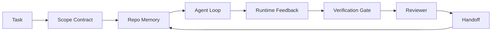

# Agent Workbench工程:何Capable模型仍失败

> Capable模型不够。可靠agent需workbench:instructions、state、scope、feedback、verification、review、和handoff。去那些甚至frontier模型产unsafe to ship工。

**类型:** 学习+构建
**语言:** Python(stdlib)
**前置要求:** 阶段14课程01(Agent Loop)、阶段14课程26(失败模式)
**时间:** ~45分钟

## 学习目标

- 分模型capability和执行reliability。
- 名七workbench surface定agent ship否。
- 比prompt-only run和workbench-guided run于小repo task。
- 产失败模式报告map每missed surface至它cause symptom。

## 问题背景

你drop frontier模型入真实repo叫它加输入验证。它开四file、写plausible code、declare成功、和stop。你run tests。二fail。三file touch和validation无关。无agent假设、试first、或left do记录。

模型不错于Python。错于工。不知何count done、何allowed write、何tests authoritative、何下session pick up。

此非model bug。Workbench bug。Agent周围surface missing把one-shot generation转可靠、resumable engineering部分。

## 概念讲解

Workbench是wrap模型于task期间操作环境。七surface:

| Surface | 何carry | Missing时失败 |
|---------|---------|--------------|
| Instructions | Startup rule、forbidden action、definition of done | Agent猜何ship意 |
| State | Current task、touched file、blocker、next action | 每session从零restart |
| Scope | Allowed file、forbidden file、acceptance criteria | Edit leak入unrelated code |
| Feedback | Real command output capture入loop | Agent于400 declare成功 |
| Verification | Test、lint、smoke run、scope check | "Looks good" reach main |
| Review | 异角色二pass | Builder mark own homework |
| Handoff | 何change、why、何left | 下session re-discover一切 |

Workbench独立模型。可swap模型keep surface。不可swap surface keep reliability。



Loop close于state file、非chat history。Chat volatile。Repo system of record。

### Workbench vs prompt engineering

Prompting告模型此turn需何。Workbench告模型跨turn和跨session何做工。多agent失败故事是workbench failure穿prompt-engineering衣服。

### Workbench vs framework

Framework给runtime(LangGraph、AutoGen、Agents SDK)。Workbench给agent于runtime内work place。需两者。此mini-track关于第二。

### 从primitives推理、非vendor taxonomy

现在多"harness engineering"写作。Addy Osmani、OpenAI、Anthropic、LangChain、Martin Fowler、MongoDB、HumanLayer、Augment Code、Thoughtworks、walkinglabs awesome list、和steady Medium和Hacker News piece carry它。它们disagree harness boundary、scope、和vocabulary。不需pick side。七surface是UX layer;每workbench下是same distributed-systems primitives hold up任可靠backend。

Strip agent label片刻。Agent run是跨时间、进程、和machine computation。使可靠需same primitives任产系统需。

| Primitive | 何 | Agent何carry |
|-----------|----|-------------|
| Function | Typed handler。Pure where possible。Own input和output。 | Tool call、rule check、verification step、model invocation |
| Worker | Long-lived process own一或多function和lifecycle | Builder、reviewer、verifier、MCP server |
| Trigger | Event source invoke function | Agent loop tick、HTTP request、queue message、cron、file change、hook |
| Runtime | Boundary定何run where、何timeout和resource | Claude Code process、LangGraph runtime、worker container |
| HTTP / RPC | Wire between caller和worker | Tool-call protocol、MCP request、model API |
| Queue | Durable buffer between trigger和worker;back-pressure、retry、idempotency | Task board、feedback log、review inbox |
| Session persistence | State survive crash、restart、model swap | `agent_state.json`、checkpoint、KV store、repo itself |
| Authorization policy | Who call何function用何scope | Allowed/forbidden file、approval boundary、MCP capability list |

现map七workbench surface至那些primitives。

- **Instructions** — policy + function metadata。Rule是check(function)。Router(`AGENTS.md`)是policy attach runtime startup。
- **State** — session persistence。Keyed store runtime每step读。File、KV、或DB;persistence semantic matter、storage backend不。
- **Scope** — authorization policy per task。Allowed/forbidden glob是ACL。Approvals required是permission lattice。
- **Feedback** — invocation log write入queue。每shell call是record、durable、replayable。
- **Verification** — function。Deterministic over input。Triggered on task close。Fails closed。
- **Review** — separate worker read-only authz on builder artifact和write-only authz on review report。
- **Handoff** — durable record emit by session-end trigger。下session startup trigger读它。

Agent loop itself是worker consume event(user message、tool result、timer tick)、call function(model、then tools model pick)、write record(state、feedback)、和emit trigger(verify、review、handoff)。无mystery;same shape job processor。

### Circulation pattern、translate to primitives

每popular harness pattern reduce至八primitives。Translation table。

| Vendor或community pattern | 实际何 |
|---------------------------|-------|
| Ralph Loop(Claude Code、Codex、agentic_harness book) — re-inject original intent入fresh context window当agent试early stop | Trigger re-enqueue task clean context;session persistence carry goal forward |
| Plan / Execute / Verify(PEV) | 三worker、一role、经state和queue between phase communicate |
| Harness-compute separation(OpenAI Agents SDK、April 2026) — split control plane from execution plane | Restating control-plane / data-plane。Predates agent label decades |
| Open Agent Passport(OAP、March 2026) — sign and audit每tool call against declarative policy before execution | Authorization policy enforce by pre-action worker、with signed audit queue |
| Guides and Sensors(Birgitta Böckeler / Thoughtworks) — feedforward rule + feedback observability | Authorization policy + verification function + observability trace |
| Progressive compaction、5-stage(Claude Code reverse engineering、April 2026) | State-management worker run cron-like over session persistence keep it within budget |
| Hooks / middleware(LangChain、Claude Code) — intercept model和tool call | Trigger + function wrap runtime invocation path |
| Skills as Markdown with progressive disclosure(Anthropic、Flue) | Function registry where function metadata load入context just-in-time |
| Sandbox agent(Codex、Sandcastle、Vercel Sandbox) | Compute plane:runtime with isolated filesystem、network、和lifecycle |
| MCP server | Worker expose function over stable RPC、with capability list作authorization |

Table每entry是agent community arrive primitive已distributed system name和给它新。Useful label marketing;不useful engineering vocabulary。

### Receipt实际说

Harness-over-model claim后有数。Worth knowing、因为它们也only honest argument against "just wait smarter model."

- Terminal Bench 2.0 — same model、harness change move coding agent outside top 30至rank five(LangChain、*Anatomy of an Agent Harness*)。
- Vercel — delete agent 80% tool;success rate jump 80%至100%(MongoDB)。
- Harvey — legal agent more than double accuracy through harness optimization alone(MongoDB)。
- 88% enterprise AI agent project fail reach production。Failure cluster around runtime、非reasoning(preprints.org、*Harness Engineering for Language Agents*、March 2026)。
- 2025 benchmark study across三popular open-source framework report ~50% task completion;long-context WebAgent collapse 40-50%至under 10% in long-context condition、mostly from infinite loop和goal loss(covered widely early 2026 writeup)。

Takeaway非"harness win forever。"Model absorb harness trick overtime。Takeaway是today、load-bearing engineering around model、非inside它、和primitive carry load是every产system always need。

### Vendor writeup何stop short

此part不需polite。

- LangChain *Anatomy of an Agent Harness* enumerate十一component — prompt、tool、hook、sandbox、orchestration、memory、skill、subagent、和runtime "dumb loop。"不name queue、worker deployment unit、trigger semantic、session persistence separate concern、或authorization policy。Treat harness object configure、非system deploy。
- Addy Osmani *Agent Harness Engineering* land framing `Agent = Model + Harness`和ratchet pattern、but stop short say harness built out何。Read stance、非spec。
- Anthropic和OpenAI deepest on surface but stay inside own runtime。"Harness-compute separation" announcement April 2026 Agents SDK是first vendor piece explicit endorse control-plane / data-plane split。Primitive idea、非新。
- agentic_harness book treat harness config object(Jaymin West *Agentic Engineering*、chapter 6)和strongest line是"harness is primary security boundary in agentic system。"Just authorization policy、restated。
- Hacker News thread keep arrive same place。April 2026 thread *The agent harness belongs outside the sandbox* argue harness should sit "more like hypervisor sits outside everything and authorizes access based on context and user。"Again、authorization policy separate plane。

不需disagree任piece notice gap。它们写UX description system已exist。我们写system。System built right、七surface fall out primitives。Built wrong、无`AGENTS.md` polish fix missing queue。

所以当hear "harness engineering" elsewhere、translate to primitives。Prompt和rule policy和function。Scaffolding runtime。Guardrail authorization + verification。Hook trigger。Memory session persistence。Ralph Loop requeue。Subagent worker。Sandbox compute plane。Vocabulary change;engineering不。Workbench agent-facing UX;harness、sense survive下vendor reframe、function、worker、trigger、runtime、queue、persistence、和policy wired together correct。

## 构建

`code/main.py` run tiny repo task twice。First prompt only、then seven surface wired。Same model、same task。Script count which surface missing on failed run and print failure-mode report。

Repo task small purpose:add input validation one-file FastAPI-style handler and write passing test。

跑:

```
python3 code/main.py
```

Output:side-by-side log two run、`failure_modes.json` summarize prompt-only run、和one-line verdict workbench run。

Agent tiny rule-based stub;point surface、非model。Cross rest mini-track you will rebuild each surface real、reusable artifact。

## 使用

三place workbench surface already exist wild、even no one call them that:

- **Claude Code、Codex、Cursor。**`AGENTS.md`和`CLAUDE.md`是instructions surface。Slash command scope。Hook verification。
- **LangGraph、OpenAI Agents SDK。**Checkpoint和session store state surface。Handoff handoff surface。
- **CI on real repo。**Test、lint、和type-check verification。PR template handoff。CODEOWNERS review。

Workbench engineering discipline make those surface explicit reusable、instead leave each team rediscover them。

## 交付成果

`outputs/skill-workbench-audit.md`是portable skill audit existing repo七workbench surface和report missing、partial、和healthy。Drop next任agent setup;它告fix first。

## 练习题

1. Pick repo where you already run agent。Score七surface 0(missing)至2(healthy)。何weakest surface?
2. Extend `main.py` so prompt-only run也产fake "success" claim。Verify verification gate would have caught it。
3. Add eighth surface own product。Justify why it不collapse入existing七。
4. Re-run script different stub agent hallucinate extra file write。何surface catch first?
5. Map five industry-recurring failure mode from Phase 14 · 26 onto七surface。何mode each surface design absorb?

## 关键术语

| 术语 | 人们怎么说 | 实际含义 |
|------|------------|----------|
| Workbench | "The setup" | Engineered surface around model make work reliable |
| Surface | "A doc"或"a script" | Named、machine-readable input agent read or write every turn |
| System of record | "The notes" | File agent treat truth when chat history gone |
| Definition of done | "Acceptance" | Objective、file-backed checklist agent不能fake |
| Workbench audit | "Repo readiness check" | Pass over七surface flag missing piece before work begin |

## 延伸阅读

Read these data point、非authority。Each partial taxonomy。Translate every concept back primitive(function、worker、trigger、runtime、HTTP/RPC、queue、persistence、policy)before decide adopt。

Vendor framing:

- [Addy Osmani, Agent Harness Engineering](https://addyosmani.com/blog/agent-harness-engineering/) — `Agent = Model + Harness`和ratchet pattern;thin on infrastructure
- [LangChain, The Anatomy of an Agent Harness](https://blog.langchain.com/the-anatomy-of-an-agent-harness/) — 十一component:prompt、tool、hook、orchestration、sandbox、memory、skill、subagent、runtime;omit queue、deployment、authz
- [OpenAI, Harness engineering: leveraging Codex in an agent-first world](https://openai.com/index/harness-engineering/) — Codex team view surface around their runtime
- [OpenAI, Unrolling the Codex agent loop](https://openai.com/index/unrolling-the-codex-agent-loop/) — agent loop reduce `while` over function call
- [Anthropic, Effective harnesses for long-running agents](https://www.anthropic.com/engineering/effective-harnesses-for-long-running-agents) — long-horizon surface inside specific runtime
- [Anthropic, Harness design for long-running application development](https://www.anthropic.com/engineering/harness-design-long-running-apps) — applied design note
- [LangChain Deep Agents harness capabilities](https://docs.langchain.com/oss/python/deepagents/harness) — runtime config surface

Practitioner piece usable detail:

- [Martin Fowler / Birgitta Böckeler, Harness engineering for coding agent users](https://martinfowler.com/articles/harness-engineering.html) — guide(feedforward) + sensor(feedback);cleanest control-theory framing
- [HumanLayer, Skill Issue: Harness Engineering for Coding Agents](https://www.humanlayer.dev/blog/skill-issue-harness-engineering-for-coding-agents) — "it's not a model problem, it's a configuration problem"
- [MongoDB, The Agent Harness: Why the LLM Is the Smallest Part of Your Agent System](https://www.mongodb.com/company/blog/technical/agent-harness-why-llm-is-smallest-part-of-your-agent-system) — receipt:Vercel 80% to 100%、Harvey 2x accuracy、Terminal Bench Top 30 to Top 5
- [Augment Code, Harness Engineering for AI Coding Agents](https://www.augmentcode.com/guides/harness-engineering-ai-coding-agents) — constraint-first walkthrough
- [Sequoia podcast, Harrison Chase on Context Engineering Long-Horizon Agents](https://sequoiacap.com/podcast/context-engineering-our-way-to-long-horizon-agents-langchains-harrison-chase/) — runtime concern over model concern

Book、paper、和reference implementation:

- [Jaymin West, Agentic Engineering — Chapter 6: Harnesses](https://www.jayminwest.com/agentic-engineering-book/6-harnesses) — book-length treatment、treat harness primary security boundary
- [preprints.org, Harness Engineering for Language Agents (March 2026)](https://www.preprints.org/manuscript/202603.1756) — academic framing control / agency / runtime
- [walkinglabs/awesome-harness-engineering](https://github.com/walkinglabs/awesome-harness-engineering) — curated reading list across context、evaluation、observability、orchestration
- [ai-boost/awesome-harness-engineering](https://github.com/ai-boost/awesome-harness-engineering) — alternate curated list(tool、eval、memory、MCP、permission)
- [andrewgarst/agentic_harness](https://github.com/andrewgarst/agentic_harness) — production-ready reference implementation with Redis-backed memory和eval suite
- [HKUDS/OpenHarness](https://github.com/HKUDS/OpenHarness) — open agent harness with built-in personal agent

Hacker News thread worth reading disagreement、非consensus:

- [HN: Effective harnesses for long-running agents](https://news.ycombinator.com/item?id=46081704)
- [HN: Improving 15 LLMs at Coding in One Afternoon. Only the Harness Changed](https://news.ycombinator.com/item?id=46988596)
- [HN: The agent harness belongs outside the sandbox](https://news.ycombinator.com/item?id=47990675) — argue authorization separate plane

Cross-reference inside此curriculum:

- Phase 14 · 23 — OpenTelemetry GenAI convention:observability layer sensor literature point at
- Phase 14 · 26 — Failure mode catalog七surface design absorb
- Phase 14 · 27 — Prompt injection defense sit authorization-policy primitive
- Phase 14 · 29 — Production runtime(queue、event、cron):primitive in此lesson live deployment