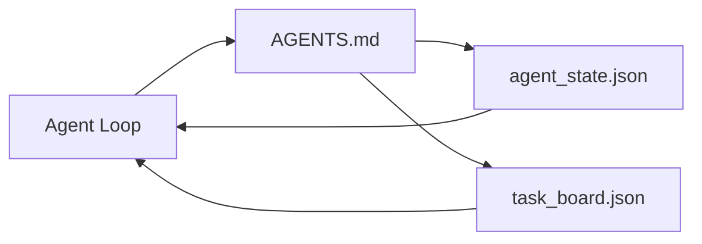

# 最小Agent Workbench

> 最小useful workbench三file:root instructions router、state file、和task board。Everything else layered top。若repo不能carry这三、无model save它。

**类型:** 构建
**语言:** Python(stdlib)
**前置要求:** 阶段14课程31(何Capable模型仍失败)
**时间:** ~45分钟

## 学习目标

- 定义三file form minimum viable workbench。
- 释何short root router beat long monolithic `AGENTS.md`。
- Build state file agent每turn read和end write。
- Build task board survive multi-session work无chat history。

## 问题背景

多team reach workbench write 3000-line `AGENTS.md` call done。Model load it、ignore part cannot summarize、和still fail same surface always failed。

需opposite。Tiny root file route agent deeper file only relevant。Durable state agent read before act and write after。Task board say in flight、blocked、和up next。

三file。Each job。Each machine-readable enough evolve real system later。

## 概念讲解



### AGENTS.md是router、非manual

Good `AGENTS.md` short。它point agent at:

- State file(where you are)。
- Task board(what left)。
- Deeper rule(under `docs/agent-rules.md`)。
- Verification command(how know work)。

Long go deeper doc、loaded only needed。Long manual ignored。Short router followed。

### agent_state.json是system of record

State carry:active task id、touched file、assumption made、blocker、和next action。Agent每turn read。下session read instead replay chat。

State live file because chat history unreliable。Session die。Conversation trim。File不。

### task_board.json是queue

Task board carry每task status `todo | in_progress | done | blocked`。Queue agent pull state empty、和queue you read when want know agent on track。

Task on board有id、goal、owner(`builder`、`reviewer`、或`human`)、和acceptance criteria。Board small purpose:when grow past screen、有planning problem、非board problem。

### 三file floor、非ceiling

后lesson add scope contract、feedback runner、verification gate、reviewer checklist、和handoff packet。三file here what they all assume。

## 构建

`code/main.py` write minimal workbench empty repo and demonstrate single agent turn:

1. Read `agent_state.json`。
2. Pull下task from `task_board.json` if state empty。
3. Touch single file inside scope。
4. Write back updated state。

跑:

```
python3 code/main.py
```

Script create `workdir/` next itself、lay三file、run one turn、and print diff。Re-run see how second turn pick first left off。

## 使用

Inside产agent product、same三file show different name:

- **Claude Code:** `AGENTS.md`或`CLAUDE.md` router、`.claude/state.json`-style store state、hook board。
- **Codex / Cursor:** workspace rule router、session memory state、queued task chat sidebar board。
- **Custom Python agent:** same file just wrote。

Name change。Shape不。

## 产pattern wild

Minimum workbench survive contact real monorepo when三pattern layered top。They independent;pick repo actually need。

**Nested `AGENTS.md` with nearest-wins precedence。**OpenAI ship 88 `AGENTS.md` file across main repo、一per subcomponent。Codex、Cursor、Claude Code、和Copilot all walk working file toward repo root and concatenate every `AGENTS.md` they find way。Sub-directory file extend root file。Codex add `AGENTS.override.md` replace而非extend;override mechanism Codex-specific and avoid cross-tool work。Augment Code measurement line matter:best `AGENTS.md` file give quality jump equivalent upgrade Haiku to Opus;worst one make output worse no file all。

**Anti-pattern refuse、even look like coverage。**Conflicting instruction silently drop agent interactive to greedy mode(ICLR 2026 AMBIG-SWE:48.8% → 28% resolve rate);number priority instead stack flat。Unverifiable style rule("follow Google Python Style Guide")无enforcement command let agent invent compliance;pair every style rule exact lint command。Lead with style instead command bury verification path;command first、style last。Write human instead agent waste context budget;terseness feature。

**Cross-tool symlink。**Single root file symlink(`ln -s AGENTS.md CLAUDE.md`、`ln -s AGENTS.md .github/copilot-instructions.md`、`ln -s AGENTS.md .cursorrules`)keep every coding agent same source truth。Nx `nx ai-setup` automate across Claude Code、Cursor、Copilot、Gemini、Codex、和OpenCode from single config。

## 交付成果

`outputs/skill-minimal-workbench.md` generate三file workbench任new repo:`AGENTS.md` router tuned project、`agent_state.json` right key、和`task_board.json` seed current backlog。

## 练习题

1. Add `last_run` timestamp `agent_state.json`。Refuse run if file older than 24 hour unless operator confirm。
2. Add `priority` field task board and change puller always pick highest priority `todo`。
3. Migrate `task_board.json` JSON Lines so each task line and diff clean version control。
4. Write `lint_workbench.py` fail if `AGENTS.md` over 80 line or reference file exist not。
5. Decide which三file would hurt most lose。Defend it。

## 关键术语

| 术语 | 人们怎么说 | 实际含义 |
|------|------------|----------|
| Router | `AGENTS.md` | Short root file point agent deeper doc和file |
| State file | "The notes" | Machine-readable record agent where、write every turn |
| Task board | "The backlog" | JSON queue work status、owner、acceptance |
| System of record | "Source of truth" | File workbench treat authoritative when chat gone |

## 延伸阅读

- [agents.md — the open spec](https://agents.md/) — adopted by Cursor、Codex、Claude Code、Copilot、Gemini、OpenCode
- [Augment Code, A good AGENTS.md is a model upgrade. A bad one is worse than no docs at all](https://www.augmentcode.com/blog/how-to-write-good-agents-dot-md-files) — measured quality jump
- [Blake Crosley, AGENTS.md Patterns: What Actually Changes Agent Behavior](https://blakecrosley.com/blog/agents-md-patterns) — what work empirically、what不
- [Datadog Frontend, Steering AI Agents in Monorepos with AGENTS.md](https://dev.to/datadog-frontend-dev/steering-ai-agents-in-monorepos-with-agentsmd-13g0) — nested precedence practice
- [Nx Blog, Teach Your AI Agent How to Work in a Monorepo](https://nx.dev/blog/nx-ai-agent-skills) — single-source generation across六tool
- [The Prompt Shelf, AGENTS.md Best Practices: Structure, Scope, and Real Examples](https://thepromptshelf.dev/blog/agents-md-best-practices/) — section ordering survive review
- [Anthropic, Claude Code subagents and session store](https://docs.anthropic.com/en/docs/agents-and-tools/claude-code/sub-agents)
- Phase 14 · 31 — failure mode此minimum absorb
- Phase 14 · 34 — durable state schema此lesson preview