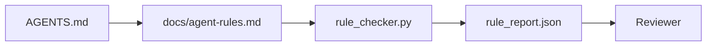

# Agent Instructions作Executable Constraint

> Instruction写prose是wish。Instruction写constraint是test。Workbench把每rule转agent runtime check和reviewer fact verify。

**类型:** 构建
**语言:** Python(stdlib)
**前置要求:** 阶段14课程32(最小Workbench)
**时间:** ~50分钟

## 学习目标

- 分routing prose和operational rule。
- Express startup rule、forbidden action、definition of done、uncertainty handling、和approval boundary作machine-checkable constraint。
- Implement rule checker score run rule set。
- Make rule set diff-friendly so review see change。

## 问题背景

Typical `AGENTS.md` read onboarding documentation。它告agent "be careful"和"test thoroughly"和"ask if unsure。"三日后、agent ship change无test、write forbidden directory、和never ask because never know line where。

Instruction operational时powerful、aspirational时weak。Fix write rule workbench interpret和reviewer score。

## 概念讲解

Rule belong `docs/agent-rules.md`、away short root router。每rule name、category、和check。



### 五category cover most rule

| Category | Rule答question | Example |
|----------|---------------|---------|
| Startup | Work begin前何must true? | "state file exist and fresh" |
| Forbidden | 何never happen? | "do not edit `scripts/release.sh`" |
| Definition of done | 何prove task complete? | "pytest exit 0 and acceptance line pass" |
| Uncertainty | Agent unsure时何do? | "open question note instead guess" |
| Approval | 何需human approval? | "any new dependency、any prod write" |

Rule不fit五usually want two rule。Force split。

### Rule machine-readable

每rule slug、category、one-line description、和`check` field name function `rule_checker.py`。Add rule mean add check;checker grow workbench。

### Rule diff-friendly

Rule live one per heading single markdown file。Rename visible diff。New rule sit category top。Stale rule delete、非comment out、because workbench source truth、非chat log team felt last quarter。

### Rule vs framework guardrail

Framework guardrail(OpenAI Agents SDK guardrail、LangGraph interrupt)enforce rule runtime level。Rule set此lesson human-readable、reviewable contract those guardrail implement。需两者:runtime catch violation turn、rule set prove runtime doing right thing。

## 构建

`code/main.py` ship:

- `agent-rules.md` parser load rule dataclass。
- `rule_checker.py` style checker function、一per `check` reference。
- Demo agent run violate二rule和check pass catch them。

跑:

```
python3 code/main.py
```

Output:parsed rule set、run trace、pass/fail per rule、和`rule_report.json` saved next script。

## 产pattern wild

三pattern separate rule set last quarter from one decay week。

**Severity tagging write time。**每rule carry `severity`:`block`、`warn`、或`info`。Checker report all三;runtime refuse only `block`。多team overstate severity early then quietly weaken deadline pressure;tagging write time force calibration up front。Pair verification gate(Phase 14 · 38)、which sign任override `block` rule入`overrides.jsonl` audit log。

**Rule expiry forcing function。**每rule carry `expires_at` date(default 90 day from authoring)。Checker emit warning unexpired rule zero violation 60 consecutive day;下quarterly review either justify keep it、weaken it `info`、或delete it。Cloudflare产AI Code Review data(April 2026、131,246 review run across 5,169 repo 30 day)show rule set explicit expiry stay under 30 rule per repo;set without grow 80+ most never firing。

**Markdown-as-source、JSON-as-cache。**`agent-rules.md` authored file;`agent-rules.lock.json` cache checker read hot path。Lock regenerate pre-commit hook。Markdown diff reviewable;JSON parsing stay out every turn。Same shape `package.json` / `package-lock.json`和`Cargo.toml` / `Cargo.lock`。

## 使用

产:

- Claude Code、Codex、Cursor read rule session start and quote when refuse action。Checker re-run CI catch silent drift。
- OpenAI Agents SDK guardrail register same check input和output guardrail。Markdown doc surface;SDK runtime surface。
- LangGraph interrupt fire in-flight node violate rule。Interrupt handler read rule、ask human、and resume。

Rule set portable across all三because just markdown plus function name。

## 交付成果

`outputs/skill-rule-set-builder.md` interview project owner、classify existing prose instruction入五category、and emit versioned `agent-rules.md` plus checker stub。

## 练习题

1. Add sixth category if product genuinely need it。Defend why不collapse入five。
2. Extend checker so rule carry severity(`block`、`warn`、`info`)and report aggregate accordingly。
3. Wire checker CI:fail build if block-severity rule fail latest agent run。
4. Add "expiry" field per rule。After 90 day无check fail、rule up review。
5. Find real `AGENTS.md` and rewrite五category rule。How many line operational?How many aspirational?

## 关键术语

| 术语 | 人们怎么说 | 实际含义 |
|------|------------|----------|
| Operational rule | "A real instruction" | Rule workbench runtime check |
| Aspirational rule | "Be careful" | Rule无check;either delete or upgrade |
| Definition of done | "Acceptance" | Objective、file-backed proof task complete |
| Block severity | "Hard rule" | Violation halt run;不能silence无operator |
| Rule expiry | "Stale rule sweep" | Rule无fail N day up retirement |

## 延伸阅读

- [OpenAI Agents SDK guardrails](https://platform.openai.com/docs/guides/agents-sdk/guardrails)
- [LangGraph interrupts](https://langchain-ai.github.io/langgraph/how-tos/human_in_the_loop/breakpoints/)
- [Anthropic, Building Effective Agents](https://www.anthropic.com/research/building-effective-agents)
- [Rick Hightower, Agent RuleZ: A Deterministic Policy Engine](https://medium.com/@richardhightower/agent-rulez-a-deterministic-policy-engine-for-ai-coding-agents-9489e0561edf) — block/warn/info severity产
- [Cloudflare, Orchestrating AI Code Review at Scale](https://blog.cloudflare.com/ai-code-review/) — 131k review run、rule composition lesson
- [microservices.io, GenAI development platform — part 1: guardrails](https://microservices.io/post/architecture/2026/03/09/genai-development-platform-part-1-development-guardrails.html) — defense depth between rule和CI
- [Type-Checked Compliance: Deterministic Guardrails (arXiv 2604.01483)](https://arxiv.org/pdf/2604.01483) — Lean 4 upper bound rule-as-check
- [logi-cmd/agent-guardrails](https://github.com/logi-cmd/agent-guardrails) — merge-gate implementation:scope、mutation testing、violation budget
- Phase 14 · 32 — minimal workbench此rule set drop into
- Phase 14 · 38 — verification gate consume rule report
- Phase 14 · 39 — reviewer agent score rule compliance