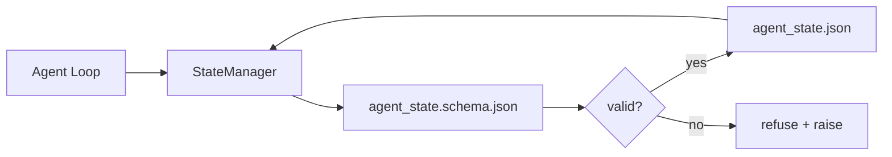

# Repo Memory和Durable State

> Chat history volatile。Repo durable。Workbench store agent state versioned file so下session、下agent、和下reviewer all read same source truth。

**类型:** 构建
**语言:** Python(stdlib + `jsonschema` optional)
**前置要求:** 阶段14课程32(最小Workbench)
**时间:** ~60分钟

## 学习目标

- Define何belong repo memory和何belong chat history。
- Author JSON Schema `agent_state.json`和`task_board.json`。
- Build state manager load、validate、mutate、和persist state atomic。
- Use schema refuse bad write before corrupt workbench。

## 问题背景

Agent finish session。Chat close。下session open ask where start。Model say "let me check file"、read stale note、and re-do work already complete。Or worse、rewrite finished file because no one told file finished。

Workbench fix repo memory:state live JSON file repo、written under schema、persisted atomic、diff-friendly code review。Chat transient feed;repo system of record。

## 概念讲解



### 何belong repo memory

| Belong | 不belong |
|--------|----------|
| Active task id | Raw chat transcript |
| Touched file此session | Token-level reasoning trace |
| Assumption agent made | "The user seemed frustrated" |
| Open blocker | Sampled completion |
| Next action | Vendor-specific model id |

Test durability:would this useful三月from now CI rerun?If yes、repo。If no、telemetry。

### Schema-first state

JSON Schema contract。Without it、every agent invent new field、every reviewer learn new shape、and every CI script special-case past version。With it、bad write refuse write。

Schema cover:

- Required key。
- Allowed `status` value。
- Forbidden value(e.g. `null` for array)。
- Pattern constraint(task id match `T-\d{3,}`)。
- Version field migration。

### Atomic write

State write survive partial failure:write tempfile、fsync、rename over target。State file source truth;half-written worse no file all。

### Migration

When schema change、ship migration script next schema bump。State file carry `schema_version` field;manager refuse load file version cannot migrate。

## 构建

`code/main.py` implement:

- `agent_state.schema.json`和`task_board.schema.json`。
- Stdlib-only validator(JSON Schema subset:required、type、enum、pattern、item)。
- `StateManager.load`、`StateManager.update`、`StateManager.commit` atomic temp-and-rename write。
- Demo mutate state、persist、reload、and prove round-trip。

跑:

```
python3 code/main.py
```

Script write `workdir/agent_state.json`和`workdir/task_board.json`、mutate across two turn、and print validated state each step。

## 产pattern wild

四pattern turn lesson minimum multi-agent monorepo survive。

**Atomic temp-and-rename非optional。**March 2026 Hive project bug report document failure mode cleanly:`state.json` written via `write_text()`and exception caught and silenced。Partial write left session resume corrupt state无signal。Fix always:`tempfile.mkstemp` same directory target、write、`fsync`、`os.replace`(atomic rename POSIX and Windows)。此lesson `atomic_write` exactly that。

**Idempotency key每non-idempotent tool call。**若agent crash after call tool but before checkpointing result、recovery retry tool call。Safe read;dangerous email、DB insert、file upload。Pattern:log every tool call ID before execution入`pending_calls.jsonl`。On retry、check ID;if present、skip call and use cached result。Anthropic和LangChain both call out 2026 guidance;LangGraph checkpointer persist pending write same reason。

**Separate large artifact from state。**不store CSV、long transcript、或generated file `agent_state.json`。Save artifact separate file(or upload object storage)and keep only path state。Checkpoint stay small fast;artifact grow independently。

**Event sourcing audit、snapshot resume。**Append event log(`state.events.jsonl`)每mutation;periodically snapshot `state.json`。Resume read snapshot、then replay event after snapshot timestamp。This cost more disk but let replay agent decision verbatim — essential debugging long-horizon run。Same shape Postgres use internally WAL。

**Schema migration or refuse load。**`schema_version` integer contract。When manager load file unknown version、refuse read。Ship migration script next schema bump;`tools/migrate_state.py` run idempotently every startup。

## 使用

产:

- **LangGraph checkpoint。**Same idea、different storage。Checkpointer persist graph state SQLite、Postgres、或custom backend。Schema此lesson teach reach when checkpointer die and need read state hand。
- **Letta memory block。**Persistent block structured schema(Phase 14 · 08)。Same discipline scoped long-running persona。
- **OpenAI Agents SDK session store。**Pluggable backend、schema-aware。State file此lesson local-file backend。

## 交付成果

`outputs/skill-state-schema.md` generate project-specific JSON Schema pair(state + board)、Python `StateManager` wired atomic write、and migration scaffold so下schema bump不break workbench。

## 练习题

1. Add `last_human_touch` timestamp。Refuse任agent write five second human edit。
2. Extend validator support `oneOf` so task either build task or review task different required field。
3. Add `schema_version` field and write migration v1 to v2(rename `blockers` to `risks`)。
4. Move storage backend local file to SQLite。Keep `StateManager` API identical。
5. Run two agent same state file 50 ms write race。何go wrong and atomic rename save?

## 关键术语

| 术语 | 人们怎么说 | 实际含义 |
|------|------------|----------|
| Repo memory | "Notes file" | State stored tracked file repo、under schema |
| Schema-first | "Validate inputs" | Define contract before writer、refuse drift |
| Atomic write | "Just rename" | Write temp、fsync、rename、so partial failure不能corrupt |
| Migration | "Schema bump" | Script turn vN state into v(N+1) state |
| System of record | "Source of truth" | Artifact workbench treat authoritative |

## 延伸阅读

- [JSON Schema specification](https://json-schema.org/specification.html)
- [LangGraph checkpoint](https://langchain-ai.github.io/langgraph/concepts/persistence/)
- [Letta memory block](https://docs.letta.com/concepts/memory)
- [Fast.io, AI Agent State Checkpointing: A Practical Guide](https://fast.io/resources/ai-agent-state-checkpointing/) — schema-first checkpointing idempotency
- [Fast.io, AI Agent Workflow State Persistence: Best Practices 2026](https://fast.io/resources/ai-agent-workflow-state-persistence/) — concurrency control、TTL、event sourcing
- [Hive Issue #6263 — non-atomic state.json writes silently ignored](https://github.com/aden-hive/hive/issues/6263) — failure mode real project
- [eunomia, Checkpoint/Restore Systems: Evolution, Techniques, Applications](https://eunomia.dev/blog/2025/05/11/checkpointrestore-systems-evolution-techniques-and-applications-in-ai-agents/) — CR primitive OS history apply agent
- [Indium, 7 State Persistence Strategies for Long-Running AI Agents in 2026](https://www.indium.tech/blog/7-state-persistence-strategies-ai-agents-2026/)
- [Microsoft Agent Framework, Compaction](https://learn.microsoft.com/en-us/agent-framework/agents/conversations/compaction) — vendor checkpoint manager
- Phase 14 · 08 — memory block和sleep-time compute
- Phase 14 · 32 — three-file minimum此lesson schematize
- Phase 14 · 40 — handoff packet read same schema