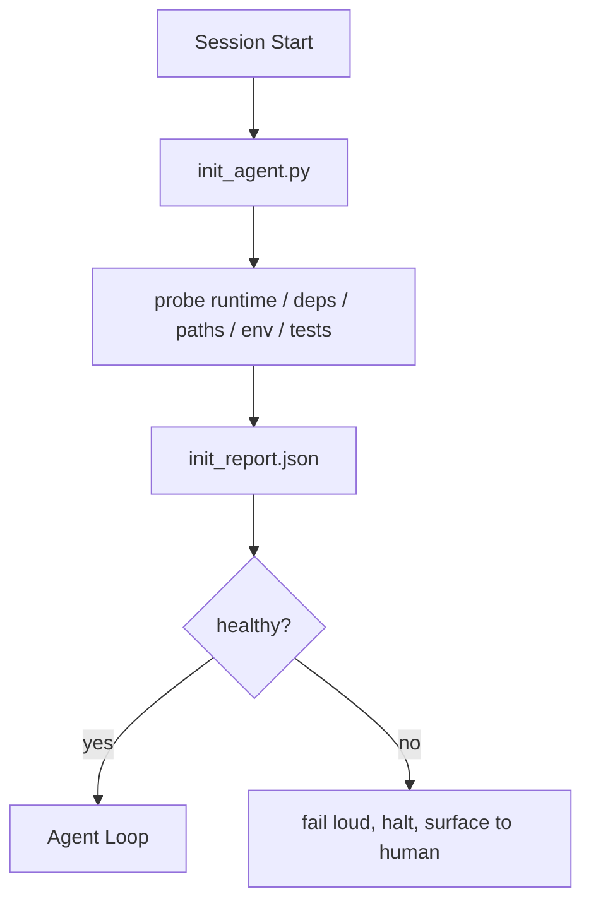

# Agent Initialization Script

> 每session start cold pay tax。Agent read same file、retry same probe、and rediscover same path。Init script pay tax once and write answer state。

**类型:** 构建
**语言:** Python(stdlib)
**前置要求:** 阶段14课程32(最小Workbench)、阶段14课程34(Repo Memory)
**时间:** ~45分钟

## 学习目标

- Identify work agent never redo per session。
- Build deterministic init script probe runtime、dependency、和repo health。
- Persist probe result so agent read instead re-run check。
- Fail loud、fast、and one place look when initialization fail。

## 问题背景

Open session。Agent guess Python version。Guess test command。List repo root five time find entry point。Try import package not installed。Ask user config file live。By time make real edit、ten thousand token go setup work should single script。

Fix one initialization script run before agent anything else and write `init_report.json` agent read startup。

## 概念讲解



### Init script probe何

| Probe | 何matter |
|-------|----------|
| Runtime version | Wrong Python or Node version mean silent wrong-version bug |
| Dependency availability | Missing package later cost ten time cost catch now |
| Test command | Agent must know how verify;command missing workbench broken |
| Repo path | Hard-coded path drift;resolve once and pin |
| Environment variable | Missing `OPENAI_API_KEY` failure surface、非runtime mystery |
| State + board freshness | Stale state crash session footgun |
| Last-known-good commit | Anchor handoff diff end session |

### Fail loud、fail fast、fail one place

Probe failure mean halt and surface human。No "agent will figure it out。"Init whole point refuse start when workbench broken。

### Idempotent

Run twice row。Second run should no-op except fresh timestamp。Idempotency let wire script CI、hook、或pre-task slash command。

### Init vs startup rule

Rule(Phase 14 · 33)describe何must true act。Init script establish those rule check。Rule without init become "be careful。"Init without rule become polished failure。

## 构建

`code/main.py` implement `init_agent.py`:

- Five probe:Python version、listed dependency via `importlib.util.find_spec`、test command resolvability、required env var、state file freshness。
- Each probe return `(name, status, detail)`。
- Script write `init_report.json` full probe set and exit non-zero any block-severity probe fail。

跑:

```
python3 code/main.py
```

Script print probe table、write `init_report.json`、and exit zero happy path or non-zero failed probe list。

## 产pattern wild

三pattern separate useful init script from ceremony。

**Last-known-good commit anchoring。**Probe current commit against `LKG` file write last successful merge。If diff exceed budget(default 50 file)、refuse start and require human ratify new baseline。This Cloudflare AI Code Review use scope reviewer agent:every review session anchor same last-known-good and never compound drift across session。

**Lock file TTL。**Write `prereqs.lock` after first successful probe pass。Subsequent run trust lock N hour(24h default)and skip expensive probe。Init script read lock first;if fresh and dependency manifest hash match、short-circuit。Same pattern Docker use layer cache:idempotent probe + content hash = skip。

**No network、no LLM、no surprise hot path。**Init probe deterministic plumbing。Probe call LLM classify failure or hit external service check license not probe;workflow。If probe take longer three second dry run、treat workbench smell and either move out init or cache result。

## 使用

产:

- **Claude Code hook。**`pre-task` hook call init script and refuse launch agent if fail。
- **GitHub Actions。**`setup-agent` job run init script;agent job depend it。
- **Docker entrypoint。**Agent container run init script before exec-ing agent runtime;log surface failure。

Init script portable because no call specific framework。Bash、Make、或task file all wrap it。

## 交付成果

`outputs/skill-init-script.md` interview project、classify setup work probe、and emit project-specific `init_agent.py` plus CI workflow run before any agent step。

## 练习题

1. Add probe diff current commit last-known-good commit and refuse start more than 50 file changed。
2. Wire script write `prereqs.lock` file and refuse start lock older seven day。
3. Add `--fix` flag auto-install missing dev dependency but never modify runtime dependency approval。
4. Move probe hardcoded function YAML registry。Defend trade-off。
5. Add timing budget per probe。Probe run longer three second workbench smell。

## 关键术语

| 术语 | 人们怎么说 | 实际含义 |
|------|------------|----------|
| Probe | "A check" | Deterministic function return `(name, status, detail)` |
| Init report | "Setup output" | JSON write next state probe result |
| Idempotent | "Safe to re-run" | Two run row produce identical report modulo timestamp |
| Fail loud | "Don't swallow" | Halt and surface human;无silent fallback |
| Setup tax | "Bootstrap cost" | Token agent spend per session rediscover obvious |

## 延伸阅读

- [Anthropic, Effective harnesses for long-running agents](https://www.anthropic.com/engineering/effective-harnesses-for-long-running-agents)
- [GitHub Actions, composite actions for setup](https://docs.github.com/en/actions/sharing-automations/creating-actions/creating-a-composite-action)
- [microservices.io, GenAI dev platform: guardrails](https://microservices.io/post/architecture/2026/03/09/genai-development-platform-part-1-development-guardrails.html) — pre-commit + CI check init
- [Augment Code, How to Build Your AGENTS.md (2026)](https://www.augmentcode.com/guides/how-to-build-agents-md) — init expectation
- [Codex Blog, Codex CLI Context Compaction](https://codex.danielvaughan.com/2026/03/31/codex-cli-context-compaction-architecture/) — session start compaction-aware init
- Phase 14 · 33 — rule set script enable
- Phase 14 · 34 — state file script seed
- Phase 14 · 38 — verification gate init script feed
- Phase 14 · 40 — handoff consume init report last-known-good