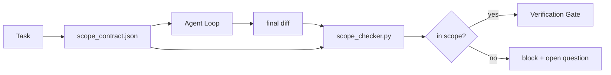

# Scope Contract和Task Boundary

> 模型不知work end where。Scope contract per-task file say work begin where、end where、and how roll back if spill。Contract turn "stay in scope" wish check。

**类型:** 构建
**语言:** Python(stdlib)
**前置要求:** 阶段14课程32(最小Workbench)、阶段14课程33(Rule作Constraint)
**时间:** ~50分钟

## 学习目标

- Write scope contract agent read task start and verifier read task end。
- Specify allowed file、forbidden file、acceptance criteria、rollback plan、和approval boundary。
- Implement scope checker compare diff contract and flag violation。
- Make scope creep visible、automatic、和reviewable。

## 问题背景

Agent creep。Task "fix login bug。"Diff touch login route、email helper、database driver、README、和release script。Each touch plausible reason moment。Together different change reviewed。

Scope creep most under-monitored failure mode agent work because agent narrate each step good faith。Fix not stricter prompt。Fix contract disk say promise and check compare result promise。

## 概念讲解



### Scope contract何go

| Field | Purpose |
|-------|---------|
| `task_id` | Link task board |
| `goal` | One sentence reviewer verify |
| `allowed_files` | Glob agent may write |
| `forbidden_files` | Glob agent must not touch even accident |
| `acceptance_criteria` | Test command or assertion line prove done |
| `rollback_plan` | One paragraph operator execute if halt required |
| `approvals_required` | Action outside scope need explicit human sign-off |

Contract without `forbidden_files` incomplete。Negative space half contract。

### Glob、非raw path

Real repo move file。Pin contract glob(`app/**/*.py`、`tests/test_signup*.py`)so refactor between session not invalidate contract。

### Rollback scope part

List how roll back force contract author think what could wrong。Contract cannot roll back contract should not approve。

### Scope check diff check

Agent write diff。Checker read diff、allowed glob、forbidden glob、和acceptance command run list。Each violation tagged finding verification gate refuse。

## 构建

`code/main.py` implement:

- `scope_contract.json` schema(JSON Schema subset、glob array)。
- Diff parser turn touched file list plus run command list `RunSummary`。
- `scope_check` return `(violations, in_scope, off_scope)` contract。
- Two demo run:one stay scope、one creep。Checker flag creep exact file and reason。

跑:

```
python3 code/main.py
```

Output:contract、two run、per-run verdict、and saved `scope_report.json`。

## 产pattern wild

Practitioner running "specsmaxxing"(scope contract YAML before invoke agent)report rabbit-hole rate drop 52% to 21% three week without change agent。Contract work、非model。三pattern make gain stick。

**Violation budget、非binary failure。**`agent-guardrails`(OSS merge gate use Claude Code、Cursor、Windsurf、Codex via MCP)ship `violationBudget` per task:minor scope slip within budget surface warning;only budget exceeded merge gate refuse。Pair `violationSeverity: "error" | "warning"`。Budget difference gate ship and gate disabled team hated it。

**Severity asymmetry path family。**Off-scope write `docs/**` usually `warn`;off-scope write `scripts/**`、`migrations/**`、`config/prod/**` always `block`。Asymmetry live contract、非runtime、because project-specific and change per task。

**Time和network budget next file budget。**`time_budget_minutes` field bound wall clock;runtime refuse continue past re-approval。`network_egress` allowlist hostname prevent agent quiet hit external API not part task。These scope dimension too;file glob necessary、非sufficient。

**Multi-contract merge semantic(least privilege)。**When two scope contract apply(e.g. project-wide contract plus task-specific one)、merge:**intersect** `allowed_files`(both contract must permit path)、**union** `forbidden_files`(either prohibit)、`time_budget_minutes` most restrictive(min)、`approvals_required` accumulate。`network_egress` `None` no enforcement、`[]` deny-all、`[...]` allowlist;under merge、`None` defer other side、two list intersect、and deny-all stay deny-all。State contract schema so merge mechanical and reviewable。

## 使用

产pattern:

- **Claude Code slash command。**`/scope` command write contract and pin session context。Subagent read contract before act。
- **GitHub PR。**Push contract JSON file PR body or checked-in artifact。CI run scope checker merge diff。
- **LangGraph interrupt。**Scope violation trigger interrupt;handler ask human whether contract need grow or agent need back off。

Contract travel task。When task close、contract archive `outputs/scope/closed/`。

## 交付成果

`outputs/skill-scope-contract.md` generate scope contract task description and glob-aware checker run CI every agent diff。

## 练习题

1. Add `network_egress` field list allowed external host。Refuse run touch other host。
2. Extend checker fail soft `docs/**` and hard `scripts/**`。Justify asymmetry。
3. Make contract derive `allowed_files` `goal` field static rule set(no LLM)。何go wrong first edge case?
4. Add `time_budget_minutes` and refuse continue once wall clock exceed。
5. Run two contract same diff。何right merge semantic when both apply?

## 关键术语

| 术语 | 人们怎么说 | 实际含义 |
|------|------------|----------|
| Scope contract | "The task brief" | Per-task JSON list allowed/forbidden file、acceptance、rollback |
| Scope creep | "It also touched..." | File outside contract change same task |
| Rollback plan | "We can revert" | One-paragraph operator runbook halt |
| Approval boundary | "Needs sign-off" | Action list contract require explicit human approval |
| Diff check | "Path audit" | Compare touched file contract glob |

## 延伸阅读

- [LangGraph human-in-the-loop interrupt](https://langchain-ai.github.io/langgraph/concepts/human_in_the_loop/)
- [OpenAI Agents SDK tool approval policy](https://platform.openai.com/docs/guides/agents-sdk)
- [logi-cmd/agent-guardrails — merge gate and scope validation](https://github.com/logi-cmd/agent-guardrails) — violation budget、severity tier
- [Dev|Journal, Preventing AI Agent Configuration Drift with Agent Contract Testing](https://earezki.com/ai-news/2026-05-05-i-built-a-tiny-ci-tool-to-keep-ai-agent-configs-from-drifting-in-my-repo/) — `--strict` mode without external dep
- [Agentic Coding Is Not a Trap (production log)](https://dev.to/jtorchia/agentic-coding-is-not-a-trap-i-answered-the-viral-hn-post-with-my-own-production-logs-33d9) — specsmaxxing receipt:52% → 21%
- [OpenCode permission glob](https://opencode.ai/docs/agents/) — fine-grained per-permission scope
- [Knostic, AI Coding Agent Security: Threat Model and Protection Strategy](https://www.knostic.ai/blog/ai-coding-agent-security) — scope part least privilege
- [Augment Code, AI Spec Template](https://www.augmentcode.com/guides/ai-spec-template) — three-tier boundary system(must/ask/never)
- Phase 14 · 27 — prompt injection defense pair scope lock
- Phase 14 · 33 — rule set contract specialize per task
- Phase 14 · 38 — verification gate checker report into