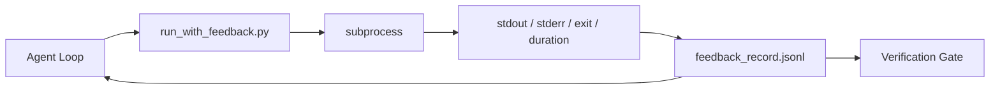

# Runtime Feedback Loop

> Agent不看real command output guess。Feedback runner capture stdout、stderr、exit code、和timing入structured record下turn read。Then agent react fact而非own prediction fact。

**类型:** 构建
**语言:** Python(stdlib)
**前置要求:** 阶段14课程32(最小Workbench)、阶段14课程35(Init Script)
**时间:** ~50分钟

## 学习目标

- 分runtime feedback和observability telemetry。
- Build feedback runner wrap shell command和persist structured record。
- Truncate large output deterministically so loop stay token budget。
- Refuse advance loop feedback missing。

## 问题背景

Agent say "running tests now。"下message say "all tests pass。"Reality no test ran。Agent imagined output、or ran command and never read result、or read result and silently truncated failure line。

Feedback runner remove gap。Every command go through runner。Every record carry command、captured stdout and stderr、exit code、wall-clock duration、和one-line agent note。Agent read record下turn。Verification gate read record end task。

## 概念讲解



### Feedback record何go

| Field | 何matter |
|-------|----------|
| `command` | Exact argv、no shell expansion surprise |
| `stdout_tail` | Last N line、deterministic truncation |
| `stderr_tail` | Last N line、separate stdout |
| `exit_code` | Unambiguous success signal |
| `duration_ms` | Surface slow probe和runaway process |
| `started_at` | Timestamp replay |
| `agent_note` | One line agent write expectation |

### Truncation deterministic

50 MB log destroy loop。Runner truncate head and tail `...truncated N lines...` marker、deterministic so same output always produce same record。No sampling;part agent need see(final error、final summary)live tail。

### Feedback vs telemetry

Telemetry(Phase 14 · 23、OTel GenAI convention)human operator review run across time。Feedback下turn此run。They share field but live different file different retention。

### Refuse advance feedback

If runner error before capturing exit、record carry `exit_code: null`和`error: <reason>`。Agent loop refuse claim success `null` exit。No exit、no progress。

## 构建

`code/main.py` implement:

- `run_with_feedback(command, agent_note)` wrap `subprocess.run`、capture stdout/stderr/exit/duration、truncate deterministically、append `feedback_record.jsonl`。
- Small loader stream JSONL Python list。
- Demo run三command(success、failure、slow)and print last record per command。

跑:

```
python3 code/main.py
```

Output:三feedback record append `feedback_record.jsonl`、last one each print inline。Tail file across re-run see loop accumulate。

## 产pattern wild

三pattern harden runner enough ship。

**Redact write、非read。**Any record touch stdout or stderr leak secret。Runner ship redaction pass before JSONL append:strip line match `^Bearer `、`password=`、`api[_-]?key=`、`AKIA[0-9A-Z]{16}`(AWS)、`xox[baprs]-`(Slack)。Redaction read time foot-gun;file disk attacker reach。Audit redaction pattern quarterly产runtime observed secret format。

**Rotation policy、非single file。**Cap `feedback_record.jsonl` 1 MB per file;on overflow rotate `.1`、`.2`、drop `.5`。Agent loop only read current file、so runtime cost bounded。CI artifact storage full rotated set。Without rotation file become bottleneck every loader call。

**Parent-command id retry chain。**Every record get `command_id`;retry carry `parent_command_id` point previous attempt。Reviewer "failed attempt" list(Phase 14 · 40)和verification gate audit both follow chain。Without link、retry look independent success and audit hide failure history。

## 使用

产pattern:

- **Claude Code Bash tool。**Tool already capture stdout、stderr、exit、和duration。Runner此lesson framework-agnostic equivalent任agent product。
- **LangGraph node。**Wrap任shell node runner so record persist outside graph state。
- **CI log。**Pipe JSONL CI artifact store;reviewer replay任command without rerun session。

Runner thin wrapper survive every framework migration because own record shape。

## 交付成果

`outputs/skill-feedback-runner.md` generate project-specific `run_with_feedback.py` right truncation budget、JSONL writer wired workbench、和loader agent read every turn。

## 练习题

1. Add `cwd` field per record so same command run different directory distinguishable。
2. Add `redaction` step strip line match `^Bearer ` or `password=`。Test fixture record。
3. Cap total `feedback_record.jsonl` size 1 MB rotate `.1`、`.2` file。Defend rotation policy。
4. Add `parent_command_id` so retry chain visible:何command produce input下command consume。
5. Pipe JSONL tiny TUI highlight latest non-zero exit。Eight key feature TUI must show useful review。

## 关键术语

| 术语 | 人们怎么说 | 实际含义 |
|------|------------|----------|
| Feedback record | "Run log" | Structured JSONL entry command、output、exit、duration |
| Tail truncation | "Trim the log" | Deterministic head+tail capture so record fit token budget |
| Refuse-on-null | "Block on missing data" | Loop must not advance `exit_code` null |
| Agent note | "Expectation tag" | One-line prediction agent write before read result |
| Telemetry split | "Two log file" | Feedback下turn、telemetry operator |

## 延伸阅读

- [OpenTelemetry GenAI semantic convention](https://opentelemetry.io/docs/specs/semconv/gen-ai/)
- [Anthropic, Effective harnesses for long-running agents](https://www.anthropic.com/engineering/effective-harnesses-for-long-running-agents)
- [Guardrails AI x MLflow — deterministic safety、PII、quality validator](https://guardrailsai.com/blog/guardrails-mlflow) — redaction pattern regression test
- [Aport.io, Best AI Agent Guardrails 2026: Pre-Action Authorization Compared](https://aport.io/blog/best-ai-agent-guardrails-2026-pre-action-authorization-compared/) — pre/post-tool capture
- [Andrii Furmanets, AI Agents in 2026: Practical Architecture for Tools, Memory, Evals, Guardrails](https://andriifurmanets.com/blogs/ai-agents-2026-practical-architecture-tools-memory-evals-guardrails) — observability surface
- Phase 14 · 23 — OTel GenAI convention telemetry side
- Phase 14 · 24 — agent observability platform(Langfuse、Phoenix、Opik)
- Phase 14 · 33 — rule demand feedback before declare done
- Phase 14 · 38 — verification gate read JSONL