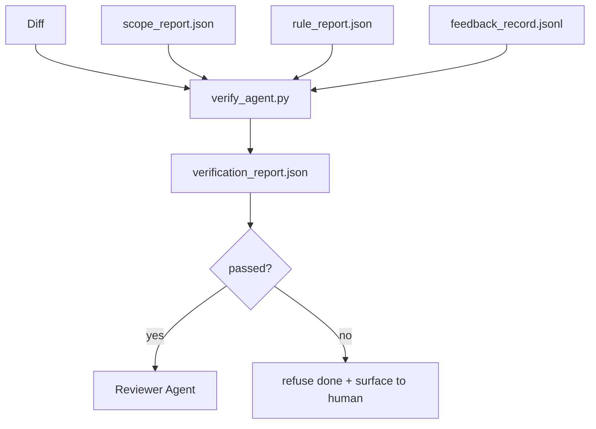

# Verification Gate

> Agent不mark own work done。Verification gate read scope contract、feedback log、rule report、和diff、答single question:此task actually complete?If gate say no、task not done、no matter chat say。

**类型:** 构建
**语言:** Python(stdlib)
**前置要求:** 阶段14课程33(Rule)、阶段14课程36(Scope)、阶段14课程37(Feedback)
**时间:** ~55分钟

## 学习目标

- Define verification gate deterministic function over workbench artifact。
- Combine rule report、scope report、feedback record、和diff single verdict。
- Emit `verification_report.json` reviewer agent和CI both read。
- Refuse advance task any block-severity failure、without exception。

## 问题背景

Agent declare success too easily。三failure shape dominate:

- "Looks good。"Model read own diff and decided correct。
- "Tests passed。"Say confidence。No record test actually running。
- "Acceptance met。"Acceptance criteria interpreted loosely enough mean "anything resembling done。"

Workbench fix single verification gate read artifact agent already produce and make call。Gate deterministic。Gate version control。Gate wired CI。Agent cannot bribe。

## 概念讲解



### Gate check何

| Check | Source artifact | Severity |
|-------|-----------------|----------|
| All acceptance command ran | `feedback_record.jsonl` | block |
| All acceptance command exited zero | `feedback_record.jsonl` | block |
| Scope check无forbidden write | `scope_report.json` | block |
| Scope check无off-scope write | `scope_report.json` | block or warn |
| All block-severity rule pass | `rule_report.json` | block |
| No `null` exit code feedback | `feedback_record.jsonl` | block |
| Touched file match `scope.allowed_files` | both | warn |

`warn` finding annotate verdict;`block` finding prevent `passed: true`。

### Deterministic、非probabilistic

Gate must produce same verdict same artifact set every time。No LLM judge。LLM judge belong reviewer side(Phase 14 · 39)goal qualitative evaluation、非status。

### One report、one path

Gate emit one `verification_report.json` per task close-out、written under `outputs/verification/<task_id>.json`。CI consume same path。Multiple gate different path fork source truth。

### Refuse without exception

Block-severity finding不能override agent。Only override human、with recorded `override_reason`和`overridden_by` user id。Override signed change、非agent decision。

## 构建

`code/main.py` implement:

- Loader each input artifact、all stubbed locally so lesson self-contained。
- `verify(task_id, artifacts) -> VerdictReport` pure function。
- Printer show per-check result and final pass/fail。
- Demo三task scenario:clean pass、scope creep、missing acceptance。

跑:

```
python3 code/main.py
```

Output:三verdict report、each saved next script。

## 产pattern wild

四pattern elevate gate "another lint job" "deciding edge。"

**Defense-in-depth、非single gate。**Pre-commit hook → CI status check → pre-tool authz hook → pre-merge gate。Each layer deterministic so failure one layer caught next。microservices.io March 2026 playbook explicit:pre-commit hook non-bypassable because、unlike model-side skill、does not depend agent following instruction。Verification gate sit CI / pre-merge layer。

**Defense deterministic check、model-judge only nuance。**Anthropic 2026 Hybrid Norm pairing:verifiable reward(unit test、schema check、exit code)answer "did code solve problem?" — LLM rubric answer "is code readable、secure、on-style?" Gate run first class;reviewer(Phase 14 · 39)run second。Mixing collapse signal。

**Signed override log、非Slack thread。**Every override emit row `outputs/verification/overrides.jsonl` with:timestamp、finding code、reason、signing user、current HEAD commit。Runtime refuse override lack signature;audit trail git-tracked。This line override policy and override theater。

**Coverage floor first-class check。**`coverage_report.json` feed `coverage_floor`(default 80%)check。Gate fail measured coverage drop floor or previous merge floor more than 1 percentage point。Without check、agent quietly delete test fail and verification report stay green。

**`--strict` mode promote warn block。**For release branch、ship-blocking PR、或post-incident triage、`--strict` make every warning hard fail。Flag opt-in branch;非global default、because strict-on-everything corrode day-to-day flow。

## 使用

产pattern:

- **CI step。**`verify_agent` job run gate agent final artifact。Merge protection refuse without `passed: true`。
- **Pre-handoff hook。**Agent runtime call gate before generate handoff doc。No green verdict、no handoff。
- **Manual triage。**Operator read report when agent claim success and human suspect。

Gate deciding edge workbench flow。Every other surface upstream。

## 交付成果

`outputs/skill-verification-gate.md` wire gate specific project:何acceptance command feed it、何rule block-severity、何off-scope write tolerated、how override audit log store。

## 练习题

1. Add `coverage_floor` check:test command must produce coverage report at least 80%。Decide何artifact carry floor。
2. Support `--strict` mode promote every `warn` `block`。Document case strict mode right default。
3. Make gate produce Markdown summary addition JSON。Defend何field belong summary。
4. Add `time_since_last_human_touch` check:any file edit 60 second human keystroke exempt off-scope flag。
5. Run gate real agent diff product。How many finding real and how many noise?Where gate need grow?

## 关键术语

| 术语 | 人们怎么说 | 实际含义 |
|------|------------|----------|
| Verification gate | "The check stop thing" | Deterministic function over workbench artifact produce pass/fail verdict |
| Block severity | "Hard fail" | Finding prevent `passed: true` and require signed override |
| Override log | "Why we let it through" | Signed entry reason and user id、audited review |
| Acceptance command | "The proof" | Shell command zero exit `done` mean |
| One report path | "Source of truth" | `outputs/verification/<task_id>.json`、consumed CI and human alike |

## 延伸阅读

- [Anthropic, Harness design for long-running application development](https://www.anthropic.com/engineering/harness-design-long-running-apps)
- [OpenAI Agents SDK guardrail](https://platform.openai.com/docs/guides/agents-sdk/guardrails)
- [microservices.io, GenAI dev platform: guardrail](https://microservices.io/post/architecture/2026/03/09/genai-development-platform-part-1-development-guardrails.html) — defense depth pre-commit and CI
- [ICMD, The 2026 Playbook for Agentic AI Ops](https://icmd.app/article/the-2026-playbook-for-agentic-ai-ops-guardrails-costs-and-reliability-at-scale-1776661990431) — approval-gate ladder(draft → approval → auto under threshold)
- [Type-Checked Compliance: Deterministic Guardrails (arXiv 2604.01483)](https://arxiv.org/pdf/2604.01483) — Lean 4 upper bound deterministic gating
- [logi-cmd/agent-guardrails — merge gate spec](https://github.com/logi-cmd/agent-guardrails) — scope + mutation-testing gate
- [Guardrails AI x MLflow](https://guardrailsai.com/blog/guardrails-mlflow) — deterministic validator CI scorer
- [Akira, Real-Time Guardrails for Agentic Systems](https://www.akira.ai/blog/real-time-guardrails-agentic-systems) — pre/post-tool gate
- Phase 14 · 27 — prompt injection defense(gate adversarial pair)
- Phase 14 · 36 — scope contract gate enforce
- Phase 14 · 37 — feedback log gate score
- Phase 14 · 39 — reviewer agent gate hand off to