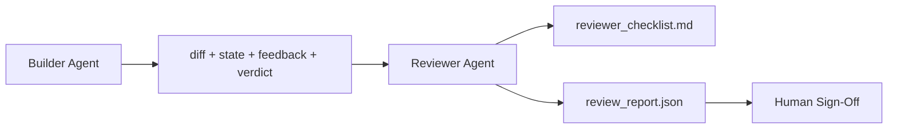

# Reviewer Agent:Separate Builder from Marker

> Agent wrote code不能grade it。Reviewer second loop different system prompt、different goal、和read-only access everything builder produce。Gap builder和reviewer most reliability live。

**类型:** 构建
**语言:** Python(stdlib)
**前置要求:** 阶段14课程38(Verification Gate)
**时间:** ~55分钟

## 学习目标

- State why same agent cannot reliably review own work。
- Build reviewer agent loop consume builder artifact and emit structured review report。
- Author reviewer rubric grade specific dimension、非vibe。
- Wire reviewer workbench so human review step start real artifact。

## 问题背景

You ask agent fix bug。It edit four file、run test、and report done。Verification gate(Phase 14 · 38)confirm acceptance ran and scope held。Gate say `passed: true`。You merge。Two day later find fix solved wrong half bug。

Acceptance necessary、非sufficient。Reviewer ask question acceptance cannot ask:did this solve right problem?Did it expand scope without flag?Did it document assumption should questioned?Did it leave workbench state下session pick up?

## 概念讲解



### Reviewer rubric

五dimension、each scored 0 to 2。

| Dimension | Question |
|-----------|----------|
| Problem fit | Change solve task stated、非nearby task? |
| Scope discipline | Edit confined contract or contract grown deliberately? |
| Assumption | All hidden assumption written somewhere reviewable? |
| Verification quality | Acceptance command actually prove goal、or prove weaker version? |
| Handoff readiness | Could下session pick up cleanly current state? |

Total out 10。Run below 7 soft fail;run below 5 hard fail。

### Reviewer separate role、非separate model

You can run reviewer same model builder。Discipline role separation:different system prompt、different input、no write access diff。Posture change signal change。

### Reviewer cannot edit diff

Reviewer read diff、state、feedback、verdict。It write report。It not patch diff。If report say "fix this、"下builder turn do fix;reviewer go back reviewing。Mixing role defeat gap。

### Reviewer rubric vs verification gate

Gate(Phase 14 · 38)check deterministic fact:did acceptance run、did rule pass、did scope hold。Reviewer make qualitative judgment:was this right work、is it documented、is handoff usable。Both required。

## 构建

`code/main.py` implement:

- `ReviewerInputs` dataclass bundle artifact reviewer read。
- Rubric scorer one function per dimension。Each function deterministic stub-grade lesson;real implementation would call LLM。
- `review_report.json` writer five score、total、和verdict(`pass`、`soft_fail`、`hard_fail`)。
- Two demo case:clean change and "right test、wrong problem" change。

跑:

```
python3 code/main.py
```

Output:two review report written disk and console table dimensional score。

## 产pattern wild

Receipt:Cloudflare April 2026 AI Code Review system ran 131,246 review run across 48,095 merge request 5,169 repo 30 day。Median review completed 3 minute 39 second。Up seven specialist reviewer(security、performance、code quality、doc、release management、compliance、Engineering Codex)ran parallel Review Coordinator deduplicate finding and judge severity。Top-tier model reserved exclusively coordinator;specialist ran cheaper tier。

四pattern make work scale。

**Specialist pool、非one big reviewer。**One reviewer 5-dimension rubric work solo repo。Once codebase security-critical、performance-critical、和doc surface、split specialist smaller prompt。Coordinator deduplication;specialist never run full rubric。Model-tier separation fall out:cheap specialist、expensive coordinator。

**Bias mitigation design requirement、非optimization。**LLM judge show four reliable bias(Adnan Masood、April 2026):position bias(GPT-4 ~40% inconsistent (A,B) vs (B,A) ordering)、verbosity bias(~15% score inflation longer output)、self-preference(judge prefer output same model family)、authority(judge over-rate reference known author)。Mitigation:evaluate both ordering and only count consistent win;use 1-4 scale explicitly reward conciseness;rotate judge across model family;strip author name before scoring。

**Calibration set、非vibe。**10-20 task historical set known correct verdict。Run reviewer over it every prompt change。If agreement historical record fall below 80%、rubric need revision before reviewer ship。This what every team eventually rediscover;better start it。

**Hybrid norm gate。**Verification gate(Phase 14 · 38)handle deterministic check(did acceptance run、did test pass、did scope hold)。Reviewer handle semantic check(was right work、are assumption documented、is handoff usable)。Anthropic 2026 guidance explicit split:不ask reviewer redo gate already prove。

## 使用

产pattern:

- **Claude Code subagent。**Reviewer subagent run after builder close task。It post comment PR rubric score。
- **OpenAI Agents SDK handoff。**Builder hand off Reviewer task completion。Reviewer can hand back finding list or up human。
- **Two-model pairing。**Builder run faster cheaper model。Reviewer run stronger model smaller context、focused judgment。

Reviewer second pair eye workbench grow when human cannot do every review themselves。

## 交付成果

`outputs/skill-reviewer-agent.md` generate project-specific reviewer rubric、reviewer agent stub wired builder artifact、和integration verification gate so human review start written report instead blank page。

## 练习题

1. Add sixth dimension specific product domain。Defend why not absorbed existing five。
2. Run reviewer two different system prompt(terse、verbose)。Which produce report human more likely read?
3. Add `confidence` field per dimension。Refuse ship report when confidence lowest dimension below 0.6。
4. Build calibration set:10 historical task close-out known correct verdict。Run reviewer over them。Where disagree historical record?
5. Add "request more evidence" affordance:reviewer can ask builder specific test run before scoring。何right back-off so not loop?

## 关键术语

| 术语 | 人们怎么说 | 实际含义 |
|------|------------|----------|
| Reviewer rubric | "Checklist" | 五dimension 0-2 scoring written question per dimension |
| Soft fail | "Needs revision" | Total below 7;builder get finding address |
| Hard fail | "Reject" | Total below 5 or any dimension 0;halt and surface human |
| Role separation | "Different prompt" | Same model can both role;discipline input and posture |
| Confidence floor | "Don't ship low-signal report" | Refuse emit verdict when rubric uncertain |

## 延伸阅读

- [OpenAI Agents SDK handoff](https://platform.openai.com/docs/guides/agents-sdk/handoffs)
- [Anthropic Claude Code subagent](https://docs.anthropic.com/en/docs/agents-and-tools/claude-code/sub-agents)
- [Cloudflare, Orchestrating AI Code Review at Scale](https://blog.cloudflare.com/ai-code-review/) — 7-specialist + coordinator architecture、131k run / 30 day
- [Agent-as-a-Judge: Evaluating Agents with Agents (OpenReview / ICLR)](https://openreview.net/forum?id=DeVm3YUnpj) — DevAI benchmark、366 hierarchical solution requirement
- [Adnan Masood, Rubric-Based Evaluations and LLM-as-a-Judge: Methodologies, Biases, Empirical Validation](https://medium.com/@adnanmasood/rubric-based-evals-llm-as-a-judge-methodologies-and-empirical-validation-in-domain-context-71936b989e80) — 4 bias和mitigation
- [MLflow, LLM-as-a-Judge Evaluation](https://mlflow.org/llm-as-a-judge) — production tooling separated builder/evaluator
- [LangChain, How to Calibrate LLM-as-a-Judge with Human Corrections](https://www.langchain.com/articles/llm-as-a-judge) — calibration-set workflow
- [Evidently AI, LLM-as-a-judge: a complete guide](https://www.evidentlyai.com/llm-guide/llm-as-a-judge)
- [Arize, LLM as a Judge — Primer and Pre-Built Evaluator](https://arize.com/llm-as-a-judge/)
- Phase 14 · 05 — Self-Refine and CRITIC(single-agent self-review baseline)
- Phase 14 · 30 — Eval-driven agent development(calibration set generator)
- Phase 14 · 38 — verification gate reviewer read
- Phase 14 · 40 — handoff packet reviewer report feed