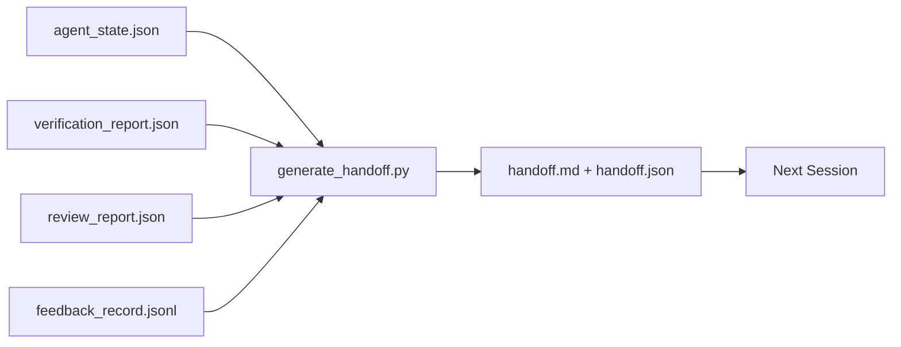

# Multi-Session Handoff

> Session end。Work不。Handoff packet artifact turn "agent worked hour" into "下session productive first minute。"Build purpose、非afterthought。

**类型:** 构建
**语言:** Python(stdlib)
**前置要求:** 阶段14课程34(Repo Memory)、阶段14课程38(Verification)、阶段14课程39(Reviewer)
**时间:** ~50分钟

## 学习目标

- Identify七field every handoff packet need。
- Generate handoff workbench artifact without hand-writing prose。
- Trim large feedback log handoff-sized summary。
- Make下session first action deterministic。

## 问题背景

Session end。Agent say "great、we made progress。"下session open。下agent ask "where leave off?"First agent answer gone。下agent rediscover、re-run same command、re-ask human same question、and burn thirty minute recover last thirty second previous session。

Bad handoff cost paid every session task life。Fix packet generated automatically session end:何change、why、何tried、何failed、何left、何do first next time。

## 概念讲解



### 七field handoff carry

| Field | Question answer |
|-------|-----------------|
| `summary` | One paragraph何done |
| `changed_files` | Diff glance |
| `commands_run` | 何actually executed |
| `failed_attempts` | 何tried and why not work |
| `open_risks` | 何could bite下session、with severity |
| `next_action` | First concrete step下session take |
| `verdict_pointer` | Path verification + review report |

`next_action` field load-bearing。Handoff everything except `next_action` status report、非handoff。

### Handoff generated、非written

Hand-written handoff handoff skipped hard day。Generator read workbench artifact and emit packet。Agent job leave workbench state generator can summarize、非write summary。

### Two form:human-readable和machine-readable

`handoff.md` human read。`handoff.json`下agent load。Both come same source artifact。If diverge、JSON win。

### Feedback log trimming

Full `feedback_record.jsonl` may hundred entry。Handoff carry only last K plus every entry non-zero exit。下session load full log if need、but packet stay small。

## 构建

`code/main.py` implement:

- Loader gather state、verdict、review、和feedback single `WorkbenchSnapshot`。
- `generate_handoff(snapshot) -> (markdown, payload)` function。
- Filter pick last K feedback entry plus all non-zero exit。
- Demo run write `handoff.md`和`handoff.json` next script。

跑:

```
python3 code/main.py
```

Output:printed handoff body、plus both file disk。

## 产pattern wild

Codex CLI、Claude Code、和OpenCode each ship different compaction story;structured handoff packet sit top all three。

**Compaction strategy vary;packet schema不。**Codex CLI POST /v1/responses/compact server-side opaque AES blob(fast path OpenAI model);fallback local "handoff summary" appended `_summary` user-role message。Claude Code run five-stage progressive compaction 95% context。OpenCode timestamp-based message hiding plus 5-heading LLM summary。三different mechanism、same need:serialize survive compression portable artifact。Packet that artifact。

**Fresh-session handoff非compaction。**Compaction extend session;handoff close one cleanly and start next。Hermes Issue #20372 framing(April 2026)right:when in-place compression start degrading、agent should write compact handoff、end session、and resume fresh context。Packet make transition cheap。Mistake keep compressing until quality collapse;fix budget early、clean handoff。

**One active handoff per branch和topic。**Multi-agent coordination breakdown stale handoff more bad model output。Always include `branch`、`last_known_good_commit`、和`status` `active | superseded | archived`。Stale handoff archived;only active drive下session。This difference handoff-as-note and handoff-as-state。

**Wrap up before 50-75% context、非at wall。**Hand-written-pattern playbook(CLAUDE.md + HANDOVER.md)report best result session end 50-75% context budget instead 95%。Packet generator run cleanly before compression artifact pollute source state。Cheap write while context intact;expensive when model already losing place。

## 使用

产pattern:

- **Session-end hook。**Runtime fire generator user close chat。Packet go `outputs/handoff/<session_id>/`。
- **PR template。**Generator markdown also PR body。Reviewer read without open five other file。
- **Cross-agent handoff。**Build one product(Claude Code)、continue another(Codex)。Packet lingua franca。

Packet small、regular、and cheap produce。Cost saving compound every session。

## 交付成果

`outputs/skill-handoff-generator.md` produce generator tuned project artifact path、end-of-session hook run it、和`handoff.json` schema下agent read startup。

## 练习题

1. Add `assumptions_to_validate` field surface every assumption builder logged but reviewer not score above 1。
2. Trim feedback summary differently failing run versus passing。Defend asymmetry。
3. Include "question human" list。何threshold question make packet versus chat message?
4. Make generator idempotent:running twice produce same packet。何need stable hold?
5. Add "下session prereq" section list exactly artifact下session must load before act。

## 关键术语

| 术语 | 人们怎么说 | 实际含义 |
|------|------------|----------|
| Handoff packet | "Session summary" | Generated artifact carry七field、both markdown and JSON |
| Next action | "What do first" | One concrete step start下session |
| Feedback trim | "Log summary" | Last K record plus every non-zero exit |
| Status report | "What we did" | Document missing `next_action`;useful、非handoff |
| Verdict pointer | "Receipt" | Path verification + review report traceability |

## 延伸阅读

- [Anthropic, Effective harnesses for long-running agents](https://www.anthropic.com/engineering/effective-harnesses-for-long-running-agents)
- [OpenAI Agents SDK handoff](https://platform.openai.com/docs/guides/agents-sdk/handoffs)
- [Codex Blog, Codex CLI Context Compaction: Architecture, Configuration, Managing Long Sessions](https://codex.danielvaughan.com/2026/03/31/codex-cli-context-compaction-architecture/) — POST /v1/responses/compact and local fallback
- [Justin3go, Shedding Heavy Memories: Context Compaction in Codex, Claude Code, OpenCode](https://justin3go.com/en/posts/2026/04/09-context-compaction-in-codex-claude-code-and-opencode) — three-vendor compaction comparison
- [JD Hodges, Claude Handoff Prompt: How to Keep Context Across Sessions (2026)](https://www.jdhodges.com/blog/ai-session-handoffs-keep-context-across-conversations/) — CLAUDE.md + HANDOVER.md、50-75% context budget
- [Mervin Praison, Managing Handoffs in Multi-Agent Coding Sessions: Fresh Context Without Losing Continuity](https://mer.vin/2026/04/managing-handoffs-in-multi-agent-coding-sessions-fresh-context-without-losing-continuity/) — distributed-systems framing
- [Hermes Issue #20372 — automatic fresh-session handoff when compression become risky](https://github.com/NousResearch/hermes-agent/issues/20372)
- [Hermes Issue #499 — Context Compaction Quality Overhaul](https://github.com/NousResearch/hermes-agent/issues/499) — handoff-oriented prompt Codex CLI
- [Microsoft Agent Framework, Compaction](https://learn.microsoft.com/en-us/agent-framework/agents/conversations/compaction)
- [OpenCode, Context Management and Compaction](https://deepwiki.com/sst/opencode/2.4-context-management-and-compaction)
- [LangChain, Context Engineering for Agents](https://www.langchain.com/blog/context-engineering-for-agents)
- Phase 14 · 34 — state file generator read
- Phase 14 · 38 — verification verdict packet point at
- Phase 14 · 39 — reviewer report bundle packet