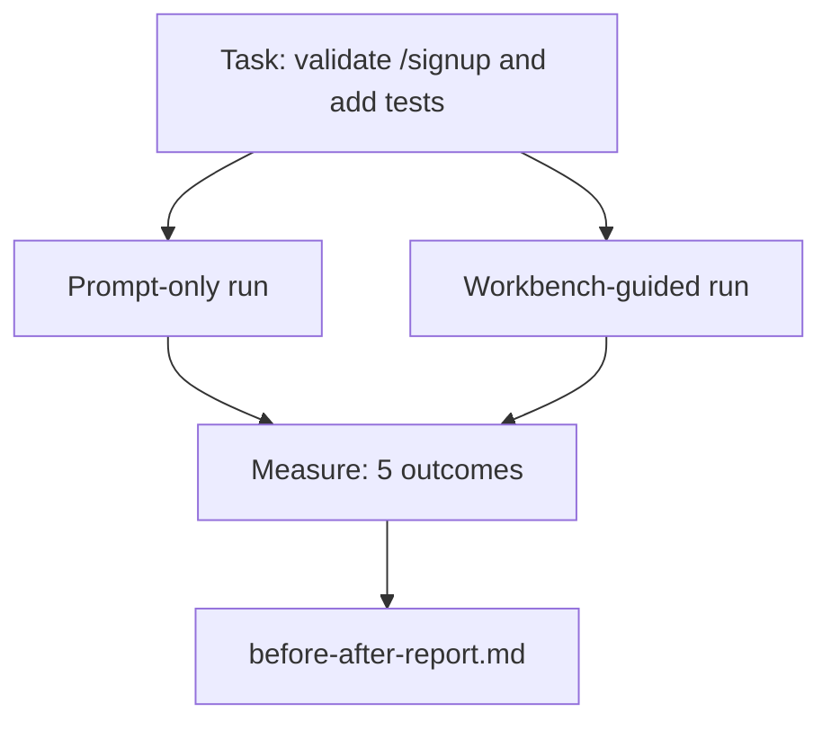

# Workbench on Real Repo

> 十一lesson surface worth nothing if not survive contact real codebase。此lesson run same task twice small sample app:prompt-only versus workbench-guided。Number argue。

**类型:** 构建
**语言:** Python(stdlib)
**前置要求:** 阶段14课程32至40
**时间:** ~60分钟

## 学习目标

- Bring七workbench surface together small application。
- Run same task twice(prompt-only和workbench-guided)and measure五outcome。
- Read before/after report and decide which surface most leverage。
- Defend workbench against "but my model good enough" pushback。

## 问题背景

Demo toy task convince no one。Case workbench made when real-feeling task real-feeling repo land production fewer failure、fewer revert、and packet下session use。

此lesson ship that real-feeling repo and run same task both pipeline。Result before/after report hand skeptic。

## 概念讲解



### Sample app

Minimal FastAPI-style handler `sample_app/`:

- `app.py` with `/signup`(no validation yet)。
- `test_app.py` with one happy-path test。
- `README.md`和`scripts/release.sh` forbidden-zone bait。

### Task

> Add input validation `/signup`:reject password shorter 8 character、return 422 typed error envelope。Add test prove new behavior。

### Two pipeline

Prompt-only:

1. Read README。
2. Read `app.py`。
3. Edit file。
4. Claim done。

Workbench-guided:

1. Run init script(Lesson 35)。
2. Read scope contract(Lesson 36)。
3. Read state(Lesson 34)。
4. Edit allowed file only。
5. Run acceptance command via feedback runner(Lesson 37)。
6. Run verification gate(Lesson 38)。
7. Run reviewer(Lesson 39)。
8. Generate handoff(Lesson 40)。

### 五outcome measured

| Outcome | 何matter |
|---------|----------|
| `tests_actually_run` | Most "tests passed" claim unverifiable |
| `acceptance_met` | Test prove goal must test ran |
| `files_outside_scope` | Scope creep dominant silent failure |
| `handoff_quality` | 下session pay or benefit this |
| `reviewer_total` | Qualitative judgment top gate |

## 构建

`code/main.py` orchestrate two pipeline same sample app fixture。Both pipeline scripted(no LLM loop)so measurement reproducible。Script write comparison `before-after-report.md`和`comparison.json`。

跑:

```
python3 code/main.py
```

Output:console table outcome per pipeline、markdown report saved next script、和JSON whoever want chart it。

## 产pattern wild

Skeptic question "how much workbench actually help?"2026 number say lot more explanation。

**Terminal Bench Top-30 to Top-5 same model。**LangChain *Anatomy of an Agent Harness*(April 2026):coding agent jump outside top 30 rank five Terminal Bench 2.0 change only harness。Same model。Different surface。Twenty-five-rank delta。

**Vercel 80% to 100% delete tool。**Vercel report delete agent 80% tool move success rate 80% to 100%。Smaller tool surface、sharper scope、fewer way fail。Negative space win。

**Harvey 2x accuracy via harness alone。**Legal agent more than double accuracy harness optimization、no model change。

**88% enterprise AI agent project fail reach production。**preprints.org *Harness Engineering for Language Agents* paper(March 2026)trace failure runtime、非reasoning:stale state、brittle retry、overgrown context、poor recovery intermediate mistake。

**Long-context collapse。**WebAgent baseline 40-50% success drop under 10% long-context condition、mostly infinite loop和goal loss。Ralph Loop和handoff packet exist absorb that。

**False negative still exist。**Single-step factual task、one-line lint、formatter run、anything model memorize verbatim — these run faster prompt-only。Benchmark enumerate honestly so workbench not framed overkill。

Takeaway非"harness win forever。"Model absorb harness trick overtime。Takeaway today、engineering load sit七surface、and number prove。

## 使用

此lesson case file cite when:

- Someone ask why every PR carry `agent-rules.md`和scope contract。
- Team want drop verification gate "just this sprint。"
- New agent product launch and need portable benchmark whether actually save time。

Number travel further explanation。

## 交付成果

`outputs/skill-workbench-benchmark.md` portable evaluation harness run any agent product both pipeline project own sample app and report五outcome。

## 练习题

1. Add sixth outcome:time-to-first-meaningful-edit。How measure cleanly?
2. Run comparison real second-day task codebase。Where workbench number slip?
3. Add "false negative" pass:task prompt-only faster and workbench overhead real cost。Defend keep workbench anyway。
4. Replace scripted "agent" real LLM call。Which outcome get noisier?
5. Author one-page summary aim non-engineer。何survive cut?

## 关键术语

| 术语 | 人们怎么说 | 实际含义 |
|------|------------|----------|
| Sample app | "Toy repo" | Small but realistic enough exercise all七surface |
| Pipeline | "Workflow" | Ordered sequence surface read/write agent follow |
| Before/after report | "The receipt" | Artifact hand skeptic |
| False negative | "Workbench overkill" | Task prompt-only faster;useful enumerate honestly |
| Workbench benchmark | "Reliability score" | Portable harness run comparison codebase |

## 延伸阅读

- [LangChain, The Anatomy of an Agent Harness](https://blog.langchain.com/the-anatomy-of-an-agent-harness/) — Terminal Bench Top-30 to Top-5 receipt
- [MongoDB, The Agent Harness: Why the LLM Is the Smallest Part of Your Agent System](https://www.mongodb.com/company/blog/technical/agent-harness-why-llm-is-smallest-part-of-your-agent-system) — Vercel + Harvey number
- [preprints.org, Harness Engineering for Language Agents](https://www.preprints.org/manuscript/202603.1756) — 88% enterprise failure rate、runtime root cause
- [HN: Improving 15 LLMs at Coding in One Afternoon. Only the Harness Changed](https://news.ycombinator.com/item?id=46988596) — replicated across 15 model
- [Cloudflare, Orchestrating AI Code Review at Scale](https://blog.cloudflare.com/ai-code-review/) — 131k review run / 30 day production
- [Anthropic, Building Effective Agents](https://www.anthropic.com/research/building-effective-agents)
- Phase 14 · 32 to 40 — surface此lesson exercise end-to-end
- Phase 14 · 19 — SWE-bench、GAIA、AgentBench macro benchmark此lesson complement
- Phase 14 · 30 — eval-driven agent development same harness plug into