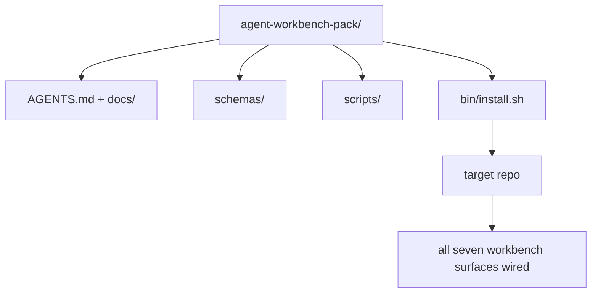

# Capstone:Ship Reusable Agent Workbench Pack

> Mini-track end pack you drop any repo。十一lesson surface compress directory you can `cp -r` and have agent working reliably next morning。Capstone artifact此curriculum trade on。

**类型:** 构建
**语言:** Python(stdlib)
**前置要求:** 阶段14课程31至41
**时间:** ~75分钟

## 学习目标

- Package七workbench surface one drop-in directory。
- Pin schema、script、和template so new repo get known-good baseline。
- Add single installer script lay down pack idempotently。
- Decide what stay pack and what stay out、defending cut each。

## 问题背景

Workbench live Google Doc、chat history、和three half-remembered script is workbench rebuilt every quarter。Cure versioned pack:repo or directory with surface、schema、script、和one-command installer。

You will end此lesson with `outputs/agent-workbench-pack/` shipped disk and `bin/install.sh` drop it any target repo。

## 概念讲解



### Pack layout

```
outputs/agent-workbench-pack/
├── AGENTS.md
├── docs/
│   ├── agent-rules.md
│   ├── reliability-policy.md
│   ├── handoff-protocol.md
│   └── reviewer-rubric.md
├── schemas/
│   ├── agent_state.schema.json
│   ├── task_board.schema.json
│   └── scope_contract.schema.json
├── scripts/
│   ├── init_agent.py
│   ├── run_with_feedback.py
│   ├── verify_agent.py
│   └── generate_handoff.py
├── bin/
│   └── install.sh
└── README.md
```

### 何stay in、何stay out

In:

- Surface schema。They contract。
- Four script above。They runtime。
- Four doc。They rule and rubric。

Out:

- Project-specific task。Task belong target repo board、非pack。
- Vendor SDK call。Pack framework-agnostic。
- Onboarding prose。Pack live next team existing onboarding、非inside it。

### Installer

Short `bin/install.sh`(or `bin/install.py`):

1. Refuse install over existing pack without `--force`。
2. Copy pack target repo。
3. Wire up CI if `.github/workflows/` exist。
4. Print next step:fill board、set acceptance command、run init script。

### Versioning

Pack carry `VERSION` file。Schema bump和script change require migration bump major。Doc-only change bump patch。Target repo `agent_state.json` record which pack version initialized against。

## 构建

`code/main.py` assemble pack `outputs/agent-workbench-pack/` next lesson、seeded schema and script previous lesson mini-track and doc you already wrote。

跑:

```
python3 code/main.py
```

Script copy and pin surface、write README、print pack tree、and exit zero。Re-running idempotent。

## 产pattern wild

Pack only valuable if survive fork、update、and unfriendly upstream。四pattern make work。

**`VERSION` contract、非marketing。**Major bump require state migration。Minor bump require checker re-run。Patch bump doc-only。Installer write `.workbench-version` target repo every install;`lint_pack.py` refuse ship if target lock disagree pack `VERSION`。This how `npm`、`Cargo`、和`pyproject.toml` survive 10 year churn;nothing agent change rule。

**Single source cross-tool distribution。**Nx ship one `nx ai-setup` lay down `AGENTS.md`、`CLAUDE.md`、`.cursor/rules/`、`.github/copilot-instructions.md`、和MCP server single config。Pack should same;installer emit symlink(`ln -s AGENTS.md CLAUDE.md`)so single source truth fan out every coding agent。Fork pack support one tool over another failure mode。

**`uninstall.sh` refuse non-trivial state。**Uninstalling pack must not delete user `agent_state.json`、`task_board.json`、或`outputs/`。Uninstaller remove schema、script、doc、和`AGENTS.md`(with `--keep-agents-md` opt-out)and refuse proceed state file any uncommitted change。State belong user;pack not own it。

**Skill-as-publishable。SkillKit-style distribution。**Pack ship SkillKit skill:`skillkit install agent-workbench-pack` lay down across 32 AI agent single source。Pack repo source truth;SkillKit distribution channel。Vendor lock-in collapse;七surface stay same。

## 使用

三place pack ship:

- **As directory you drop repo。**`cp -r outputs/agent-workbench-pack /path/to/repo`。
- **As public template repo。**Fork-and-customize、with `VERSION` controlling drift。
- **As SkillKit skill。**Wired agent product so single command lay down。

Pack recipe。Each install serving。

## 交付成果

`outputs/skill-workbench-pack.md` generate project-tuned pack:rule sharpen team history、scope glob match repo、rubric dimension extend one domain-specific entry。

## 练习题

1. Decide which optional fifth doc deserve promotion canonical pack。Defend cut。
2. Rewrite installer Python `--dry-run` flag。Compare ergonomics bash。
3. Add `bin/uninstall.sh` safely remove pack and refuse if state file non-trivial history。何count non-trivial?
4. Add `lint_pack.py` fail when pack drift `VERSION`。Wire CI pack own repo。
5. Author migration runbook hand-rolled workbench this pack。何order operation minimize downtime?

## 关键术语

| 术语 | 人们怎么说 | 实际含义 |
|------|------------|----------|
| Workbench pack | "The starter kit" | Versioned directory carry all七surface |
| Installer | "Setup script" | `bin/install.sh` lay pack idempotently |
| Pack version | "VERSION" | Major bump schema/script change、patch doc-only |
| Drop-in pack | "cp -r and go" | Pack work without per-repo customization day one |
| Forkable template | "GitHub template" | Public repo GitHub "Use this template" can clone |

## 延伸阅读

- Phase 14 · 31 to 41 — every surface pack bundle
- [SkillKit](https://github.com/rohitg00/skillkit) — install skill across 32 AI agent
- [Nx Blog, Teach Your AI Agent How to Work in a Monorepo](https://nx.dev/blog/nx-ai-agent-skills) — single-source generator across six tool
- [agents.md — the open spec](https://agents.md/) — what pack router must implement
- [HKUDS/OpenHarness](https://github.com/HKUDS/OpenHarness) — reference implementation pack-equivalent
- [andrewgarst/agentic_harness](https://github.com/andrewgarst/agentic_harness) — Redis-backed reference eval suite
- [Augment Code, A good AGENTS.md is a model upgrade](https://www.augmentcode.com/blog/how-to-write-good-agents-dot-md-files) — pack doc quality bar
- [Anthropic, Effective harnesses for long-running agents](https://www.anthropic.com/engineering/effective-harnesses-for-long-running-agents)
- [Anthropic, Harness design for long-running application development](https://www.anthropic.com/engineering/harness-design-long-running-apps)
- Phase 14 · 30 — eval-driven agent development consume pack verification gate
- Phase 14 · 41 — before/after benchmark pack improve on